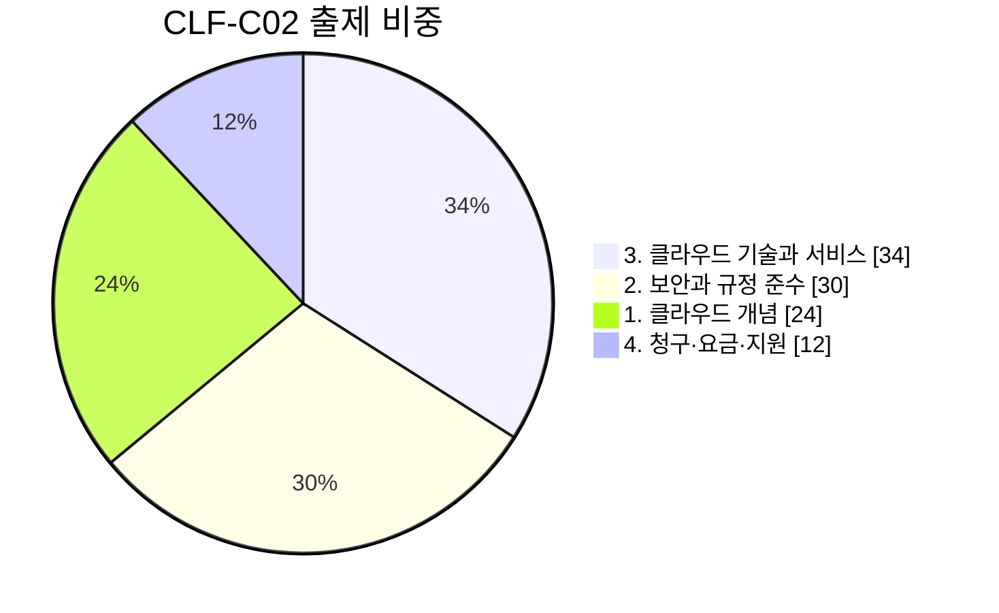

# CLF-C02 시험 개요

## 시험 형식

| 항목 | 내용 |
|---|---|
| 정식 명칭 | AWS Certified Cloud Practitioner (**CLF-C02**) |
| 문항 수 | 65문항 (채점 50 + 미채점 15) |
| 시간 | 90분 |
| 점수 | 100~1000점 · **700점 이상 합격** |
| 문제 유형 | 객관식(정답 1개) · 복수 응답(정답 2개 이상) |
| 응시료 | USD 100 |
| 유효기간 | 3년 |

> 미채점 15문항이 섞여 있어 어떤 문제가 점수에 반영되는지 알 수 없습니다. 전부 푸세요.

## 도메인별 출제 비중

| 도메인 | 비중 | 해당 단계 |
|---|---|---|
| 1. 클라우드 개념 | 24% | [[01-cloud-intro]] · [[13-well-architected]] |
| 2. 보안과 규정 준수 | **30%** | [[09-security]] |
| 3. 클라우드 기술과 서비스 | **34%** | [[02-cloud-computing]] · [[03-compute-services]] · [[04-global-infrastructure]] · [[05-networking]] · [[06-storage]] · [[07-databases]] · [[10-monitoring-governance]] · [[12-migration]] |
| 4. 청구·요금·지원 | 12% | [[11-billing-support]] |

> [!tip] 전략
> **보안(30%)이 두 번째로 크지만 서비스 수는 적습니다.** 가성비가 가장 좋은 구간이에요.
> 반대로 도메인 3(34%)은 서비스가 가장 많으니 시간을 제일 많이 배분하세요.

## 자주 나오는 함정

- **공동 책임 모델** — 무엇이 AWS 책임이고 무엇이 고객 책임인지. 최빈출
- **비슷한 이름 구분** — CloudWatch / CloudTrail / Config / Trusted Advisor
- **스토리지 3종** — EBS(블록) / EFS(파일) / S3(객체)
- **탐지 서비스 3종** — GuardDuty(위협) / Inspector(취약점) / Macie(민감 데이터)
- **"Choose TWO"** — 복수 응답 문제를 놓치지 않기

## 공식 자료

- [시험 가이드 PDF](https://docs.aws.amazon.com/pdfs/aws-certification/latest/cloud-practitioner-02/cloud-practitioner-02.pdf)
- [AWS Skill Builder — Cloud Practitioner Essentials](https://skillbuilder.aws/learn/94T2BEN85A/aws-cloud-practitioner-essentials-/KEGU7KUPF6)

## 다음

[[00-learning-path]] [문제 풀이](/aws-clf-c02/quiz) [[wrong-answers]]
