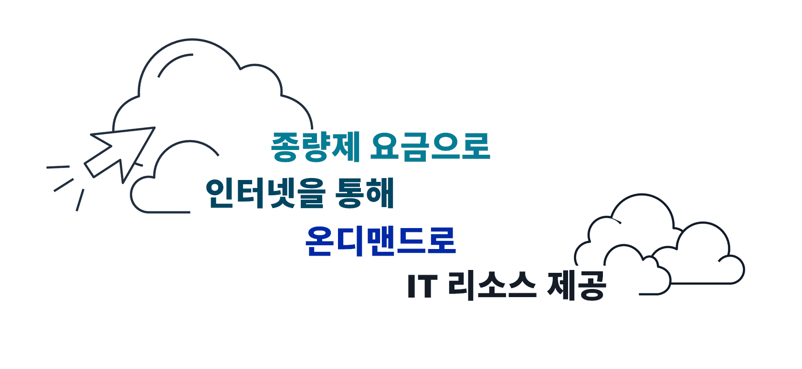
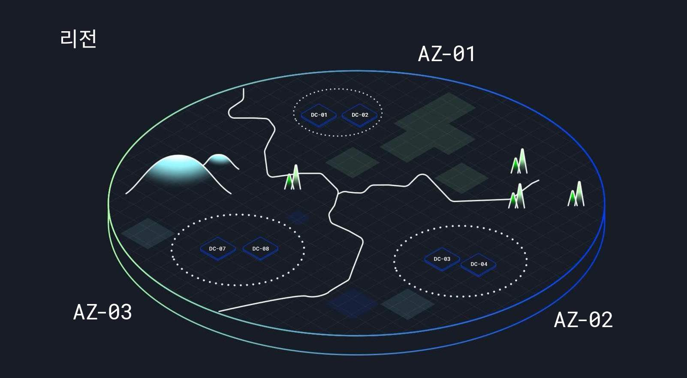
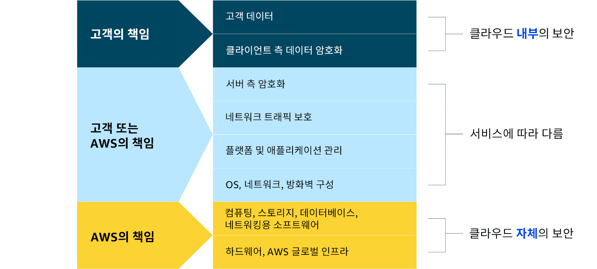
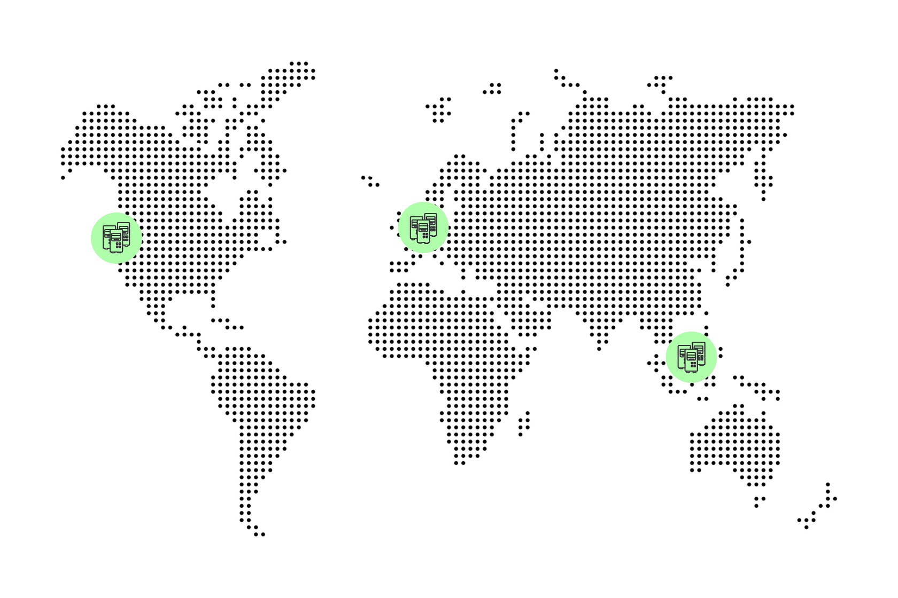

> 강의 6개 · 지식 점검 5문항 · 모듈 평가 8문항

---

## 1. 왜 필요한가

> 아무것도 모르는 상태에서 시작. 클라우드가 대체 무엇을 해결하는가?

서버를 직접 사려면 **얼마나 살지 미리 맞혀야** 합니다. 많이 사면 놀리는 장비에 돈이 나가고,
적게 사면 손님을 놓치게 되죠. 게다가 장비가 한 건물에만 있으면, 그 건물이 멈추는 순간 사업도 같이 멈춰버립니다.

이번 모듈에서는 이 두 가지 문제 — **용량 예측**과 **한 곳에 몰아넣기** — 를 클라우드가 어떻게 없애는지 살펴보겠습니다.
그리고 그 대가로 **무엇이 내 책임으로 남는지**도 함께 확인해 보겠습니다.

## 2. 이번에 새로 나오는 서비스

새로 나오는 서비스는 없습니다. **개념 중심** 모듈입니다.

대신 다음 5가지를 확실히 챙겨 가시면 됩니다.

| 개념 | 한 줄 |
|---|---|
| 클라이언트-서버 모델 | 요청하는 쪽(클라이언트)과 응답하는 쪽(서버) |
| 클라우드 컴퓨팅 | 종량제로, 인터넷을 통해, IT 리소스를 온디맨드로 제공 |
| 배포 유형 | 클라우드 / 온프레미스 / 하이브리드 |
| 리전과 가용 영역 | 리전 = AZ 3개 이상, AZ = 데이터 센터 1개 이상 |
| 공동 책임 모델 | AWS는 **클라우드의** 보안, 고객은 **클라우드 내부의** 보안 |

## 3. 강의 내용

---

### L1. 클라이언트-서버 모델과 종량제

> **이번 강의에서 다룰 내용** — 클라이언트-서버 모델을 기초부터 짚어 보겠습니다.

#### 클라이언트-서버 모델

컴퓨팅에서 일어나는 거의 모든 일은 **요청 → 검증 → 응답** 세 단계를 거칩니다.

1. **클라이언트가 요청합니다** — 웹페이지, 이미지 분석, 엑스레이 판독, 영상 스트리밍, 무엇이든 가능합니다.
2. **서버가 그 요청이 정당한지 검증합니다** — 권한이 있는지, 결제가 되었는지, 처리할 수 있는지 확인합니다.
3. **서버가 응답을 돌려줍니다** — 요청한 결과물을 보내주는 단계입니다.

이 모델은 **커피숍**에 빗대어 설명해 보겠습니다. 이 비유는 뒤에서도 계속 사용하겠습니다.

| 커피숍 | 클라우드 |
|---|---|
| 커피를 주문하는 고객 | **클라이언트** (브라우저, 앱, 다른 서버) |
| 주문을 받는 바리스타 | **서버** (AWS에서는 가상 서버) |
| 주문 확인 · 결제 확인 | 인증 · 권한 검증 |
| 완성된 음료 | 응답 데이터 |

현실의 애플리케이션은 서버 하나가 거래 하나를 처리하는 것보다 훨씬 복잡합니다.
하지만 **아무리 복잡해져도 그 바닥에는 이 요청-응답 구조가 깔려 있다**는 점을 기억해 두세요.

#### 종량제(Pay-as-you-go)

같은 커피숍으로 AWS의 첫 번째 핵심 개념인 종량제를 설명해 보겠습니다.

직원은 **실제로 근무한 시간**에 대해서만 급여를 받습니다. 휴가를 내면 그날은 시급이 나가지 않죠.
그런데 신메뉴 출시일에 손님이 몰릴까 봐 바리스타 10명을 하루 종일 배치하면 어떻게 될까요?
붐비는 아침에는 잘 맞아떨어지겠지만, 한가한 오후에는 놀고 있는 인력에게도 급여가 나가게 됩니다.

바로 이 **"놀고 있는 인력에게 나가는 급여"가 온프레미스 데이터 센터의 유휴 서버 비용**입니다.
게다가 온프레미스에서는 오후에 인력을 줄였다가 저녁에 3배로 늘리는 일 자체가 불가능합니다.

AWS에서는 다음 세 가지가 달라집니다.

| | 온프레미스 | AWS |
|---|---|---|
| 선불 결제 | 하드웨어를 먼저 삽니다 | **없습니다** |
| 용량 한계 | 산 만큼이 곧 한계입니다 | 필요할 때 그 자리에서 프로비저닝합니다 |
| 안 쓸 때 | 그래도 비용이 나갑니다 | **프로비저닝을 해제하면 과금이 멈춥니다** |

> [!tip] 여기가 출발점입니다
> 리소스를 반납하면 그 순간부터 돈이 나가지 않습니다. 클라우드 비용 모델은 전부 여기서 출발합니다.

이 비유는 이번 강의로 끝나지 않습니다. 뒤에서는 **커피 머신의 종류를 컴퓨팅 인스턴스의 종류**에 빗대어,
워크로드마다 맞는 도구가 따로 있다는 이야기까지 이어 가겠습니다.
새 개념이 나올 때마다 "커피숍이라면 이게 뭘까?"를 한 번씩 떠올려 보시기 바랍니다.

```quiz 지식 점검 · 클라이언트-서버 모델
Q. 바리스타가 서버, 고객이 클라이언트라고 할 때 클라이언트-서버 모델의 작동 방식을 가장 잘 설명한 시나리오는 무엇입니까?
- 고객이 바리스타에게 알리지 않고 셀프 서비스 주문대에서 커피를 가져갑니다. 클라이언트와 서버가 상호 작용하지 않는 방식입니다.
- 바리스타가 커피를 미리 만들어 두었다가 요청받지 않아도 고객에게 가져다 줍니다. 클라이언트가 요청을 제출할 필요가 없는 방식입니다.
- 고객이 바리스타와 대화하지 않고 커피숍 장비로 직접 커피를 만듭니다. 클라이언트가 서버를 필요로 하지 않는 방식입니다.
+ 고객이 바리스타에게 커피를 주문하고, 바리스타가 만들어 건네줍니다. 클라이언트가 요청을 보내고 서버가 응답하는 방식입니다.
> 핵심은 **요청이 클라이언트에서 시작된다**는 것과 **서버가 응답을 돌려준다**는 것, 이 두 가지가 모두 있어야 한다는 점입니다. 나머지 셋은 요청하는 쪽이 빠졌거나, 응답하는 쪽이 빠져 있습니다.
```

---

### L2. 클라우드 컴퓨팅이란?

> **이번 강의에서 다룰 내용** — 클라우드 컴퓨팅의 정의를 세우고, 배포 유형 세 가지를 구분해 보겠습니다.

#### AWS는 왜 생겼을까요

AWS의 출발점은 **Amazon 자신의 문제**였습니다.

| 시기 | 일어난 일 |
|---|---|
| 2000년대 초 | Amazon.com 트래픽이 급증하면서 IT 팀이 서버·스토리지·컴퓨팅을 계속 증설해야 했습니다 |
| — | 증설을 효율화하려고 **표준화된 도구와 방법**을 직접 만들었습니다 |
| 2003년 | "다른 회사도 같은 문제를 겪는데, 이걸 빌려주면 어떨까?"라는 아이디어가 나왔습니다 |
| 2004년 11월 | 최초의 퍼블릭 서비스인 **Amazon SQS**를 출시했습니다 |
| 2006년 | **Amazon S3**(스토리지)와 **Amazon EC2**(컴퓨팅)를 출시했습니다 |

처음에는 스타트업과 개발자가 주로 썼지만, 확장성·비용 효율성·사용 편의성이 곧 대기업까지 끌어들였습니다.
**사내 문제를 풀려고 만든 도구가 그대로 제품이 된 셈**인데, 이 맥락을 알아 두시면 AWS 서비스들의 성격을 파악하시는 데 도움이 됩니다.

#### 정의를 네 조각으로 쪼개 보겠습니다



> **클라우드 컴퓨팅은 종량제 요금으로, 인터넷을 통해, IT 리소스를 온디맨드로 제공하는 것입니다.**

시험에 그대로 나오는 문장입니다. 통째로 외우기보다 네 조각으로 나눠서 이해하시는 편이 오래 남습니다.

| 조각 | 뜻 | 구체적으로 |
|---|---|---|
| **온디맨드 제공** | 필요한 만큼, 필요할 때 | 2,000TB가 필요하면 계정을 열고 S3에 넣으면 끝입니다. 프로비저닝을 기다릴 일이 없습니다 |
| **IT 리소스** | 서버·스토리지·DB·네트워킹·AI/ML 도구 전부 | 빌려 쓰는 대상이 하드웨어에만 국한되지 않습니다 |
| **인터넷을 통해** | 원격으로 접근 | 브라우저로 로그인해서 인프라를 관리합니다 |
| **종량제 요금** | 쓴 만큼만 | 필요 없어지면 그 부분만 해제하면 됩니다. 계약서도, 영업 담당자에게 전화할 일도 없습니다 |

여기서 **데이터 센터**는 서버만 전용으로 보관하는 건물을 말합니다. 중복 전원·냉각·보안을 갖춰서 설계됩니다.
과거에는 자체 데이터 센터를 짓거나 공유 시설에 얹는 것 말고는 선택지가 없었습니다.
AWS가 나온 뒤로는 **내가 소유하지 않은 데이터 센터에서 애플리케이션을 실행**할 수 있게 되었습니다.

#### 클라우드 배포 유형 3가지

| 유형 | 무엇인가 | 언제 고르나 | 문제 속 신호 |
|---|---|---|---|
| **클라우드 (Cloud)** | 애플리케이션 전체를 클라우드에서 실행합니다. 클라우드 네이티브로 설계하거나 기존 것을 마이그레이션합니다 | 온프레미스에 남길 이유가 없을 때 | "전부 클라우드로", "새로 만든다" |
| **온프레미스 (On-premises)** | 자체 데이터 센터에 가상화·리소스 관리 도구로 배포합니다. **프라이빗 클라우드**라고도 부릅니다 | 규제나 레거시 때문에 물리적 통제가 필요할 때 | "완전한 제어", "데이터가 사내에 있어야" |
| **하이브리드 (Hybrid)** | 클라우드 리소스와 온프레미스를 **연결해서 함께** 사용합니다 | 일부는 사내에 남겨야 하지만 확장성도 필요할 때 | "일부는 남기고 일부는 클라우드", "레거시 + 신규" |

> [!tip] 구분 요령
> 문제에 **온프레미스에 남는 것**과 **클라우드에 두는 것**이 **둘 다** 나오면 무조건 하이브리드입니다.

```quiz 지식 점검 · 배포 유형
Q. 지역 자선 단체가 규정 준수를 위해 민감한 데이터를 국내에 유지해야 하지만, 계절별 수요 급증도 처리해야 합니다. 규정 준수를 위해 온프레미스 리소스를 유지하고, 동적 스케일링에는 클라우드 기반 리소스를 사용하기로 했습니다. 이 상황이 설명하는 클라우드 배포 유형은 무엇입니까?
- 온프레미스 배포
- 퍼블릭 클라우드 배포
+ 하이브리드 배포
- 데이터 규정 준수 배포
> 온프레미스를 **유지하면서** 클라우드도 **함께** 쓰고 있으니 하이브리드입니다. 둘 다 등장하면 하이브리드라고 보시면 됩니다. 참고로 "데이터 규정 준수 배포"라는 배포 유형은 존재하지 않습니다.
```

---

### L3. AWS 클라우드의 6가지 이점

> **이번 강의에서 다룰 내용** — 클라우드의 6가지 이점을 하나씩 뜯어 보겠습니다.

**6개 전부 시험 대상입니다.** 각각을 "문제에 이런 말이 나오면 이 이점"이라는 형태로 묶어두시면 실전에서 바로 골라낼 수 있습니다.

| # | 이점 | 무슨 뜻인가 | 문제 속 신호 |
|---|---|---|---|
| 1 | **선행 비용을 가변 비용으로 대체** | 온프레미스는 공간·하드웨어·인력·유지 관리에 수십만~수백만 달러를 **먼저** 쓰고, 사용률과 무관하게 고정 비용이 나갑니다. AWS 요금은 매달 사용량에 따라 **변합니다** | "초기 투자 부담", "고정 비용이 걱정", "소규모로 시작" |
| 2 | **거대한 규모의 경제로 얻는 이점** | AWS가 전 세계 데이터 센터용 하드웨어를 대량으로 구매해 단가를 낮추고, 그 절감분을 **고객에게 요금 인하로 돌려줍니다** | "규모 때문에 더 싸게", "AWS가 대량 구매해서" |
| 3 | **용량 추정 불필요** | 3년 뒤 사용자 1,000만 명을 예상하고 하드웨어를 샀는데 실제로 50만 명이면 낭비고, 반대면 장애입니다. AWS는 **지금 필요한 만큼**만 프로비저닝하고 스케일 업/다운합니다 | "수요 예측이 어렵다", "얼마나 필요할지 모르겠다" |
| 4 | **속도 및 민첩성 향상** | 테스트 환경을 띄워 실험해 보고, 아니다 싶으면 지워서 과금을 멈춥니다. 프로비저닝에 쓰던 시간을 **혁신에 쓸 수 있습니다** | "빠르게 실험", "새로운 시도", "출시 시간 단축" |
| 5 | **데이터 센터 운영·유지 관리에 비용 투자 불필요** | 서버 랙 설치·스태킹·전원 공급처럼 **차별화되지 않는 힘든 일**을 AWS가 대신해 줍니다 | "운영 오버헤드 감소", "인프라 관리에서 손 떼기" |
| 6 | **몇 분 만에 전 세계에 배포** | 인도 진출에 현지 데이터 센터가 필요했던 일이, 인도 리전에 배포하는 것으로 끝납니다. **몇 달~몇 년이 몇 분**으로 줄어듭니다 | "글로벌 확장", "해외 사용자 지연 시간" |

> [!warning] 1번 · 3번 · 5번을 헷갈리지 마세요
> - **선행 비용을 가변 비용으로(1)** — 돈이 **언제** 나가는가의 이야기입니다 (선불이냐 사용량이냐)
> - **용량 추정 불필요(3)** — 얼마나 **살지**를 안 맞혀도 된다는 이야기입니다 (수요 예측)
> - **운영·유지 관리 비용 불필요(5)** — 산 것을 **돌보는 일**을 안 해도 된다는 이야기입니다 (운영 오버헤드)

```quiz 지식 점검 · 6가지 이점
Q. 한 소매업체가 새로운 의류 라인을 출시할 계획이지만, 출시를 뒷받침하는 데 필요한 서버 용량을 정확히 예측하는 데 어려움을 겪고 있습니다. 이 상황과 가장 연관성이 높은 AWS 클라우드의 이점은 무엇입니까?
- 데이터 센터 운영 및 유지 관리에 비용 투자 불필요
+ 용량 추정 불필요
- 선행 비용을 가변 비용으로 대체
- 몇 분 만에 전 세계에 배포
> "예측하기 어렵다"가 곧 **용량 추정**입니다. 위 표의 3번 신호와 정확히 일치합니다.
```

---

### L4. AWS 글로벌 인프라 — 리전과 가용 영역

> **이번 강의에서 다룰 내용** — 리전과 가용 영역이 무엇인지, 고가용성과 내결함성이 왜 필요한지 알아보겠습니다.

#### 왜 나눠 놓을까요

커피숍으로 다시 돌아가 보겠습니다. 신입 직원이 라떼를 계산대에 쏟아서 전기가 나갔습니다.
주문도 못 받고 음료도 못 만드는 상황이죠. **매장이 하나뿐이었다면 그날 장사는 그대로 끝**입니다.

다행히 이 커피숍은 체인이라 도시 곳곳에 지점이 있습니다. 고객은 몇 블록 걸어가서 계속 커피를 살 수 있죠.
**한 지점의 사고가 사업 전체를 멈추지는 않습니다.**

AWS도 같은 이유로 리소스를 한 데이터 센터에 몰아넣지 않습니다.
거대한 데이터 센터 하나에 정전이나 자연재해가 발생하면 모든 고객의 애플리케이션이 동시에 멈추기 때문입니다.

#### 리전 안에 무엇이 들어 있는지 보겠습니다



```layers 리전 하나를 열어 본 모습입니다. 상자 안에 상자가 들어 있는 구조를 기억해 두세요.
AWS 리전 — eu-west-1 (아일랜드) | 데이터 센터 그룹이 모인 전 세계의 물리적 위치 · AZ 3개 이상
  가용 영역 A | 독립적인 전력·네트워킹·연결성
    데이터 센터 | 중복 전원 · 냉각 · 보안
  가용 영역 B | 서로 물리적으로 떨어져 있음
    데이터 센터
  가용 영역 C | 재해가 나도 동시에 끊기지 않도록 배치
    데이터 센터
```

| 단위 | 정의 | 외울 숫자 |
|---|---|---|
| **AWS 리전** | 데이터 센터 그룹이 모여 있는 전 세계의 물리적 위치입니다. 파리·도쿄·상파울루·더블린·오하이오처럼 고객과 가까운 곳에 배치합니다 | AZ **3개 이상** |
| **가용 영역(AZ)** | 리전 안에서 물리적으로 분리된 위치입니다. 각각 독립적인 전력·네트워킹·연결성을 갖습니다 | 데이터 센터 **1개 이상** |

**AZ를 서로 붙여서 짓지 않는 이유**는 분명합니다. 자연재해 하나로 여러 AZ가 한꺼번에 끊긴다면 나누어 놓은 의미가 없기 때문입니다.

그리고 **리전 하나만으로도 충분하지 않습니다.** 리전 전체에 장애가 나는 상황까지 견디려면
여러 리전에 배포해서 장애 조치(failover)를 준비해야 합니다. 이 부분은 [[04-global-infrastructure]]에서 더 자세히 다루겠습니다.

#### 고가용성과 내결함성 — 시험에서 갈리는 지점입니다

| | 고가용성 (High Availability) | 내결함성 (Fault Tolerance) |
|---|---|---|
| **목표** | 가동 중지 시간을 **최소화**합니다 | 장애가 나도 **계속 작동**합니다 |
| **범위** | 한 구성 요소가 실패하면 다른 구성 요소가 빈자리를 채웁니다 | **여러** 구성 요소가 실패해도 버티도록 설계합니다 |
| **한 줄** | 빠르게 복구되어 거의 끊기지 않습니다 | 모든 계층에 복원력을 넣어 아예 끊기지 않습니다 |

실무에서 기억하실 것은 하나입니다. **리소스를 여러 AZ에 나누어 배포하시기 바랍니다.**
그래야 한 AZ가 중단되어도 애플리케이션이 계속 돌아갑니다.

```quiz 지식 점검 · 글로벌 인프라
Q. 빠르게 성장하는 스타트업이 증가하는 트래픽을 처리하고 고가용성을 보장하기 위해 AWS 기반의 복원력 있고 확장 가능한 인프라를 설계하려 합니다. 고가용성을 갖춘 AWS 글로벌 인프라의 이점을 가장 잘 설명한 문장은 무엇입니까?
- AWS는 모든 웹 사이트의 데이터를 단일 AWS 스토리지 버킷에 저장하여 데이터 관리를 중앙 집중화합니다.
- AWS는 질문에 대한 답변을 웹 사이트에서 쉽게 찾을 수 있도록 다양한 고객 지원 옵션을 제공합니다.
+ AWS는 다양한 지리적 리전에서 여러 개의 데이터 센터를 제공하므로, 한 위치에서 문제가 발생하더라도 웹 사이트를 계속 운영할 수 있습니다.
- AWS는 모든 트래픽을 처리할 수 있는 매우 안전한 단일 데이터 센터를 제공하므로 웹 사이트의 가용성이 보장됩니다.
> 고가용성의 핵심은 **분산과 이중화**입니다. "단일"이라는 단어가 들어간 선택지는 이 시점에서 바로 걸러내시면 됩니다. 리전은 격리된 독립 데이터 센터들이 있는 물리적 위치이고, AZ는 각각 독립적인 전력·네트워킹·연결성을 갖춘 데이터 센터 1개 이상으로 구성됩니다.
```

---

### L5. AWS 공동 책임 모델

> **이번 강의에서 다룰 내용** — AWS의 책임과 고객의 책임이 어디에서 갈리는지 짚어 보겠습니다.

#### 보안의 최종 책임자는 누구일까요

정답은 **둘 다**입니다. AWS와 고객 양쪽 모두 워크로드 보안에 최종적인 책임이 있습니다.
이것을 **공동 책임 모델**이라고 부릅니다.

집으로 비유해 보겠습니다. 건설 회사가 튼튼한 벽과 견고한 문을 만들어 줍니다.
하지만 **그 문을 닫고 잠그는 것은 집주인의 몫**입니다.
건설 회사가 열쇠를 복사해 두었다가 집주인이 외출할 때마다 대신 잠가주지는 않으니까요.

#### 한 문장으로 정리하면

> **AWS는 「클라우드의」 보안을 책임지고, 고객은 「클라우드 내부의」 보안을 책임집니다.**
>
> *(security **OF** the cloud vs security **IN** the cloud)*



```layers 스택을 아래에서 위로 쌓아 보면 경계가 어디인지 잘 보입니다.
고객 책임 — 클라우드 「내부의」 보안 (security IN the cloud) | 내가 올린 것 전부
  데이터 | 무엇을 저장할지, 누가 접근할지, 클라이언트측 암호화
  애플리케이션 | 내가 만든 앱의 보안
  게스트 OS와 패치 | 100% 고객 책임
AWS 책임 — 클라우드「의」 보안 (security OF the cloud) | 모든 서비스를 떠받치는 인프라
  하이퍼바이저 · 가상화 계층 | 고객 워크로드 간 격리
  네트워크 계층 | 물리 네트워크 보호
  하드웨어 · 물리 시설 | 데이터 센터 출입 통제, 전원, 냉각
```

**왜 OS가 100% 고객 책임일까요?** AWS는 고객 시스템에 백도어를 두지 않기 때문입니다.
그 OS에 로그인하거나 사용자 계정을 만들 수 있는 키는 **고객만** 가지고 있습니다.
그래서 AWS가 새로운 취약점을 발견하면 **알려드릴 수는 있어도 대신 패치해 드릴 수는 없습니다.**

**데이터도 마찬가지로 고객이 통제하는 영역입니다.** AWS는 통제 수단을 제공할 뿐입니다.
공개 범위를 전체 공개, 인증된 개인, 특정 조건, 완전 차단 중에서 고를 수 있고 암호화도 걸 수 있습니다.
암호화를 해 두면 실수로 문을 열어 두더라도 밖에서는 판독할 수 없는 내용만 보이게 됩니다.

#### 세 번째 칸 — 공동 책임

모든 항목이 둘로 딱 나뉘지는 않습니다. **어떤 서비스를 쓰느냐에 따라 경계가 이동합니다.**

| 공동 책임에 해당하는 항목 | 왜 서비스마다 다른가 |
|---|---|
| 서버측 암호화 · 네트워크 트래픽 보호 · 플랫폼 및 애플리케이션 관리 · OS·네트워크·방화벽 구성 | 관리형 서비스일수록 AWS 쪽으로, 직접 관리할수록 고객 쪽으로 경계가 기울기 때문입니다 |

[[amazon-ec2]](직접 관리)와 [[aws-lambda]](완전 관리형)의 책임 경계가 어떻게 다른지는 이후 모듈에서 서비스별로 확인해 보겠습니다.

```quiz 지식 점검 · 공동 책임 모델
Q. 클라우드에서 애플리케이션을 개발하는 스타트업에서 근무하고 있습니다. 회사의 운영 체제(OS)에 사용할 수 있는 새로운 보안 업데이트가 나왔고, OS에 패치가 적용되었는지 확인하는 것이 여러분의 업무입니다. 클라우드에서 실행 중인 OS에 보안 패치를 적용할 책임이 있는 당사자는 누구입니까?
- AWS가 OS에 보안 패치를 적용할 책임이 있습니다.
+ OS에 보안 패치를 적용할 책임은 여러분의 회사에 있습니다.
- AWS와 고객 양쪽 모두 별도의 패치를 적용합니다.
- OS 공급업체가 패치를 적용합니다.
> **게스트 OS는 클라우드 "내부"에 있으니 고객 책임**입니다. AWS는 그 OS에 들어갈 키가 없어서 대신 패치할 방법 자체가 없습니다.
```

---

### L6. 실제 환경에서의 클라우드 — 개념은 따로 놀지 않습니다

> **이번 강의에서 다룰 내용** — 앞에서 배운 개념들이 실제 비즈니스 상황에서 어떻게 맞물리는지 확인해 보겠습니다.

지금까지 배운 개념들은 시험에서는 따로 물어보지만, 현실에서는 **한 문제를 함께 풉니다.**
시애틀에 본사를 둔 전자 상거래 회사가 전 세계로 확장하는 상황을 예로 들어 보겠습니다.



#### 문제 1 — 인프라가 고객에서 멀수록 지연 시간이 길어집니다

이 문제는 **글로벌 인프라로 풉니다.** 고객 기반과 가까운 리전을 골라서 그곳에 배포하면 됩니다.

| 단계 | 하는 일 | 얻는 것 |
|---|---|---|
| 본사 | 시애틀 | — |
| 확장 1 | 아일랜드 **eu-west-1**에 배포하고, 그 안에서 **AZ 2개**에 걸쳐 배포합니다 | 유럽 고객 지연 시간 ↓, AZ 간 이중화로 고가용성·내결함성 ↑ |
| 확장 2 | 싱가포르 **ap-southeast-1**에 배포합니다 | 아시아 고객 지연 시간 ↓ |

**여기에서 눈여겨보실 부분은 속도입니다.** 국제적인 규모의 물리 인프라를 직접 설치하면 몇 달에서 몇 년이 걸립니다.
같은 일을 AWS에서는 몇 분 만에 끝냅니다. 그래서 **대규모 초기 자본 없이도 스타트업이 글로벌 고객에게 닿을 수 있습니다.**
소규모 팀이 대기업과 어느 정도 대등하게 경쟁할 수 있게 되는 지점입니다.

#### 문제 2 — 보안과 규정 준수는 누가 담당할까요

이 문제는 **공동 책임 모델로 풉니다.** 아일랜드 데이터 센터 정문에 어떤 자물쇠를 달지는 **AWS가 알아서 합니다.**
회사는 그 시간을 **자기만 할 수 있는 일**에 씁니다. 데이터를 보호하고, AWS 리소스 접근 권한을 관리하고,
신용 카드 규정(PCI)을 만족하도록 애플리케이션을 안전하게 구성하는 일 같은 것들이죠.

> [!tip] 정리하면
> 글로벌 인프라가 "어디에 둘 것인가"를 풀어주고, 공동 책임 모델이 "무엇까지 내가 할 것인가"를 풀어줍니다.
> AWS 서비스는 이렇게 **솔루션을 구성하는 빌딩 블록**처럼 조합해서 사용합니다.

---

## 4. 모듈 평가

```exam
Q. 여러분은 기존 애플리케이션을 클라우드로 마이그레이션하려는 회사에서 근무하는 소프트웨어 개발자입니다. 팀원들에게 클라이언트-서버 모델을 설명하고, 클라우드 컴퓨팅이 이 모델에 어떻게 들어맞는지 설명해야 합니다. 가장 잘 설명한 내용은 무엇입니까?
- 클라이언트-서버 모델에서는 클라이언트가 데이터 보안을 담당하고, 서버는 물리적 하드웨어의 보안을 담당합니다. 클라우드 컴퓨팅은 클라이언트-서버 모델을 대체합니다.
+ 클라이언트-서버 모델에서는 클라이언트가 서버로 요청을 보내고, 서버는 요청을 처리한 후 응답을 다시 전송합니다. 클라우드 컴퓨팅은 인터넷을 통해 액세스할 수 있는 확장 가능한 서버 리소스를 제공합니다.
- 클라이언트-서버 모델은 구식이며 현대적 애플리케이션에서는 더 이상 사용되지 않습니다. 클라우드 컴퓨팅이 이 모델을 완전히 대체했습니다.
- 클라이언트-서버 모델에서 서버는 데이터 저장만 처리하며, 클라이언트가 모든 처리 태스크를 수행합니다. 클라우드 컴퓨팅은 데이터 스토리지를 제공하지만 처리 기능은 제공하지 않습니다.
> 클라이언트-서버는 **요청 → 처리 → 응답**입니다. 클라우드는 이 모델을 **대체하는 것이 아니라**, 서버 쪽을 인터넷으로 빌려 쓰게 만든 것입니다. "대체한다"고 말하는 선택지는 전부 오답입니다.

Q. 한 소규모 기업이 IT 인프라를 클라우드로 마이그레이션하는 방안을 고려하고 있습니다. 재무 관리자는 클라우드의 신뢰성은 마음에 들지만 고정 비용이 우려된다고 이야기합니다. 클라우드 컴퓨팅 모델을 정확하게 정의하면서 재무 관리자의 우려를 해결하는 설명은 무엇입니까?
- 클라우드 컴퓨팅에는 전용 서버를 구입하고 프라이빗 데이터 센터를 설치하는 작업이 포함됩니다. 이 모델에는 하드웨어 및 유지 관리와 관련된 고정 비용이 수반되는 경우가 많습니다.
+ 클라우드 컴퓨팅은 인터넷을 통해 IT 리소스를 제공하기 위한 모델입니다. 기업은 종량제 방식으로 서비스를 대여할 수 있으므로, 고정 비용을 줄이고 예산을 더욱 유연하게 책정할 수 있습니다.
- 클라우드 컴퓨팅을 사용하면 추가 하드웨어의 필요성이 줄어들지만, 여전히 상당한 고정 월별 요금이 부과됩니다.
- 클라우드 컴퓨팅은 기본적으로 다른 업체의 서버를 사용하여 웹 사이트를 호스팅하는 방식으로, 기존 호스팅 솔루션에 비해 큰 비용 이점을 제공하지 않습니다.
> 정의(인터넷을 통한 온디맨드 IT 리소스)와 해법(종량제로 고정 비용을 가변 비용으로)이 **둘 다** 들어 있어야 합니다. 나머지 선택지는 고정 비용이 남는다고 말하고 있어서 재무 관리자의 우려를 해소하지 못합니다.

Q. 한 정부 기관에서 IT 인프라에 대한 완전한 제어를 유지하고자 하지만, 특정 애플리케이션에는 AWS Cloud 서비스를 사용할 계획입니다. 이러한 상황에 가장 적합한 배포 유형은 무엇입니까?
- 온프레미스
- 클라우드
+ 하이브리드
- 규정 준수
> 자체 인프라를 **유지하면서** 일부 애플리케이션만 클라우드로 보내고 있으니 하이브리드입니다. "규정 준수"라는 배포 유형은 존재하지 않습니다.

Q. 한 대기업에서 운영 비용 절감을 모색하고 있습니다. 특히 자사의 물리적 인프라 관리와 관련된 **운영 오버헤드**를 줄이고자 합니다. 이 회사가 활용할 수 있는 클라우드의 이점을 가장 잘 설명한 항목은 무엇입니까?
- 규모의 경제로 얻게 되는 이점
- 용량 추정 불필요
- 속도 및 민첩성 향상
+ 데이터 센터 운영 및 유지 관리에 비용 투자 불필요
> 키워드는 **운영 오버헤드**와 **물리적 인프라 관리**입니다. 랙 설치·스태킹·전원 공급을 AWS가 대신해 주는 이점이 바로 이것입니다. 용량 추정 불필요는 수요 예측이 어렵다는 문제일 때 고르시면 됩니다.

Q. 여러분은 글로벌 고객을 대상으로 사업을 확장하려는 스포츠 의류 회사에서 일하고 있습니다. COO에게 AWS 글로벌 인프라의 기본적인 내용을 설명해야 합니다. AWS 리전과 가용 영역의 차이점을 가장 잘 설명한 내용은 무엇입니까?
+ 리전은 3개 이상의 가용 영역이 포함된 지리적 위치입니다. 가용 영역은 1개 이상의 개별 데이터 센터가 포함된 리전 내의 별개의 위치입니다.
- 리전은 단일한 데이터 센터이고, 가용 영역은 여러 개의 데이터 센터로 구성됩니다.
- 가용 영역은 3개 이상의 리전이 포함된 지리적 위치입니다. 리전은 1개 이상의 개별 데이터 센터가 포함된 가용 영역 내의 별개의 위치입니다.
- 가용 영역은 리전 전체의 여러 물리적 위치에 걸쳐 있으며, 리전은 전 세계에 있습니다.
> 포함 관계는 **리전 ⊃ AZ ⊃ 데이터 센터** 한 방향뿐입니다. 리전과 AZ를 뒤집어 놓은 선택지가 매번 함정으로 나오니 주의하세요.

Q. 여러분의 회사에서 전 세계 사용자를 지원할 새로운 웹 애플리케이션을 출시할 예정입니다. 애플리케이션이 잘 작동하고 신뢰성을 유지하도록 IT 팀에서 방대한 글로벌 인프라에 AWS 솔루션을 사용할 계획입니다. 이 상황과 관련된 AWS 글로벌 인프라의 이점은 무엇입니까? (2개 선택)
+ 고가용성
- 사용 편의성
- 비용 절감
+ 내결함성
- 규제 표준 준수
> 글로벌 인프라는 서로 다른 지리적 위치에 있는 여러 데이터 센터에 리소스를 **분산**하고 **이중화**합니다. 한 구성 요소에 장애가 발생해도 다른 구성 요소가 대신 작동하므로 내결함성이 올라가고, 가동 중지 시간이 최소화되어 고가용성이 보장됩니다. 사용 편의성·규정 준수·비용 절감도 클라우드의 이점이긴 하지만, 이 문제의 초점은 **가용성**입니다.

Q. 한 금융 회사가 클라우드로 마이그레이션하는 데 관심이 있습니다. 사무실 공간에 대한 보안과 클라우드 컴퓨팅 리소스의 **물리적 인프라**에 대한 보안을 둘 다 담당할 충분한 직원이 있는지 궁금해합니다. 클라우드의 물리적 인프라 보안과 관련된 이 회사의 책임을 가장 잘 설명한 내용은 무엇입니까?
- 회사는 데이터 센터를 비롯하여 클라우드의 모든 물리적 인프라를 보호할 전적인 책임이 있습니다.
- 회사는 물리적 인프라 보안에 대한 책임을 클라우드 제공업체와 분담합니다.
+ AWS가 물리적 인프라의 보안을 담당하며, 회사는 클라우드 내에 있는 데이터와 애플리케이션을 보호하는 데 집중하면 됩니다.
- 회사는 클라우드의 보안과 관련하여 어떠한 책임도 지지 않습니다.
> **물리적 인프라는 클라우드"의" 보안이므로 AWS 책임**입니다. 그래서 회사는 인력을 데이터와 애플리케이션 보호에 쓸 수 있습니다. 마지막 선택지처럼 "아무 책임도 없다"고 하면 공동 책임 모델 자체를 부정하는 셈이라 오답입니다.

Q. 여러분은 최근에 인프라를 AWS로 마이그레이션한 회사의 클라우드 아키텍트입니다. 상사가 클라우드 리소스의 보안과 관련하여 고객은 어떤 책임이 있는지 팀원들에게 설명해 달라고 요청했습니다. AWS 공동 책임 모델에 따른 고객의 책임은 무엇입니까? (2개 선택)
- 데이터 센터의 물리적 보안
+ 운영 체제(OS) 패치 관리
+ 클라이언트측 데이터 암호화
- 네트워킹 및 인프라 하드웨어 유지 관리
- 컴퓨팅, 네트워킹, 스토리지, 데이터베이스 소프트웨어 업데이트
> 고객은 **게스트 OS 패치**와 **클라이언트측 데이터 암호화**를 책임집니다. AWS가 기본 인프라를 제공하더라도 OS를 최신 상태로 유지하는 것은 고객의 몫이고, 암호화 수단은 AWS가 제공하지만 구현과 관리는 고객의 몫입니다. 데이터 센터 물리 보안, 하드웨어 유지 관리, 서비스 소프트웨어 업데이트는 전부 AWS 책임입니다.
```

## 5. 여기까지의 지도

이번 모듈은 개념 중심이라 새로 나온 서비스가 없습니다.
대신 앞으로 나올 **모든 서비스에 붙게 될 세 가지 축**을 세워 두었습니다.

| 축 | 앞으로 매번 물어볼 질문 |
|---|---|
| 비용 | 이 서비스는 **쓴 만큼**만 내는 구조인가요, 켜두면 계속 나가는 구조인가요? |
| 가용성 | 이 서비스는 **AZ 하나짜리**인가요, 리전 전체에 걸치나요? |
| 책임 | 이 서비스에서 **내가 패치해야 할 것**이 남아 있나요? |

## 6. 셀프 체크

- [ ] 클라우드 컴퓨팅의 정의를 네 조각으로 나눠서 말할 수 있다
- [ ] 6가지 이점을 보고 "선행 비용 / 용량 추정 / 운영 오버헤드"를 구분할 수 있다
- [ ] 리전·AZ·데이터 센터의 포함 관계와 최소 개수를 말할 수 있다
- [ ] 고가용성과 내결함성의 차이를 한 문장씩으로 설명할 수 있다
- [ ] 임의의 항목을 보고 AWS 책임인지 내 책임인지 판단할 수 있다
- [ ] 위 `모듈 평가` 8문항을 다시 풀어 전부 맞혔다

확인 문제: [문제 풀이](/aws-clf-c02/quiz) · 틀린 것은 [[wrong-answers]]로.
