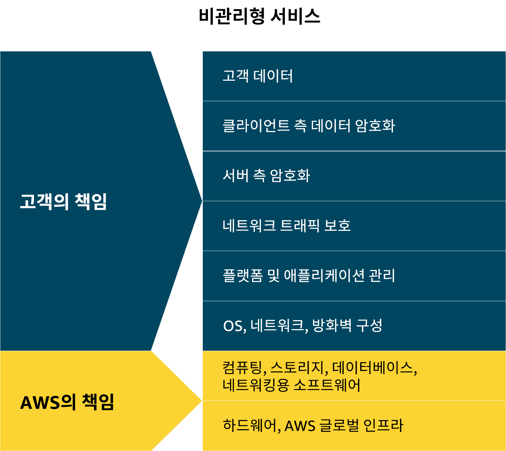
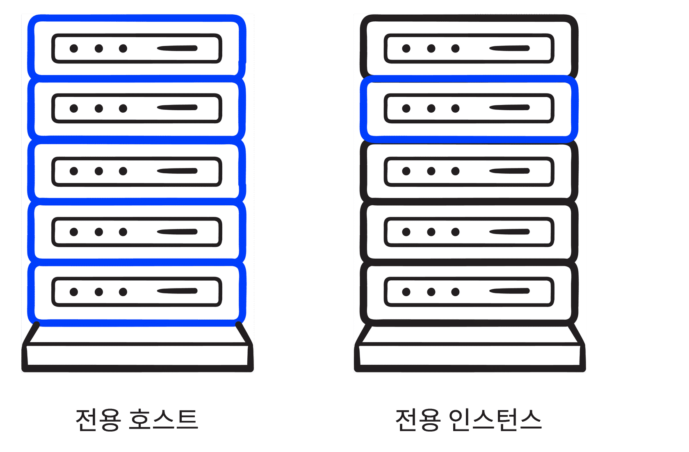
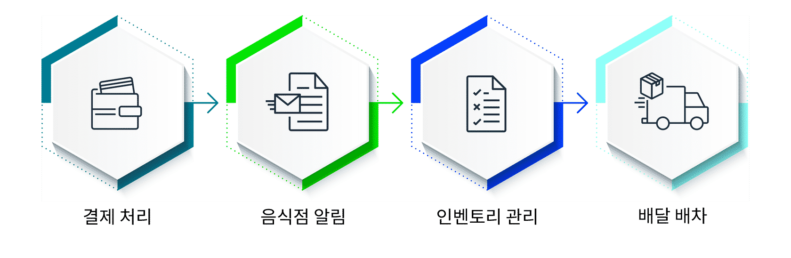
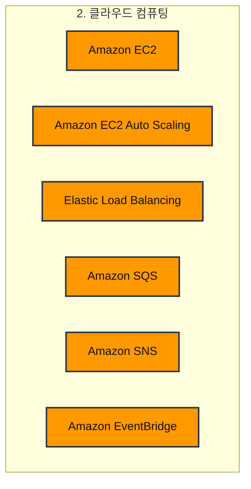

# 클라우드 컴퓨팅

> 강의 8개 · 지식 점검 20문항 · 모듈 평가 14문항

---

## 1. 왜 필요한가

> 클라우드가 뭔지는 알았다. 그럼 실제로 서버는 어떻게 빌리고 얼마를 내나?

모듈 1에서 "필요한 만큼 빌려 쓰고 반납하면 과금이 멈춘다"고 배웠습니다.
이번 모듈에서는 그 **빌리는 대상**의 실체를 봅니다. 바로 **EC2 인스턴스**, 즉 가상 서버입니다.

서버를 빌리는 순간 질문이 줄줄이 따라옵니다.
어떤 사양을 고를지, 요금은 어떻게 내는 게 싼지, 손님이 몰리면 어떻게 늘리고 줄일지,
늘어난 서버들에 트래픽은 어떻게 나눠 줄지, 그리고 서버 하나가 죽어도 시스템이 안 무너지게 하려면 어떻게 짜야 하는지.
이번 모듈은 이 다섯 가지 질문을 순서대로 풀어 갑니다.

## 2. 이번에 새로 나오는 서비스

| 서비스 | 한 줄 | 이 모듈에서 맡는 역할 |
|---|---|---|
| [[amazon-ec2]] | 가상 서버를 빌린다 | 컴퓨팅의 기본 단위 |
| [[amazon-ec2-auto-scaling]] | 수요에 따라 인스턴스 수를 자동 조절한다 | **몇 대** 띄울지 |
| [[elastic-load-balancing]] | 트래픽을 여러 인스턴스에 나눠 준다 | 그 여러 대에 **어떻게 나눠 줄지** |
| [[amazon-sqs]] | 메시지를 대기열에 쌓아 두고 나중에 처리한다 | 받는 쪽이 죽어도 **안 잃어버리게** |
| [[amazon-sns]] | 주제를 구독한 모두에게 즉시 알린다 | **지금 바로** 알려야 할 때 |
| [[amazon-eventbridge]] | 이벤트 하나로 여러 서비스를 동시에 움직인다 | 한 사건에 **여러 반응**을 붙일 때 |

> [!tip] 이번 모듈의 큰 그림
> **EC2**(서버) → **Auto Scaling**(몇 대?) → **ELB**(트래픽 배분) → **SQS·SNS·EventBridge**(서로 통신).
> 뒤로 갈수록 "서버 한 대"에서 "여러 대가 협력하는 시스템"으로 넓어집니다.

## 3. 강의 내용

---

### L1. Amazon EC2 — 가상 서버 빌리기

> **이번 강의에서 다룰 내용** — 클라우드에서 컴퓨팅 리소스를 프로비저닝하는 방법, 온프레미스와의 차이, 그리고 멀티테넌시 개념을 살펴보겠습니다.

#### EC2가 무엇인가

애플리케이션을 호스팅하려면 **원시 컴퓨팅 용량**이 필요합니다. AWS에서 이 서버를 **EC2 인스턴스**라고 부릅니다.
Elastic Compute Cloud의 약자이고, 실체는 **가상 머신(VM)** 입니다.

AWS는 방대한 컴퓨팅 용량을 미리 가동해 두고 있습니다.
고객은 원하는 인스턴스를 요청하기만 하면 **몇 분 안에** 시작되어 바로 쓸 수 있습니다.
일이 끝나면 중지하거나 종료하면 됩니다. 필요 없어진 서버에 계속 묶여 있을 이유가 없습니다.

| | 온프레미스 서버 | EC2 인스턴스 |
|---|---|---|
| 준비 시간 | 구매 · 배송 · 설치에 수 주~수 개월 | **몇 분** |
| 초기 비용 | 하드웨어를 먼저 구매 | 없음 |
| 사양 변경 | 부품을 사서 교체 | 인스턴스를 중지하고 크기 변경 |
| 안 쓸 때 | 그래도 비용 발생 | 중지·종료하면 과금 없음 |

> [!warning] 요금이 나가는 기준은 "실행 중"입니다
> **실행 중(running)** 인 인스턴스에만 요금이 붙습니다. **중지(stopped)** 하거나 **종료(terminated)** 한 인스턴스에는 붙지 않습니다.
> 시험에 자주 나오는 지점입니다.

#### 멀티테넌시와 하이퍼바이저

EC2 인스턴스는 VM이므로, **물리 호스트 한 대를 여러 인스턴스가 나눠 씁니다.**
이것을 **멀티테넌시(multitenancy)** 라고 합니다.

한 건물을 여러 세입자가 나눠 쓰는 것과 같습니다. 공용 설비는 함께 쓰지만, 각 집은 서로 격리되어 있습니다.
이 "나눠 쓰되 격리한다"를 실제로 수행하는 소프트웨어가 **하이퍼바이저**입니다.

**호스트와 하이퍼바이저, 인스턴스 간 격리는 전부 AWS가 관리합니다.**
내가 직접 손댈 일은 없지만, 개념은 알고 있어야 합니다. 뒤에서 전용 호스트·전용 인스턴스를 배울 때 다시 나옵니다.

#### 인스턴스에서 내가 정하는 것

인스턴스를 띄울 때 다음을 내가 고릅니다.

- **운영 체제** — Windows 또는 Linux
- **실행할 소프트웨어** — 사내 애플리케이션, 웹 앱, 데이터베이스, 서드 파티 패키지까지 무엇이든
- **크기** — 나중에 CPU·메모리를 늘리거나 줄일 수 있습니다. 이것을 **수직적 스케일링(스케일 업)** 이라고 합니다
- **네트워킹** — 어떤 요청을 받을지, 퍼블릭으로 열지 프라이빗으로 둘지

#### 시작부터 사용까지 3단계

| 단계 | 하는 일 |
|---|---|
| **1. 인스턴스 시작** | **AMI**(운영 체제 + 소프트웨어 템플릿)와 **인스턴스 유형**(CPU·메모리·네트워크 성능)을 고릅니다 |
| **2. 인스턴스에 연결** | Linux는 **SSH**, Windows는 **RDP**로 접속합니다. AWS Systems Manager를 쓰면 더 안전하고 간편합니다 |
| **3. 인스턴스 사용** | 명령 실행, 소프트웨어 설치, 스토리지 추가, 파일 구성 등 원하는 작업을 합니다 |

```quiz 지식 점검 · Amazon EC2 기본
Q. Amazon EC2는 온프레미스에서 서버를 실행하는 방식과 어떻게 다릅니까?
- 비용은 더 많이 들지만 더 다양한 제어 기능을 제공합니다.
+ 더 유연하고 비용 효율적이며 더 신속하게 시작할 수 있습니다.
- 설정 및 유지 관리에 더 많은 시간이 필요합니다.
- 대기업에만 유용합니다.
> EC2의 핵심 이점은 **유연성 · 비용 효율성 · 속도** 세 가지입니다. 온프레미스는 하드웨어를 사서 설치하는 데 수 주가 걸리지만, EC2는 몇 분이면 시작됩니다.

Q. Amazon EC2 인스턴스의 맥락에서 보았을 때 멀티테넌시란 무엇입니까?
+ 각 가상 머신은 격리되어 있지만 한 호스트 시스템의 리소스를 공유하는 것입니다.
- 동일한 데이터 센터에서 여러 개의 서버를 실행하는 것입니다.
- 한 번에 1명의 사용자만 인스턴스를 사용할 수 있는 것입니다.
- 서버가 1가지 유형의 애플리케이션만 실행할 수 있는 것입니다.
> **공유와 격리가 동시에** 성립해야 멀티테넌시입니다. 물리 호스트 한 대의 리소스를 여러 VM이 나눠 쓰되, 하이퍼바이저가 서로를 격리합니다.

Q. 한 회사에서 Amazon EC2 인스턴스를 사용하여 애플리케이션을 배포하고 있습니다. EC2 인스턴스를 중지하거나 종료하면 어떻게 됩니까?
- 인스턴스에 대한 요금이 계속 부과됩니다.
- 인스턴스는 설정된 시간이 지나면 자동으로 다시 시작됩니다.
+ 실행 중인 인스턴스에 대해서만 요금을 지불하며, 중지되거나 종료된 인스턴스에 대해서는 요금을 지불하지 않습니다.
- 인스턴스가 영구적으로 삭제되며 복구할 수 없습니다.
> 과금 기준은 **실행 중인지 여부**입니다. 중지·종료하면 인스턴스 요금이 멈춥니다. (연결된 스토리지 요금은 별개이며, 이는 스토리지 모듈에서 다룹니다.)

Q. Amazon EC2 인스턴스를 시작하기 위해 준비할 때 지정해야 하는 항목은 무엇입니까?
+ 인스턴스 유형 및 운영 체제
- 스토리지 용량 및 사용자 수
- 인스턴스의 위치 및 백업 계획
- 네트워크 대역폭 및 데이터 전송 제한
> 시작할 때 반드시 고르는 두 가지는 **AMI**(운영 체제)와 **인스턴스 유형**(하드웨어 사양)입니다. "사용자 수"나 "데이터 전송 제한"은 인스턴스 시작 시 지정하는 항목이 아닙니다.
```

---

### L2. EC2 인스턴스 유형 — 워크로드에 맞는 사양 고르기

> **이번 강의에서 다룰 내용** — 인스턴스 패밀리 다섯 가지와, 각각이 어떤 워크로드에 맞는지 정리해 보겠습니다.

커피숍에 커피 머신이 한 종류만 있으면 곤란합니다.
에스프레소 머신, 드립 커피 머신, 콜드브루 머신이 각각 필요하죠. **주문마다 맞는 기계가 다릅니다.**

EC2도 같습니다. 인스턴스는 CPU·메모리·스토리지·네트워킹의 조합에 따라 **인스턴스 패밀리**로 묶여 있습니다.

| 패밀리 | 무엇이 강한가 | 대표 워크로드 | 문제 속 신호 |
|---|---|---|---|
| **범용** | 컴퓨팅·메모리·네트워킹이 **균형** | 웹 서비스, 코드 리포지토리 | "어떻게 동작할지 모르겠다", "일반적인 웹 앱" |
| **컴퓨팅 최적화** | **CPU** | 게임 서버, HPC, 기계 학습, 과학 모델링 | "**CPU 성능**이 많이 필요", "복잡한 계산" |
| **메모리 최적화** | **메모리** | 대규모 데이터세트, 데이터 분석, 인메모리 DB | "**메모리**에서 대규모 데이터를 처리", "실시간 분석" |
| **가속 컴퓨팅** | **하드웨어 가속기(GPU 등)** | 그래픽 처리, 부동 소수점 계산, 패턴 매칭 | "**GPU**", "렌더링", "하드웨어 가속기" |
| **스토리지 최적화** | **로컬 디스크 I/O** | 대규모 DB, 데이터 웨어하우징, I/O 집약 앱 | "**로컬에 저장된** 데이터", "높은 디스크 처리량" |

> [!warning] 메모리 최적화와 스토리지 최적화를 가르는 한 단어
> 데이터가 **메모리에서** 처리되면 메모리 최적화, **로컬 디스크에서** 읽히면 스토리지 최적화입니다.
> 문제 지문에 "로컬에 저장된(locally stored)"이 보이면 스토리지 최적화입니다.

유형을 정했으면 다음은 **크기**입니다. 크기가 클수록 성능도 비용도 올라가니 균형점을 찾아야 합니다.
그리고 **처음 고른 것에 묶이지 않습니다.** 맞지 않으면 클라우드에서는 빠르게 바꿀 수 있습니다.

```quiz 지식 점검 · 인스턴스 유형
Q. 한 금융 기관에서 여러 서버에 저장된 대규모 데이터세트를 처리하여 신속한 쿼리 결과를 제공하는 실시간 분석 애플리케이션을 실행하고 있습니다. 대량의 정보를 효율적으로, 빠르게 처리해야 합니다. 가장 적합한 Amazon EC2 인스턴스 유형은 무엇입니까?
- 범용
- 컴퓨팅 최적화
- 스토리지 최적화
+ 메모리 최적화
> **대규모 데이터세트를 메모리에서 빠르게 처리**하는 실시간 분석은 메모리 최적화의 대표 사례입니다. 여기서는 디스크에서 읽는다는 언급이 없으므로 스토리지 최적화가 아닙니다.

Q. 한 소매업체가 **로컬에 저장된** 과거 판매 데이터를 분석하려 합니다. 대규모 데이터세트에 빠르게 액세스해야 하고, 신속한 데이터 검색을 위해 일관성 있는 **높은 디스크 처리량**이 필요합니다. 가장 적합한 인스턴스 유형은 무엇입니까?
- 범용
- 컴퓨팅 최적화
- 가속 컴퓨팅
+ 스토리지 최적화
> "로컬에 저장된"과 "디스크 처리량"이 함께 나오면 **스토리지 최적화**입니다. 앞 문제와 나란히 놓고 두 신호의 차이를 확인해 두세요.
```

---

### L3. AWS 리소스를 프로비저닝하는 방법

> **이번 강의에서 다룰 내용** — 콘솔·CLI·SDK 세 가지 방법을 비교하고, 비관리형 서비스에서 내 책임이 어디까지인지 짚어 보겠습니다.

#### 결국 전부 API 호출입니다

인스턴스를 시작하든, 중지하든, 설정을 바꾸든 **AWS에서 일어나는 모든 작업은 API 호출**입니다.
우리가 쓰는 세 가지 도구는 그 API를 호출하는 **껍데기**일 뿐입니다.

```layers 어느 문을 통해 들어가든 도착지는 같은 API입니다.
AWS API | AWS가 호스팅합니다. 모든 작업은 결국 이 API 호출입니다
내가 쓰는 도구 | 셋 중 무엇을 쓰든 결과는 같습니다
  AWS Management Console | 브라우저 · 시각적
  AWS CLI | 터미널 · 명령어
  AWS SDK | 코드 · 프로그래밍 언어
```

| 도구 | 어떻게 쓰나 | 강점 | 약점 | 권장 대상 |
|---|---|---|---|---|
| **AWS Management Console** | 브라우저에서 클릭 | 시각적이라 배우기 좋습니다. 청구서 확인·모니터링에도 편리합니다 | **수동 작업이라 실수하기 쉽습니다.** 체크박스를 빠뜨리거나 오타를 냅니다 | 시각적 인터페이스를 선호하는 사용자 |
| **AWS CLI** | 터미널에 명령어 입력 | **스크립트로 자동화**할 수 있습니다 | 명령어를 알아야 합니다 | 태스크를 자동화하려는 고급 사용자·개발자 |
| **AWS SDK** | Python, Java, C++ 등으로 코드 작성 | **애플리케이션 안에 통합**할 수 있습니다 | 코드를 짜야 합니다 | AWS를 앱에 통합하려는 개발자 |

> **자동화가 왜 중요한가** — 콘솔에서 EC2를 하나 만들려면 여러 화면을 거쳐야 합니다.
> 두 번째 인스턴스를 만들려면 그 화면들을 처음부터 다시 거쳐야 하죠.
> 사람이 손으로 하면 언젠가 반드시 틀립니다. 스크립트는 매번 똑같이 실행됩니다.

#### 비관리형 서비스에서 내 책임



EC2는 **비관리형(unmanaged)** 서비스입니다. AWS가 하드웨어와 하이퍼바이저까지만 책임지고,
**그 위는 전부 내 몫**이라는 뜻입니다.

| 항목 | 누구 책임 |
|---|---|
| 물리 하드웨어, 데이터 센터, 하이퍼바이저 | **AWS** |
| 게스트 OS와 패치 | **고객** |
| 애플리케이션 | **고객** |
| 방화벽(보안 그룹) 설정 | **고객** |
| 데이터와 접근 권한 | **고객** |

관리형 서비스와 비관리형 서비스의 차이는 이후 모듈에서 더 자세히 다루겠습니다.

```quiz 지식 점검 · 프로비저닝과 책임
Q. AWS Management Console보다 AWS Command Line Interface(AWS CLI)를 사용할 때의 주요 이점은 무엇입니까?
- AWS 리소스 관리를 위한 시각적인 드래그 앤 드롭 인터페이스를 제공합니다.
+ 자동화 및 스크립팅을 사용하여 수동 단계와 오류를 줄입니다.
- Windows 사용자만 사용 가능합니다.
- 필요한 구성이 적으며 일회성 수동 프로비저닝에 적합합니다.
> CLI의 존재 이유는 **자동화**입니다. 시각적 인터페이스는 콘솔의 장점이고, 일회성 수동 작업도 콘솔 쪽입니다.

Q. Amazon EC2 같은 컴퓨팅 서비스를 사용할 경우 AWS 공동 책임 모델에 따른 고객의 책임은 무엇입니까?
- AWS는 클라우드의 보안을 관리하고, 고객은 인프라 보안을 관리합니다.
- 고객은 EC2 인스턴스의 물리적 하드웨어를 보호할 책임이 있습니다.
- AWS는 고객의 EC2 인스턴스에서 운영 체제, 네트워킹, 애플리케이션을 관리할 책임이 있습니다.
+ 고객은 EC2 인스턴스의 운영 체제, 네트워킹, 애플리케이션을 구성하고, 보호하고, 관리할 책임이 있습니다.
> EC2는 비관리형 서비스이므로 **게스트 OS부터 위쪽은 전부 고객 책임**입니다. 물리 하드웨어와 인프라 보안은 AWS 책임입니다.
```

---

### L4. EC2 인스턴스 시작하기 — 실제로 무엇을 고르나

> **이번 강의에서 다룰 내용** — 웹 서버용 인스턴스를 만들 때 실제로 지정하는 항목들과, AMI가 왜 중요한지 살펴보겠습니다.

콘솔에서 **Launch instance**를 누르면 순서대로 다음을 정하게 됩니다.

| 순서 | 항목 | 무엇을 정하는가 |
|---|---|---|
| 1 | **이름** | 나중에 찾기 위한 이름입니다 |
| 2 | **AMI** (Amazon Machine Image) | **운영 체제 + 미리 설치된 소프트웨어 템플릿**. 예: Amazon Linux |
| 3 | **인스턴스 유형** | 컴퓨팅 성능. 예: `t2.micro` (vCPU 1개, 메모리 1GB, 프리 티어) |
| 4 | **키 페어** | 접속용 열쇠. **퍼블릭 키는 인스턴스에**, **프라이빗 키는 내가** 보관합니다 |
| 5 | **네트워크 설정** | 어떤 트래픽을 허용할지. 웹 서버라면 HTTP 허용 |
| 6 | **스토리지** | EBS 볼륨 크기와 종류. 예: gp3 8GB |
| 7 | **사용자 데이터** (선택) | **시작할 때 자동 실행할 스크립트**. 예: Nginx 설치·기동 |

시작하고 나면 퍼블릭 IP 주소가 생기고, 브라우저로 접속하면 웹 서버가 응답합니다.

#### AMI가 스케일링에서 중요한 이유

AMI는 **인스턴스를 시작하는 데 필요한 구성이 통째로 들어 있는 템플릿**입니다.
그래서 인스턴스를 100대로 늘려도 **전부 똑같은 상태로** 시작됩니다.

이 "일관성"이 뒤에 나올 Auto Scaling의 전제 조건입니다.
자동으로 늘어난 인스턴스가 매번 다른 설정으로 뜬다면 자동 스케일링은 성립하지 않습니다.

```quiz 지식 점검 · 인스턴스 시작과 AMI
Q. 웹 서버용 Amazon EC2 인스턴스를 시작할 때 필요한 구성은 무엇입니까? (3개 선택)
+ Amazon Machine Image(AMI)
- 로드 밸런싱
+ 인스턴스 유형
- 권한
+ 스토리지
- 인스턴스 종료 동작
> 운영 체제와 소프트웨어를 정하는 **AMI**, CPU·메모리를 정하는 **인스턴스 유형**, 볼륨 종류와 크기를 정하는 **스토리지**가 필수입니다. 로드 밸런싱·권한·종료 동작은 기본 웹 서버 하나를 띄우는 데는 필요하지 않습니다.

Q. Amazon EC2 인스턴스를 시작할 때 사용되는 Amazon Machine Image(AMI)의 용도는 무엇입니까?
- 인스턴스 크기를 선택하기 위한 용도
- 네트워킹 설정을 구성하기 위한 용도
+ 운영 체제 및 소프트웨어를 사전 구성하기 위한 용도
- 인스턴스 데이터를 저장하기 위한 용도
> AMI는 **템플릿**입니다. 크기를 정하는 것은 인스턴스 유형, 데이터를 저장하는 것은 EBS 볼륨입니다.
```

---

### L5. Amazon EC2 요금 — 다섯 가지 선택지

> **이번 강의에서 다룰 내용** — 요금 옵션 다섯 가지와 각각을 언제 고르는지, 그리고 용량 예약과 예약 인스턴스의 유연성을 살펴보겠습니다.

**이 표가 이번 모듈에서 시험에 가장 많이 나오는 부분입니다.**

| 옵션 | 어떻게 싸지나 | 절감폭 | 약정 | 언제 고르나 |
|---|---|---|---|---|
| **온디맨드** | 할인 없음. 실행한 만큼 시간·초 단위 과금 | — | **없음** | 처음 시작할 때, 사용 패턴을 아직 모를 때, 테스트 |
| **절감형 플랜** | 시간당 **일정 금액**을 1년/3년 쓰겠다고 약정 | **최대 72%** | 1년 / 3년 | 예측 가능한 워크로드. **인스턴스 패밀리·크기·OS·리전이 바뀌어도 적용** |
| **예약 인스턴스(RI)** | **특정 인스턴스**를 1년/3년 쓰겠다고 약정 | **최대 75%** | 1년 / 3년 | 사용량이 **꾸준하고 예측 가능한** 워크로드 |
| **스팟 인스턴스** | AWS의 **남는 용량**을 싸게 빌림 | **최대 90%** | 없음 | **중단되어도 괜찮은** 워크로드 (배치 처리 등) |
| **전용 호스트** | 물리 서버 **한 대를 통째로** 독점 | 할인이 목적이 아님 | — | 규정 준수, 라이선스(Windows·SQL Server) |

> [!warning] 스팟 인스턴스의 조건
> AWS가 **언제든 인스턴스를 회수할 수 있습니다.** 대신 **2분 전에 경고**를 주므로 진행 상황을 저장할 수 있습니다.
> 따라서 **중단을 견딜 수 있는 워크로드에만** 씁니다. 이 조건이 문제의 정답 신호입니다.

**절감형 플랜과 예약 인스턴스의 차이**는 유연성입니다.
절감형 플랜은 "시간당 얼마어치를 쓰겠다"는 약정이라 인스턴스 종류가 바뀌어도 할인이 따라옵니다.
게다가 **EC2뿐 아니라 AWS Fargate, AWS Lambda, Amazon SageMaker AI 사용량에도 적용**됩니다.

지불 방식은 세 가지입니다 — **전액 선결제 / 부분 선결제 / 선결제 없음.** 선결제가 많을수록 할인폭이 큽니다.

#### 전용 호스트와 전용 인스턴스



둘 다 "다른 고객과 물리적으로 섞이지 않는다"는 점은 같지만, **제어 수준이 다릅니다.**

| | 전용 호스트 (Dedicated Host) | 전용 인스턴스 (Dedicated Instance) |
|---|---|---|
| 격리 | 물리 서버 전체를 독점 | 다른 계정과 물리적으로 분리 |
| **물리 서버 선택** | **가능** — 인스턴스 배치와 리소스 할당까지 제어 | **불가능** |
| 언제 | 서버 단위 라이선스, 엄격한 규정 준수 | 격리만 필요하고 서버 제어까지는 불필요할 때 |

#### 용량 예약 — 할인이 아니라 자리 확보

**Amazon EC2 용량 예약**은 헷갈리기 쉬운 항목입니다. **요금 할인이 목적이 아닙니다.**

특정 가용 영역에 **컴퓨팅 용량 자리를 미리 잡아두는 것**이고, 요금은 사용 여부와 관계없이 온디맨드 요금으로 청구됩니다.
용량이 반드시 확보되어 있어야 하는 비즈니스 크리티컬 워크로드에 씁니다.

**예약 인스턴스의 유연성** — RI를 사면 AWS가 같은 패밀리 안의 **다른 인스턴스 크기**와
리전 내 **여러 가용 영역**에도 할인을 자동으로 적용해 줍니다.

```quiz 지식 점검 · EC2 요금
Q. 한 금융 서비스 회사에서 고객 기밀 데이터를 처리하고 업계 규정을 준수해야 하는 민감한 애플리케이션을 실행해야 합니다. 이 회사는 인스턴스 배치 및 리소스 할당을 비롯하여 **물리적 서버를 완벽하게 제어**해야 합니다. 어떤 요금 옵션을 선택해야 합니까?
+ 전용 호스트
- 절감형 플랜
- 온디맨드
- 스팟 인스턴스
> "물리적 서버를 **완벽하게 제어**"가 결정적입니다. 전용 인스턴스는 격리만 제공하고 서버를 고를 수는 없으므로, 배치까지 제어하려면 **전용 호스트**입니다.

Q. 한 스타트업에서 **간헐적인 중단을 허용할 수 있는** 배치 처리 워크로드를 실행하고 있으며, 사용하지 않는 Amazon EC2 용량을 활용하여 비용을 절감하고자 합니다. 어떤 요금 옵션이 비용을 가장 많이 절감하겠습니까?
- 예약 인스턴스
- 절감형 플랜
- 온디맨드
+ 스팟 인스턴스
> "중단을 허용한다" + "사용하지 않는 용량" 두 신호가 모두 **스팟 인스턴스**를 가리킵니다. 최대 90%로 절감폭도 가장 큽니다.

Q. 고객이 새 애플리케이션을 구축하고 있습니다. 사용 패턴은 잘 모르지만 시간이 지나면서 사용량이 증가하고 안정화될 것으로 예상합니다. 이 고객은 **장기적인 약정 없이** 시작하고자 합니다. 어떤 요금 옵션을 사용해야 합니까?
- 예약 인스턴스
- 절감형 플랜
+ 온디맨드
- 스팟 인스턴스
> "패턴을 모른다" + "약정 없이"이므로 **온디맨드**입니다. 예약 인스턴스와 절감형 플랜은 둘 다 1년 이상 약정이 필요합니다. 온디맨드로 기준선을 파악한 뒤에 약정형으로 옮겨 가는 것이 정석입니다.
```

---

### L6. 스케일링 — 몇 대를 띄울 것인가

> **이번 강의에서 다룰 내용** — 확장성과 탄력성의 개념, 스케일 업과 스케일 아웃의 차이, 그리고 EC2 Auto Scaling을 살펴보겠습니다.

#### 왜 필요한가

사업을 하다 보면 평균 수요는 대충 압니다. 하지만 성수기와 비수기가 있고, 피크가 하루 한 시간뿐일 수도 있습니다.
**피크에 맞춰 사면 나머지 시간이 낭비고, 평균에 맞춰 사면 피크에 장애가 납니다.**

정답은 "**매시간 정확한 수요만큼만** 프로비저닝하는 것"입니다. 고객도 만족하고 비용도 줄어듭니다.

| 용어 | 뜻 |
|---|---|
| **확장성(Scalability)** | 시간이 지나며 **커질 수 있는 잠재력** |
| **탄력성(Elasticity)** | 수요에 따라 **실시간으로 늘었다 줄었다** 하는 성질 |

#### 스케일 업 vs 스케일 아웃

| | 스케일 업 (수직적) | 스케일 아웃 (수평적) |
|---|---|---|
| 무엇을 | **한 대를 더 크게** — CPU·메모리 증설 | **대수를 늘림** — 인스턴스 추가 |
| 커피숍 | 바리스타 한 명을 더 숙련되게 | 바리스타를 더 고용 |
| 한계 | 한 대의 최대 사양까지 | 사실상 없음 |

**클라우드에서 기본은 스케일 아웃입니다.** 대수를 늘리면 병렬로 더 많은 일을 처리할 수 있고,
한 대가 죽어도 나머지가 버티므로 **단일 장애점이 사라집니다.**

> [!tip] 모범 사례
> 중복 EC2 인스턴스를 만든 뒤 **한 리전의 여러 AZ에 나누어 배포**합니다.
> 한 AZ에 문제가 생겨도 다른 AZ의 인스턴스가 그 자리를 채웁니다. 모듈 1의 고가용성이 여기에서 실제로 구현됩니다.

**각 계층을 따로 조절할 수 있다**는 점도 중요합니다.
커피숍에서 주문받는 사람이 부족한 것과 음료 만드는 사람이 부족한 것은 다른 문제입니다.
필요한 쪽만 늘리면 되므로, 한 곳을 위해 전체를 오버프로비저닝할 이유가 없습니다.

#### Amazon EC2 Auto Scaling

수요와 지표에 따라 **인스턴스를 자동으로 추가하고, 수요가 줄면 자동으로 없앱니다.**
지표는 **Amazon CloudWatch**가 수집합니다.

| 방식 | 언제 움직이나 |
|---|---|
| **동적 스케일링** | 수요 변동에 **실시간으로** 반응합니다 |
| **예측 스케일링** | 예상 수요에 맞춰 **미리** 준비합니다 |

**Auto Scaling 그룹**은 세 가지 값으로 동작합니다.

| 설정 | 뜻 | 예시 |
|---|---|---|
| **최소 용량** | 이 아래로는 절대 줄지 않습니다. 그룹 생성 직후 시작되는 대수이기도 합니다 | 4대 |
| **원하는 용량** | 지금 유지하려는 이상적인 대수입니다. 지정하지 않으면 **최소 용량과 같아집니다** | 6대 |
| **최대 용량** | 이 위로는 절대 늘지 않습니다. 과도한 스케일링과 비용 폭주를 막습니다 | 12대 |

Auto Scaling 자체에는 요금이 없습니다. **실제로 띄운 EC2 인스턴스 요금만** 냅니다.

```quiz 지식 점검 · 스케일링
Q. AWS의 확장성 및 탄력성의 주요 이점은 무엇입니까?
- 최대 사용량에 따라 리소스를 수동으로 조정할 수 있는 기능
+ 실시간 수요에 따라 리소스를 동적으로 확장 및 축소할 수 있는 기능
- 크기가 변하지 않는 고정된 리소스를 생성할 수 있는 기능
- 장기적인 성장을 위해 리소스 용량을 영구적으로 늘릴 수 있는 기능
> 핵심 단어는 **동적**과 **양방향**입니다. 늘리기만 하고 줄이지 못하면 탄력성이 아니고, 수동으로 조정하는 것도 탄력성이 아닙니다.

Q. Amazon EC2 인스턴스를 여러 가용 영역에 배포하는 주된 이유는 무엇입니까?
- 각 개별 인스턴스의 성능과 속도를 높이기 위해
+ 한 가용 영역에 실패가 발생할 경우 다른 가용 영역의 인스턴스가 트래픽을 처리할 수 있도록 하여 고가용성을 제공하기 위해
- 인스턴스를 AWS 리전 전체에 균일하게 배포하여 인스턴스 비용을 줄이기 위해
- 각 가용 영역의 리소스 사용량에 따라 인스턴스의 규모를 자동으로 조정하기 위해
> 다중 AZ 배포의 목적은 언제나 **고가용성**입니다. 개별 인스턴스가 빨라지지도, 비용이 줄지도 않습니다.

Q. AWS는 기업이 리소스를 초과 프로비저닝하지 않고도 변동하는 수요를 충족할 수 있도록 어떻게 보장합니까?
- 항상 사용 가능한 고정 리소스를 제공함
+ 기업이 수요에 따라 자동으로 확장되는 리소스를 프로비저닝할 수 있도록 함
- 기업이 최대 수요를 처리하려면 초과 리소스를 미리 구매하도록 요구함
- 수요에 관계없이 항상 실행되는 리소스를 제공함
> "초과 프로비저닝하지 않고도"가 조건입니다. 고정 리소스나 미리 구매는 정확히 그 반대입니다.
```

---

### L7. Elastic Load Balancing — 트래픽 나눠 주기

> **이번 강의에서 다룰 내용** — 인스턴스가 여러 대일 때 트래픽을 어떻게 고르게 나누는지, 그리고 ELB와 Auto Scaling의 관계를 살펴보겠습니다.

#### 문제 상황

계산대가 셋인데 손님이 한 줄에만 몰립니다. 나머지 둘은 놀고 있고요.
**인스턴스를 늘려도 트래픽이 고르게 가지 않으면 소용이 없습니다.**

해결책은 입구에 **호스트**를 두는 것입니다. 호스트는 각 줄의 인원을 실시간으로 보고 **가장 짧은 줄로 안내**합니다.
이 역할을 하는 것이 **로드 밸런서**이고, AWS의 관리형 로드 밸런서가 **Elastic Load Balancing(ELB)** 입니다.

#### ELB가 실제로 해결하는 것

인스턴스가 6개만 되어도, 프론트엔드가 모든 백엔드 인스턴스를 일일이 알고 있어야 한다면 관리가 복잡해집니다.
백엔드가 하나 늘어날 때마다 모든 프론트엔드에게 알려야 하니까요. 수백 대라면 감당이 안 됩니다.

ELB는 이 사이에 들어가서 **단일 진입점**이 되어 줍니다.

| ELB가 없으면 | ELB가 있으면 |
|---|---|
| 프론트엔드가 백엔드 목록을 전부 알아야 합니다 | 프론트엔드는 **ELB 주소 하나만** 알면 됩니다 |
| 백엔드가 늘 때마다 모두에게 알려야 합니다 | 새 인스턴스가 **ELB에게만** 준비됐다고 알립니다 |
| 계층이 서로 묶여 있습니다 | 계층이 **분리되어** 각자 알아서 스케일링합니다 |

**탄력적(Elastic)이라는 이름의 뜻** — 트래픽에 따라 **시간당 추가 비용 없이** 로드 밸런서 자체가 확장·축소됩니다.
ELB는 **리전 서비스**이고, 내부 트래픽과 외부 트래픽을 모두 처리할 수 있습니다.
라우팅 방식으로는 라운드 로빈, 최소 연결, IP 해시, 최소 응답 시간 등을 사용합니다.

> [!warning] ELB와 Auto Scaling은 다른 서비스입니다
> - **Auto Scaling** — 인스턴스를 **몇 대** 띄울지 조절합니다
> - **ELB** — 그 인스턴스들에 트래픽을 **어떻게 나눌지** 결정합니다
>
> 별개 서비스지만 함께 써야 제 역할을 합니다. 문제에서 둘의 역할을 바꿔 놓는 선택지가 자주 나옵니다.

```quiz 지식 점검 · Elastic Load Balancing
Q. Elastic Load Balancing(ELB)은 AWS의 확장성을 어떤 방식으로 개선합니까?
- 트래픽에 따라 Amazon EC2 인스턴스 수를 수동으로 조정합니다.
+ 다양한 라우팅 방법을 토대로 트래픽을 인스턴스에 자동으로 라우팅합니다.
- Amazon EC2 인스턴스의 크기를 직접 늘립니다.
- 각 요청에 대해 새 Amazon EC2 인스턴스를 생성합니다.
> ELB가 하는 일은 **분산**이지 **증설**이 아닙니다. 인스턴스 수를 조정하는 것은 Auto Scaling, 크기를 키우는 것은 스케일 업입니다.

Q. Elastic Load Balancing(ELB)은 어떤 태스크를 수행합니까?
- 수요에 맞춰 Amazon EC2 인스턴스 수를 자동으로 조정합니다.
+ 여러 Amazon EC2 인스턴스에 워크로드를 분산합니다.
- 수요가 적을 때에는 불필요한 Amazon EC2 인스턴스를 제거합니다.
- 온라인 상점의 인기 있는 세일 기간 중 두 번째 Amazon EC2 인스턴스를 추가합니다.
> 정답을 뺀 나머지 셋은 전부 **Auto Scaling**이 하는 일입니다. 인스턴스를 더하고 빼는 것은 Auto Scaling, 들어온 트래픽을 나누는 것은 ELB입니다.
```

---

### L8. 메시징과 대기열 — 서로 안 무너지게 연결하기

> **이번 강의에서 다룰 내용** — 긴밀한 결합과 느슨한 결합의 차이, 그리고 SQS·SNS·EventBridge가 각각 언제 쓰이는지 살펴보겠습니다.

#### 긴밀한 결합의 문제

계산원이 주문을 받아 **바리스타에게 직접** 종이를 건넨다고 해 봅시다.
바리스타가 쉬는 중이거나 다른 주문으로 바쁘면, **계산원은 손에 종이를 든 채 발이 묶입니다.**
결국 그 주문은 취소되고, 다음 손님도 기다리게 됩니다.

이렇게 구성 요소가 **서로 직접** 통신하는 것을 **긴밀하게 결합(tightly coupled)** 되었다고 합니다.
앱 A가 앱 B에 직접 보내는데 B가 죽으면, **A까지 같이 오류가 나기 시작합니다.**

#### 느슨한 결합 — 사이에 버퍼를 둔다

해결책은 간단합니다. 계산원이 바리스타에게 직접 주지 않고 **주문판에 붙여 두는 것**입니다.
바리스타는 준비되면 떼어 가면 됩니다.

이 주문판이 **메시지 대기열**이고, 이 구조를 **느슨하게 결합(loosely coupled)** 되었다고 합니다.
B가 죽어도 **A는 계속 돌아가고**, 메시지는 대기열에 남아 있다가 나중에 처리됩니다.
한 구성 요소의 실패가 격리되어 **연쇄 실패로 번지지 않습니다.**

| | 긴밀한 결합 | 느슨한 결합 |
|---|---|---|
| 연결 방식 | 서로 **직접** 호출 | 사이에 **버퍼(대기열)** |
| 한쪽이 죽으면 | 다른 쪽도 실패, 연쇄 장애 | **격리됨**, 나머지는 계속 동작 |
| AWS에서 목표로 하는 구조 | | **이쪽** |

#### SQS와 SNS — 무엇이 다른가

| | **Amazon SQS** (Simple Queue Service) | **Amazon SNS** (Simple Notification Service) |
|---|---|---|
| 모델 | **대기열** — 쌓아 두고 나중에 꺼냄 | **게시-구독(pub/sub)** — 즉시 밀어냄 |
| 커피숍 | 주문판에 붙여 둔 주문서 | "주문 나왔습니다!" 하고 **외치는** 바리스타 |
| 받는 쪽이 없으면 | **기다립니다.** 처리될 때까지 대기열에 남습니다 | **지금** 받는 사람에게 전달됩니다 |
| 대상 수 | 보통 하나의 처리자가 꺼내 감 | 구독자 **여럿에게 동시에**(팬아웃) |
| 전달 수단 | 애플리케이션 간 메시지 | 모바일 푸시, **SMS, 이메일**도 가능 |

메시지 안에 담긴 데이터를 **페이로드(payload)** 라고 합니다.
SQS 대기열은 자동으로 확장되고, 신뢰성이 높으며, 설정이 간단합니다.

> [!tip] 문제에서 고르는 법
> - "서비스가 중단되어도 **잃어버리면 안 된다**", "**나중에 처리**해도 된다" → **SQS**
> - "**즉시 알려야** 한다", "**여러 대상에게 동시에**", "이메일·SMS 알림" → **SNS**

#### Amazon EventBridge

**하나의 사건에 여러 서비스가 동시에 반응해야 할 때** 씁니다.



배달 앱에서 고객이 주문 하나를 넣으면, 그 순간 동시에 일어나야 하는 일들이 있습니다.

| 반응 | 하는 일 |
|---|---|
| 결제 처리 | 고객의 결제를 확인하고 처리합니다 |
| 음식점 알림 | 음식점에 조리를 시작하라고 알립니다 |
| 재고 관리 | 필요한 재료가 있는지 확인합니다 |
| 배달 배차 | 기사에게 픽업·배달 요청을 보냅니다 |

**EventBridge, SNS, SQS 셋이 함께** 이벤트 기반·메시지 기반 시스템을 이룹니다.
많은 트래픽을 감당하면서도 구성 요소끼리 안전하게 통신하게 해 주는 조합입니다.

```quiz 지식 점검 · 메시징과 결합도
Q. 긴밀하게 결합된 아키텍처와 느슨하게 결합된 아키텍처의 주요 차이점을 가장 잘 설명한 내용은 무엇입니까?
+ 긴밀하게 결합된 아키텍처에서는 구성 요소가 긴밀하게 연결되고 서로 종속되는 반면, 느슨하게 결합된 아키텍처에서는 구성 요소가 독립적으로 작동할 수 있습니다.
- 긴밀하게 결합된 시스템은 새 구성 요소를 추가할 때 더 유연하지만, 느슨하게 결합된 시스템은 새 구성 요소를 추가하려면 신중한 구성이 필요합니다.
- 긴밀하게 결합된 아키텍처는 확장성을 고려하여 설계된 반면, 느슨하게 결합된 시스템은 고가용성을 유지하는 데 중점을 둡니다.
- 느슨하게 결합된 시스템에서는 구성 요소가 서로 데이터를 직접 공유해야 하는 반면, 긴밀하게 결합된 시스템에서는 데이터를 중앙 리포지토리에 저장합니다.
> 갈리는 지점은 **독립성**입니다. 긴밀하게 결합된 시스템은 구성 요소가 서로 의존해서 하나가 죽으면 연쇄적으로 실패합니다. 느슨하게 결합된 시스템은 각자 독립적으로 동작하므로 하나가 죽어도 전체가 멈추지 않습니다.

Q. 어떤 은행 시스템에서는 고객이 돈을 이체하면 거래 세부 정보가 거래 서비스에서 사기 행위 탐지 서비스로 전송됩니다. 그런데 간혹 사기 행위 탐지 서비스가 일시적으로 중단될 때가 있습니다. 이 상황에서 Amazon SQS를 사용할 경우 얻을 수 있는 주요 이점은 무엇입니까?
- 즉각적인 거래 승인이 보장됩니다.
+ 서비스가 중단되더라도, 사기 행위 탐지 서비스가 거래를 처리할 수 있게 될 때까지 거래 세부 정보를 저장합니다.
- 버퍼 사용을 방지하여 거래 처리 속도를 높입니다.
- 거래 서비스와 사기 행위 탐지 서비스가 서로 직접적으로 의존해야 하는 환경을 만듭니다.
> 대기열의 존재 이유가 바로 **받는 쪽이 죽어도 메시지를 잃지 않는 것**입니다. SQS는 버퍼를 없애는 것이 아니라 **버퍼 그 자체**이고, 직접 의존을 만드는 것이 아니라 **끊어 주는** 역할을 합니다.
```

---

## 4. 모듈 평가

```exam
Q. 다음 중 클라우드에서 컴퓨팅 리소스를 프로비저닝하고 관리하는 방법을 가장 잘 설명한 것은 무엇입니까?
- 컴퓨팅 리소스는 고정되어 있으며 규모를 조정할 수 없습니다.
+ 리소스는 수요에 따라 프로비저닝되므로, 스케일링 및 관리가 가능합니다.
- 리소스는 사전 구매한 후 현장에 설치해야 합니다.
- 컴퓨팅 리소스에는 지속적인 수동 관리가 필요합니다.
> 클라우드 컴퓨팅의 정의 자체가 **온디맨드 제공**입니다. "고정", "사전 구매 후 설치", "지속적인 수동 관리"는 전부 온프레미스의 특성입니다.

Q. 한 미디어 회사에서 복잡한 시각 효과 및 시뮬레이션을 렌더링하는 프로젝트를 진행 중입니다. 렌더링 프로세스에는 집중적인 워크로드를 효율적으로 처리할 수 있는 상당한 계산 능력과 **하드웨어 가속기**가 필요합니다. 가장 적합한 Amazon EC2 인스턴스 유형은 무엇입니까?
- 범용
- 컴퓨팅 최적화
- 메모리 최적화
+ 가속 컴퓨팅
> **하드웨어 가속기**라는 단어가 곧 가속 컴퓨팅입니다. 그래픽 렌더링은 GPU를 쓰는 대표적인 워크로드입니다. 컴퓨팅 최적화는 가속기 없이 CPU만 강한 유형입니다.

Q. 한 스타트업이 새로운 웹 애플리케이션을 구축하고 있으며 범용 Amazon EC2 인스턴스를 선택하여 애플리케이션을 호스팅하려 합니다. 이 회사가 이러한 인스턴스 유형을 선택한 이유는 무엇입니까?
+ 컴퓨팅, 메모리, 네트워킹 리소스를 균형 있게 조합하여 제공하는 동시에 사용자 기반의 규모를 조정할 경우 비용 효율성을 유지합니다.
- 특히 메모리 집약적 애플리케이션을 위해 설계되었으므로 웹 애플리케이션을 호스팅하는 데 적합합니다.
- 동영상 렌더링 또는 기계 학습처럼 컴퓨팅 집약적인 태스크에 최고의 성능을 제공합니다.
- 대규모 데이터베이스를 호스팅하는 데 필요한 대용량 스토리지를 위해 설계되었습니다.
> 범용의 정의는 **균형**입니다. 메모리 집약·컴퓨팅 집약·대용량 스토리지는 각각 메모리 최적화·컴퓨팅 최적화·스토리지 최적화의 설명입니다.

Q. 한 대학 연구 팀에서 복잡한 알고리즘을 처리하고 대규모 데이터세트를 분석하기 위해 **상당한 CPU 성능**이 필요한 기후 모델링 시뮬레이션을 실행하고 있습니다. 컴퓨팅 최적화 인스턴스가 이 태스크에 적합한 이유는 무엇입니까?
- 대규모 데이터세트를 효율적으로 처리하기 위해 많은 양의 메모리가 필요한 워크로드에 맞게 설계되었습니다.
+ 계산을 수행하기 위해 상당한 CPU 성능이 필요한 태스크에 적합합니다.
- 높은 스토리지 처리량을 제공하므로 빠른 데이터 검색 및 대규모 데이터세트 저장이 필요한 태스크에 적합합니다.
- 하드웨어 가속기가 필요한 태스크를 처리하는 데 최적화되어 있습니다.
> 문제가 이미 "컴퓨팅 최적화가 적합한 **이유**"를 묻고 있으므로, 컴퓨팅 최적화의 정의인 **CPU 성능**을 고르면 됩니다. 나머지 셋은 메모리 최적화·스토리지 최적화·가속 컴퓨팅의 설명입니다.

Q. Amazon EC2의 맥락에서 보았을 때 멀티테넌시란 무엇입니까?
+ 격리를 유지하면서 동일한 물리적 호스트를 공유하는 여러 인스턴스
- 자체 프라이빗 네트워크에서 실행되는 각 EC2 인스턴스
- 개별 클라이언트 전용 EC2 인스턴스
- 하나의 지리적 리전으로 제한된 인스턴스
> **공유 + 격리**가 동시에 성립해야 합니다. "개별 클라이언트 전용"은 오히려 전용 호스트에 가까운 설명이라 멀티테넌시의 반대입니다.

Q. 그래픽 사용자 인터페이스(GUI)를 통해 AWS 서비스와 상호 작용하는 데 사용할 수 있는 도구는 무엇입니까?
- AWS Command Line Interface(AWS CLI)
- AWS 소프트웨어 개발 키트(AWS SDK)
+ AWS Management Console
- Amazon EC2
> GUI는 **콘솔**입니다. CLI는 명령줄, SDK는 코드이고, EC2는 도구가 아니라 컴퓨팅 서비스입니다.

Q. 한 기업에서 꾸준한 상태의 중요한 워크로드 및 시간에 민감하지 않은 배치 작업을 보유하고 있습니다. 절감형 플랜과 스팟 인스턴스를 사용하여 비용을 최적화하려면 어떻게 해야 합니까?
+ 중요한 워크로드에는 절감형 플랜을 사용하고, 시간에 민감하지 않은 작업에는 스팟 인스턴스를 사용하여 비용 절감을 극대화합니다.
- 모든 워크로드에 절감형 플랜을 사용하며, 중단 위험이 있으므로 스팟 인스턴스는 지양합니다.
- 시간에 민감하지 않은 워크로드에는 절감형 플랜을 사용하고, 중요한 작업에는 스팟 인스턴스를 사용합니다.
- 모든 워크로드에 스팟 인스턴스를 사용하여 비용 절감을 극대화하고 절감형 플랜은 지양합니다.
> 스팟은 **언제든 회수될 수 있으므로** 중요한 워크로드에 쓰면 안 됩니다. 꾸준한 중요 워크로드는 절감형 플랜, 중단을 견디는 배치 작업은 스팟이라는 조합이 정답입니다. 세 번째 선택지는 이 둘을 정확히 뒤집어 놓은 함정입니다.

Q. 한 마케팅 대행사가 새로운 웹 애플리케이션을 개발 중이며 꾸준한 성장을 예상하고 있으나, 초기 몇 개월간의 트래픽은 불확실한 상황입니다. 이 대행사는 **장기적인 약정이 없는 유연성**을 원합니다. 어떤 요금 옵션을 사용해야 합니까?
- 예약 인스턴스
- 절감형 플랜
+ 온디맨드
- 스팟 인스턴스
> "약정이 없는 유연성"이 결정적입니다. 예약 인스턴스와 절감형 플랜은 1년 또는 3년 약정이 필요하고, 스팟은 중단을 감수해야 하므로 프로덕션 웹 앱에는 부적합합니다.

Q. 한 제조 회사가 **향후 3년 동안 예측 가능한** 워크로드를 실행하고 있으며 비용을 최적화하고자 합니다. 어떤 옵션을 선택해야 합니까?
+ 예약 인스턴스
- 전용 호스트
- 온디맨드
- 스팟 인스턴스
> "3년"과 "예측 가능"이 함께 나오면 약정형입니다. 이 선택지 중에서는 **예약 인스턴스**가 최대 75% 절감으로 답이 됩니다. 전용 호스트는 격리·라이선스용이지 비용 최적화 수단이 아닙니다.

Q. 애플리케이션을 스케일링할 때 Amazon Machine Image(AMI)의 주요 역할은 무엇입니까?
- 네트워크 트래픽을 자동으로 관리합니다.
- 애플리케이션 데이터의 백업 사본을 저장합니다.
+ 새 인스턴스를 시작할 수 있는 일관된 이미지를 제공합니다.
- 애플리케이션의 스케일링 정책을 구성합니다.
> 스케일링에서 AMI의 가치는 **일관성**입니다. 자동으로 늘어난 인스턴스가 매번 같은 구성으로 떠야 스케일링이 의미가 있습니다. 트래픽 관리는 ELB의 일입니다.

Q. Amazon EC2 Auto Scaling은 AWS에서 어떻게 작동합니까?
- 인스턴스 유형을 조정하되, 인스턴스 수는 변경하지 않습니다.
+ 성능 데이터 및 애플리케이션 지표에 따라 인스턴스를 자동으로 추가하거나 제거합니다.
- 트래픽에 따라 인스턴스를 추가하거나 제거하려면 수동 개입이 필요합니다.
- 워크로드가 너무 많을 경우 인스턴스를 추가하지만, 수요가 감소할 경우 스케일 다운하지 않습니다.
> Auto Scaling은 **대수**를 조절하고(유형이 아니라), **자동**이며(수동이 아니라), **양방향**입니다(늘리기만 하는 것이 아니라). 세 선택지가 각각 이 세 가지를 하나씩 틀리게 써 두었습니다.

Q. Amazon EC2 Auto Scaling과 Elastic Load Balancing(ELB)은 AWS에서 어떻게 함께 작동합니까?
+ Amazon EC2 Auto Scaling은 인스턴스 수를 조정하는 반면, ELB는 인스턴스 전체에 트래픽을 균일하게 분산합니다.
- ELB는 EC2 인스턴스를 자동으로 확장하며, Amazon EC2 Auto Scaling은 트래픽을 조정합니다.
- 이 두 가지는 독립적으로 작동하며 연결되지 않습니다.
- Amazon EC2 Auto Scaling은 트래픽 라우팅을 처리하는 반면, ELB는 인스턴스 스케일링을 관리합니다.
> **Auto Scaling은 대수, ELB는 분배**입니다. 둘을 서로 바꿔 놓은 선택지가 두 개나 들어 있으니 역할을 확실히 구분해 두세요.

Q. 느슨하게 결합된 아키텍처에서 1가지 구성 요소에 실패가 발생하면 어떻게 됩니까?
- 실패로 인해 전체 시스템에 실패가 발생합니다.
+ 다른 구성 요소가 독립적이므로 시스템이 계속 작동할 수 있습니다.
- 시스템은 아무런 개입 없이 자동으로 백업 구성 요소로 전환됩니다.
- 다른 구성 요소는 수동으로 다시 시작해야 합니다.
> 느슨한 결합의 목적이 바로 **실패의 격리**입니다. 전체가 같이 죽는 것은 긴밀하게 결합된 아키텍처의 특징입니다.

Q. 한 소프트웨어 개발 회사의 경우, 버그 추적 시스템에 새로운 버그가 보고될 때마다 엔지니어링 팀에 알려야 합니다. **즉시 알림을 받아야 하는** 팀원도 있고, 나중에 처리해도 되는 팀원도 있습니다. 어떤 서비스를 선택해야 합니까?
+ Amazon Simple Notification Service(Amazon SNS)
- Amazon Simple Queue Service(Amazon SQS)
- Amazon EC2
- Elastic Load Balancing(ELB)
> **즉시 알림**과 **여러 대상에게 동시에**가 함께 나오면 SNS입니다. SNS는 주제를 구독한 대상들에게 한 번에 알림을 보낼 수 있습니다. SQS는 쌓아 두고 나중에 꺼내 가는 대기열이라 "즉시 알림"에는 맞지 않습니다.
```

## 5. 여기까지의 지도

주황색이 이번 모듈에서 새로 나온 서비스입니다.



모듈 1에서 세운 세 가지 축에 이번 모듈의 서비스를 얹어 보면 이렇게 정리됩니다.

| 축 | 이번 모듈에서의 답 |
|---|---|
| 비용 | **실행 중**인 인스턴스에만 과금. 약정하면 싸지고(절감형 플랜·RI), 중단을 감수하면 더 싸집니다(스팟) |
| 가용성 | 여러 **AZ에 분산** + **Auto Scaling**으로 죽은 인스턴스를 대체 |
| 책임 | EC2는 **비관리형**이라 게스트 OS부터 위는 전부 내 책임 |

## 6. 셀프 체크

- [ ] 인스턴스 패밀리 5개를 보고 각각의 대표 워크로드를 말할 수 있다
- [ ] "메모리에서 처리" vs "로컬에 저장된"으로 메모리 최적화와 스토리지 최적화를 가를 수 있다
- [ ] 요금 옵션 5개를 절감폭·약정·조건으로 구분할 수 있다
- [ ] 절감형 플랜과 예약 인스턴스의 유연성 차이를 설명할 수 있다
- [ ] 스케일 업과 스케일 아웃을 구분하고, 왜 스케일 아웃이 기본인지 말할 수 있다
- [ ] Auto Scaling 그룹의 최소·원하는·최대 용량이 각각 무엇을 막는지 말할 수 있다
- [ ] Auto Scaling과 ELB의 역할을 바꿔 쓴 선택지를 골라낼 수 있다
- [ ] SQS와 SNS를 문제 속 신호로 구분할 수 있다
- [ ] 위 `모듈 평가` 14문항을 다시 풀어 전부 맞혔다

확인 문제: [문제 풀이](/aws-clf-c02/quiz) · 틀린 것은 [[wrong-answers]]로.
