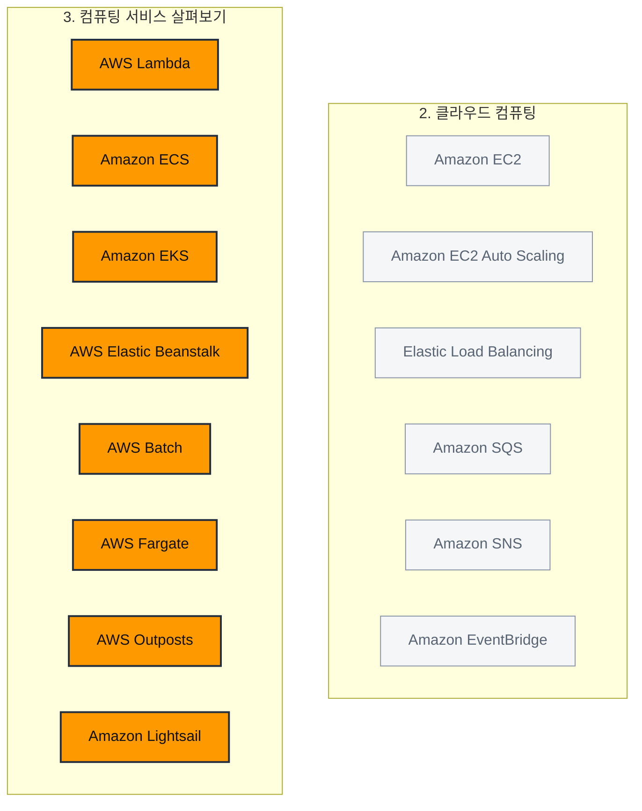

> 강의 4개 · 지식 점검 8문항 · 모듈 평가 8문항

---

## 1. 왜 필요한가

> EC2는 알겠다. 그런데 서버를 직접 관리하기 싫으면 어떤 선택지가 있나?

모듈 2에서 EC2로 가상 서버를 빌려 보았습니다. 제어권은 완벽하게 손에 들어왔지만, 그 대가도 함께 따라왔습니다.
게스트 OS에 패치를 적용하고, 몇 대를 띄울지 정하고, 인스턴스가 죽지 않았는지 지켜보는 일이 전부 내 몫으로 남았습니다.
**서버를 빌린다는 것은 곧 서버를 돌본다는 뜻**이었던 셈입니다.

그런데 애플리케이션을 만드는 사람이 정말 하고 싶은 일은 서버 돌보기가 아니라 코드 짜기입니다.
이번 모듈에서는 **그 돌보는 일을 AWS 쪽으로 얼마나 넘길 수 있는지**를 살펴보겠습니다.
넘기는 정도에 따라 비관리형 · 관리형 · 서버리스로 갈리고, 그 스펙트럼 위에 이번 모듈의 서비스들이 하나씩 놓입니다.

그리고 마지막에는 반대 방향의 질문도 하나 던져 보겠습니다.
**클라우드로 다 못 올리고 일부를 사내에 남겨야 한다면** 어떻게 하는지, AWS Outposts로 확인해 보겠습니다.

## 2. 이번에 새로 나오는 서비스

| 서비스 | 한 줄 | 이 모듈에서 맡는 역할 |
|---|---|---|
| [[aws-lambda]] | 서버 없이 함수 단위로 코드를 실행한다 | **서버리스**의 대표 주자 |
| [[amazon-ecs]] | AWS 방식으로 컨테이너를 오케스트레이션한다 | 컨테이너를 **누가 관리할지** |
| [[amazon-eks]] | Kubernetes를 AWS에서 관리형으로 돌린다 | 컨테이너를 **Kubernetes로** 관리할 때 |
| [[aws-fargate]] | 서버를 관리하지 않고 컨테이너를 돌린다 | 컨테이너를 **어디에서 돌릴지** |
| [[aws-elastic-beanstalk]] | 코드를 올리면 환경을 대신 구축해 준다 | 웹 애플리케이션 **배포 간소화** |
| [[aws-batch]] | 대규모 배치 작업을 예약하고 분산 실행한다 | **오래 걸리는 대량 계산** |
| [[amazon-lightsail]] | 컴퓨팅·스토리지·네트워킹을 한 패키지로 준다 | **작고 단순한** 웹사이트 |
| [[aws-outposts]] | AWS 인프라를 온프레미스로 확장한다 | **사내에 남겨야 할 때** |

여기에 컨테이너 이미지를 보관하는 **Amazon ECR**(Elastic Container Registry)이 함께 나옵니다.

> [!tip] 이번 모듈의 큰 그림
> **EC2**(전부 내가) → **컨테이너**(패키징은 내가, 운영은 AWS가) → **Lambda·Fargate**(코드만 내가).
> 오른쪽으로 갈수록 제어권은 줄고 편의성은 늘어납니다. 이 저울 하나가 이번 모듈의 전부라고 보셔도 됩니다.

## 3. 강의 내용

---

### L1. 비관리형 · 관리형 · 서버리스 — 제어와 편의의 저울

> **이번 강의에서 다룰 내용** — 세 가지 서비스 모델이 어떻게 갈리는지, 그리고 각 모델에서 고객 책임이 어디까지 남는지 짚어 보겠습니다.

#### 커피 머신으로 비교해 보겠습니다

커피숍 비유를 여기서도 이어 가겠습니다.

**비관리형 서비스**는 손잡이와 레버가 잔뜩 달린 고급 에스프레소 머신입니다.
원두를 고르고, 분쇄도를 맞추고, 추출 시간까지 직접 조절해서 원하는 맛을 정확히 낼 수 있습니다.
대신 **청소하고 정비하는 일도 전부 내 몫**입니다.

**관리형 서비스**는 캡슐 커피 머신입니다. 캡슐을 넣고 버튼을 누르면 끝입니다.
맛을 미세하게 조정하지는 못하지만, 시간과 손이 확실히 절약됩니다.

무엇이 더 낫다는 이야기가 아닙니다. **바리스타처럼 처음부터 다 만지고 싶을 때가 있고, 그냥 한 잔이 필요할 때가 있습니다.**
애플리케이션 요구 사항을 먼저 확인하시고, 제어와 편의 사이에서 균형점을 고르시기 바랍니다.

#### 세 가지 모델을 표로 갈라 보겠습니다

| 모델 | AWS가 맡는 범위 | 내게 남는 일 | 대표 서비스 | 문제 속 신호 |
|---|---|---|---|---|
| **비관리형** | 물리 하드웨어 · 데이터 센터 · 하이퍼바이저까지 | 게스트 OS 패치, 보안 업데이트, 네트워크 설정, 스케일링 구성, 애플리케이션 | [[amazon-ec2]] | "OS를 **완전히 제어**", "직접 튜닝해야" |
| **관리형** | 서버가 계속 원활하게 돌아가도록 운영 | **배포 옵션 선택**과 **환경 설정 구성** | [[elastic-load-balancing]], [[amazon-sqs]], [[amazon-sns]], [[aws-elastic-beanstalk]] | "인프라는 맡기되 구성은 내가" |
| **서버리스** | 프로비저닝 · 스케일링 · 고가용성 · 유지 관리 전부 | **코드 작성과 배포**, 그리고 데이터 접근 권한 | [[aws-lambda]], [[aws-fargate]] | "서버를 **전혀** 관리하고 싶지 않다" |

**서버리스**라는 말은 서버가 없다는 뜻이 아닙니다.
애플리케이션을 호스팅하는 인스턴스를 **내가 보거나 접근할 수 없다**는 뜻입니다.
그 아래에서 프로비저닝·스케일링·가용성·패치가 알아서 처리되고, 나는 애플리케이션만 바라보면 됩니다.

문제에 따라서는 같은 구분을 **IaaS · PaaS · SaaS**라는 이름으로 묻기도 합니다.
OS까지 직접 만지는 [[amazon-ec2]]가 **IaaS**이고, 코드만 올리면 환경을 세워 주는 [[aws-elastic-beanstalk]]가 **PaaS**입니다.
**SaaS**는 사람이 바로 쓰는 **완성된 애플리케이션**입니다. AWS가 드는 예는 **웹 기반 이메일**입니다.

> [!warning] S3는 SaaS가 아닙니다
> AWS의 IaaS 정의에 **데이터 스토리지**가 들어 있어서 [[amazon-s3]]는 **IaaS** 쪽입니다.
> "완성된 형태로 그대로 쓴다"는 느낌으로 고르지 마시고, **사람이 바로 쓰는 애플리케이션인가**로 판단하시기 바랍니다.

[[aws-cloudformation]]은 인프라를 템플릿으로 배포하는 **코드형 인프라** 도구일 뿐 IaaS가 아니라는 점이 함정으로 나옵니다.

```layers 같은 스택을 세 가지 모델로 잘라 보면 내가 손대는 층이 이렇게 달라집니다.
Amazon EC2 — 비관리형 | 아래 세 층이 전부 내 몫입니다
  애플리케이션 코드 | 고객
  런타임 · 미들웨어 | 고객
  게스트 OS · 패치 · 스케일링 | 고객
AWS Elastic Beanstalk — 관리형 | 환경을 고르면 AWS가 세워 줍니다
  애플리케이션 코드 | 고객
  배포 옵션 · 환경 설정 | 고객이 고르고 AWS가 프로비저닝
AWS Lambda — 서버리스 | 코드만 남습니다
  애플리케이션 코드 | 고객
```

> [!warning] 서버리스라고 고객 책임이 0이 되지는 않습니다
> AWS가 인프라를 전부 관리해도, **내가 올린 코드**와 **데이터에 누가 접근할 수 있는지**는 여전히 고객 책임입니다.
> 모듈 1의 공동 책임 모델이 그대로 적용됩니다. "AWS가 다 해 주니까 아무 책임도 없다"는 선택지는 항상 오답입니다.

```quiz 지식 점검 · 서비스 모델
Q. AWS Lambda 같은 완전관리형 서버리스 서비스를 사용할 때, 고객이 실제로 하게 되는 일은 무엇입니까?
- 운영 체제, 보안 패치, 네트워크 설정을 직접 구성합니다.
- 인스턴스 유형을 고르고 스케일링 정책을 직접 작성합니다.
+ 코드를 작성해서 배포하는 데만 집중합니다.
- 하이퍼바이저와 물리 서버의 격리 설정을 관리합니다.
> 서버리스는 **코드만 남는** 모델입니다. 운영 체제·보안 패치·네트워크 설정을 직접 만지는 것은 EC2 같은 **비관리형** 서비스이고, 인스턴스 유형과 스케일링 정책을 정하는 것은 **관리형** 서비스에서 하는 일입니다. 하이퍼바이저와 물리 서버는 어느 모델에서든 AWS 책임입니다.
```

---

### L2. AWS Lambda — 서버 없이 코드만 올리기

> **이번 강의에서 다룰 내용** — Lambda가 무엇인지, 트리거·함수·런타임이 어떻게 맞물리는지, 그리고 Lambda를 고르면 안 되는 조건까지 살펴보겠습니다.

#### 무엇을 대신해 주는 서비스인가

이미지 분류 앱을 만들었다고 해 보겠습니다. 코딩이 끝나면 그다음이 문제입니다.
서버를 프로비저닝하고, 스케일 업·다운을 붙이고, 항상 살아 있는지 확인해야 합니다.
**앱을 만드는 시간보다 앱을 띄우는 시간이 더 걸리는 상황**이죠.

**AWS Lambda**는 이 뒷일을 통째로 가져갑니다.
함수를 만들고, 코드를 넣고, 트리거를 붙이면 끝입니다. 트리거가 발생할 때만 코드가 실행됩니다.
그래서 Lambda를 **서비스형 함수(FaaS)** 라고도 부릅니다.

#### 구성 요소는 세 개입니다

| 구성 요소 | 무엇인가 | 예 |
|---|---|---|
| **함수(Function)** | 실행할 코드 덩어리. Lambda에 업로드하는 단위입니다 | 이미지 크기를 조정하는 코드 |
| **트리거(Trigger)** | 함수를 언제 실행할지 정하는 사건 | S3 파일 업로드, HTTP 요청, SQS 메시지 도착, 모바일 앱 이벤트 |
| **런타임(Runtime)** | 코드를 돌릴 언어 환경. 호출 이벤트·컨텍스트·응답을 함수와 중계합니다 | Python, Java, Node.js. 사용자 지정 런타임도 가능합니다 |

시험에서 "Lambda 워크플로에 **필요한 구성 요소**"를 물으면 이 셋입니다.
**서버 프로비저닝 · 수동 스케일링 구성 · 운영 체제 선택은 전부 AWS가 처리하므로 고객이 정하는 항목이 아닙니다.**

#### 동작은 네 단계입니다

| 단계 | 하는 일 |
|---|---|
| 1 | **코드를 업로드합니다.** 업로드한 코드가 곧 **Lambda 함수**가 됩니다 |
| 2 | **트리거를 설정합니다.** AWS 서비스, 모바일 앱, HTTP 요청 같은 이벤트 소스를 붙입니다 |
| 3 | **이벤트가 발생할 때만 실행됩니다.** 서버 관리·스케일링·인프라는 Lambda가 알아서 처리합니다 |
| 4 | **사용한 컴퓨팅 시간만큼만 냅니다.** 밀리초 단위로 계산되고, 함수에 할당한 **메모리 양**에 따라 단가가 달라집니다 |

트리거가 하나든 수천 개든 Lambda가 알아서 스케일 업·다운합니다. 패치·업데이트·보안도 AWS가 처리합니다.

> [!warning] Lambda를 고르면 안 되는 조건 — 15분
> Lambda 함수의 **최대 실행 시간은 15분**입니다.
> 몇 시간 걸리는 고성능 컴퓨팅 작업이나, 상시 대기해야 하는 트래픽 많은 웹 서버, OS를 직접 제어해야 하는 워크로드는 Lambda가 답이 아닙니다.
> **코드를 15분짜리 조각으로 쪼갤 수 없다면 다른 서비스를 보시기 바랍니다.**

#### 어디에 쓰는가

Lambda는 **짧고 빠른 이벤트 기반 처리**에 강합니다.

| 사례 | 어떻게 쓰는가 | Lambda여야 하는 이유 |
|---|---|---|
| 실시간 이미지 처리 | 사진이 업로드되면 크기 조정·필터 적용 후 저장합니다 | 업로드량에 따라 자동으로 확장되고, 처리한 시간만큼만 과금됩니다 |
| 개인화된 콘텐츠 전송 | 사용자가 앱을 열면 기사를 모아 추천 로직을 실행합니다 | 사용자가 상호 작용할 때만 실행되므로 대기 비용이 없습니다 |
| 게임 내 이벤트 처리 | 점수 획득·업적 해제 때마다 플레이어 데이터를 갱신합니다 | 서버 없이 수천 개 이벤트를 동시에 처리합니다 |

```quiz 지식 점검 · Lambda와 책임
Q. 핀테크 스타트업 개발 팀이 AWS Lambda로 고객용 마이크로서비스를 구축하려 합니다. AWS가 인프라를 관리하지만, 이 팀은 엄격한 보안 및 규정 준수 요구 사항을 충족해야 합니다. Lambda를 사용할 때 이 팀에게 여전히 남아 있는 책임은 무엇입니까?
- 기본 운영 체제에 패치를 적용하는 일
- 인프라 규모를 조정하는 일
+ 데이터 액세스 권한을 관리하는 일
- 서버 가용성을 관리하는 일
> 서버리스에서도 **데이터와 접근 권한은 언제나 고객 책임**입니다. OS 패치·스케일링·가용성은 Lambda가 대신 처리하는 항목이라 고객이 손댈 수 없습니다. "보안 및 규정 준수"라는 단어가 보이면 데이터 쪽을 먼저 의심해 보시기 바랍니다.

Q. 한 사진 회사가 클라이언트의 이미지 업로드에 맞춰 크기 조정·필터 적용·파일 정리를 AWS Lambda로 자동 처리하려 합니다. 이 워크플로를 실행하는 데 필요한 Lambda의 주요 구성 요소는 무엇입니까? (3개 선택)
+ Lambda 함수
+ 트리거
+ 런타임
- 서버 프로비저닝
- 수동 스케일링 구성
- 운영 체제 선택
> Lambda의 구성 요소는 **함수 · 트리거 · 런타임** 셋입니다. 코드를 담고, 실행 시점을 정하고, 언어 환경을 제공하는 역할이 각각 하나씩 대응합니다. 서버 프로비저닝·스케일링·운영 체제는 AWS가 전부 처리하므로 고객이 구성할 대상이 아닙니다.
```

---

### L3. 컨테이너와 오케스트레이션 — ECR · ECS · EKS · Fargate

> **이번 강의에서 다룰 내용** — 컨테이너가 어떤 문제를 푸는지, 그리고 컨테이너를 AWS에서 굴릴 때 무엇을 세 번 고르게 되는지 살펴보겠습니다.

#### "제 컴퓨터에서는 잘 되는데요"

개발자 랩톱에서는 완벽하게 돌아가던 애플리케이션이 스테이징 환경에 올리는 순간 죽습니다.
종속성이 빠져 있거나, 설정이 미묘하게 다르기 때문입니다. **환경이 다르면 결과도 다릅니다.**

**컨테이너**는 이 이식성 문제를 풉니다.
애플리케이션을 실행하는 데 필요한 **코드 · 런타임 · 종속성 · 구성을 하나로 묶어서** 통째로 옮깁니다.
어디에 내려놓아도 같은 환경이 재현되므로, 개발·테스트·프로덕션에서 똑같이 동작합니다.
기본 시스템에서 격리되고, 시작 시간이 짧고, 리소스 효율도 좋습니다.

> [!tip] 문제 속 신호
> "로컬에서는 되는데 배포하면 안 된다", "모든 환경에서 **일관되게** 실행되어야 한다"가 나오면 답은 **컨테이너**입니다.
> "환경마다 다른 버전을 쓴다"나 "OS마다 환경을 따로 만든다"는 문제를 더 키우는 선택지라서 항상 오답입니다.

#### 컨테이너가 많아지면 관리가 문제가 됩니다

컨테이너를 EC2 클러스터 위에 직접 올려서 굴릴 수는 있습니다.
다만 상태를 모니터링하고, 필요할 때 시작·중지하고, 업데이트하고, 네트워킹까지 챙기다 보면 금세 감당이 어려워집니다.

**컨테이너 오케스트레이션 서비스**가 이 수명 주기를 대신 관리합니다.
클러스터에서 컨테이너를 시작·중지·실행하고, 트래픽이 늘면 자동으로 스케일 아웃하고 잠잠해지면 다시 줄입니다.
오류 복구와 모니터링, 업데이트까지 함께 처리합니다.

#### AWS에서는 세 가지를 고르게 됩니다

| 순서 | 정하는 것 | 선택지 | 고르는 기준 |
|---|---|---|---|
| 1 | **이미지를 어디에 둘까** | **Amazon ECR** | 컨테이너 이미지를 저장·관리·버전 관리하는 완전관리형 레지스트리입니다. ECS·EKS·Fargate와 모두 연동됩니다 |
| 2 | **누가 컨테이너를 관리할까** | [[amazon-ecs]] / [[amazon-eks]] | **Kubernetes**를 쓰겠다면 EKS, AWS 통합 방식으로 간소하게 가겠다면 ECS |
| 3 | **어디에서 돌릴까** | [[amazon-ec2]] / [[aws-fargate]] | 컨테이너가 도는 VM까지 제어하겠다면 EC2, **서버를 아예 안 만지겠다면** Fargate |

| 서비스 | 한 줄 정의 | 결정적인 단어 |
|---|---|---|
| **Amazon ECR** | 컨테이너 이미지를 저장하는 완전관리형 레지스트리입니다 | "이미지를 **저장**", "레지스트리" |
| **Amazon ECS** | AWS 자체 방식의 컨테이너 오케스트레이션 서비스입니다. 컨테이너 이미지, 인스턴스 유형, 로드 밸런서 같은 리소스를 정의하면 나머지를 자동으로 관리합니다 | "간소화된 통합", "AWS 방식" |
| **Amazon EKS** | Kubernetes를 AWS에서 관리형으로 실행합니다. 대규모·하이브리드 배포에 제어와 유연성을 제공합니다 | "**Kubernetes**" |
| **AWS Fargate** | 컨테이너용 **서버리스** 컴퓨팅 엔진입니다. ECS·EKS 양쪽 모두와 연동됩니다 | "서버를 관리하지 않고" |

> [!warning] 오케스트레이션과 컴퓨팅은 다른 층입니다
> - **ECS · EKS** — 컨테이너를 **누가 관리하는가**
> - **EC2 · Fargate** — 컨테이너가 **어디에서 도는가**
>
> 둘은 같은 줄에 놓고 비교하는 대상이 아니라 **함께 고르는** 대상입니다.
> "Kubernetes를 쓰면서 서버는 관리하고 싶지 않다"는 문제라면 답은 **EKS + Fargate**처럼 두 층에서 하나씩 나옵니다.

```quiz 지식 점검 · 컨테이너
Q. 개발자가 랩톱에서 완벽하게 실행되는 애플리케이션을 완성했습니다. 그런데 팀이 이 애플리케이션을 다른 환경에 배포하자 종속성 누락과 구성 불일치로 충돌이 발생합니다. 컨테이너는 이 문제를 어떤 방식으로 해결합니까?
- 여러 운영 체제에 대한 액세스를 제공하여 호환성 테스트를 지원합니다.
+ 애플리케이션과 이를 실행하는 데 필요한 모든 요소를 하나의 일관된 환경으로 패키징합니다.
- 여러 클라우드 제공업체 전반에 걸쳐 애플리케이션의 규모를 자동으로 조정합니다.
- 구성 파일을 작성할 필요가 없도록 만들어 줍니다.
> 컨테이너의 존재 이유는 **일관성**입니다. 코드·런타임·종속성·구성을 한 단위로 묶기 때문에 어느 환경에 내려놓아도 똑같이 동작합니다. 자동 스케일링은 오케스트레이션 서비스의 일이고, 구성 파일은 오히려 컨테이너 정의에 필요합니다.

Q. 서버를 프로비저닝하거나 관리하지 않고도 컨테이너를 실행할 수 있게 해 주며, Amazon ECS와 Amazon EKS 양쪽 모두와 연동되는 AWS 서비스는 무엇입니까?
- Amazon Elastic Container Registry(Amazon ECR)
- Amazon Elastic Container Service(Amazon ECS)
- Amazon Elastic Kubernetes Service(Amazon EKS)
+ AWS Fargate
> **Fargate**는 컨테이너용 서버리스 컴퓨팅 엔진이라 실행 위치를 담당합니다. ECR은 이미지를 저장하는 레지스트리이고, ECS와 EKS는 컨테이너를 관리하는 오케스트레이션 서비스입니다. 오케스트레이션 서비스는 그 자체로 실행 위치가 아니라, 실행 위치로 EC2나 Fargate를 지정해서 씁니다.
```

---

### L4. 목적별 컴퓨팅 서비스 — Elastic Beanstalk · Batch · Lightsail · Outposts

> **이번 강의에서 다룰 내용** — 특정 사용 사례를 위해 따로 만들어진 컴퓨팅 서비스 네 가지를 신호별로 구분해 보겠습니다.

여기서 나오는 네 서비스는 깊게 파고들 대상이 아닙니다.
**"문제에 이런 말이 나오면 이 서비스"** 한 줄씩만 확실히 잡아 두시면 충분합니다.

| 서비스 | 무엇을 해 주는가 | 문제 속 신호 |
|---|---|---|
| **AWS Elastic Beanstalk** | 애플리케이션 코드와 원하는 구성만 넘기면 네트워크·EC2 인스턴스·오토 스케일링·로드 밸런서를 **대신 구축**해 줍니다. 환경 구성을 저장해 두었다가 다시 배포할 수도 있습니다 | "**웹 애플리케이션**을 인프라 구축 없이 배포", "오토 스케일링과 모니터링을 자동으로" |
| **AWS Batch** | 방대한 데이터세트 처리, 시뮬레이션, 복잡한 계산 같은 **대용량 작업**을 예약하고 컴퓨팅 리소스 플릿에 분산합니다. 수요에 따라 자동으로 규모를 조정합니다 | "수천 개 작업을 **병렬**로", "**실시간 상호 작용이 필요 없음**", "배치" |
| **Amazon Lightsail** | 컴퓨팅·스토리지·네트워킹을 **하나의 패키지**로 묶어 예측 가능한 요금에 제공합니다. 복잡한 구성 없이 작은 웹사이트를 띄울 때 씁니다 | "**단순**하고 저렴하게", "트래픽이 적은 블로그·소규모 사이트" |
| **AWS Outposts** | AWS 인프라와 서비스를 **온프레미스 데이터 센터로 확장**합니다. 클라우드와 사내 양쪽에서 같은 도구·같은 방식으로 운영할 수 있습니다 | "**온프레미스에서 실행해야** 하지만 AWS 서비스는 그대로", "데이터 레지던시", "하이브리드" |

> [!warning] Beanstalk · Batch · Lightsail이 헷갈리는 지점
> - **Elastic Beanstalk** — 상시 떠 있는 **웹 애플리케이션**을 자동으로 배포·운영합니다
> - **AWS Batch** — 시작했다 끝나는 **일괄 작업**을 대량으로 돌립니다. 웹 서비스가 아닙니다
> - **Lightsail** — 스케일링·오토 스케일링 이야기 자체가 필요 없는 **작고 단순한** 사이트용입니다
>
> 지문에 "웹 애플리케이션 + 오토 스케일링"이면 Beanstalk, "병렬 계산 + 실시간 불필요"면 Batch,
> "최소 트래픽 + 하나의 패키지 + 비용 효율"이면 Lightsail이라고 갈라 두시기 바랍니다.

> [!info] Outposts는 모듈 1의 하이브리드와 이어집니다
> 모듈 1에서 배운 **하이브리드 배포**를 AWS가 서비스로 만들어 놓은 것이 Outposts입니다.
> 규정 준수나 지연 시간 때문에 워크로드를 사내에 두어야 하는데 AWS 도구는 그대로 쓰고 싶을 때 등장합니다.

```quiz 지식 점검 · 목적별 컴퓨팅 서비스
Q. 대규모 배치 컴퓨팅 워크로드를 실행하고, 작업량에 따라 컴퓨팅 리소스를 자동으로 조정해 주는 AWS 서비스는 무엇입니까?
- AWS Elastic Beanstalk
+ AWS Batch
- Amazon Lightsail
- AWS Outposts
> 이름 그대로 **배치 작업**을 담당하는 서비스입니다. Elastic Beanstalk은 웹 애플리케이션을 배포·확장하는 관리형 서비스, Lightsail은 간소화된 가상 프라이빗 서버와 스토리지·네트워킹 패키지, Outposts는 AWS 서비스를 온프레미스로 확장하는 서비스입니다.

Q. 한 스타트업이 웹 애플리케이션을 구축 중이며, 인프라를 관리하지 않고 코드를 배포할 간단한 방법을 찾고 있습니다. 오토 스케일링과 모니터링도 자동으로 처리되어야 합니다. 이 회사가 사용해야 할 AWS 서비스는 무엇입니까?
+ AWS Elastic Beanstalk
- Amazon EC2
- AWS Batch
- AWS Outposts
> **웹 애플리케이션 + 인프라 구축 없이 + 오토 스케일링 자동**은 Elastic Beanstalk의 정확한 정의입니다. EC2를 고르면 인프라를 직접 관리하게 되고, Batch는 웹 애플리케이션이 아니라 일괄 작업용이며, Outposts는 온프레미스 확장이라 이 상황과 관계가 없습니다.

Q. 한 금융 회사가 엄격한 규정 준수 요구 사항 때문에 워크로드를 온프레미스에서 실행해야 하지만, AWS 서비스와 도구는 환경 전체에서 일관되게 사용하고자 합니다. 이 요구 사항을 충족하는 서비스는 무엇입니까?
- AWS Elastic Beanstalk
- Amazon Lightsail
- AWS Batch
+ AWS Outposts
> "**온프레미스에서 실행**"과 "**AWS 서비스는 그대로**"가 동시에 나오면 Outposts입니다. Outposts는 AWS 인프라를 고객 데이터 센터로 확장해서 양쪽에서 같은 경험을 제공합니다. 나머지 셋은 모두 AWS 클라우드 안에서만 동작하는 서비스입니다.
```

---

## 4. 모듈 평가

```exam
Q. AWS Lambda 같은 서버리스 서비스를 사용할 때 고객이 책임지는 부분은 무엇입니까?
+ 애플리케이션 코드
- 물리적 서버 및 네트워킹 하드웨어
- 운영 체제, 네트워크 구성, 애플리케이션 스택
- 아무것도 없음 — AWS에서 모든 것을 관리함
> 서버리스에서 고객에게 남는 것은 **코드**(그리고 데이터와 접근 권한)입니다. 물리 하드웨어는 어느 모델에서든 AWS 책임이고, 운영 체제와 네트워크 구성까지 책임지는 것은 EC2 같은 비관리형 서비스입니다. "아무 책임도 없다"는 공동 책임 모델 자체를 부정하는 말이라 언제나 오답입니다.

Q. 한 개발사에서 새로운 마이크로서비스를 출시할 예정이며, 코드 작성과 배포에만 집중하고자 합니다. 서버를 관리하거나, 스케일링을 처리하거나, 인프라 가용성을 걱정하고 싶어 하지 않습니다. 이 사용 사례에 가장 적합한 AWS 서비스 모델은 무엇입니까?
- 비관리형
- 온프레미스
+ 서버리스
- 하이브리드 클라우드
> 서버 관리 · 스케일링 · 가용성 **세 가지를 모두 넘기고 코드만 남기는** 모델은 서버리스뿐입니다. 비관리형은 정확히 그 반대로 게스트 OS부터 위쪽을 전부 직접 관리하는 모델이고, 온프레미스와 하이브리드는 서비스 모델이 아니라 **배포 유형**이라 질문 자체와 층이 다릅니다.

Q. AWS Lambda를 사용하기에 가장 적합한 시나리오는 무엇입니까?
- 완료하는 데 몇 시간이 걸리는 대규모 고성능 컴퓨팅 워크로드 실행
- 운영 체제(OS)를 완전히 제어해야 하는 트래픽이 많은 웹 서버 호스팅
+ 사용자가 이미지를 Amazon S3 버킷에 업로드할 때 자동으로 해당 이미지 처리
- 복잡한 쿼리와 잦은 연결이 필요한 관계형 데이터베이스 실행
> Lambda는 **짧고 이벤트로 시작되는** 처리에 맞습니다. S3 업로드 이벤트로 트리거되어 이미지를 처리하는 것이 교과서적인 사례입니다. 몇 시간짜리 워크로드는 **15분 제한**에 걸려서 불가능하고, OS를 완전히 제어해야 한다면 서버리스를 고를 이유가 없으며, 상시 연결이 필요한 데이터베이스는 이벤트가 끝나면 사라지는 함수와 성격이 맞지 않습니다.

Q. 한 회사가 컨테이너식 사진 애플리케이션을 출시하려 하며, 안전하게 저장해야 할 컨테이너 이미지를 이미 구축했습니다. 오케스트레이션에는 Kubernetes를 사용할 계획이고 서버는 관리하지 않는 방식을 선호합니다. 이 회사의 요구 사항에 가장 적합한 AWS 서비스 조합은 무엇입니까?
+ Amazon Elastic Container Registry(Amazon ECR), Amazon Elastic Kubernetes Service(Amazon EKS), AWS Fargate
- Amazon S3, Amazon Elastic Container Service(Amazon ECS), Amazon EC2
- Amazon Elastic Container Registry(Amazon ECR), Amazon Elastic Container Service(Amazon ECS), Amazon EC2
- Amazon Elastic Container Registry(Amazon ECR), AWS Lambda, Amazon EC2
> 요구 사항 세 개를 층별로 하나씩 짚으면 됩니다. **이미지 저장 → ECR**, **Kubernetes → EKS**, **서버를 관리하지 않음 → Fargate**입니다. ECS를 고른 조합은 Kubernetes 조건을 놓쳤고, EC2를 고른 조합은 서버를 직접 관리하게 되므로 조건에 어긋납니다. S3는 객체 스토리지이지 컨테이너 이미지 레지스트리가 아닙니다.

Q. 한 여행사 개발 팀이 호텔 예약 시스템의 컨테이너 이미지를 Amazon ECR에 저장했고 배포할 준비를 마쳤습니다. 이 팀에는 트래픽에 따라 컨테이너를 자동으로 시작·중지하고, 수요에 따라 스케일 업·다운하며, 시스템 상태를 모니터링해 주는 서비스가 필요합니다. 다음 단계에서 이 팀에 필요한 서비스는 무엇입니까?
- 컨테이너를 수동으로 실행할 수 있는 가상 머신
+ Amazon Elastic Container Service(Amazon ECS) 또는 Amazon Elastic Kubernetes Service(Amazon EKS) 같은 오케스트레이션 서비스
- 오토 스케일링 기능이 있는 Amazon EC2
- AWS Lambda
> "컨테이너를 자동으로 시작·중지 + 스케일링 + 상태 모니터링"은 **컨테이너 오케스트레이션**의 정의 그 자체입니다. 수동 실행은 자동화 요구를 정면으로 어기고, EC2 오토 스케일링은 **인스턴스** 대수를 조절할 뿐 컨테이너 수명 주기를 관리하지 못하며, Lambda는 컨테이너 오케스트레이션 서비스가 아닙니다.

Q. 한 전자상거래 회사의 개발 팀이 새 웹 사이트를 개발 중입니다. 애플리케이션이 로컬 시스템에서는 올바르게 실행되지만 스테이징 환경에 배포하면 정상 작동하지 않습니다. 팀은 앞으로 모든 개발·테스트·프로덕션 환경에서 애플리케이션이 일관되게 실행되기를 원합니다. 어떤 솔루션을 사용해야 합니까?
- Amazon EC2를 사용하여 개발 환경을 수동으로 다시 조성합니다.
+ 모든 종속성이 포함된 컨테이너에 애플리케이션을 패키징합니다.
- 각 운영 체제에 대해 별도의 환경을 설정합니다.
- 다양한 환경에 서로 다른 버전의 애플리케이션을 사용합니다.
> 환경마다 결과가 달라지는 문제의 해법은 **환경을 통째로 들고 다니는 것**, 즉 컨테이너입니다. 수동으로 다시 조성하는 방법은 사람이 매번 틀릴 여지를 남기고, 운영 체제마다 환경을 따로 만들거나 환경마다 다른 버전을 쓰는 것은 불일치를 오히려 더 늘리는 선택입니다.

Q. 한 제약 연구 회사에서 단백질 폴딩을 분석하기 위해 수천 개의 시뮬레이션을 실행해야 합니다. 이 컴퓨팅 집약적 태스크는 병렬로 실행되며 실시간 상호 작용이 필요하지 않습니다. 회사는 컴퓨팅 수요에 따라 작업을 자동으로 예약하고 규모를 조정하기를 원합니다. 이 워크로드에 가장 적합한 AWS 서비스는 무엇입니까?
- AWS Elastic Beanstalk
+ AWS Batch
- AWS Lambda
- Amazon Lightsail
> "수천 개를 **병렬**로", "**실시간 상호 작용 불필요**", "작업을 자동으로 **예약**"이 전부 배치 워크로드의 신호입니다. Elastic Beanstalk은 상시 떠 있는 웹 애플리케이션용이고, Lambda는 15분 제한 때문에 장시간 시뮬레이션에 부적합하며, Lightsail은 소규모 웹 호스팅용이라 대규모 병렬 계산과는 성격이 다릅니다.

Q. 프리랜서 개발자가 트래픽이 아주 적은 클라이언트용 블로그를 만들고 있습니다. 복잡한 구성이나 스케일링 문제를 다루지 않으면서, 스토리지와 컴퓨팅이 하나의 패키지에 포함된 기본적이고 비용 효율적인 솔루션을 원합니다. 이 경우에 가장 적합한 AWS 서비스는 무엇입니까?
- AWS Fargate
- AWS Batch
+ Amazon Lightsail
- AWS Lambda
> "**하나의 패키지**", "복잡한 구성 없이", "트래픽 최소"가 모이면 Lightsail입니다. 컴퓨팅·스토리지·네트워킹을 묶어 예측 가능한 요금으로 제공하기 때문입니다. Fargate는 컨테이너를 먼저 만들어야 하므로 오히려 구성이 늘어나고, Batch는 일괄 계산용이며, Lambda는 상시 서비스되는 블로그를 통째로 호스팅하기에 맞는 형태가 아닙니다.
```

## 5. 여기까지의 지도

주황색이 이번 모듈에서 새로 나온 서비스입니다.



모듈 1에서 세운 세 가지 축에 이번 모듈을 얹어 보면 이렇게 정리됩니다.

| 축 | 이번 모듈에서의 답 |
|---|---|
| 비용 | Lambda는 **실행한 밀리초**만큼, Fargate는 컨테이너가 쓴 리소스만큼 냅니다. 켜 두는 시간이 아니라 **일한 시간**으로 과금 기준이 옮겨 갑니다 |
| 가용성 | 서버리스와 관리형에서는 스케일링·고가용성을 AWS가 처리하므로, 내가 Auto Scaling을 설계할 일이 사라집니다 |
| 책임 | 비관리형에서는 게스트 OS부터, 관리형에서는 환경 설정부터, 서버리스에서는 **코드와 데이터 권한만** 내 몫입니다 |

## 6. 셀프 체크

- [ ] 비관리형 · 관리형 · 서버리스를 "내가 손대는 층"으로 구분해서 설명할 수 있다
- [ ] 서버리스에서도 고객에게 남는 책임 두 가지를 말할 수 있다
- [ ] Lambda의 구성 요소 세 가지를 말하고, 각각이 무슨 역할인지 설명할 수 있다
- [ ] Lambda를 고르면 안 되는 조건(15분, OS 제어, 상시 연결)을 말할 수 있다
- [ ] 컨테이너가 푸는 문제를 한 문장으로 설명할 수 있다
- [ ] ECR · ECS · EKS · Fargate를 "저장 / 오케스트레이션 / 컴퓨팅" 세 층으로 배치할 수 있다
- [ ] Elastic Beanstalk · Batch · Lightsail · Outposts를 문제 속 신호로 갈라낼 수 있다
- [ ] 위 `모듈 평가` 8문항을 다시 풀어 전부 맞혔다
- [ ] [[service-comparisons]]에서 이 모듈 관련 표를 확인했다

확인 문제: [문제 풀이](/aws-clf-c02/quiz) · 틀린 것은 [[wrong-answers]]로.
