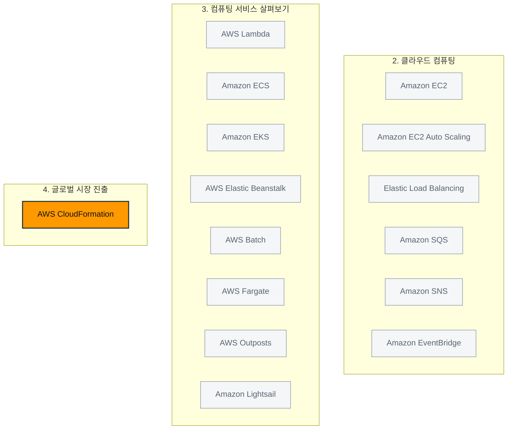

> 강의 4개 · 지식 점검 3문항 · 모듈 평가 6문항

---

## 1. 왜 필요한가

> 컴퓨팅 선택지는 봤다. 그 자원은 지구 어디에 두고, 안 죽게 하려면?

모듈 1에서 리전과 가용 영역이 무엇인지 이름은 붙여 두었습니다.
모듈 2와 3에서는 그 위에 무엇을 올릴지 — EC2, 컨테이너, Lambda — 를 골랐습니다.
그런데 아직 답하지 않은 질문이 하나 남아 있습니다. **그래서 그걸 지구 어디에 둘 것인가**입니다.

리전은 20곳이 넘고, 아무 데나 골라도 되는 것이 아닙니다.
데이터를 국경 밖으로 못 내보내는 규제가 있을 수 있고, 고객이 반대편 대륙에 있으면 지연 시간을 손해 보고,
쓰려던 서비스가 그 리전에 아직 없을 수도 있고, 같은 인스턴스인데도 리전마다 요금이 다릅니다.

이번 모듈에서는 세 가지를 이어서 살펴보겠습니다.
**리전을 고르는 기준**, 고른 뒤 **여러 곳에 복제해서 안 죽게 만드는 방법**,
그리고 리전 밖에서 콘텐츠를 대신 내주는 **엣지 로케이션**입니다.
마지막으로 이 배치를 손으로 반복하지 않도록 **코드로 찍어내는 방법**까지 다루겠습니다.

## 2. 이번에 새로 나오는 서비스

| 서비스 | 한 줄 | 이 모듈에서 맡는 역할 |
|---|---|---|
| [[aws-cloudformation]] | 인프라를 텍스트 템플릿으로 정의하면 알아서 프로비저닝한다 | 고른 리전에 **같은 환경을 반복해서** 찍어내기 |
| [[amazon-cloudfront]] | 엣지 로케이션에 콘텐츠를 캐시해서 전달한다 | 리전 밖에서 **지연 시간 줄이기** |
| [[amazon-route-53]] | DNS. 사람이 읽는 주소를 IP로 바꾸고 사용자를 라우팅한다 | 엣지 네트워크에서 동작하는 서비스의 예 |
| [[aws-global-accelerator]] | AWS 백본 네트워크로 트래픽을 태워 보낸다 | 같은 엣지 네트워크에 얹혀 있는 서비스 |

> [!tip] 이번 모듈의 큰 그림
> **어디에 둘지 고르고**(리전 선택) → **여러 곳에 복제해 안 죽게 만들고**(다중 AZ · 다중 리전) →
> **리전 밖까지 끌어당기고**(엣지 로케이션) → **그 배치를 코드로 재현합니다**(CloudFormation).

## 3. 강의 내용

---

### L1. 리전을 어디로 고를 것인가

> **이번 강의에서 다룰 내용** — 리전이 서로 격리되어 있다는 성질과, 리전을 고를 때 따지는 4가지를 짚어 보겠습니다.

#### 먼저 알아 두실 것 — 리전은 서로 격리되어 있습니다

**각 리전은 다른 모든 리전과 격리되어 있습니다.**
내가 명시적으로 이동 권한을 주지 않는 한, 데이터가 그 리전 밖으로 나가지도 않고 밖에서 들어오지도 않습니다.

이 성질이 뒤에 나올 규정 준수 이야기의 전제입니다.
"금융 데이터가 독일 밖으로 나가면 안 된다"는 요구를 프랑크푸르트 리전 하나로 만족시킬 수 있는 이유가 바로 이것입니다.

#### 리전 선택의 4가지 고려 사항

**이 네 가지는 시험에 그대로 나옵니다.** 순서까지 함께 기억해 두시기 바랍니다.

| # | 요인 | 무엇을 따지는가 | 문제 속 신호 |
|---|---|---|---|
| 1 | **규정 준수 (Compliance)** | 데이터가 어느 국경 안에 있어야 하는가. 리전에 저장된 데이터에는 **그 리전이 위치한 국가의 법률**이 적용됩니다 | "GDPR", "데이터 주권", "국내에 보관해야", "정부 기관", "금융 규제" |
| 2 | **근접성 (Proximity)** | 사용자 기반과 얼마나 가까운가. 가까울수록 데이터 이동 거리가 짧아 **지연 시간이 줄어듭니다** | "고객 대부분이 ○○에 있다", "응답이 느리다", "지연 시간" |
| 3 | **기능 가용성 (Feature availability)** | 내가 쓰려는 서비스·기능이 그 리전에 있는가. 새 기능은 리전마다 순차적으로 출시됩니다 | "그 서비스가 해당 리전에 없다", "특정 기능이 필요하다" |
| 4 | **요금 (Pricing)** | 같은 서비스라도 리전마다 요금이 다릅니다. 현지 조세 체계와 에너지 비용이 반영되기 때문입니다 | "운영 비용이 더 저렴한 곳", "세율" |

> [!warning] 순서에는 이유가 있습니다
> **규정 준수를 가장 먼저 확인하시기 바랍니다.** 데이터가 영국 안에 있어야 한다면 런던 리전이고, 그것으로 결정이 끝납니다.
> 근접성·기능·요금을 아무리 따져도 규제를 못 넘습니다. 나머지 셋은 **규제가 리전을 강제하지 않을 때** 비로소 비교 대상이 됩니다.

**기능 가용성에서 자주 예로 드는 것이 AWS GovCloud 리전**입니다.
미국 정부 기관과 계약자의 규정 준수·보안 요구를 충족하도록 따로 설계된 리전이고,
엄격한 물리적·운영적·인적 보안 제어가 걸려 있어서 **거기서만 쓸 수 있는 것들**이 있습니다.

```quiz 지식 점검 · 리전 선택
Q. 정부 기관의 클라우드 엔지니어가 해당 기관의 리소스를 배포할 AWS 리전을 선택하는 업무를 맡았습니다. 리전을 선택할 때 가장 중요하게 고려해야 할 요소는 무엇입니까? (2개 선택)
+ 기관에서 요구하는 모든 규정 준수 표준
+ 사용자와의 근접성
- 저장된 파일 수
- Chief Information Officer의 개인적 선호도
- 리전이 얼마나 최근에 구성되었는지 여부
> 정부 기관이라는 조건이 붙었으니 **규정 준수**가 최우선입니다. 데이터 주권·개인정보 보호법 같은 요구를 만족하는 리전이 아니면 애초에 후보가 되지 못합니다. 그다음이 **근접성**으로, 사용자와 가까울수록 지연 시간이 줄어 애플리케이션 성능이 좋아집니다. 저장된 파일 수는 리전과 무관하고, 개인적 선호도는 기준이 될 수 없으며, 리전이 언제 만들어졌는지는 4가지 고려 사항 어디에도 들어가지 않습니다.
```

---

### L2. 이중화 아키텍처 — 다중 AZ와 다중 리전

> **이번 강의에서 다룰 내용** — 리소스를 여러 곳에 복제하는 두 단계와, 그것으로 얻는 이점 세 가지를 살펴보겠습니다.

#### 목표는 "끊겨도 티가 안 나는 것"입니다

인프라를 설계할 때는 장기적인 안정성을 염두에 두고 **가동 중지 시간을 줄이거나 아예 없앨 계획**을 세워야 합니다.
한쪽이 멈추면 중복해 둔 쪽으로 자연스럽게 넘어가도록 만드는 것, 이것을 **이중화 아키텍처를 구축한다**고 합니다.

방법은 두 단계입니다. 먼저 **한 리전 안에서 AZ를 여러 개 쓰고**, 더 나아가면 **리전 자체를 여러 개 씁니다.**

| | 다중 AZ (Multi-AZ) | 다중 리전 (Multi-Region) |
|---|---|---|
| 무엇을 견디나 | **AZ 한 곳**의 중단 | **리전 전체**의 장애 |
| 전환 방식 | 구성해 둔 백업 AZ로 자동 전환됩니다. 제대로 설정하면 고객은 차이를 느끼지 못합니다 | 다른 리전으로 **장애 조치(failover)** 를 수행합니다 |
| 부가 효과 | 빠른 재해 복구, 비즈니스 연속성 개선 | **지연 시간 감소** — 리소스를 최종 사용자에게 더 가깝게 놓게 됩니다 |
| 난이도 | 기본기. 웬만하면 항상 합니다 | 설계·운영 부담이 큽니다 |

> [!warning] 두 배치가 주는 이점이 다릅니다
> - **다중 AZ** — 같은 리전 안이므로 사용자와의 거리는 그대로입니다. 얻는 것은 **고가용성과 내결함성**입니다.
> - **다중 리전** — 여기에 더해 사용자 근처에 리소스가 생기므로 **지연 시간까지** 줄어듭니다.
>
> 문제에서 "여러 리전 **및** 여러 AZ를 쓰는 이점"을 물으면 이 둘을 함께 고르시면 됩니다.

#### 얻는 것은 가용성만이 아닙니다

| 이점 | 뜻 | 글로벌 인프라가 어떻게 주는가 |
|---|---|---|
| **고가용성** | 가동 중지 시간을 최소화합니다 | 한 위치가 멈춰도 다른 위치가 요청을 계속 받습니다 |
| **탄력성** | 수요에 맞춰 실시간으로 늘렸다 줄입니다 | 필요한 리전에서 필요한 만큼만 프로비저닝합니다 |
| **민첩성** | 새 시도를 빠르게 해 봅니다 | 새 시장에 진출할 때 데이터 센터를 짓는 대신 그 리전에 배포하면 끝입니다 |

모듈 2에서 "여러 AZ에 나누어 배포하시기 바랍니다"라고 했던 모범 사례가 여기에서 한 단계 위로 확장됩니다.
**인스턴스를 여러 AZ에 → 애플리케이션을 여러 리전에.** 견딜 수 있는 장애의 크기가 그만큼 커집니다.

---

### L3. 엣지 로케이션 — 리전 밖의 글로벌 네트워크

> **이번 강의에서 다룰 내용** — 엣지 로케이션이 무엇이고 리전·AZ와 어떻게 다른지 구분해 보겠습니다.

#### 리전에 배포하는 것만으로 부족할 때

리전을 잘 골라도, 그 리전에서 지구 반대편 사용자까지는 여전히 멉니다.
이미지나 동영상처럼 **같은 파일을 수많은 사람이 반복해서 받아 가는 콘텐츠**라면
매번 원본 리전까지 왕복하는 것은 낭비입니다.

그래서 AWS는 리전과 별개로 **글로벌 엣지 네트워크**를 운영합니다.
애틀랜타, 상하이처럼 전 세계 요지에 전략적으로 배치된 사이트들이고,
여기에 **자주 액세스하는 콘텐츠를 캐시해 두었다가 사용자에게 가까운 곳에서 바로 내줍니다.**

커피숍으로 비유하면 **커피 카트**입니다. 정식 매장의 모든 메뉴를 갖추지는 않지만,
공항이나 행사장처럼 사람이 몰리는 곳에서 **가장 인기 있는 메뉴를 빠르게** 내줍니다.

#### 엣지 로케이션에서 돌아가는 서비스

| 서비스 | 하는 일 |
|---|---|
| [[amazon-cloudfront]] | **CDN(콘텐츠 전송 네트워크)**. 이미지·동영상·API 응답을 캐시해 사용자와 가까운 엣지에서 전달합니다 |
| [[amazon-route-53]] | **DNS**. 사람이 읽는 URL을 컴퓨터가 읽는 IP 주소로 바꾸고 사용자를 애플리케이션으로 라우팅합니다 |
| [[aws-global-accelerator]] | 트래픽을 인터넷 대신 **AWS 백본 네트워크**에 태워 보내 경로를 단축합니다 |

CloudFront와 Route 53의 자세한 동작은 네트워킹 모듈에서 다시 다루겠습니다.
지금은 **"엣지 로케이션은 리전 밖에 있고, 캐싱으로 지연 시간을 줄인다"** 한 줄만 확실히 챙겨 가시면 됩니다.

> [!info] 엣지로도 부족하다면
> 지연 시간 요구가 더 극단적이면 [[aws-outposts]]로 **AWS 서비스를 아예 내 건물 안에서** 실행할 수 있습니다.
> 엣지 로케이션은 AWS가 운영하는 사이트이고, Outposts는 내 데이터 센터에 들어오는 AWS 랙이라는 점이 다릅니다.

#### 세 가지를 한 그림에 놓아 보겠습니다

```layers 모듈 1에서 본 리전 ⊃ AZ ⊃ 데이터 센터에, 이번 모듈의 엣지 로케이션을 나란히 얹은 모습입니다.
AWS 글로벌 인프라 | 전 세계에 흩어진 AWS의 물리 자산 전체
  AWS 리전 — 예: ap-northeast-1 (도쿄) | 다른 리전과 완전히 격리 · AZ 3개 이상
    가용 영역 A | 독립적인 전력·네트워킹·연결성
      데이터 센터 | 1개 이상
    가용 영역 B | 물리적으로 떨어져 있음
      데이터 센터
    가용 영역 C
      데이터 센터
  엣지 로케이션 | 리전 밖에 따로 있는 사이트 · 콘텐츠 캐시 전용 · AZ에 속하지 않음
```

| 요소 | 정의 | 무엇을 위해 있나 | 외울 숫자 |
|---|---|---|---|
| **AWS 리전** | 여러 데이터 센터로 구성된 전 세계의 지리적 영역입니다. 리전끼리는 서로 격리됩니다 | 규정 준수, 근접성, 리전 단위 장애 조치 | AZ **3개 이상** |
| **가용 영역(AZ)** | 리전 안의 개별 위치입니다. 각각 고유한 전력·네트워킹·연결성을 갖습니다 | **고가용성과 내결함성** | 데이터 센터 **1개 이상** |
| **엣지 로케이션** | 전 세계에 전략적으로 배치된 캐싱 사이트입니다. **리전 밖**에 있습니다 | **지연 시간 감소와 전송 속도** | — |

> [!warning] 시험에서 가장 잘 나오는 함정
> **엣지 로케이션은 가용 영역 안에 들어 있지 않습니다.** 리전 바깥에 별도로 존재합니다.
> "각 가용 영역에는 1개 이상의 엣지 로케이션이 있다", "리전 안에 엣지 로케이션이 포함된다" 같은 문장은 전부 오답입니다.
> 포함 관계는 **리전 ⊃ AZ ⊃ 데이터 센터**까지이고, 엣지 로케이션은 그 바깥에 따로 놓입니다.

```quiz 지식 점검 · 글로벌 인프라의 핵심 요소
Q. AWS 리전, 가용 영역, 엣지 로케이션을 설명한 내용으로 옳은 것은 무엇입니까?
- 엣지 로케이션은 각 가용 영역 안에 1개 이상씩 배치되어 해당 영역의 콘텐츠를 캐시합니다.
+ 리전은 3개 이상의 가용 영역으로 구성되고, 각 가용 영역은 1개 이상의 데이터 센터로 구성되며, 엣지 로케이션은 리전 밖에서 콘텐츠를 캐시합니다.
- 리전은 1개의 데이터 센터를 의미하고, 가용 영역은 여러 리전을 묶은 지리적 영역입니다.
- 리전, 가용 영역, 엣지 로케이션은 같은 것을 부르는 다른 이름이므로 바꿔서 사용할 수 있습니다.
> 숫자 두 개와 위치 하나를 함께 확인하시면 됩니다. **리전당 AZ 3개 이상, AZ당 데이터 센터 1개 이상**, 그리고 **엣지 로케이션은 리전 밖**입니다. 엣지 로케이션을 가용 영역 안에 넣어 놓은 선택지, 리전과 AZ의 포함 관계를 뒤집어 놓은 선택지가 매번 함정으로 나옵니다.
```

---

### L4. AWS CloudFormation — 배치를 코드로 재현하기

> **이번 강의에서 다룰 내용** — 코드형 인프라(IaC)가 푸는 문제와 CloudFormation의 동작 방식, 그리고 세 가지 접근 방식의 사용 사례를 살펴보겠습니다.

#### 손으로 하면 반드시 틀립니다

리전 A에 애플리케이션이 돌고 있고, 고가용성을 위해 리전 B에도 똑같이 올리려 합니다.
콘솔을 클릭하거나 CLI 명령을 하나씩 실행해서 수동으로 맞출 수는 있습니다. 하지만 그 방식은 이렇습니다.

- **느립니다** — 화면을 처음부터 다시 거쳐야 합니다
- **틀립니다** — 체크박스 하나, 보안 그룹 규칙 하나를 빠뜨립니다
- **재현이 안 됩니다** — 무엇을 어떻게 설정했는지 기록이 남지 않습니다

모듈 2에서 "사람이 손으로 하면 언젠가 반드시 틀린다"고 했던 이야기가, 리전이 여러 개가 되는 순간 훨씬 심각해집니다.

#### 코드형 인프라(IaC)

**인프라를 파일로 정의해 두는 것**입니다. AWS 아키텍처의 **청사진**이라고 생각하시면 됩니다.
그 청사진을 도구에 넘기면 사양대로 리소스를 자동으로 만들어 줍니다.

| 얻는 것 | 설명 |
|---|---|
| **일관성** | 같은 파일을 여러 번 배포하면 매번 변형 없이 같은 환경이 만들어집니다 |
| **반복 가능성** | 계정이 여러 개든 리전이 여러 개든 같은 템플릿 하나면 됩니다 |
| **추적 가능성** | 파일이므로 **소스 제어**에 넣어 변경 이력을 남길 수 있습니다 |
| **인적 오류 감소** | 완전 자동화된 프로세스라 사람이 빠뜨릴 여지가 줄어듭니다 |

#### AWS CloudFormation

AWS의 IaC 서비스입니다. **CloudFormation 템플릿**이라는 텍스트 문서에 필요한 AWS 리소스를 적어 두면,
CloudFormation이 그 템플릿을 해석해서 리소스를 프로비저닝합니다.

| 성질 | 내용 |
|---|---|
| **선언적(declarative)** | "**무엇을** 만들지"만 적습니다. 어떤 순서로 어떻게 만들지는 CloudFormation이 알아서 합니다 |
| **결국 API 호출** | 백그라운드에서 필요한 AWS API를 대신 호출합니다. 모듈 2에서 본 그 API가 맞습니다 |
| **광범위한 지원** | EC2 인스턴스, 로드 밸런서, Auto Scaling 그룹, 데이터베이스까지 폭넓은 리소스를 다룹니다 |
| **요금** | CloudFormation 자체는 무료이고, 템플릿이 만들어 낸 리소스 요금만 냅니다 |

> [!tip] 문제에서 CloudFormation을 고르는 신호
> **"일관성 있게"**, **"반복 가능한"**, **"여러 리전·여러 계정에 동일하게"**, **"수동 오류를 최소화"**, **"자동화"**.
> 이 표현들이 함께 나오면 답은 코드형 인프라, 즉 CloudFormation입니다.

#### 세 가지 접근 방식 — 언제 무엇을 쓰나

AWS 리소스를 다루려면 결국 **AWS API를 호출**해야 합니다. 그 API에 닿는 길이 세 가지입니다.

| 접근 방식 | 누구에게 맞나 | 대표 사용 사례 |
|---|---|---|
| **AWS Management Console** | 클라우드를 처음 쓰거나 개발 경험이 적은 사용자 | 청구·비용 최적화 대시보드, 시각화 중심 서비스(Amazon QuickSight 등) |
| **프로그래밍 방식 액세스**(CLI · SDK) | 개발자, 코딩에 익숙한 사용자 | **CLI** — 정기 백업 스크립트 같은 반복 태스크 자동화 / **SDK** — 애플리케이션 안에서 S3에 사용자 데이터 저장처럼 API 호출을 코드에 통합 |
| **코드형 인프라(IaC)** | 조직 전체의 리소스 관리를 자동화하려는 팀 | CI/CD 파이프라인을 통한 DevOps 인프라 관리, **다중 리전 애플리케이션에 같은 스택을 반복 배포** |

> [!warning] 스크립트와 IaC를 헷갈리지 마세요
> CLI 스크립트도 자동화이긴 합니다. 하지만 **"이 명령을 이 순서로 실행해라"** 라고 절차를 적는 방식이라,
> 중간에 실패하면 상태가 어중간하게 남고 매번 같은 결과를 보장하기 어렵습니다.
> IaC는 **"최종 상태가 이래야 한다"** 를 적는 방식입니다. 문제에서 **일관성**과 **반복 가능성**을 요구하면 IaC 쪽입니다.

```quiz 지식 점검 · CloudFormation
Q. 빠르게 성장하고 있는 한 기술 스타트업 회사에서 여러 Amazon EC2 인스턴스, Elastic Load Balancing, Auto Scaling 그룹을 비롯하여 복잡한 인프라 설정이 필요한 새로운 웹 애플리케이션을 출시할 계획입니다. 이 애플리케이션은 다양한 환경에 일관성 있게 배포해야 합니다. AWS CloudFormation은 이 회사의 인프라를 관리하는 데 적합한 솔루션입니까?
- CloudFormation은 간단한 인프라 설정만 지원하므로 이 시나리오에서 유용하지 않습니다.
+ CloudFormation은 코드형 인프라(IaC)를 지원하여 다양한 환경에서 일관성 있고 반복 가능한 배포를 실현하므로 적합합니다.
- CloudFormation은 정적 웹 사이트 설정에만 사용해야 하며, 복잡한 애플리케이션에는 적합하지 않습니다.
- CloudFormation은 너무 복잡해서 배포 프로세스의 속도가 저하될 수 있습니다.
> 문제에 **"다양한 환경에 일관성 있게"** 가 들어 있으니 신호가 명확합니다. CloudFormation은 EC2·ELB·Auto Scaling 그룹처럼 여러 리소스가 얽힌 복잡한 스택도 템플릿 하나로 다룰 수 있고, 오히려 구성이 복잡할수록 손으로 맞추는 것보다 빨라집니다. "간단한 설정만 지원한다", "정적 웹 사이트 전용이다"라는 설명은 CloudFormation의 성격과 맞지 않습니다.
```

---

## 4. 모듈 평가

```exam
Q. 한 비영리 조직에서 모든 리소스를 AWS 클라우드로 마이그레이션하려 합니다. 이 조직에서는 리소스를 배포할 AWS 리전을 결정해야 합니다. 클라우드 리소스를 배치할 곳을 결정할 때 고려해야 할 요소가 나열된 옵션은 무엇입니까?
+ 규정 준수, 고객과의 근접성, 기능 가용성, 요금
- 네트워크 속도, 데이터 암호화, 사용자 인터페이스, 스토리지 용량
- 서버 가동 시간, 애플리케이션 성능, 직원 만족도, 사무실 위치
- 소프트웨어 라이선스, 하드웨어 사양, 직원의 클라우드 기술 역량, 고객 리뷰
> 리전 선택의 4가지 고려 사항은 **규정 준수 · 근접성 · 기능 가용성 · 요금**입니다. 이 네 단어를 통째로 외워 두시면 이런 문제는 목록을 보는 즉시 걸러집니다. 나머지 선택지에 들어 있는 항목들은 좋은 고려 사항처럼 보이지만, **리전마다 달라지는 값이 아니라서** 리전을 고르는 기준이 되지 못합니다. 예를 들어 데이터 암호화나 스토리지 용량은 어느 리전을 골라도 똑같이 설정할 수 있습니다.

Q. 여러 AWS 리전 및 여러 가용 영역을 사용할 때 얻을 수 있는 주요 이점을 가장 잘 나타낸 항목은 무엇입니까? (2개 선택)
+ 최종 사용자를 위한 짧은 지연 시간
+ 고가용성 및 내결함성
- 보안 프로토콜 강화
- 스토리지 용량 증가
- 더욱 신속한 데이터베이스 마이그레이션
> 두 배치가 각각 하나씩 답을 줍니다. **여러 리전**을 쓰면 리소스를 최종 사용자에게 더 가깝게 놓을 수 있어 데이터 이동 거리가 줄고 **지연 시간이 짧아집니다.** **한 리전 안의 여러 가용 영역**을 쓰면 한 영역이 죽어도 다른 영역에서 계속 동작하므로 **고가용성과 내결함성**이 올라갑니다. 보안 프로토콜은 배포 위치를 늘린다고 강화되지 않고, 스토리지 용량이나 마이그레이션 속도도 이중화 배치와는 무관합니다.

Q. 다음 중 AWS 엣지 로케이션의 목적과 이점을 가장 잘 설명한 답변은 무엇입니까?
+ 엣지 로케이션은 콘텐츠를 캐시하여 지연 시간을 줄이고 전송 속도를 높이는 방식으로 최종 사용자에게 데이터를 전송합니다.
- 엣지 로케이션은 대부분의 AWS 서비스 및 애플리케이션을 호스팅하는 물리적 데이터 센터로 구성됩니다.
- 엣지 로케이션은 컴퓨팅 집약적인 애플리케이션 및 데이터베이스를 실행하는 데에만 사용됩니다.
- 엣지 로케이션의 용도는 중요한 데이터를 위한 이중화 스토리지 솔루션을 제공하는 것입니다.
> 엣지 로케이션의 존재 이유는 딱 하나, **캐싱을 통한 지연 시간 감소**입니다. 서비스와 애플리케이션을 실제로 호스팅하는 곳은 리전 안의 데이터 센터이고, 컴퓨팅 집약적 워크로드나 데이터베이스도 리전에서 돌립니다. 이중화 스토리지를 제공하는 것도 엣지의 역할이 아닙니다. "호스팅한다", "실행한다"고 말하는 선택지는 엣지 로케이션 설명으로는 전부 오답이라고 보시면 됩니다.

Q. 다음 중 AWS 리전, 가용 영역, 엣지 로케이션의 관계를 가장 잘 설명한 답변은 무엇입니까?
+ AWS 리전은 AWS가 여러 가용 영역을 보유하고 있는 전 세계의 물리적 위치입니다. 엣지 로케이션은 AWS 리전 밖에 위치하며 액세스 빈도가 높은 콘텐츠를 캐싱합니다.
- AWS 리전은 AWS가 여러 가용 영역을 보유하고 있는 전 세계의 물리적 위치입니다. 각 가용 영역에는 1개 이상의 엣지 로케이션이 있습니다.
- AWS 리전에는 여러 엣지 로케이션이 포함되며, 각 엣지 로케이션에는 1개 이상의 가용 영역이 존재할 수 있습니다.
- AWS 리전, 가용 영역, 엣지 로케이션은 모두 동일하며 서로 같은 의미로 바꿔서 사용 가능합니다.
> 갈리는 지점은 **엣지 로케이션이 리전 안이냐 밖이냐**입니다. 정답은 **밖**입니다. 앞부분에서 리전과 가용 영역을 올바르게 설명해 놓고 마지막에 "가용 영역 안에 엣지 로케이션이 있다"고 붙여 놓은 선택지가 가장 잘 걸리는 함정이니, 문장 끝까지 읽으시기 바랍니다. 엣지 로케이션 안에 가용 영역이 있다는 설명은 포함 관계를 완전히 뒤집은 것이고, 셋이 같은 말이라는 설명은 애초에 성립하지 않습니다.

Q. 다음 중 AWS CloudFormation의 주요 기능 및 이점을 설명한 답변은 무엇입니까?
+ CloudFormation을 통해 사용자는 인프라 프로비저닝 및 관리를 자동화하는 코드를 사용하여 AWS 리소스를 모델링하고 설정할 수 있습니다. 이러한 방법을 사용하면 오류를 줄이고 환경 전체의 일관성을 유지할 수 있습니다.
- CloudFormation은 각 AWS 리소스를 하나씩 수동으로 구성할 수 있는 시각적 인터페이스를 제공하는 서비스로, 코드가 전혀 필요하지 않습니다.
- CloudFormation을 활용할 경우 사용자는 자주 액세스하는 콘텐츠를 캐시할 수 있습니다. 이러한 방식을 통해 사용자는 클라우드 리소스에 액세스할 때 지연 시간을 줄일 수 있습니다.
- CloudFormation은 AWS 사용량을 분석하고 회사의 AWS 요금을 줄이기 위한 모범 사례를 추천하는 비용 최적화 도구입니다.
> CloudFormation은 **코드형 인프라 서비스**이므로 핵심 단어는 **코드 · 자동화 · 일관성**입니다. "수동으로 구성하는 시각적 인터페이스"는 AWS Management Console의 설명이고, "자주 액세스하는 콘텐츠 캐싱"은 CloudFront와 엣지 로케이션의 설명이며, "사용량을 분석해 모범 사례를 추천"하는 것은 Trusted Advisor 쪽 이야기입니다. 이 세 가지가 CloudFormation과 붙어 나오는 단골 오답 조합입니다.

Q. 생체 의학 기술 회사의 한 팀에서는 고가용성 및 내결함성을 유지하기 위해 여러 AWS 리전에 새로운 의료 애플리케이션을 배포하는 업무를 담당하고 있습니다. 해당 애플리케이션은 웹 서버, 데이터베이스, 메시지 대기열을 비롯한 여러 가지 구성 요소로 구성됩니다. 애플리케이션 배포는 일관성 있고 반복 가능한 방식으로 이루어져야 하며 자동화를 통해 수동 오류를 최소화해야 합니다. 이 애플리케이션을 배포하는 데 가장 적합한 접근 방식은 무엇입니까?
+ AWS CloudFormation 같은 코드형 인프라(IaC) 서비스를 사용하여 애플리케이션 배포
- AWS Management Console을 사용하여 모든 리전에 각 구성 요소를 수동으로 배포
- 클라우드 제공업체의 API를 사용하여 애플리케이션을 프로그래밍 방식으로 배포하는 스크립트 작성
- 다양한 애플리케이션 티어를 위해 콘솔과 프로그래밍 방식 조합
> 문제가 요구하는 세 단어가 **일관성 · 반복 가능성 · 자동화**이므로 코드형 인프라를 고르시면 됩니다. 콘솔에서 수동으로 배포하는 방식은 "수동 오류를 최소화"라는 조건과 정면으로 어긋납니다. API 스크립트도 자동화이긴 하지만, 절차를 순서대로 적는 방식이라 여러 리전에 걸쳐 동일한 최종 상태를 보장하기 어렵습니다. 콘솔과 스크립트를 섞는 방식은 수동 작업이 남는 데다 관리 지점만 늘어나므로 가장 나쁜 선택입니다.
```

## 5. 여기까지의 지도

주황색이 이번 모듈에서 새로 나온 서비스입니다.



모듈 1에서 세운 세 가지 축에 이번 모듈을 얹어 보면 이렇게 정리됩니다.

| 축 | 이번 모듈에서의 답 |
|---|---|
| 비용 | 같은 서비스라도 **리전마다 요금이 다릅니다.** CloudFormation 자체는 무료이고, 만들어진 리소스 요금만 냅니다 |
| 가용성 | **다중 AZ**로 영역 장애를, **다중 리전**으로 리전 장애를 견딥니다. 엣지 로케이션은 가용성이 아니라 **지연 시간**을 담당합니다 |
| 책임 | **어느 국경 안에 데이터를 둘지 고르는 것은 고객 책임**입니다. AWS는 리전이라는 선택지와 격리를 제공할 뿐입니다 |

## 6. 셀프 체크

- [ ] 리전 선택의 4가지 고려 사항을 순서대로 말하고, 왜 규정 준수가 먼저인지 설명할 수 있다
- [ ] 다중 AZ가 주는 이점과 다중 리전이 추가로 주는 이점을 구분해서 말할 수 있다
- [ ] 리전 ⊃ AZ ⊃ 데이터 센터의 최소 개수를 말하고, 엣지 로케이션이 그 바깥에 있다는 것을 설명할 수 있다
- [ ] 엣지 로케이션의 목적이 "호스팅"이 아니라 "캐싱을 통한 지연 시간 감소"임을 구분할 수 있다
- [ ] 코드형 인프라가 콘솔·CLI 스크립트와 무엇이 다른지 한 문장으로 말할 수 있다
- [ ] 문제에서 "일관성 있고 반복 가능한"을 보면 CloudFormation을 고를 수 있다
- [ ] 위 `모듈 평가` 6문항을 다시 풀어 전부 맞혔다

확인 문제: [문제 풀이](/aws-clf-c02/quiz) · 틀린 것은 [[wrong-answers]]로.
