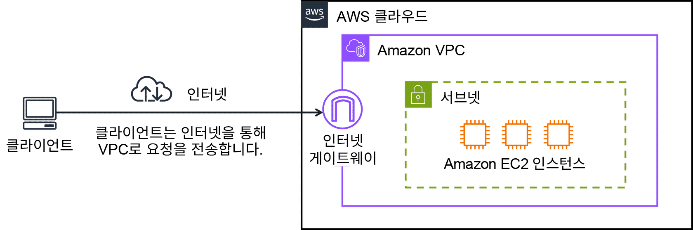
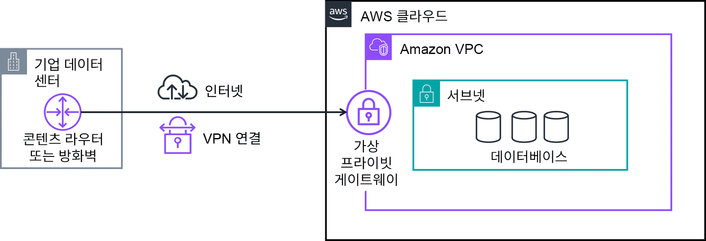
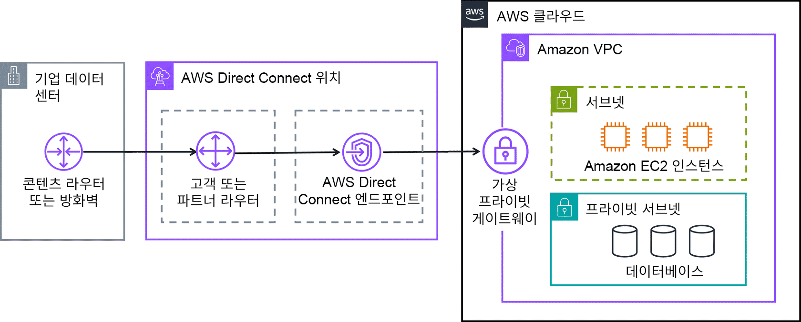
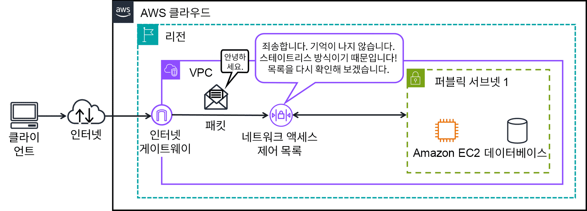
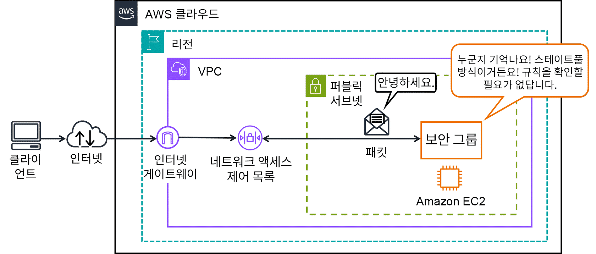
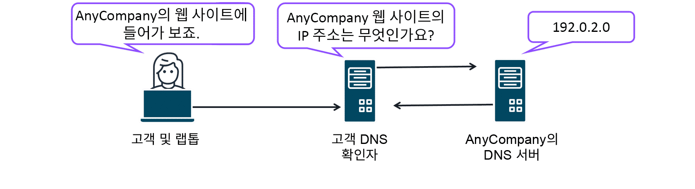
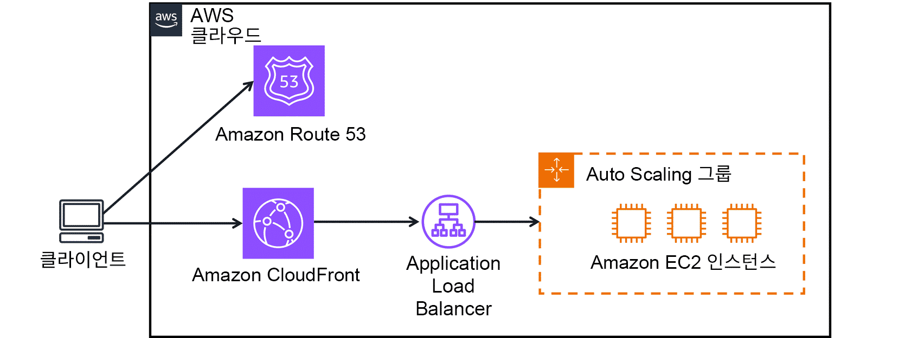
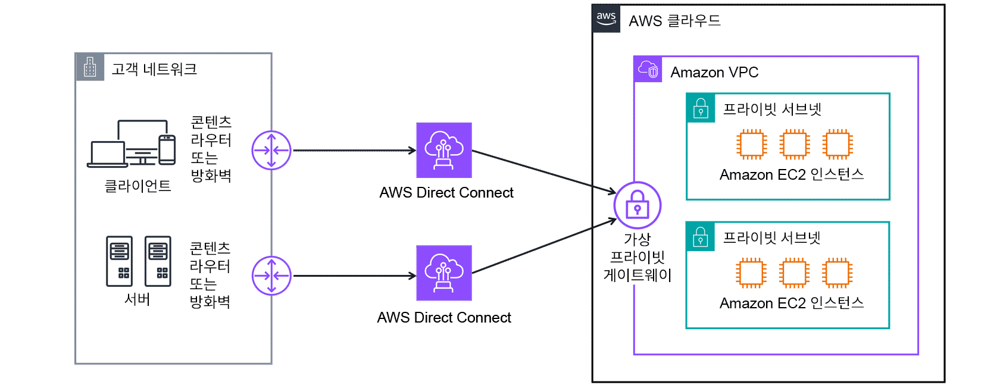
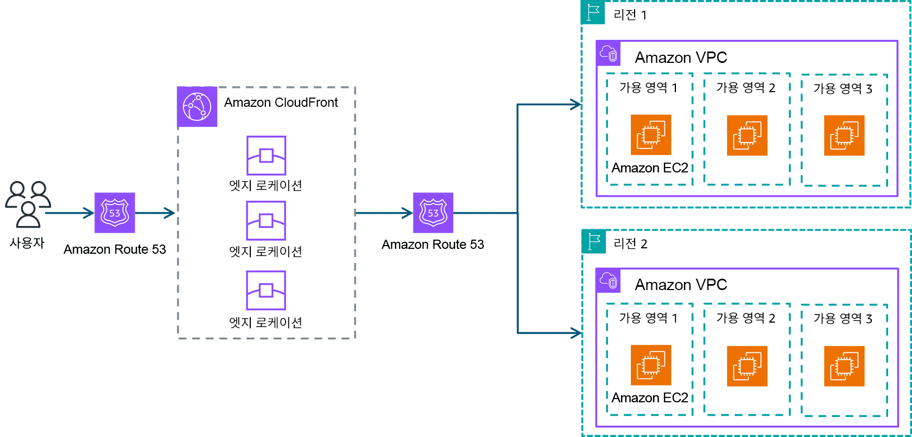

> 강의 7개 · 지식 점검 9문항 · 모듈 평가 14문항

---

## 1. 왜 필요한가

> 여러 곳에 자원이 흩어졌다. 이것들끼리, 그리고 바깥과 어떻게 연결하나?

앞 모듈까지 오면서 EC2 인스턴스, 컨테이너, 로드 밸런서를 여러 리전과 여러 가용 영역에 나누어 두는 방법을 살펴보았습니다.
그런데 지금까지는 이 리소스들이 **어떤 울타리 안에 있는지**, **누가 들어올 수 있는지**를 한 번도 정하지 않았습니다.
울타리가 없으면 전 세계 수백만 고객의 리소스가 아무 제한 없이 서로 트래픽을 주고받게 됩니다.

그래서 이번 모듈에서는 먼저 **Amazon VPC**로 내 리소스만 들어가는 격리된 네트워크를 만들고,
그 안을 **서브넷**으로 쪼개서 공개할 것과 감출 것을 나누어 보겠습니다.
그다음 **게이트웨이**로 바깥과 이어 주고, **보안 그룹·네트워크 ACL**로 들어오는 패킷을 검사하겠습니다.

마지막으로 시선을 전 세계로 넓혀 보겠습니다. 사무실과 AWS를 잇는 **VPN·Direct Connect**,
그리고 전 세계 사용자를 가장 가까운 곳으로 안내하는 **Route 53·CloudFront·Global Accelerator**까지 살펴보겠습니다.

## 2. 이번에 새로 나오는 서비스

| 서비스 | 한 줄 | 이 모듈에서 맡는 역할 |
|---|---|---|
| [[amazon-vpc]] | AWS 안에 나만의 격리된 가상 네트워크를 만든다 | 이 모듈의 **뼈대**. 서브넷·게이트웨이·보안 규칙이 전부 여기 안에 들어갑니다 |
| [[aws-direct-connect]] | 데이터 센터와 AWS를 전용 광케이블로 잇는다 | 인터넷을 아예 **우회**하는 연결 |
| [[amazon-route-53]] | 도메인 이름을 IP 주소로 바꿔 주는 DNS | 사용자를 **어느 리전으로 보낼지** 결정합니다 |
| [[amazon-cloudfront]] | 콘텐츠를 엣지 로케이션에 캐시해서 전송한다 | 정적 콘텐츠를 **사용자 가까이** 미리 가져다 둡니다 |
| [[aws-global-accelerator]] | AWS 프라이빗 글로벌 네트워크로 트래픽을 태운다 | 캐시가 아니라 **경로 자체**를 빠르게 만듭니다 |
| [[aws-transit-gateway]] | 여러 VPC와 온프레미스를 중앙 허브로 묶는다 | 연결이 많아졌을 때의 **교통 정리** |
| [[amazon-api-gateway]] | API를 생성·게시·보호한다 | 애플리케이션 앞단의 **API 출입구** |

> [!tip] 이번 모듈의 큰 그림
> **VPC**(울타리) → **서브넷**(구획) → **게이트웨이**(출입구) → **보안 그룹·네트워크 ACL**(검문소) 순으로 안쪽을 다지고,
> 그다음 **VPN·Direct Connect**(사무실과 연결)와 **Route 53·CloudFront**(전 세계 사용자와 연결)로 바깥으로 넓혀 갑니다.

## 3. 강의 내용

---

### L1. Amazon VPC와 서브넷 — 경계를 먼저 그립니다

> **이번 강의에서 다룰 내용** — VPC가 무엇인지, 서브넷이 왜 필요한지, 퍼블릭 서브넷과 프라이빗 서브넷이 어떻게 갈리는지 살펴보겠습니다.

#### 커피숍으로 다시 돌아가 보겠습니다

성격 급한 손님이 계산원을 건너뛰고 바리스타에게 직접 달려가 주문을 외친다고 해 봅시다.
바리스타는 음료 만드는 일에 집중해야 하는데 그럴 수가 없게 됩니다.
필요한 조치는 분명합니다. **손님은 계산원하고만 상호 작용하게 하고, 바리스타는 안쪽에 감춰 두는 것**입니다.

AWS에서 이 "누구를 밖에 내놓고 누구를 안에 감출지"를 정하는 것이 네트워킹입니다.
그 출발점이 **Amazon VPC(Virtual Private Cloud)** 입니다.

| 커피숍 | AWS |
|---|---|
| 가게 건물 전체 | **VPC** — AWS 클라우드 안에 논리적으로 격리된 내 구역 |
| 손님이 드나드는 홀 | **퍼블릭 서브넷** — 인터넷에서 닿을 수 있는 구획 |
| 직원만 들어가는 주방 | **프라이빗 서브넷** — 내부 네트워크에서만 닿는 구획 |
| 현관문 | **인터넷 게이트웨이** — 이 문이 없으면 아무도 못 들어옵니다 |

#### Amazon VPC

**VPC는 AWS 클라우드 안에서 논리적으로 격리된, 내가 소유한 프라이빗 네트워크**입니다.
VPC를 만들 때 **프라이빗 IP 주소 범위(CIDR 블록)** 를 직접 정하고, 그 안에 EC2 인스턴스나 로드 밸런서 같은 리소스를 배치합니다.

| VPC로 얻는 것 | 무슨 뜻인가 |
|---|---|
| **보안 강화** | 리소스 주변에 경계가 생겨서, 허가 없이는 트래픽이 오갈 수 없습니다 |
| **시간 절약** | 물리 네트워크 장비를 사고 배선할 필요 없이 콘솔에서 네트워크를 정의합니다 |
| **환경 제어** | IP 범위·서브넷 구획·라우팅·방화벽 규칙을 전부 내가 정합니다 |

#### 서브넷 — VPC를 다시 쪼갭니다

리소스를 하나의 큰 VPC에 전부 몰아넣고 끝내지는 않습니다.
**서브넷**은 VPC를 관리 가능한 크기로 나눈 구획이고, 실체는 **VPC 안의 IP 주소 범위**입니다.

```layers VPC 안에 서브넷이 있고, 서브넷 안에 리소스가 들어갑니다. 상자 안의 상자 구조를 그대로 기억해 두세요.
AWS 클라우드 | 다이어그램에서 가장 바깥 상자
  AWS 리전 — us-east-1 | 지연 시간 · 규정 준수 · 비용을 보고 고릅니다
    Amazon VPC — 10.0.0.0/16 | 논리적으로 격리된 내 네트워크
      퍼블릭 서브넷 — 10.0.3.0/24 (AZ a) | 인터넷 게이트웨이로 가는 경로가 있습니다
        웹 서버 EC2 인스턴스 | 누구나 접근해야 하는 리소스
      퍼블릭 서브넷 — 10.0.4.0/24 (AZ b) | 다른 AZ에 하나 더 두어 고가용성 확보
        웹 서버 EC2 인스턴스
      프라이빗 서브넷 — 10.0.1.0/24 (AZ a) | 인터넷으로 가는 경로가 없습니다
        데이터베이스 | 개인 정보 · 주문 내역
      프라이빗 서브넷 — 10.0.2.0/24 (AZ b)
        데이터베이스
```

| | 퍼블릭 서브넷 | 프라이빗 서브넷 |
|---|---|---|
| 목적 | 안에 있는 리소스에 **직접적인 인터넷 액세스**를 제공합니다 | 인터넷에 노출되면 안 되는 리소스를 **격리**합니다 |
| 조건 | **인터넷 게이트웨이로 가는 경로**가 라우팅 테이블에 있습니다 | 그 경로가 없습니다 |
| 들어가는 것 | 온라인 스토어 웹 사이트, 로드 밸런서 | 고객 개인 정보 DB, 주문 내역, 사내 HR 애플리케이션 |
| 다이어그램 표기 | 파선 상자 | 실선 상자 |

**서브넷을 나눈다고 서로 못 만나는 것은 아닙니다.** 규칙을 정의하면 서로 다른 서브넷의 리소스끼리 통신할 수 있습니다.
퍼블릭 서브넷의 EC2 인스턴스가 프라이빗 서브넷의 데이터베이스를 호출하는 구성이 가장 전형적인 예입니다.

> [!warning] 서브넷과 가용 영역을 헷갈리지 마세요
> - **가용 영역(AZ)** — 리전 안의 **물리적으로 분리된 위치**입니다. 이중화 전력·네트워킹을 갖춘 데이터 센터 1개 이상으로 구성됩니다
> - **서브넷** — VPC를 나눈 **IP 주소 범위**, 즉 논리적인 구획입니다
>
> 서브넷은 반드시 하나의 AZ 안에 만들어집니다. "고가용성을 제공한다"는 설명이 붙으면 서브넷이 아니라 **AZ** 쪽입니다.

```quiz 지식 점검 · 서브넷
Q. Amazon VPC에서 서브넷은 어디에 사용됩니까? (3개 선택)
+ 공용 리소스를 공유하는 데 사용할 수 있습니다.
+ 리소스를 구성하는 데 사용할 수 있습니다.
- 1개 이상의 개별 데이터 센터로 구성되므로 고가용성을 제공하는 데 사용할 수 있습니다.
- 다양한 AWS 리소스 및 서비스에 액세스하고 이를 관리하기 위한 중앙 집중식 인터페이스를 제공할 수 있습니다.
+ 리소스를 격리하고 비공개로 유지하는 데 사용할 수 있습니다.
- AWS 클라우드에서 온디맨드 방식의 확장 가능한 컴퓨팅 용량으로 사용할 수 있습니다.
> 서브넷이 하는 일은 **구성 · 공유 · 격리** 세 가지입니다. 리소스를 목적별로 묶어 두고, 퍼블릭 서브넷에서는 공개하고, 프라이빗 서브넷에서는 감춥니다. "1개 이상의 개별 데이터 센터로 구성된다"는 설명은 **가용 영역**의 정의이고, "중앙 집중식 관리 인터페이스"는 AWS Management Console, "온디맨드 컴퓨팅 용량"은 Amazon EC2의 설명입니다.
```

---

### L2. 게이트웨이 — 인터넷 게이트웨이와 가상 프라이빗 게이트웨이

> **이번 강의에서 다룰 내용** — VPC에 문을 다는 두 가지 방법을 비교하고, 각각이 어떤 요구 사항에 대응하는지 짚어 보겠습니다.

VPC는 기본적으로 **닫혀 있습니다.** 문을 달아 주지 않으면 안팎으로 아무것도 오갈 수 없습니다.
그리고 어떤 문을 다느냐에 따라 **누가 들어올 수 있는지가 완전히 달라집니다.**

#### 인터넷 게이트웨이 — 대중에게 열린 현관문

인터넷의 퍼블릭 트래픽이 VPC에 들어오게 하려면 **인터넷 게이트웨이(IGW)** 를 VPC에 연결합니다.
커피숍 현관문과 같습니다. 문이 없으면 손님이 들어와서 주문할 방법 자체가 없습니다.



#### 가상 프라이빗 게이트웨이 — 사원증이 있어야 열리는 문

리소스를 전부 프라이빗으로 두어야 한다면 인터넷 게이트웨이를 달지 않습니다.
대신 **가상 프라이빗 게이트웨이(VGW)** 를 붙여서, **승인된 네트워크에서 오는 트래픽만** 들여보냅니다.

여기서 인터넷은 집과 커피숍 사이의 **공용 도로**라고 생각하시면 됩니다.
누구나 다니는 길이므로, 그 길로 보내는 데이터는 통신사업자나 중간에서 가로채려는 사람에게 노출될 수 있습니다.
그래서 **VPN 연결**로 암호화된 터널을 만들어 그 안으로 데이터를 통과시킵니다.
**가상 프라이빗 게이트웨이는 이 보호된 트래픽이 VPC로 들어오는 지점**입니다.



비유를 하나 더 이어 가겠습니다. 이 커피숍이 **비공개 사옥 안에 입주해 있다면**, 사원증을 제시해야 건물에 들어갈 수 있습니다.
다만 그 사옥에는 여러 회사가 함께 있어서 엘리베이터를 기다리거나 붐비는 복도를 지나야 하죠.
**VPN도 마찬가지로 공유 네트워크(인터넷) 위를 지나가므로, 사용량이 몰리면 느려질 수 있습니다.**
이 한계가 뒤에 나올 Direct Connect의 존재 이유가 됩니다.

#### 둘을 나란히 놓고 보겠습니다

| | 인터넷 게이트웨이 (IGW) | 가상 프라이빗 게이트웨이 (VGW) |
|---|---|---|
| 누구를 들여보내나 | **일반 대중** — 인터넷의 누구나 | **승인된 네트워크**에서 오는 트래픽만 |
| 붙는 곳 | VPC (퍼블릭 서브넷이 이 문으로 나갑니다) | VPC (VPN 연결의 AWS 쪽 끝) |
| 암호화 | 게이트웨이 자체는 암호화하지 않습니다 | **VPN 연결로 암호화**된 터널을 받습니다 |
| 대표 용도 | 퍼블릭 웹 사이트, 퍼블릭 로드 밸런서 | 온프레미스 데이터 센터·사내 네트워크와 연결 |
| 문제 속 신호 | "누구나 액세스", "퍼블릭 웹 사이트" | "**보안 연결**", "**온프레미스와 연결**", "인터넷에서 격리" |

> [!warning] 문제에서 가장 자주 갈리는 지점입니다
> "온프레미스 데이터 센터와 VPC를 **안전하게 연결**하고 싶다"는 지문이 나오면 **가상 프라이빗 게이트웨이**입니다.
> 인터넷 게이트웨이는 반대로 **아무나 들어오게 하는** 문이므로, 격리가 요구 사항일 때는 절대 정답이 아닙니다.

```quiz 지식 점검 · 게이트웨이
Q. 한 회사가 Amazon VPC를 설정하려 합니다. 이 회사는 보안 연결을 사용하여 인터넷을 통해 회사 데이터 센터를 연결해야 합니다. 그리고 리소스를 일반 대중과 격리해야 합니다. 이 고객의 요구 사항을 가장 잘 충족할 수 있는 솔루션은 무엇입니까?
- Amazon VPC에 리소스를 보관하는 퍼블릭 서브넷이 있는 인터넷 게이트웨이
+ VPN 연결 및 Amazon VPC의 프라이빗 서브넷이 있는 가상 프라이빗 게이트웨이
- Amazon VPC가 있고 서브넷이 없는 인터넷 게이트웨이
- Amazon VPC와 퍼블릭 서브넷이 있는 인터넷 게이트웨이
> 요구 사항이 두 개입니다. **보안 연결로 데이터 센터와 연결**(→ VPN + 가상 프라이빗 게이트웨이)과 **일반 대중과 격리**(→ 프라이빗 서브넷). 두 가지를 모두 만족하는 조합은 하나뿐입니다. 인터넷 게이트웨이가 들어간 나머지 선택지는 전부 "일반 대중과 격리"라는 조건을 정면으로 어깁니다.

Q. 한 회사에서 네트워크에 사용할 게이트웨이 유형을 선정하려 합니다. 이 회사는 회사 데이터 센터를 Amazon VPC의 프라이빗 서브넷에 연결해야 합니다. 이 회사의 게이트웨이는 보호된 인터넷 트래픽만 Amazon VPC에 들어올 수 있도록 해야 합니다. 또한 승인된 네트워크에서 들어오는 경우에만 Amazon VPC와 프라이빗 네트워크 간의 연결을 허용해야 합니다.  이 고객의 요구 사항에 가장 잘 부합하는 게이트웨이 유형은 무엇입니까?
- 인터넷 게이트웨이
+ 가상 프라이빗 게이트웨이
- AWS Transit Gateway
- Amazon API Gateway
> "**보호된 트래픽만**", "**승인된 네트워크에서 들어오는 경우에만**" 이 두 표현이 가상 프라이빗 게이트웨이의 정의 그대로입니다. 인터넷 게이트웨이는 퍼블릭 트래픽을 받는 문이라 조건이 반대이고, Transit Gateway는 여러 VPC와 온프레미스를 묶는 **중앙 허브**, API Gateway는 **API를 만들고 게시하는** 서비스라 이 상황과 맞지 않습니다.
```

---

### L3. AWS 클라우드에 연결하는 네 가지 방법

> **이번 강의에서 다룰 내용** — Client VPN·Site-to-Site VPN·PrivateLink·Direct Connect가 각각 어떤 상황을 위한 것인지 구분해 보겠습니다.

연결해야 할 대상이 **원격 직원 한 명**인지, **지사 건물 하나**인지, **다른 VPC의 서비스**인지, **데이터 센터 전체**인지에 따라 답이 달라집니다.
이 네 가지를 한 표로 정리해 두시면 문제에서 바로 골라낼 수 있습니다.

| 서비스 | 무엇을 무엇에 연결하나 | 특징 | 문제 속 신호 |
|---|---|---|---|
| **AWS Client VPN** | **개별 사용자(디바이스)** → AWS·온프레미스 | 관리형 VPN. OpenVPN 기반 클라이언트를 사용하고 수요에 따라 자동으로 스케일링됩니다 | "**원격 작업자**", "재택 근무", "합병으로 늘어난 인력", "완전관리형" |
| **AWS Site-to-Site VPN** | **네트워크 ↔ 네트워크** (데이터 센터·지사 ↔ VPC) | 인터넷 위에 암호화된 터널을 만듭니다. 전용 회선보다 저렴합니다 | "**사이트와 사이트**", "지사", "암호화된 연결", "**비용 효율적**" |
| **AWS PrivateLink** | VPC ↔ **서비스·리소스** | 게이트웨이나 VPN을 따로 세우지 않고, 내 VPC 안에 있는 것처럼 비공개로 연결합니다 | "게이트웨이 설정 없이", "**비공개로** 서비스에 연결" |
| **AWS Direct Connect** | 데이터 센터 → AWS (**전용 광케이블**) | 인터넷을 우회하는 물리 회선입니다. Direct Connect 파트너와 협력해 설치합니다 | "**전용**", "**대역폭**", "일관성 있는 성능", "대규모 데이터 전송" |

#### AWS Direct Connect를 조금 더 보겠습니다

VPN은 편리하지만 **로컬 인터넷의 대역폭을 다른 트래픽과 나눠 씁니다.**
대용량 페이로드를 계속 밀어 넣으면 느려지고, 속도가 얼마나 나올지 예측하기도 어렵습니다.

Direct Connect는 **데이터 센터에서 AWS까지 완전한 프라이빗 전용 광케이블 연결**을 놓습니다.
트래픽은 회사 데이터 센터 → Direct Connect 위치 → 가상 프라이빗 게이트웨이 → VPC 순서로 흘러갑니다.



| Direct Connect가 답이 되는 상황 | 왜 |
|---|---|
| **지연 시간에 민감한 애플리케이션** | 인터넷을 우회하므로 지연 시간이 짧고 **일관성**이 있습니다. 동영상 스트리밍, 실시간 처리에 적합합니다 |
| **대규모 데이터 마이그레이션·전송** | 실시간 분석, 대용량 백업, 브로드캐스트 미디어 처리를 안정적으로 밀어냅니다 |
| **하이브리드 클라우드 아키텍처** | 온프레미스와 AWS를 성능 저하 없이 하나의 환경처럼 씁니다 |

> [!warning] VPN과 Direct Connect를 가르는 한 문장
> **"대역폭"과 "전용"이 나오면 Direct Connect, "암호화"와 "비용 효율"이 나오면 VPN입니다.**
> Direct Connect는 물리 회선이라 설치에 시간과 비용이 들고, 회선이 끊기면 대안이 필요합니다.
> 그래서 실무에서는 **VPN을 Direct Connect의 장애 조치용 백업**으로 함께 쓰는 구성이 흔합니다.

#### 알아 두어야 할 게이트웨이 세 가지

| 게이트웨이 | 하는 일 |
|---|---|
| **AWS Transit Gateway** | 여러 VPC와 온프레미스 네트워크를 **중앙 허브** 하나로 연결합니다. 리전 간 피어링으로 전송 게이트웨이끼리도 이을 수 있습니다 |
| **NAT 게이트웨이** | **프라이빗 서브넷의 인스턴스가 VPC 밖으로 나가는 것은 허용**하되, 밖에서 그 인스턴스로 연결을 시작하는 것은 막습니다 |
| **Amazon API Gateway** | API를 생성·게시·유지 관리·모니터링·보호합니다 |

> [!tip] NAT 게이트웨이는 방향이 핵심입니다
> "프라이빗 서브넷의 서버가 **패치를 받으러 인터넷에 나가야** 하는데, 밖에서는 못 들어오게 하고 싶다"는 지문이 나오면 NAT 게이트웨이입니다.
> **나가는 것만 허용, 들어오는 연결은 차단** — 이 한 방향성이 인터넷 게이트웨이와의 차이입니다.

```quiz 지식 점검 · AWS 클라우드 연결 방법
Q. 한 회사에서 데이터 웨어하우스 및 데이터 백업을 사용하여 온프레미스 데이터 센터의 대규모 마이그레이션을 수행하고 있습니다. 이 회사에는 마이그레이션 동안 많은 대역폭 요구 사항을 충족할 수 있는 솔루션이 필요합니다. 온프레미스 데이터 센터의 일부를 하이브리드 클라우드 솔루션용으로 유지할 예정이므로, 이 솔루션은 이동 후에도 지속적인 데이터 전송에 사용하고자 합니다. 고객의 요구 사항에 가장 잘 부합하는 AWS 솔루션은 무엇입니까?
- AWS Client VPN
- AWS Site-to-Site VPN
+ 온프레미스 네트워크 및 AWS 클라우드에 대한 AWS Direct Connect 링크
- 온프레미스 데이터 센터에 대한 AWS Private Link
> **"많은 대역폭 요구 사항"** + **"대규모 마이그레이션"** + **"하이브리드로 계속 사용"** 세 신호가 전부 Direct Connect를 가리킵니다. VPN 계열은 인터넷 대역폭을 공유하기 때문에 대용량 전송에서 속도가 떨어지고, Client VPN은 애초에 개별 원격 작업자용입니다. PrivateLink는 서비스에 비공개로 연결하는 기술이지 대역폭을 늘려 주는 수단이 아닙니다.
```

---

### L4. 보안 그룹과 네트워크 ACL — VPC 안의 검문소

> **이번 강의에서 다룰 내용** — 패킷이 VPC 안에서 어떤 검문을 거치는지 따라가 보고, 보안 그룹과 네트워크 ACL의 차이를 확실히 갈라 놓겠습니다.

게이트웨이는 **경계에만** 있는 문입니다. 문을 통과한 뒤 안에서 벌어지는 일까지 통제하지는 못합니다.
그래서 VPC 내부에는 검문소가 두 겹으로 놓여 있습니다.

#### 패킷이 지나가는 길

고객이 요청을 보내면 그 요청은 **패킷**이라는 데이터 단위로 전송됩니다.
패킷이 VPC에 들어와서 EC2 인스턴스에 닿기까지 거치는 순서는 이렇습니다.

| 순서 | 검문소 | 무엇을 확인하나 |
|---|---|---|
| 1 | **인터넷 게이트웨이** | VPC로 들어올 수 있는지 |
| 2 | **네트워크 ACL** | **서브넷 경계**를 넘을 수 있는지 |
| 3 | **보안 그룹** | 그 **인스턴스**에 닿을 수 있는지 |

#### 네트워크 ACL — 출입국 심사대

**네트워크 ACL은 서브넷 수준에서 인바운드·아웃바운드 트래픽을 제어하는 가상 방화벽**입니다.
공항의 출입국 심사 직원을 떠올리시면 됩니다. 여행자(패킷)가 **들어올 때도 나갈 때도** 신원을 확인합니다.

| | 기본 네트워크 ACL | 사용자 지정 네트워크 ACL |
|---|---|---|
| 초기 상태 | 모든 인바운드·아웃바운드 트래픽을 **허용**합니다 | 규칙을 추가할 때까지 모든 트래픽을 **거부**합니다 |
| 수정 | 규칙을 추가해서 바꿀 수 있습니다 | 허용할 트래픽을 직접 지정합니다 |

모든 네트워크 ACL 맨 끝에는 **명시적 거부 규칙**이 있습니다.
목록의 어떤 규칙과도 일치하지 않은 패킷은 이 규칙에서 반드시 걸러집니다.

**네트워크 ACL은 스테이트리스(stateless)** 입니다. 아무것도 기억하지 않습니다.
나갈 때 통과시킨 요청이라도, 그 응답이 돌아올 때 **처음 보는 패킷처럼 목록을 다시 확인**합니다.
그래서 인바운드 규칙과 아웃바운드 규칙을 **양쪽 모두** 정의해 두어야 합니다.



#### 보안 그룹 — 건물 정문의 경비원

**보안 그룹은 EC2 인스턴스 같은 개별 리소스 수준에서 트래픽을 제어하는 가상 방화벽**입니다.
아파트 정문에서 방문객 목록을 확인하는 경비원과 같습니다.

| | 새로 만든 보안 그룹 |
|---|---|
| 인바운드 | 모든 트래픽을 **거부**합니다. 모든 포트와 모든 IP가 차단된 상태로 시작합니다 |
| 아웃바운드 | 모든 트래픽을 **허용**합니다 |

VPC에 원래 들어 있는 **기본(default) 보안 그룹**만 예외입니다.
여기에는 **같은 보안 그룹에 속한 리소스끼리 서로 통신할 수 있게** 하는 인바운드 규칙이 하나 들어 있습니다.

여기에 사용자 지정 규칙을 추가해서 허용할 트래픽을 정합니다.
웹 서버라면 HTTPS 트래픽만 승인하고 나머지는 그대로 막아 두는 식입니다.
**보안 그룹에는 허용 규칙만 있습니다.** 규칙에 적히지 않은 것은 자동으로 거부됩니다.

**보안 그룹은 스테이트풀(stateful)** 입니다. 들여보낸 요청을 기억합니다.
그 요청에 대한 응답이 돌아오면 **인바운드 규칙과 무관하게** 통과시킵니다.
경비원이 방문객을 들여보낼 때는 목록을 확인하지만, 나갈 때는 다시 확인하지 않는 것과 같습니다.



> [!info] 인스턴스마다 따로 붙일 수 있습니다
> 같은 VPC 안의 여러 EC2 인스턴스를 하나의 보안 그룹에 묶어도 되고, 인스턴스마다 다른 보안 그룹을 붙여도 됩니다.

#### 시험에 그대로 나오는 비교표입니다

| 기능 | **보안 그룹** | **네트워크 ACL** |
|---|---|---|
| **범위** | **인스턴스 수준** (EC2 인스턴스에 연결) | **서브넷 수준** (서브넷에 연결) |
| **상태** | **스테이트풀** — 이전 결정을 기억합니다 | **스테이트리스** — 아무것도 기억하지 않습니다 |
| **규칙 유형** | **허용 규칙만** 있습니다 | **허용 규칙 + 거부 규칙** 둘 다 있습니다 |
| **기본값** | 인바운드 전부 거부 / 아웃바운드 전부 허용 | 기본 ACL은 전부 허용 / 사용자 지정 ACL은 전부 거부 |
| **반환 트래픽** | 인바운드가 허용되면 반환 트래픽이 **자동 허용**됩니다 | 반환 트래픽도 **규칙을 다시 확인**합니다 |
| **용도** | 개별 인스턴스의 트래픽을 **세밀하게** 제어 | 서브넷을 드나드는 트래픽을 **광범위하게** 제어 |

> [!warning] 문제에서 둘을 가르는 두 단어
> - 지문에 **"인스턴스 수준"**, **"개별 EC2"**, **"세밀한 제어"** → **보안 그룹**
> - 지문에 **"서브넷 수준"**, **"광범위한 제어"**, **"거부 규칙도 사용"** → **네트워크 ACL**
>
> 특히 **거부(deny) 규칙**은 네트워크 ACL만 가진 기능입니다. 지문에 "허용 및 거부 규칙을 모두 사용"이 보이면 그 순간 답이 정해집니다.

#### 이건 누구 책임일까요

공동 책임 모델로 돌아가 보겠습니다.
**네트워크 ACL과 보안 그룹으로 서브넷과 리소스를 보호하는 일은 고객의 책임**입니다.
AWS는 이 통제 수단을 제공할 뿐, 어떤 규칙을 넣을지는 고객이 정합니다.
네트워크 트래픽 보호는 클라우드 **내부의** 보안에 해당하고, 애플리케이션을 지키는 핵심 방어선입니다.

```quiz 지식 점검 · 보안 그룹과 네트워크 ACL
Q. 한 소매업체 고객이 AWS 클라우드에서 애플리케이션을 설정하려 합니다. 해당 애플리케이션은 퍼블릭 서브넷에서 개별 Amazon EC2 인스턴스에 대한 트래픽 규칙을 정의하는 과정에서 많은 제어가 필요합니다. 다음 중 리소스 보안에 대한 요구 사항을 가장 잘 충족하는 솔루션은 무엇입니까?
- 퍼블릭 인터넷에서 액세스하지 못하도록 모든 서브넷을 프라이빗 서브넷으로 변경합니다.
+ 애플리케이션 요구 사항에 따라 EC2 인스턴스의 보안 그룹을 설정합니다.
- 애플리케이션 요구 사항에 따라 EC2 인스턴스의 네트워크 ACL을 설정합니다.
- 고객의 요구 사항을 충족하는 강력한 암호로 퍼블릭 서브넷을 설정합니다.
> **"개별 EC2 인스턴스"** 라는 표현이 결정적입니다. 인스턴스 수준에서 동작하는 것은 보안 그룹뿐입니다. 네트워크 ACL은 서브넷에 붙는 것이라 인스턴스마다 다른 규칙을 줄 수 없습니다. 서브넷을 전부 프라이빗으로 바꾸면 퍼블릭 서브넷에서 서비스하겠다는 요구 자체가 사라지고, "서브넷에 암호를 건다"는 개념은 AWS에 존재하지 않습니다.

Q. 스테이트리스 패킷 필터링을 수행하는 네트워크 구성 요소는 무엇입니까?
- 프라이빗 서브넷
+ 네트워크 액세스 제어 목록(네트워크 ACL)
- Amazon VPC
- 보안 그룹
> 스테이트리스는 **아무것도 기억하지 않고 매번 목록을 다시 확인하는** 방식이고, 이것이 네트워크 ACL의 동작입니다. 보안 그룹은 정반대인 스테이트풀입니다. 프라이빗 서브넷은 IP 범위를 나눈 구획이고 VPC는 네트워크 전체라서, 둘 다 패킷 필터링을 수행하는 구성 요소가 아닙니다.
```

---

### L5. VPC를 실제로 만드는 순서

> **이번 강의에서 다룰 내용** — 콘솔에서 VPC를 구성할 때 어떤 순서로 무엇을 만드는지, 그리고 라우팅 테이블이 왜 필요한지 살펴보겠습니다.

지금까지 나온 구성 요소들이 실제로는 어떤 순서로 조립되는지 확인해 보겠습니다.
세부 조작을 외우실 필요는 없습니다. **"무엇이 있어야 그다음이 성립하는가"** 만 따라오시면 됩니다.

| 단계 | 만드는 것 | 정하는 값 | 왜 이 순서인가 |
|---|---|---|---|
| 1 | **VPC** | CIDR 블록 (예: `10.0.0.0/16`) | 이 범위 안에서 모든 리소스가 프라이빗 IP를 받습니다 |
| 2 | **서브넷** | 이름, 가용 영역, CIDR (예: `10.0.1.0/24`) | VPC 범위를 쪼갭니다. **AZ 2개에 퍼블릭·프라이빗을 각각** 두는 것이 모범 사례입니다 |
| 3 | **인터넷 게이트웨이** | 이름 | 만든 뒤 반드시 **VPC에 연결(attach)** 해야 합니다 |
| 4 | **라우팅 테이블** | 대상 `0.0.0.0/0` → 인터넷 게이트웨이 | 인스턴스에게 "인터넷으로 나가려면 이쪽"을 알려 줍니다 |
| 5 | **서브넷 연결** | 라우팅 테이블에 퍼블릭 서브넷을 연결 | **이 시점에 비로소 퍼블릭 서브넷이 됩니다** |
| 6 | **보안 그룹 · 네트워크 ACL** | 허용할 트래픽 규칙 | 드나드는 트래픽을 필터링합니다 |
| 7 | **리소스 배치** | EC2 인스턴스, 데이터베이스 등 | 서브넷 안에 실제 리소스를 넣습니다 |

> [!warning] 이름을 `public-subnet-1`로 지었다고 퍼블릭 서브넷이 되지는 않습니다
> 서브넷을 퍼블릭으로 만드는 것은 이름이 아니라 **인터넷 게이트웨이로 가는 경로가 라우팅 테이블에 있는지**입니다.
> 프라이빗 서브넷은 그 경로가 없어서 프라이빗인 것입니다. 시험에서 자주 건드리는 지점입니다.

**라우팅 테이블**은 네트워크 트래픽을 어디로 보낼지 결정하는 규칙 집합입니다.
VPC 안의 모든 서브넷은 라우팅 테이블 하나와 연결되어야 하고, 그 테이블이 해당 서브넷의 경로를 통제합니다.
새로 만든 라우팅 테이블에는 처음부터 **VPC 내부끼리 통신하는 경로**가 들어 있습니다.
다만 바깥으로 나가는 경로는 없으므로, `0.0.0.0/0`을 인터넷 게이트웨이로 보내는 경로를 직접 추가해야 합니다.

> [!tip] 퍼블릭 IP 자동 할당
> 퍼블릭 서브넷에서는 **퍼블릭 IPv4 주소 자동 할당**을 켜서, 이 서브넷에서 시작되는 리소스가 퍼블릭 IP를 받게 합니다.
> 프라이빗 서브넷에서는 이 설정을 켜지 않습니다.

> [!warning] 퍼블릭 IPv4 요금은 기출과 현재가 다릅니다
> **기출** — 탄력적 IP(EIP)가 **실행 중인 인스턴스에 붙어 있으면** 무료, 놀리고 있으면 시간당 과금.
> **현재** — 붙어 있는 것까지 **전부** 시간당 과금.
> 둘 다 알아 두시면 어느 쪽으로 나와도 대응하실 수 있습니다.

---

### L6. 글로벌 네트워킹 — 사용자를 가장 가까운 곳으로

> **이번 강의에서 다룰 내용** — DNS가 무엇인지, Route 53·CloudFront·Global Accelerator가 각각 어떤 문제를 푸는지 살펴보겠습니다.

VPC까지는 "내 리소스를 어떻게 가둘 것인가"의 이야기였습니다.
이번에는 방향을 뒤집어서, **전 세계에 흩어진 사용자를 내 리소스까지 어떻게 빠르게 데려올 것인가**를 보겠습니다.

**엣지 네트워킹**은 저장과 컴퓨팅을 **사용자에게 더 가까운 곳**으로 옮기는 방식입니다.
가까운 곳에서 처리하거나 캐시해 두면 지연 시간이 줄고 응답이 빨라집니다.

#### DNS — 인터넷의 전화번호부

사람은 도메인 이름을 읽고 컴퓨터는 IP 주소를 읽습니다. 그 사이를 잇는 것이 **DNS(도메인 이름 시스템)** 이고,
도메인 이름을 IP 주소로 바꾸는 과정을 **DNS 확인(resolution)** 이라고 부릅니다.



| 단계 | 일어나는 일 |
|---|---|
| 1 | 사용자가 브라우저에 도메인 이름을 입력하면 요청이 **고객 DNS 확인자**로 갑니다 |
| 2 | 확인자가 **회사 DNS 서버**에 그 웹 사이트의 IP 주소를 물어봅니다 |
| 3 | DNS 서버가 IP 주소(예: `192.0.2.0`)로 응답하고, 브라우저는 그 주소로 이동합니다 |

#### Amazon Route 53

**Route 53은 AWS의 DNS 웹 서비스**입니다. 전 세계에 분산된 DNS 서버로 최종 사용자를 리소스까지 안내합니다.
AWS에서 실행되는 인프라(EC2 인스턴스, 로드 밸런서)로도 보내고, **AWS 밖의 인프라로도** 보낼 수 있습니다.

| Route 53이 하는 일 | 설명 |
|---|---|
| **DNS 확인** | 도메인 이름을 IP 주소로 변환합니다 |
| **트래픽 라우팅** | 지연 시간 기반, 지리적 위치, 지리적 근접성, 가중치 기반 라운드 로빈 등의 **라우팅 정책**을 사용합니다 |
| **도메인 등록** | 새 도메인 이름을 직접 등록할 수 있습니다 |
| **DNS 레코드 관리** | 다른 등록 대행자가 관리하던 기존 도메인의 레코드를 옮겨 와 **한곳에서 전부 관리**할 수 있습니다 |

#### Amazon CloudFront

**CloudFront는 콘텐츠 전송 네트워크(CDN)** 입니다.
모든 요청을 중앙 창고(오리진 서버)까지 보내는 대신, **콘텐츠 사본을 엣지 로케이션에 캐시**해 둡니다.
사용자와 거리가 짧을수록 전송 시간이 짧아지므로, 웹 사이트·동영상·이미지가 훨씬 빨리 로드됩니다.

| 사용 사례 | CloudFront가 해결하는 것 |
|---|---|
| 스트리밍 동영상 | 수천 명이 동시에 접속하는 피크 시간에도 버퍼링 없이 재생됩니다 |
| 전자상거래 | 쇼핑 시즌에도 제품 이미지와 페이지를 빠르게 전달해 장바구니 이탈을 줄입니다 |
| 모바일 앱 | 지도 데이터와 이미지를 지연 없이 전송합니다 |

#### Route 53과 CloudFront가 함께 일하는 모습



| 순서 | 일어나는 일 |
|---|---|
| 1 | 고객이 웹 사이트에 접속해 데이터를 요청합니다 |
| 2 | **Route 53**이 DNS 확인으로 IP 주소를 알려 줍니다 |
| 3 | 요청이 **CloudFront**를 통해 가장 가까운 **엣지 로케이션**으로 갑니다 |
| 4 | 엣지 로케이션이 **Application Load Balancer**를 거쳐 EC2 인스턴스로 요청을 전달합니다 |

#### AWS Global Accelerator

**Global Accelerator는 트래픽을 AWS의 프라이빗 글로벌 네트워크에 태우는 서비스**입니다.
정체가 생기는 일반 인터넷 경로 대신, **인터넷 고속도로에 전용 차선을 낸다**고 생각하시면 됩니다.
엔드포인트 상태, 사용자 위치, 라우팅 정책을 보고 트래픽을 보내므로,
한 위치에 문제가 생기면 정상인 쪽으로 트래픽을 돌립니다.

| 사용 사례 | 얻는 것 |
|---|---|
| 글로벌 게임 | 도쿄·뉴욕·런던의 플레이어가 비슷한 수준의 응답성을 경험합니다 |
| 금융 서비스 앱 | 피크 시간이나 지역 네트워크 상태가 나쁠 때에도 잔고 조회와 거래가 빠르게 처리됩니다 |

> [!warning] 엣지 서비스 세 가지를 문제 속 신호로 갈라 두세요
> | 서비스 | 정체 | 문제 속 신호 |
> |---|---|---|
> | **Route 53** | DNS | "**도메인 등록**", "도메인 이름 관리", "도메인 이름을 IP로 변환", "여러 등록 대행자를 한곳에서" |
> | **CloudFront** | CDN (캐시) | "**콘텐츠 전송**", "동영상·이미지·정적 콘텐츠", "**캐시**", "지연 시간 감소" |
> | **Global Accelerator** | 네트워크 경로 최적화 | "**AWS 글로벌 네트워크**", "엔드포인트 상태에 따라 라우팅", "가용성·성능·보안 개선" |
>
> CloudFront는 **콘텐츠를 미리 복사**해 두는 쪽이고, Global Accelerator는 **경로 자체**를 빠르게 만드는 쪽입니다.

```quiz 지식 점검 · 엣지 네트워킹
Q. 전 세계에 영업 인력을 보유한 한 기업 고객이 대규모 영업 교육 콘텐츠 라이브러리를 제공하고자 합니다. 이 고객의 목표는 풍부한 미디어를 갖춘 교육 콘텐츠에 영업 인력이 액세스할 수 있도록 보장하는 동시에, 콘텐츠의 지연 시간을 줄이고 비용을 절감하는 것입니다. 이 고객의 요구 사항에 가장 적합한 AWS 서비스는 무엇입니까?
- Amazon VPC
- Amazon Route 53
+ Amazon CloudFront
- AWS Global Accelerator
> **"풍부한 미디어 콘텐츠"** 와 **"지연 시간 감소"** 가 함께 나오면 CDN, 즉 CloudFront입니다. 엣지 로케이션에 캐시해 두면 오리진까지 갈 필요가 없어 지연 시간과 데이터 전송 비용이 함께 줄어듭니다. Route 53은 사용자를 어디로 보낼지 정하는 DNS일 뿐 콘텐츠를 캐시하지 않고, Global Accelerator는 경로를 최적화하지만 콘텐츠 라이브러리 전송이 주 목적은 아닙니다. VPC는 애초에 엣지 서비스가 아닙니다.

Q. 여러 도메인 등록 회사와 수년간 협업해 온 경험이 있는 한 미디어 회사가 기존 도메인 이름을 모두 관리할 수 있는 솔루션을 찾고 있습니다. 그리고 새 도메인 이름도 등록하고자 합니다. 이 회사의 이상적인 목표는 단일한 서비스에서 모든 도메인 이름을 관리하는 것입니다. 이 고객의 요구 사항에 가장 적합한 AWS 서비스는 무엇입니까?
- Amazon VPC
+ Amazon Route 53
- Amazon CloudFront
- AWS Global Accelerator
> **"도메인 이름 등록과 관리"** 는 Route 53의 고유 기능입니다. 새 도메인을 등록할 수도 있고, 다른 등록 대행자가 관리하던 도메인의 DNS 레코드를 옮겨 와 한곳에서 관리할 수도 있습니다. 나머지 서비스에는 도메인 등록 기능 자체가 없습니다.
```

---

### L7. 실제 환경에서의 클라우드 — 글로벌 아키텍처

> **이번 강의에서 다룰 내용** — 지금까지의 구성 요소가 실제 기업 아키텍처에서 어떻게 맞물리는지 두 가지 사례로 확인해 보겠습니다.

지금까지는 **단일 리전의 단일 VPC**를 전제로 이야기했습니다.
현실의 글로벌 기업은 여러 계정, 여러 리전, 여러 VPC, 그리고 하이브리드 배포를 함께 씁니다.
전부 이해하지 않으셔도 괜찮습니다. **어떤 요구 사항이 어떤 구성 요소를 불러오는지**만 따라가 보시면 됩니다.

#### 사례 1 — Direct Connect를 이중화한 하이브리드 아키텍처

대용량 전송과 중요한 애플리케이션 성능 때문에 고대역폭 연결이 필요한 회사의 구성입니다.



| 요소 | 역할 |
|---|---|
| **고객 네트워크** | 클라이언트와 서버가 안전한 고대역폭 연결을 필요로 합니다 |
| **콘텐츠 라우터 또는 방화벽** | 사내 네트워크를 Direct Connect에 물립니다 |
| **다중 Direct Connect 연결** | 하나가 끊겨도 다른 회선이 받습니다. 게다가 여러 연결을 **합쳐서 집계 대역폭을 늘릴 수도** 있습니다 |
| **가상 프라이빗 게이트웨이** | Direct Connect로 들어온 트래픽이 VPC의 **프라이빗 리소스**에 닿는 지점입니다 |

> [!tip] VPN과 Direct Connect의 실전 조합
> Direct Connect는 **물리적인 유선 연결**이라 회선이 끊어지면 그대로 단절됩니다.
> 그래서 **VPN을 Direct Connect의 장애 조치용 백업**으로 두거나, 위 그림처럼 **Direct Connect 회선을 하나 더** 두는 구성을 씁니다.
> 내결함성과 대역폭 증가를 동시에 얻는 방법입니다.

#### 사례 2 — 여러 리전으로 콘텐츠 전송

전 세계에 지사와 고객을 둔 회사가 지연 시간을 최소화하는 구성입니다.



| 순서 | 일어나는 일 |
|---|---|
| 1 | 사용자가 사용자 지정 도메인으로 접속하면 요청이 **Route 53 DNS 레코드**로 갑니다 |
| 2 | Route 53이 **라우팅 정책**으로 사용자와 가장 가까운 리전을 판단합니다 |
| 3 | Route 53이 사용자를 해당 리전의 **CloudFront 엣지 로케이션**으로 보냅니다 |
| 4 | 엣지 로케이션이 지정된 **오리진 서버**에서 콘텐츠를 가져옵니다. 오리진 쪽 웹 사이트는 고가용성을 위해 **여러 AZ**에 걸쳐 구축되어 있습니다 |

**여기서 두 서비스의 분업이 분명하게 보입니다.**
**Route 53은 "어느 리전으로 보낼지"** 를 정하고, **CloudFront는 "그 리전의 콘텐츠를 얼마나 가까이서 줄지"** 를 담당합니다.

```quiz 지식 점검 · 전용 연결 선택
Q. 한 의료 회사가 AWS에 대한 전용 네트워크 연결을 구축할 방법을 모색하고 있습니다. 이 회사는 인터넷을 통해 AWS로 전송되는 대량의 데이터 페이로드에 이러한 연결을 사용하려 합니다. 그리고 환자 데이터의 민감한 특성으로 인해 규정 준수 요구 사항도 충족해야 합니다. 이 고객의 요구 사항을 가장 잘 충족하는 AWS 클라우드 연결 유형은 무엇입니까?
- 클라이언트에서 AWS 클라우드의 VPC에 있는 인터넷 게이트웨이까지 일반적인 인터넷 연결
- 기업 데이터 센터에서 AWS 클라우드까지 VPN 연결
- 기업 데이터 센터에서 Amazon VPC에 대한 가상 프라이빗 게이트웨이까지 VPN 연결
+ 기업 데이터 센터에서 AWS 클라우드의 VPC에 있는 가상 프라이빗 게이트웨이까지 AWS Direct Connect 연결
> **"전용 네트워크 연결"** + **"대량의 데이터 페이로드"** + **"규정 준수"** 세 조건이 모두 Direct Connect를 가리킵니다. VPN 계열은 인터넷 대역폭을 공유해서 대용량 전송 시 속도가 떨어지고, 일반 인터넷 연결은 전용도 아니고 규정 준수 요구도 만족시키지 못합니다. Direct Connect로 들어온 트래픽이 VPC의 프라이빗 리소스에 닿으려면 **가상 프라이빗 게이트웨이**를 거친다는 점까지 함께 기억해 두세요.
```

---

## 4. 모듈 평가

```exam
Q. AWS 클라우드의 네트워킹이란 무엇입니까?
- 읽을 수 있는 도메인 이름을 IP 주소로 변환하는 시스템
- 사용자가 정의하는 가상 네트워크에서 AWS 리소스를 시작할 수 있는 AWS 클라우드의 논리적으로 격리된 섹션
+ 데이터와 리소스를 교환할 수 있는 상호 연결된 디바이스
- 물리적으로 격리된 데이터 센터 또는 AWS 리전 내의 데이터 센터 집합
> 네트워킹의 정의는 **데이터와 리소스를 교환할 수 있도록 상호 연결된 디바이스**입니다. 나머지 셋은 각각 **DNS**, **Amazon VPC**, **가용 영역**의 정의라서, 이 모듈의 개별 구성 요소를 네트워킹 전체의 정의 자리에 끼워 넣은 함정입니다.

Q. AWS 클라우드에서 가용 영역의 주요 기능은 무엇입니까?
- VPC의 EC2 인스턴스에 대한 인바운드 및 아웃바운드 트래픽을 필터링합니다.
- 이는 사용자가 정의하는 가상 네트워크에서 AWS 리소스를 시작할 수 있는 AWS 클라우드의 논리적으로 격리된 섹션을 프로비저닝합니다.
- 이를 통해 리소스를 격리하고 액세스를 제어할 수 있는 Virtual Private Cloud(VPC)의 하위 섹션을 생성할 수 있습니다.
+ 리소스를 여러 영역에 배포할 수 있으므로, 애플리케이션 가용성 및 내결함성이 향상됩니다.
> 가용 영역의 존재 이유는 언제나 **가용성과 내결함성**입니다. 트래픽 필터링은 보안 그룹, 논리적으로 격리된 섹션은 VPC, VPC의 하위 섹션은 서브넷의 설명입니다. AZ와 서브넷을 바꿔 놓은 선택지가 매번 나오니, "물리적으로 분리된 위치 = AZ / IP 범위로 나눈 구획 = 서브넷"으로 갈라 두세요.

Q. 한 회사에서 온프레미스 데이터 센터와 Amazon VPC 간에 안전한 프라이빗 연결을 설정하여 하이브리드 클라우드 아키텍처를 구축하고자 합니다. 안전한 연결을 보장하려면 어떤 구성 요소를 사용해야 합니까?
- 인터넷 게이트웨이
+ 가상 프라이빗 게이트웨이
- 라우팅 테이블
- 서브넷
> **"온프레미스 데이터 센터와 VPC를 안전하게 연결"** 은 가상 프라이빗 게이트웨이의 정의 그대로입니다. 인터넷 게이트웨이는 반대로 일반 대중을 들여보내는 문이고, 라우팅 테이블은 트래픽의 방향을 정하는 규칙일 뿐 연결을 만들지 않으며, 서브넷은 VPC 내부의 구획이라 외부와의 연결과는 무관합니다.

Q. 한 고객이 애플리케이션을 위한 Amazon VPC를 생성하려 합니다. 이 고객이 원하는 건 시작된 리소스를 인터넷상의 사용자와 격리할 수 있도록 Amazon VPC에 프라이빗 세그먼트를 생성하는 것입니다. 이 고객의 요구 사항에 가장 잘 부합하는 네트워크 구성 요소는 무엇입니까?
- 퍼블릭 서브넷
+ 프라이빗 서브넷
- 퍼블릭 서브넷 또는 프라이빗 서브넷 모두 사용 가능
- 서브넷 대신 가용 영역
> **"인터넷상의 사용자와 격리"** 가 조건이므로, 인터넷 게이트웨이로 가는 경로가 없는 프라이빗 서브넷입니다. 퍼블릭 서브넷은 정확히 반대로 직접적인 인터넷 액세스를 제공하는 구획이라 요구 사항을 어기고, 가용 영역은 물리적 위치 단위이지 격리 세그먼트를 만드는 수단이 아닙니다.

Q. 한 소매업체 고객이 Amazon VPC에서 애플리케이션을 호스팅하려 합니다. 이 고객의 목표는 퍼블릭 서브넷에서 실행되는 Amazon EC2 인스턴스에 대한 트래픽 규칙을 구성하는 것입니다. 해당 애플리케이션을 실행하려면 **인스턴스 수준**에서 여러 규칙을 정의해야 합니다. 이 고객의 요구 사항을 충족하는 솔루션 또는 기능은 무엇입니까?
- 퍼블릭 서브넷을 프라이빗 서브넷으로 변경하여 퍼블릭 인터넷 액세스를 방지합니다.
- 애플리케이션 요구 사항에 따라 Amazon EC2 인스턴스의 네트워크 액세스 제어 목록(네트워크 ACL)을 설정합니다.
+ 애플리케이션 요구 사항에 따라 Amazon EC2 인스턴스의 보안 그룹을 설정합니다.
- 애플리케이션 요구 사항에 따라 가상 프라이빗 게이트웨이를 설정합니다.
> **"인스턴스 수준"** 이라는 단어 하나로 답이 정해집니다. EC2 인스턴스에 직접 붙는 방화벽은 보안 그룹입니다. 네트워크 ACL은 서브넷에 붙기 때문에 인스턴스마다 다른 규칙을 줄 수 없고, 서브넷을 프라이빗으로 바꾸는 것은 퍼블릭 서브넷에서 서비스하겠다는 전제를 깨뜨립니다. 가상 프라이빗 게이트웨이는 온프레미스와의 연결용이라 이 상황과 무관합니다.

Q. 한 고객이 애플리케이션을 Amazon VPC로 이동 중이며, **서브넷 수준**에서 트래픽 제어를 설정하려고 합니다. 이 고객은 들어오고 나가는 트래픽을 광범위하게 제어해야 하며 **허용 및 거부 유형 규칙**을 모두 사용하려고 합니다. 이 고객의 요구 사항을 충족하는 솔루션 또는 기능은 무엇입니까?
- 퍼블릭 서브넷을 프라이빗 서브넷으로 변경하여 퍼블릭 인터넷 액세스를 방지합니다.
+ 네트워크 액세스 제어 목록(네트워크 ACL)을 사용합니다.
- 보안 그룹을 사용합니다.
- 애플리케이션 요구 사항에 따라 가상 프라이빗 게이트웨이를 설정합니다.
> **"서브넷 수준"** 과 **"거부 규칙"** 이 함께 나오면 네트워크 ACL 하나뿐입니다. 보안 그룹은 인스턴스 수준이고 **허용 규칙만** 지원하므로 거부 규칙이라는 요구를 만족할 수 없습니다. 앞 문제와 나란히 놓고 "인스턴스 수준 = 보안 그룹 / 서브넷 수준 + 거부 = 네트워크 ACL"을 확인해 두세요.

Q. 한 고객이 데이터 센터와 지사의 온프레미스 네트워크 간에 안전하고 암호화된 연결을 설정할 수 있는 솔루션을 찾고 있습니다. 이 고객은 사무실 사이트를 다른 사이트 및 AWS 서비스에 연결하기 위한 가장 비용 효율적인 방법을 모색하고 있습니다. 단, 대역폭은 늘릴 계획이 없습니다. 이 고객의 요구 사항에 가장 잘 부합하는 솔루션은 무엇입니까?
- AWS Client VPN
+ AWS Site-to-Site VPN
- AWS PrivateLink
- AWS Direct Connect
> 연결 대상이 **사이트(데이터 센터·지사)와 사이트**이고, **비용 효율**을 원하면서 **대역폭은 늘리지 않겠다**고 못을 박았습니다. 이 조합이 Site-to-Site VPN입니다. Client VPN은 개별 원격 작업자의 디바이스를 연결하는 용도이고, Direct Connect는 대역폭을 늘리려는 경우에 쓰는 전용 회선이라 비용 조건과 어긋납니다. PrivateLink는 서비스에 비공개로 연결하는 기술이지 사이트 간 VPN을 대체하지 않습니다.

Q. 한 기업 고객이 방금 다른 회사와 합병되었습니다. 이에 따라 빠르게 규모를 조정하고, 새로운 전 세계의 영업 인력이 AWS 리소스에 액세스할 수 있는 방법을 제공해야 합니다. 이 고객은 새로운 원격 작업자를 위한 고급 인증 기능을 갖춘 완전관리형 서비스를 원합니다. 이 고객의 요구 사항에 가장 잘 부합하는 솔루션은 무엇입니까?
+ AWS Client VPN
- AWS Site-to-Site VPN
- AWS PrivateLink
- AWS Direct Connect
> **"원격 작업자"** 와 **"완전관리형"** 이 함께 나오면 Client VPN입니다. 사용자 수요에 따라 자동으로 스케일링되므로 합병으로 인력이 갑자기 늘어난 상황에도 대응합니다. Site-to-Site VPN은 사람이 아니라 **네트워크와 네트워크**를 잇는 것이고, Direct Connect는 데이터 센터용 물리 회선이라 전 세계에 흩어진 개인을 붙일 수 없습니다.

Q. 한 고객이 온프레미스 네트워크에서 Amazon VPC까지 **전용 연결**을 설정하는 방법을 찾고 있습니다. 이 고객에게는 **대역폭을 늘리면서** 더욱 일관성 있는 네트워크 경험을 제공하는 솔루션이 필요합니다. 이 고객의 요구 사항을 가장 잘 충족하는 AWS 클라우드 연결 유형은 무엇입니까?
- 인터넷 게이트웨이
- 가상 프라이빗 게이트웨이
+ AWS Direct Connect
- Amazon CloudFront
> **"전용"** + **"대역폭 증가"** + **"일관성"** 세 단어가 Direct Connect의 정의입니다. 가상 프라이빗 게이트웨이는 VPN 트래픽이 VPC로 들어오는 지점일 뿐 대역폭을 늘려 주지 않고, 인터넷 게이트웨이는 퍼블릭 트래픽용이라 전용 연결이 아닙니다. CloudFront는 콘텐츠를 캐시하는 CDN이라 온프레미스 연결과는 다른 문제를 풉니다.

Q. 도메인 이름 서비스(DNS)의 주요 기능은 무엇입니까?
- Virtual Private Cloud(VPC)에서 Amazon EC2 인스턴스로 전송되는 인바운드 및 아웃바운드 트래픽을 필터링합니다.
- 고객이 정의하는 가상 네트워크에서 AWS 리소스를 구동할 수 있는 AWS 클라우드의 논리적으로 격리된 섹션을 프로비저닝합니다.
- 리소스를 격리하고 액세스를 제어할 수 있는 Virtual Private Cloud(VPC)의 하위 섹션을 생성할 수 있습니다.
+ 사람이 읽을 수 있는 도메인 이름을 컴퓨터가 읽을 수 있는 IP 주소로 변환합니다.
> DNS는 **인터넷의 전화번호부**입니다. 사람이 읽는 이름과 컴퓨터가 읽는 주소를 이어 주는 번역 서비스라고 보시면 됩니다. 나머지 셋은 각각 보안 그룹, VPC, 서브넷의 설명입니다.

Q. 한 고객이 Virtual Private Cloud(VPC) 서브넷에서 애플리케이션 리소스를 생성하려 합니다. 이 고객의 목표는 클라우드의 리소스, 특히 네트워킹 트래픽 보호 태스크를 안전하게 보호하는 것입니다. 공동 책임 모델을 기준으로 했을 때, 고객에게 책임이 있는 요소는 무엇입니까?
- AWS 클라우드 서비스를 실행하는 소프트웨어의 보안
+ 네트워크 액세스 제어 목록(네트워크 ACL) 및 보안 그룹을 통해 서브넷 및 리소스를 사용한 네트워크 트래픽의 보안
- AWS 클라우드 서비스를 실행하는 하드웨어의 보안
- AWS 클라우드 서비스를 실행하는 AWS 데이터 센터 및 시설에 대한 액세스의 보안
> 네트워크 ACL과 보안 그룹의 **규칙을 정의하는 일은 고객의 책임**입니다. AWS는 통제 수단을 제공할 뿐입니다. 반면 서비스를 실행하는 소프트웨어, 하드웨어, 데이터 센터 시설 접근 통제는 전부 클라우드**의** 보안, 즉 AWS 책임입니다. 선택지에 "하드웨어", "데이터 센터", "AWS 클라우드 서비스를 실행하는" 같은 말이 보이면 AWS 쪽으로 걸러내시면 됩니다.

Q. 한 금융 고객은 전 세계 금융 컨설턴트에게 필수 교육 동영상 및 정적 콘텐츠를 제공하기 위한 콘텐츠 전송 솔루션이 필요합니다. 이 고객이 사용할 솔루션은 지연 시간이 짧아야 합니다. 이 고객의 요구 사항에 가장 잘 부합하는 AWS 솔루션은 무엇입니까?
- AWS Direct Connect
- Amazon Route 53
+ Amazon CloudFront
- AWS Global Accelerator
> **"콘텐츠 전송"** 과 **"동영상·정적 콘텐츠"** 가 나오면 CDN, 즉 CloudFront입니다. 엣지 로케이션에 캐시해 두어 지연 시간을 줄입니다. Route 53은 어느 리전으로 보낼지 결정하는 DNS이고, Global Accelerator는 경로를 최적화하지만 콘텐츠를 캐시하지 않으며, Direct Connect는 온프레미스와 AWS를 잇는 전용 회선이라 전 세계 사용자에게 콘텐츠를 뿌리는 문제와는 다릅니다.

Q. 한 미디어 회사에서는 제공업체가 서로 다른 도메인 등록을 관리할 수 있는 서비스가 필요한 상황입니다. 또한 이 회사는 이러한 서비스를 사용하여 AWS 클라우드 및 다른 곳에 호스팅된 리소스로 인터넷 트래픽을 라우팅하려 합니다. 이 고객의 요구 사항에 가장 잘 부합하는 AWS 솔루션은 무엇입니까?
- AWS Direct Connect
+ Amazon Route 53
- Amazon CloudFront
- AWS Global Accelerator
> **"도메인 등록 관리"** 와 **"인터넷 트래픽 라우팅"** 은 둘 다 Route 53의 기능입니다. 특히 Route 53은 **AWS 밖에 호스팅된 리소스로도** 트래픽을 보낼 수 있다는 점이 이 지문의 마지막 조건과 맞아떨어집니다. 나머지 서비스에는 도메인 등록 기능 자체가 없습니다.

Q. 한 고객이 애플리케이션 가용성, 성능, 보안을 개선하기 위한 엣지 네트워킹 서비스를 찾고 있습니다. 이 고객에게 필요한 건 애플리케이션의 위치 중 한 곳에서 문제가 발생할 경우 트래픽을 라우팅할 수 있는 솔루션입니다. 특히 이러한 솔루션은 **엔드포인트 상태, 사용자 위치, 정책**을 고려해야 합니다. 이 고객의 요구 사항에 가장 잘 부합하는 AWS 솔루션은 무엇입니까?
- AWS Direct Connect
- Amazon Route 53
- Amazon CloudFront
+ AWS Global Accelerator
> **"엔드포인트 상태 · 사용자 위치 · 정책을 보고 트래픽을 라우팅"** 하면서 **"가용성 · 성능 · 보안을 개선"** 한다는 설명이 Global Accelerator의 정의 그대로입니다. AWS 프라이빗 글로벌 네트워크로 트래픽을 태우고, 한 위치에 장애가 나면 정상인 엔드포인트로 돌립니다. CloudFront는 콘텐츠를 캐시하는 쪽이라 초점이 다르고, Route 53은 DNS 단계에서 안내할 뿐 트래픽 경로 자체를 최적화하지는 않으며, Direct Connect는 엣지 서비스가 아니라 온프레미스 전용 연결입니다.
```

## 5. 여기까지의 지도

주황색이 이번 모듈에서 새로 나온 서비스입니다.

```d2
classes: {
  new: {
    style: {
      fill: "#ff9900"
      stroke: "#232f3e"
      stroke-width: 2
      font-color: "#111111"
    }
  }
}

grid-columns: 1
grid-gap: 16

"2. 클라우드 컴퓨팅": {
  grid-rows: 2
  *.width: 190
  *.style.font-size: 12

  Amazon EC2
  Amazon EC2 Auto Scaling
  Elastic Load Balancing
  Amazon SQS
  Amazon SNS
  Amazon EventBridge
}
"3. 컴퓨팅 서비스 살펴보기": {
  grid-rows: 2
  *.width: 190
  *.style.font-size: 12

  AWS Lambda
  Amazon ECS
  Amazon EKS
  AWS Elastic Beanstalk
  AWS Batch
  AWS Fargate
  AWS Outposts
  Amazon Lightsail
}
"4. 글로벌 시장 진출": {
  grid-rows: 1
  *.width: 190
  *.style.font-size: 12

  AWS CloudFormation
}
"5. 네트워킹": {
  grid-rows: 2
  *.width: 190
  *.style.font-size: 12
  *.class: new

  Amazon VPC
  AWS Direct Connect
  Amazon CloudFront
  Amazon Route 53
  AWS Global Accelerator
  AWS Transit Gateway
}
```

모듈 1에서 세운 세 가지 축에 이번 모듈을 얹어 보면 이렇게 정리됩니다.

| 축 | 이번 모듈에서의 답 |
|---|---|
| 비용 | VPC·서브넷·보안 그룹·네트워크 ACL 자체는 요금이 없습니다. 요금은 **NAT 게이트웨이·Direct Connect 회선·데이터 전송량·퍼블릭 IPv4 주소**에서 나옵니다 |
| 가용성 | 서브넷을 **여러 AZ에 나누어** 만들고, Direct Connect는 **회선을 이중화**하거나 VPN을 백업으로 둡니다 |
| 책임 | **보안 그룹과 네트워크 ACL의 규칙은 고객 책임**입니다. AWS는 수단만 제공합니다 |

## 6. 셀프 체크

- [ ] VPC · 서브넷 · 가용 영역의 포함 관계와 각각의 정의를 구분해서 말할 수 있다
- [ ] 서브넷을 퍼블릭으로 만드는 것이 "이름"이 아니라 **인터넷 게이트웨이로 가는 경로**임을 설명할 수 있다
- [ ] 인터넷 게이트웨이와 가상 프라이빗 게이트웨이를 문제 속 신호로 가를 수 있다
- [ ] 보안 그룹과 네트워크 ACL을 범위 · 상태 · 규칙 유형 세 축으로 비교할 수 있다
- [ ] "거부 규칙"이라는 단어를 보고 네트워크 ACL을 바로 고를 수 있다
- [ ] Client VPN · Site-to-Site VPN · PrivateLink · Direct Connect를 연결 대상으로 구분할 수 있다
- [ ] VPN과 Direct Connect 중 무엇을 언제 쓰는지, 왜 둘을 함께 쓰는지 설명할 수 있다
- [ ] Route 53 · CloudFront · Global Accelerator를 각각 한 문장으로 구분할 수 있다
- [ ] 위 `모듈 평가` 14문항을 다시 풀어 전부 맞혔다

확인 문제: [문제 풀이](/aws-clf-c02/quiz) · 틀린 것은 [[wrong-answers]]로.
