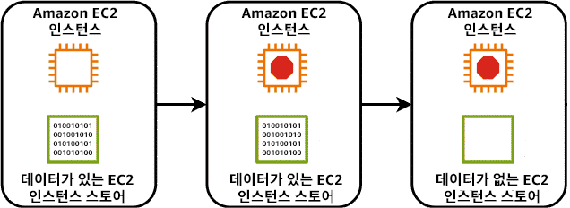
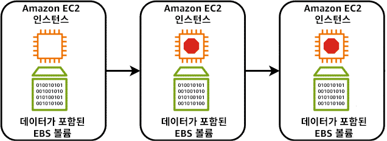
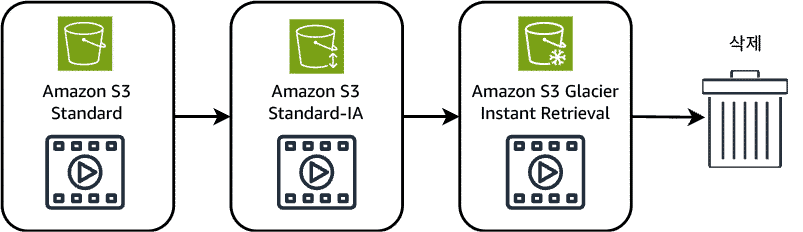

> 강의 8개 · 지식 점검 16문항 · 모듈 평가 15문항

---

## 1. 왜 필요한가

> 연결까지 됐다. 이제 파일과 데이터는 어디에 저장하나?

서버를 띄우고(모듈 2·3), 전 세계에 배포하고(모듈 4), 네트워크로 연결까지 했습니다.
그런데 그 서버가 다루는 **데이터가 어디에 남는지**는 아직 정하지 않았습니다.
인스턴스를 껐다 켰더니 데이터베이스가 통째로 사라진다면 지금까지의 설계는 아무 의미가 없습니다.

커피숍으로 돌아가 보겠습니다. 원두는 밀폐 용기에, 서류는 캐비닛에, 비밀 레시피는 금고에 넣습니다.
**보관하는 물건마다 맞는 보관 방식이 따로 있습니다.** 데이터도 똑같습니다.
초당 수천 번 조금씩 고쳐 쓰는 데이터베이스와, 한 번 올리고 그대로 두는 홍보 영상은 같은 곳에 담을 수 없습니다.

그래서 AWS는 스토리지를 **블록 · 파일 · 객체** 세 가지로 나눠서 제공합니다.
이번 모듈은 이 세 갈래를 구분하는 것에서 시작해서, 각 갈래의 대표 서비스와 요금을 줄이는 방법,
그리고 온프레미스에 남아 있는 데이터를 어떻게 클라우드와 잇는지까지 살펴보겠습니다.

## 2. 이번에 새로 나오는 서비스

| 서비스 | 한 줄 | 이 모듈에서 맡는 역할 |
|---|---|---|
| [[amazon-ebs]] | EC2에 붙이는 영구 가상 하드 드라이브 | **블록** 스토리지의 기본 |
| [[amazon-s3]] | 버킷에 객체를 사실상 무제한으로 담는다 | **객체** 스토리지의 기본 |
| [[amazon-s3-glacier]] | S3 안의 아카이브 전용 스토리지 클래스 묶음 | 장기 보관 비용을 낮출 때 |
| [[amazon-efs]] | 여러 인스턴스가 동시에 쓰는 Linux 공유 파일 시스템 | **파일** 스토리지 · 리전 단위 |
| [[amazon-fsx]] | Windows·Lustre 등 기존 파일 시스템을 관리형으로 | 파일 스토리지 · 프로토콜 호환 |
| [[aws-storage-gateway]] | 온프레미스를 클라우드 스토리지에 이어 준다 | **하이브리드** |

서비스는 아니지만 함께 외워야 하는 것이 세 가지 더 있습니다.
**EC2 인스턴스 스토어**(EC2에 딸려 오는 휘발성 로컬 디스크), **Amazon Data Lifecycle Manager**(EBS 스냅샷 자동화),
**AWS Elastic Disaster Recovery**(서버를 통째로 AWS에 실시간 복제)입니다.

> [!tip] 이번 모듈의 큰 그림
> **블록(EBS)** 은 인스턴스 한 대의 디스크, **파일(EFS·FSx)** 은 여러 대가 나눠 쓰는 폴더,
> **객체(S3)** 는 인터넷에서 통째로 꺼내 쓰는 창고입니다.
> 시험 문제는 거의 항상 "이 셋 중 무엇인가"를 묻습니다.

## 3. 강의 내용

---

### L1. 스토리지 3종 — 블록 · 파일 · 객체

> **이번 강의에서 다룰 내용** — 세 가지 스토리지 유형이 어떻게 갈리는지, 그리고 공동 책임 모델이 스토리지에 어떻게 적용되는지 짚어 보겠습니다.

#### 왜 세 갈래로 나눌까요

데이터마다 요구하는 것이 다르기 때문입니다.

- **마케팅 PDF나 이미지** — 반쪽짜리로는 쓸모가 없습니다. **완전한 덩어리**로 넣고 꺼내면 됩니다.
- **로그와 데이터베이스** — 아주 조금씩, 아주 자주 고쳐 씁니다. 매번 파일 전체를 다시 쓰면 감당이 안 됩니다.
- **교육 자료 폴더** — 매장의 **여러 직원이 동시에** 열어 봐야 합니다.

이 세 요구가 각각 객체 · 블록 · 파일 스토리지로 이어집니다.

| | **블록 스토리지** | **파일 스토리지** | **객체 스토리지** |
|---|---|---|---|
| 저장 단위 | 고정 크기 **블록** | **파일** | **객체** = 데이터 + 고유 ID + 메타데이터 |
| 구조 | 볼륨(디스크) | 계층형 디렉터리 | **평면 구조**의 버킷 (폴더 계층이 없습니다) |
| 일부만 고치면 | **바뀐 블록만** 다시 씁니다 | 파일 단위로 씁니다 | **객체 전체를** 다시 씁니다 |
| 동시 접근 | 원칙적으로 인스턴스 1대 | 여러 대가 동시에 | HTTP(S)로 어디서나 |
| 대표 서비스 | EC2 인스턴스 스토어, **Amazon EBS** | **Amazon EFS**, **Amazon FSx** | **Amazon S3** |
| 잘 맞는 데이터 | 데이터베이스, 부팅 볼륨, 잦은 갱신 | 공유 폴더, CMS, 협업 워크로드 | 이미지·동영상·백업·로그·아카이브 |
| 문제 속 신호 | "데이터베이스", "**빠르고 빈번한 업데이트**", "볼륨을 연결" | "**여러 서버가 동시에** 같은 파일", "NFS", "SMB" | "**무제한**", "URL로 공유", "정적 웹 사이트", "아카이브" |

> [!warning] 한 단어로 가릅니다
> 문제에 **"여러 인스턴스가 동시에"** 가 보이면 EBS는 탈락입니다. 파일 스토리지(EFS·FSx)로 가야 합니다.
> **"전체를 다시 쓴다"** 는 객체 스토리지의 특징이라, 조금씩 자주 고치는 데이터베이스에 S3를 쓰면 안 됩니다.

#### 공동 책임 모델은 스토리지에서 어떻게 갈릴까요

AWS는 관리 태스크를 누가 갖느냐에 따라 서비스를 세 범주로 나눕니다.

| 범주 | AWS가 하는 일 | 고객이 하는 일 | 이 모듈의 예 |
|---|---|---|---|
| **완전관리형** | 하드웨어부터 스토리지 스택 전체 — 내구성, 가용성, 저장 데이터 암호화, 복제 | 데이터 관리, 액세스 제어, 올바른 구성 | Amazon S3, Amazon EFS, Amazon FSx |
| **관리형** | 기본 스토리지 인프라, 하드웨어 이중화, 볼륨 복제 | **백업 전략**, 암호화 구성, 성능 최적화, 용량 계획 | Amazon EBS |
| **비관리형** | 물리 하드웨어와 네트워크 인프라만 | 데이터 관리, 백업·복구, 암호화, 성능, 내구성 **전부** | EC2 인스턴스 스토어 |

**어느 범주에서도 "데이터 자체"는 항상 고객 책임입니다.** 모듈 1에서 배운 경계선이 스토리지에서도 그대로 유지됩니다.

---

### L2. 블록 스토리지 — EC2 인스턴스 스토어와 Amazon EBS

> **이번 강의에서 다룰 내용** — 두 가지 블록 스토리지가 무엇이 다른지, 특히 **데이터가 남느냐 사라지느냐**를 확실히 갈라 보겠습니다.

#### 인스턴스에 붙는 디스크가 두 종류입니다

랩톱에 하드 드라이브가 있듯이 EC2 인스턴스에도 디스크가 붙습니다. 그런데 붙는 방식이 두 가지입니다.

- **EC2 인스턴스 스토어** — 인스턴스가 올라가 있는 **물리 호스트에 직접 달린** 디스크입니다. 독립된 서비스가 아니라 인스턴스 유형에 딸려 오는 기능입니다.
- **Amazon EBS** — 호스트와 **별개로 존재하는 볼륨**을 네트워크로 연결합니다. 외장 하드 드라이브라고 생각하시면 됩니다.

이 차이 하나가 시험에서 가장 많이 나오는 지점을 만듭니다.

#### 인스턴스를 중지하면 무슨 일이 벌어지나요

**인스턴스 스토어** — 데이터가 사라집니다.



**Amazon EBS** — 데이터가 남습니다.



인스턴스 스토어가 사라지는 이유는 분명합니다. 중지했던 인스턴스를 다시 시작하면
**그 볼륨이 없는 다른 호스트에서 뜰 가능성이 높기** 때문입니다. 디스크가 호스트에 묶여 있으니 인스턴스와 함께 옮겨 갈 수가 없습니다.

| | **EC2 인스턴스 스토어** | **Amazon EBS** |
|---|---|---|
| 연결 방식 | 호스트 컴퓨터에 **물리적으로 직접** | 네트워크로 연결되는 **별도 볼륨** |
| **중지·종료하면** | **데이터가 전부 삭제됩니다 (휘발성)** | **그대로 유지됩니다 (영구)** |
| 다른 인스턴스로 옮기기 | 불가능합니다 | 분리 후 다시 연결하면 됩니다 |
| 백업 수단 | 없습니다 | **EBS 스냅샷** |
| 범위 | 그 호스트 한 대 | **가용 영역(AZ) 1개** |
| 요금 | **EC2 인스턴스 요금에 포함** (추가 요금 없음) | 프로비저닝한 볼륨에 **별도 과금**. **인스턴스를 중지해도 계속 청구**되고 볼륨을 삭제해야 멈춥니다 |
| 성능 | 로컬 디스크라 I/O 지연이 매우 짧습니다 | 일관되고 짧은 지연 시간, **IOPS**로 측정합니다 |
| 관리 범주 | 비관리형 | 관리형 |
| 언제 쓰나 | **버퍼 · 캐시 · 스크래치 데이터** | 데이터베이스, 부팅 볼륨, **유지해야 하는 모든 데이터** |

> [!warning] EBS는 AZ 리소스입니다
> EBS 볼륨과 EC2 인스턴스는 **같은 가용 영역에 있어야** 연결됩니다.
> 다른 AZ나 다른 리전으로 옮기려면 **스냅샷을 만들어서** 그쪽에서 볼륨을 새로 생성해야 합니다.
> 반면 EFS는 리전 전체에 걸치므로 이 제약이 없습니다. 이 대비가 문제로 자주 나옵니다.

#### EBS를 고를 때 실제로 정하는 것

볼륨을 만들 때 **크기**와 **유형**을 정하고, 인스턴스에 연결한 뒤 애플리케이션이 그 볼륨에 쓰도록 구성합니다.
유형에 따라 성능과 요금이 달라지며, 성능은 **IOPS(초당 입출력 작업 수)** 로 측정합니다.
미션 크리티컬한 데이터베이스라면 **프로비저닝된 IOPS SSD** 계열을 골라 성능을 확보합니다.

| EBS의 이점 | 무엇이 가능해지나 |
|---|---|
| 데이터 이식성 | 볼륨을 분리했다가 **다른 인스턴스에 다시 연결**할 수 있습니다 |
| 인스턴스 유형 변경 | 볼륨이 인스턴스와 독립적이라 **데이터 손실 없이** 업그레이드·다운그레이드합니다 |
| 재해 복구 | 스냅샷을 **다른 리전에서 복원**할 수 있습니다 |
| 무중단 조정 | 가동 중지 없이 **용량과 볼륨 유형을 바꿉니다** |

```quiz 지식 점검 · 인스턴스 스토어와 EBS
Q. 개발자가 대량의 데이터를 처리하고 높은 I/O 성능이 필요한 애플리케이션을 구축하고 있습니다. 처리한 결과는 사용자에게 표시된 후 장기간 보관할 필요가 없습니다. 그런데 현재 스토리지 솔루션은 피크 처리 시간대에 성능 병목 현상을 겪고 있습니다. EC2 인스턴스 스토어를 구현하면 애플리케이션 성능을 어떻게 개선할 수 있습니까?
+ EC2 인스턴스 스토어는 임시 스토리지 요구 사항을 위한 높은 I/O 성능을 제공합니다.
- EC2 인스턴스 스토어는 AWS에서 가장 저렴한 기가바이트당 스토리지 옵션을 제공하여 전체 스토리지 비용을 절감합니다.
- EC2 인스턴스 스토어는 인스턴스 실패 시에도 지속되는 영구 스토리지 솔루션을 제공합니다.
- EC2 인스턴스 스토어를 사용하면 동시에 여러 EC2 인스턴스 간에 스토리지를 편리하게 공유할 수 있습니다.
> 문제가 **높은 I/O 성능**과 **보관할 필요 없는 데이터**를 동시에 말하고 있습니다. 호스트에 물리적으로 붙어 있어서 지연 시간이 가장 짧고, 그 대신 인스턴스가 멈추면 사라지는 것이 인스턴스 스토어의 정체입니다. 영구 스토리지라고 말하는 선택지는 사실과 반대이고, 여러 인스턴스가 공유한다는 것은 EFS의 설명입니다. 기가바이트당 최저가라는 표현도 맞지 않습니다. 인스턴스 스토어는 EC2 요금에 포함될 뿐 별도의 저가 스토리지 상품이 아닙니다.

Q. AnyCompany Finance는 일관성 있고 지연 시간이 짧은 방식으로 재무 데이터에 액세스해야 하는 애플리케이션을 설계하고 있습니다. 이 회사는 영구적인 블록 스토리지를 제공하는 솔루션을 찾고 있습니다. 이러한 시나리오에서 Amazon EBS가 적합한 이유는 무엇입니까?
- Amazon EBS를 사용하면 지연 시간에 영향을 주지 않으면서 여러 AWS 리전에서 볼륨을 공유할 수 있습니다.
- Amazon EBS는 볼륨 수정 없이 볼륨 용량의 규모를 자동으로 조정합니다.
- Amazon EBS는 크기와 관계없이 모든 볼륨 유형에 대해 무제한 초당 입력 및 출력 작업(IOPS)을 제공합니다.
+ Amazon EBS는 동일한 가용 영역 내에서 볼륨을 자동으로 복제하여 높은 가용성 및 내구성을 제공합니다.
> EBS는 **AZ 하나 안에서** 볼륨을 자동 복제해 내구성을 확보합니다. 리전을 넘나들며 볼륨을 공유한다는 설명은 EBS가 AZ 리소스라는 사실과 충돌하고, 용량이 저절로 늘어나는 것은 EFS의 성질입니다. IOPS가 무제한이라는 선택지는 볼륨 유형과 크기에 따라 성능 상한이 정해진다는 점에서 틀렸습니다.

Q. AnyCompany Software는 온프레미스 아키텍처를 AWS로 마이그레이션하려 하지만 데이터 지속성을 크게 우려하고 있습니다. 현재 환경에서는 가상 머신에 충돌이 발생하면 데이터가 사라지기 때문입니다. Amazon EBS는 이 데이터 지속성 문제를 어떤 방식으로 해결합니까?
- EBS는 데이터를 Amazon S3와 5분마다 자동으로 동기화하여, EC2 인스턴스가 충돌할 경우 모든 데이터를 S3 백업에서 즉시 복원할 수 있도록 합니다.
- Amazon EBS는 인스턴스가 다시 시작될 때 즉시 복구할 수 있도록 모든 데이터를 메모리에 캐시합니다.
+ Amazon EBS 볼륨은 인스턴스와 독립적으로 존재하며 인스턴스가 종료된 후에도 계속 유지됩니다.
- Amazon EBS는 지속성을 보장하기 위해 1시간마다 모든 데이터를 Amazon S3에 자동으로 백업합니다.
> EBS가 데이터를 지키는 원리는 단순합니다. **볼륨이 인스턴스와 별개로 존재하기 때문에** 인스턴스가 죽어도 볼륨은 그대로 남습니다. 5분마다, 1시간마다 자동으로 S3에 백업한다는 설명은 사실이 아닙니다. 백업은 고객이 **스냅샷을 직접 예약**해야 이루어집니다. 메모리에 캐시한다는 선택지는 지속성과 정반대의 이야기입니다.
```

---

### L3. EBS 스냅샷과 데이터 수명 주기

> **이번 강의에서 다룰 내용** — 스냅샷이 무엇이고 왜 증분식인지, 그리고 그 관리를 어떻게 자동화하는지 살펴보겠습니다.

#### 볼륨을 백업하는 유일한 방법

공동 책임 모델에서 **데이터 백업은 고객 몫**입니다. EBS는 관리형 서비스라 AWS가 인프라와 복제까지는 맡지만,
"언제 백업할지"는 아무도 대신 정해 주지 않습니다. 그 백업 수단이 **EBS 스냅샷**입니다.

| 스냅샷의 성질 | 내용 |
|---|---|
| 무엇인가 | EBS 볼륨의 **특정 시점 사본** |
| 저장 위치 | Amazon S3를 사용해 **여러 가용 영역에 중복 저장**됩니다 |
| 방식 | **증분식** — 직전 스냅샷 이후 **변경된 블록만** 저장합니다 |
| 복원 | 스냅샷에서 **새 볼륨을 여러 개** 만들 수 있고, 각각 그 시점의 정확한 사본입니다 |
| 이동 | **리전 간 복사**, 계정 간 공유가 가능합니다 |


| 시점 | 저장되는 것 |
|---|---|
| **초기 스냅샷** | 그 시점 볼륨에서 사용 중인 **모든 블록**을 담습니다. 이후 스냅샷의 기준이 됩니다 |
| **후속 증분 스냅샷** | **마지막 스냅샷 이후 바뀐 블록만** 담습니다. 크기가 작고 생성이 빠릅니다 |
| **스냅샷 삭제** | 증분식이어도 **각 스냅샷은 전체 사본처럼 보입니다.** 삭제하면 그 스냅샷에만 있는 데이터만 지워지고, 다른 스냅샷이 참조하는 블록은 남습니다 |

> [!tip] 증분식이 왜 이점인가
> 매번 전체를 복사하지 않으므로 **백업 시간과 스토리지 비용이 둘 다 줄어듭니다.**
> 그러면서도 복원할 때는 어느 스냅샷에서든 그 시점의 완전한 볼륨을 만들 수 있습니다.

#### 스냅샷 관리를 자동화합니다 — Amazon Data Lifecycle Manager

볼륨이 수천 개라면 매주 콘솔에 들어가 버튼을 누르는 방식은 성립하지 않습니다.
시간도 오래 걸리고 사람이 하면 반드시 빠뜨립니다.

**Amazon Data Lifecycle Manager(DLM)** 는 정책으로 이 일을 대신합니다.

| DLM으로 정의하는 것 | 내용 |
|---|---|
| 대상 | EBS 볼륨 또는 EC2 인스턴스를 태그로 지정합니다. 루트 볼륨·데이터 볼륨을 제외할 수도 있습니다 |
| 일정 | 스냅샷 **생성 주기**를 정합니다. 피크가 아닌 시간대로 잡아 성능 영향을 줄입니다 |
| 보존 | 며칠·몇 개까지 보관할지 정하고, **오래된 것을 자동 삭제**해 비용을 관리합니다 |
| 추가 작업 | 태그 지정, 스냅샷 아카이빙, 빠른 스냅샷 복원, **리전 간 복사**, 계정 간 공유 |

DLM은 **EBS 스냅샷과 EBS 기반 AMI**의 생성·보존·삭제를 자동화하는 서비스입니다.
암호화나 성능 모니터링을 대신해 주는 서비스가 아니라는 점을 구분해 두시기 바랍니다.

```quiz 지식 점검 · 스냅샷과 수명 주기
Q. AnyCompany Commerce의 개발 팀에서는 새 기능을 테스트하기 위해 프로덕션 환경을 그대로 본뜬 테스트 환경을 자주 만들어야 하지만, 이 환경을 설정하는 작업에 시간이 오래 걸리고 오류도 잦습니다. 이러한 시나리오에서 EBS 스냅샷을 사용할 경우 얻을 수 있는 가장 큰 이점은 무엇입니까?
+ EBS 스냅샷을 사용하면 기존 데이터에서 새 볼륨을 빠르게 생성할 수 있으므로, 프로덕션을 미러링하는 동일한 테스트 환경을 신속하게 배포할 수 있습니다.
- EBS 스냅샷은 스냅샷 프로세스가 진행되는 동안 데이터 조각 모음을 실행하여 EBS 볼륨의 성능을 자동으로 최적화합니다.
- EBS 스냅샷은 EBS 볼륨의 모든 데이터를 최대 90%까지 압축하여 스토리지 비용을 절감합니다.
- EBS 스냅샷은 글로벌 액세스 속도를 개선하기 위해 데이터를 다른 AWS 리전으로 자동 마이그레이션합니다.
> 스냅샷 하나로 **똑같은 볼륨을 몇 개든 복제**할 수 있다는 점이 이 시나리오의 해답입니다. 조각 모음이나 90% 압축은 스냅샷이 제공하는 기능이 아니고, 리전 간 복사는 **가능하긴 하지만 자동이 아니라 고객이 지정하는 작업**이며 이 문제가 요구하는 것도 아닙니다.

Q. AnyCompany Healthcare는 환자 기록이 담긴 수천 개의 EBS 볼륨을 관리합니다. 규정 준수 요구 사항에 따라 데이터를 적절히 백업·보존해야 하고, 비용 관리를 위해 오래된 스냅샷도 제거해야 합니다. 이 시나리오에서 Amazon Data Lifecycle Manager가 주로 해결하는 문제는 무엇입니까?
- EBS 볼륨 성능 지표에 대한 실시간 모니터링을 제공합니다.
- EBS 볼륨에 저장된 민감한 환자 데이터를 암호화합니다.
+ 일정에 따라 EBS 스냅샷과 EBS 기반 Amazon Machine Image(AMI)의 생성, 보존, 삭제 작업을 자동화합니다.
- 온프레미스 스토리지에서 AWS 클라우드 스토리지로 환자 데이터를 마이그레이션합니다.
> 문제 안에 **일정에 따른 백업**과 **오래된 스냅샷 삭제**가 함께 있으면 Data Lifecycle Manager입니다. 실시간 성능 모니터링은 CloudWatch, 온프레미스 데이터 이관은 Storage Gateway나 DataSync의 영역이고, 암호화는 DLM이 자동으로 걸어 주는 기능이 아닙니다.
```

---

### L4. Amazon S3 — 객체 스토리지의 표준

> **이번 강의에서 다룰 내용** — S3의 구조와 내구성, 그리고 액세스를 제어하는 방법을 살펴보겠습니다.

#### 버킷과 객체

S3에서는 파일 하나를 **객체**로 저장하고, 그 객체를 **버킷**이라는 컨테이너에 담습니다.
하드 드라이브의 파일이 객체, 파일 디렉터리가 버킷이라고 생각하시면 됩니다.
다만 버킷은 **평면 구조**라 진짜 폴더 계층이 아닙니다. 콘솔에서 폴더처럼 보이는 것은 이름에 붙은 접두사일 뿐입니다.

| 외워 둘 숫자와 성질 | 값 |
|---|---|
| 개별 객체 최대 크기 | **5TB** |
| 버킷 전체 크기 한도 | **없습니다** (사실상 무제한) |
| 내구성 | **99.999999999% (9가 11개)** — 객체가 1년간 손상되지 않을 확률입니다 |
| 기본 이중화 | 대부분의 스토리지 클래스에서 **여러 AZ에 자동 복제**됩니다 |
| 버킷 이름 | **전 세계에서 고유**해야 합니다 |
| 기본 공개 범위 | **완전 비공개** — 만든 사람만 접근할 수 있습니다 |

**버전 관리**를 켜면 같은 객체의 여러 버전을 보관하므로, 실수로 덮어쓰거나 지워도 이전 버전을 복원할 수 있습니다.

#### S3가 잘하는 일

| 사용 사례 | 왜 S3인가 |
|---|---|
| **정적 웹 사이트 호스팅** | HTML·CSS·JS·미디어를 버킷에 올리고 기능만 켜면 됩니다. 서버가 필요 없습니다 |
| 콘텐츠 배포 · 미디어 파일 | 트래픽이 갑자기 늘어도 **스케일링 설정 없이** 알아서 감당합니다 |
| 백업 · 아카이브 | 11개의 9 내구성과, 뒤에서 볼 저렴한 아카이브 클래스가 있습니다 |
| 데이터 레이크 · 규정 준수 보존 | 사실상 무제한 용량과 수명 주기 정책이 있습니다 |

요금은 **저장한 용량**과 **버킷 밖으로 나간 데이터**, 그리고 **요청 수**를 기준으로 나갑니다.
관리형 서비스라 스케일링을 위한 인프라 작업은 전혀 하지 않습니다.

#### 액세스 제어 — 기본은 비공개입니다

S3에 올린 것은 **전부 기본적으로 비공개**입니다. 열어 주려면 명시적으로 권한을 부여해야 합니다.

| 수단 | 무엇인가 | 언제 쓰나 |
|---|---|---|
| **버킷 정책** | 버킷에 붙이는 **리소스 기반** 정책(JSON) | 버킷 단위로 허용·거부를 한 번에 정할 때 |
| **자격 증명 기반 정책** | 사용자·그룹·역할에 붙는 IAM 정책 | "이 사용자가 어떤 버킷에 무엇을 할 수 있는가"를 정할 때 |
| **블록 퍼블릭 액세스** | 계정·버킷 수준에서 **퍼블릭 공개를 통째로 차단**하는 안전장치 | 실수로 데이터가 공개되는 것을 막을 때 |
| **미리 서명된 URL** | **시간 제한**이 붙은 임시 접근 링크 | 버킷 정책을 건드리지 않고 잠깐만 공유할 때 |
| **S3 액세스 포인트** | 공유 데이터세트에 대해 그룹별 접근 정책을 따로 만드는 기능 | 한 데이터세트를 여러 팀이 다른 권한으로 쓸 때 |
| **암호화** | **저장 데이터 암호화** + **전송 중 암호화** | 기밀 유지와 규정 준수 |
| **감사 로그** | 리소스에 대한 모든 요청을 기록 | 누가 언제 접근했는지 추적할 때 |

> [!warning] "버킷 정책은 열었는데 접근이 안 됩니다"
> **블록 퍼블릭 액세스**가 켜져 있으면 버킷 정책이 무엇이든 퍼블릭 접근이 차단됩니다.
> 이 안전장치가 정책보다 우선한다는 점이 시험 단골 문항입니다.

```quiz 지식 점검 · Amazon S3
Q. AnyCompany Mobile은 새 모바일 애플리케이션을 위한 클라우드 스토리지를 평가하고 있습니다. 사용자층이 계속 늘고 있어 다양한 유형의 데이터를 감당할 수 있는 신뢰성 높은 서비스가 필요합니다. 이 회사가 활용할 수 있는 Amazon S3의 측면은 무엇입니까?
- 사용자 인증을 위해 관계형 데이터베이스 쿼리를 실행합니다.
- 가상 머신을 호스팅하여 애플리케이션 로직을 처리합니다.
- 실시간 데이터 스트리밍과 메시지 처리를 담당합니다.
+ 모바일 애플리케이션 콘텐츠와 사용자 생성 미디어 파일을 저장하고 배포합니다.
> S3는 **객체 스토리지**입니다. 이미지·동영상 같은 비정형 파일을 담고 배포하는 것이 본업입니다. 데이터베이스 쿼리, 가상 머신 호스팅, 스트리밍 처리는 각각 RDS 계열, EC2, Kinesis 계열의 일이라 S3의 역할이 아닙니다.

Q. AnyCompany Marketing은 새 웹 사이트 이미지를 담을 S3 버킷을 만들었고, 방문자 누구나 인증 없이 이미지를 볼 수 있어야 합니다. 버킷 정책은 퍼블릭 액세스를 허용하도록 설정했는데도 이미지에 접근할 수 없다는 신고가 들어옵니다. 이러한 문제를 초래할 가능성이 가장 높은 원인은 무엇입니까?
- 이미지의 태그가 퍼블릭 읽기 권한으로 올바르게 지정되지 않았습니다.
+ 블록 퍼블릭 액세스 설정이 계정 또는 버킷 수준에서 활성화되어 있습니다.
- Amazon S3 콘텐츠를 공개하려면 정적 웹 사이트 호스팅 기능을 반드시 활성화해야 합니다.
- S3 버킷은 콘텐츠에 액세스하려는 사용자와 동일한 AWS 리전에 있어야 합니다.
> **블록 퍼블릭 액세스는 버킷 정책보다 우선합니다.** 정책을 아무리 열어도 이 설정이 켜져 있으면 차단됩니다. 태그는 접근 권한을 결정하지 않고, 정적 웹 사이트 호스팅은 공개의 전제 조건이 아니며, S3 객체는 리전과 무관하게 인터넷에서 접근할 수 있습니다.

Q. AnyCompany Media는 대용량 동영상 파일을 전 세계 사용자에게 배포하며, 내구성이 우수하고 확장 가능하며 다양한 액세스 제어 수단을 제공하는 서비스를 찾고 있습니다. 이 시나리오에서 특히 유용한 Amazon S3의 특징은 무엇입니까?
+ Amazon S3는 여러 가용 영역에 저장된 객체에 대해 99.999999999%의 내구성을 제공하여 데이터 손실을 방지합니다.
- Amazon S3는 저장된 모든 객체를 자동으로 압축하여 스토리지 비용을 최대 90%까지 절감합니다.
- Amazon S3는 개별 객체 크기를 5GB로 제한하므로 대용량 동영상은 미리 분할해서 올려야 합니다.
- Amazon S3는 업로드된 동영상을 다른 형식으로 자동 변환하는 트랜스코딩 기능을 내장하고 있습니다.
> 이 시나리오가 요구하는 **내구성**의 답이 9가 11개입니다. S3는 객체를 자동으로 압축하지 않고, 트랜스코딩도 하지 않습니다. 객체 크기 한도는 5GB가 아니라 **5TB**라는 점도 함께 기억해 두시기 바랍니다.
```

---

### L5. S3 스토리지 클래스와 수명 주기 정책

> **이번 강의에서 다룰 내용** — 스토리지 클래스 전체를 검색 시간·비용·용도로 정리하고, 수명 주기 정책으로 이 이동을 자동화하는 방법을 살펴보겠습니다.

#### 액세스 빈도가 요금을 결정합니다

같은 버킷 안에서도 객체마다 다른 스토리지 클래스를 쓸 수 있습니다.
**자주 볼수록 저장 단가가 비싸고 검색이 빠르며, 드물게 볼수록 저장 단가가 싸고 꺼내는 데 오래 걸립니다.**

| 스토리지 클래스 | AZ 수 | 검색 시간 | 저장 비용 | 최소 보관 기간 | 언제 쓰나 |
|---|---|---|---|---|---|
| **S3 Standard** | 3개 이상 | **즉시 (밀리초)** | 기준 (가장 높음) | 없음 | **기본값.** 자주 액세스하는 데이터, 동적 웹 사이트, 콘텐츠 배포, 빅데이터 분석 |
| **S3 Intelligent-Tiering** | 3개 이상 | 즉시 (아카이브 티어는 예외) | 자동 최적화 + **객체당 모니터링 요금** | 없음 | **액세스 패턴을 모르거나 변덕스러울 때.** 데이터 레이크, 대규모 데이터세트 |
| **S3 Standard-IA** | 3개 이상 | **즉시 (밀리초)** | Standard보다 저렴, **검색 요금 발생** | **30일** | 가끔 쓰지만 **필요할 땐 즉시** 꺼내야 하는 것. 장기 백업, 재해 복구 파일 |
| **S3 One Zone-IA** | **1개** | 즉시 (밀리초) | Standard-IA보다 더 저렴 | **30일** | **없어져도 다시 만들 수 있는** 데이터. 보조 백업. AZ가 하나라 복원력이 낮습니다 |
| **S3 Glacier Instant Retrieval** | 3개 이상 | **즉시 (밀리초)** | Standard-IA 대비 최대 68% 절감 | **90일** | 분기에 한 번 볼까 말까 하지만 **볼 때는 즉시** 필요한 것. 의료 영상, 미디어 자산 |
| **S3 Glacier Flexible Retrieval** | 3개 이상 | **1~5분(신속) / 3~5시간(표준) / 5~12시간(대량)** | 더 저렴 | **90일** | 연 1~2회 접근, **몇 분에서 몇 시간 기다려도 되는** 백업·오프사이트 보관 |
| **S3 Glacier Deep Archive** | 3개 이상 | **기본 12시간** | **가장 저렴** | **180일** | 7~10년 이상 보관하는 규정 준수·디지털 아카이브. 금융·의료·공공 |
| **S3 Express One Zone** | **1개** | **한 자릿수 밀리초** (Standard 대비 최대 10배 빠름) | 요청 비용은 최대 80% 저렴하지만 저장 단가는 높습니다 | — | **지연 시간에 극도로 민감한** 워크로드 |
| **S3 Outposts** | 온프레미스 | — | — | — | **데이터 레지던시** 때문에 온프레미스에 객체를 둬야 할 때 |

> [!warning] Glacier 삼형제를 가르는 것은 "얼마나 기다릴 수 있는가"입니다
> - **즉시 꺼내야 한다** → **Glacier Instant Retrieval**
> - **몇 분~몇 시간은 기다릴 수 있다** → **Glacier Flexible Retrieval**
> - **하루쯤 기다려도 된다, 대신 가장 싸야 한다** → **Glacier Deep Archive**
>
> 그리고 **One Zone**이 붙으면 무조건 **가용 영역 1개**입니다. AZ가 통째로 사라지면 데이터도 사라지므로,
> 문제에 "고가용성이 필요하다"가 있으면 One Zone 계열은 바로 탈락입니다.

#### S3 수명 주기 — 이동을 자동화합니다

객체는 시간이 지나면서 덜 보게 됩니다. 소셜 미디어 게시물이 며칠 지나면 아무도 안 보듯이 말입니다.
**S3 수명 주기 구성**은 이 흐름을 규칙으로 만들어 자동으로 옮기고 지웁니다.

| 작업 유형 | 무엇을 정하나 | 예시 |
|---|---|---|
| **전환(Transition)** | 객체를 **다른 스토리지 클래스로 옮길 시점** | 생성 30일 후 S3 Standard-IA로, 1년 후 Glacier Deep Archive로 |
| **만료(Expiration)** | 객체를 **영구 삭제할 시점** | 365일 후 삭제 |



위 그림의 규칙을 말로 풀면 이렇습니다.

| 경과 | 일어나는 일 |
|---|---|
| 30일 | S3 Standard → **S3 Standard-IA** |
| 60일 | S3 Standard-IA → **S3 Glacier Instant Retrieval** |
| 365일 | **삭제** |

| 수명 주기가 잘 맞는 상황 | 규칙 |
|---|---|
| **주기적 로그** | 한 주나 한 달만 쓰고 그 뒤에는 필요 없으므로 **만료 규칙**으로 삭제합니다 |
| **액세스 빈도가 변하는 문서** | 한동안 자주 보다가 뜸해지므로 **전환 규칙**으로 낮은 클래스로 내리고, 보존 기한이 끝나면 삭제합니다 |

> [!tip] 옮길 시점을 모르겠다면
> **S3 스토리지 클래스 분석**으로 실제 액세스 패턴을 확인한 뒤 규칙을 정합니다.
> 규칙을 직접 관리하고 싶지 않다면 아예 **S3 Intelligent-Tiering**에 맡기면 됩니다.
> 수명 주기는 **내가 규칙을 정하는 것**, Intelligent-Tiering은 **S3가 알아서 옮기는 것**이라는 차이를 기억해 두시기 바랍니다.

```quiz 지식 점검 · 스토리지 클래스와 수명 주기
Q. AnyCompany Business는 Amazon S3에 쌓이는 고객 데이터의 스토리지 비용을 걱정하고 있습니다. 해당 데이터는 처음 30일 동안 자주 액세스되고, 다음 60일 동안에는 가끔 액세스되며, 90일이 지나면 거의 액세스되지 않습니다. 적절한 액세스를 유지하면서 비용을 최적화하는 방법은 무엇입니까?
+ 30일 후 객체를 S3 Standard-Infrequent Access로 전환하고, 90일 후 S3 Glacier로 전환하는 수명 주기 규칙을 생성합니다.
- 수명 주기 규칙을 생성하여 모든 객체를 즉시 S3 Glacier로 전환하고 복원 정책을 설정합니다.
- 90일 후 모든 객체를 삭제하고 데이터베이스 백업을 사용하는 수명 주기 규칙을 생성합니다.
- 스토리지 클래스가 서로 다른 여러 개의 S3 버킷을 생성한 후, 버킷이 노후화되면 버킷 간에 객체를 수동으로 이동합니다.
> 문제가 액세스 빈도의 변화를 **30일 · 90일**로 친절하게 알려 주고 있으므로, 그 시점에 맞춰 클래스를 낮추는 규칙을 만들면 됩니다. 처음부터 Glacier에 넣으면 자주 봐야 할 30일 동안 검색이 느리고 검색 요금이 붙습니다. 90일에 전부 지우는 것은 "적절한 액세스 유지"라는 조건을 어깁니다. 버킷을 여러 개 만들어 손으로 옮기는 방식은 자동화를 포기하는 선택이라 수명 주기 정책을 쓰는 이유 자체를 없앱니다.

Q. 다음 중 S3 수명 주기를 가장 잘 설명한 내용은 무엇입니까?
- 리전 실패를 방지하기 위해 여러 AWS 리전에 S3 객체의 사본을 생성하는 백업 서비스입니다.
- 특정한 기간이 지나면 Amazon S3 객체를 자동으로 압축하여 스토리지 비용을 절감하는 기능입니다.
- 지정된 기간 동안 Amazon S3 객체에 액세스하지 않을 경우 관리자에게 알림을 전달하는 모니터링 시스템입니다.
+ 서로 다른 스토리지 클래스 간에 객체를 자동으로 전환하거나, 경과 기간에 따라 객체를 삭제하는 규칙을 정의하는 기능입니다.
> 수명 주기가 하는 일은 **전환**과 **만료** 두 가지뿐입니다. 리전 간 사본을 만드는 것은 교차 리전 복제, 접근이 없을 때 알려 주는 것은 모니터링 도구의 일이며, S3는 객체를 압축하지 않습니다.
```

---

### L6. 파일 스토리지 — Amazon EFS와 Amazon FSx

> **이번 강의에서 다룰 내용** — 여러 인스턴스가 같은 파일을 함께 쓰는 방법을 살펴보고, EFS와 FSx를 어떻게 나누어 고르는지 정리해 보겠습니다.

#### Amazon EFS — 리전 단위 공유 파일 시스템

여러 서버가 **같은 데이터세트**를 함께 봐야 하는 상황은 흔합니다.
직접 파일 서버를 세우면 용량 계획, 이중화, 백업, 증설을 전부 떠안아야 합니다.
**Amazon EFS**는 그 부담을 AWS가 가져가는 완전관리형 파일 시스템입니다.

| EFS의 성질 | 내용 |
|---|---|
| 프로토콜 | **Linux NFS** |
| 확장 | 파일을 넣고 빼는 대로 **자동으로 늘고 줄어듭니다.** 페타바이트 규모까지 가고, 프로비저닝이 없습니다 |
| 동시 접근 | **수천 개의 동시 NFS 연결**을 지원합니다 |
| 범위 | **리전 전체** — 한 리전의 여러 AZ에 자동 복제하며, 온프레미스에서도 접근할 수 있습니다 |
| 요금 | **실제로 저장한 용량**만 냅니다. 최소 요금이나 설치 비용이 없습니다 |

**EBS와 EFS의 차이가 이 모듈에서 가장 자주 나오는 비교입니다.**

| | **Amazon EBS** | **Amazon EFS** |
|---|---|---|
| 스토리지 유형 | 블록 | 파일(NFS) |
| **범위** | **가용 영역 1개** — 같은 AZ의 인스턴스만 연결됩니다 | **리전 전체** — 여러 AZ의 인스턴스가 동시에 씁니다 |
| 동시 연결 | 원칙적으로 인스턴스 1대 | **수천 대 동시** |
| 용량 | 프로비저닝한 크기 고정. 다 차면 **직접 늘려야** 합니다 | **자동으로** 늘고 줄어듭니다 |
| 요금 기준 | 프로비저닝한 용량 | 실제 저장한 용량 |
| 대표 용도 | 데이터베이스, 부팅 볼륨 | 공유 폴더, CMS, 협업·분석 워크로드 |

EFS도 액세스 빈도에 따라 스토리지 클래스가 나뉘고, **수명 주기 정책이 기본으로 딸려 옵니다.**

| EFS 스토리지 클래스 | 복원력 | 언제 |
|---|---|---|
| **EFS Standard / Standard-IA** | **다중 AZ** | 가용성과 내구성이 최우선일 때. 그만큼 비쌉니다 |
| **EFS One Zone / One Zone-IA** | **단일 AZ** | 복원력을 조금 포기하고 비용을 낮출 때 |
| **EFS Archive** | 다중 AZ | 1년에 몇 번만 보는 콜드 데이터. IA보다 최대 50% 더 저렴합니다 |

#### Amazon FSx — 기존 파일 시스템을 그대로

EFS는 **NFS 하나**에 집중합니다. 그런데 회사가 이미 Windows 파일 서버나 Lustre를 쓰고 있다면
프로토콜이 맞지 않아 애플리케이션을 고쳐야 합니다. **Amazon FSx**는 그 문제를 없앱니다.
널리 쓰이는 파일 시스템을 **완전관리형으로 그대로** 제공하므로, 하드웨어 프로비저닝·패치·백업을 AWS가 맡습니다.

| FSx 옵션 | 기반 · 프로토콜 | 언제 고르나 |
|---|---|---|
| **FSx for Windows File Server** | **SMB**, **Active Directory 통합**, 데이터 중복 제거 | **Windows** 파일 공유를 그대로 옮길 때 |
| **FSx for Lustre** | Lustre, S3와 연동 | **HPC · 기계 학습**처럼 컴퓨팅 집약적인 고속 처리 |
| **FSx for NetApp ONTAP** | NFS · SMB · iSCSI 동시 지원 | 기존 ONTAP의 고급 데이터 관리 기능이 필요할 때 |
| **FSx for OpenZFS** | NFS(ZFS) | ZFS 기반 워크로드를 옮길 때 |

> [!warning] EFS와 FSx를 가르는 신호
> 문제에 **Linux · NFS**가 나오면 **EFS**, **Windows · SMB · Active Directory**가 나오면 **FSx for Windows File Server**입니다.
> **Lustre**나 **HPC**가 나오면 **FSx for Lustre**입니다. 이 세 단어만 잡으면 대부분의 문항이 풀립니다.

```quiz 지식 점검 · EFS와 FSx
Q. AnyCompany Financial은 시장 데이터를 분석하는 새 애플리케이션을 구현하려 합니다. 이 애플리케이션은 동일한 데이터세트에 대한 액세스를 유지하면서, 트래픽 수요에 따라 컴퓨팅 리소스를 늘리고 줄일 수 있어야 합니다. Amazon EFS를 이 애플리케이션의 스토리지로 사용할 경우 어떤 이점이 있습니까?
- Amazon EFS는 자주 액세스하지 않는 재무 데이터를 위한 가장 저렴한 스토리지 옵션을 제공합니다.
- Amazon EFS는 빈도가 높은 거래 알고리즘에 사용할 경우 로컬 인스턴스 스토리지보다 빠른 읽기 액세스를 제공합니다.
+ Amazon EFS는 파일이 추가되고 제거될 때 자동으로 늘고 줄어드는 탄력적인 스토리지 용량을 제공하며, 그 과정에서 애플리케이션이 중단되지 않습니다.
- Amazon EFS는 데이터를 전 세계에 자동 복제하므로 별도의 백업이 필요하지 않습니다.
> 이 시나리오의 조건은 **같은 데이터세트를 공유하면서 규모가 오르내리는 것**이고, 여기에 맞는 EFS의 성질이 무중단 자동 확장입니다. 가장 저렴한 스토리지는 Glacier 계열이고, 호스트에 직접 붙은 인스턴스 스토어보다 네트워크 파일 시스템이 빠를 수는 없습니다. 전 세계 자동 복제로 백업이 필요 없다는 설명도 사실이 아닙니다. 백업은 여전히 고객 책임입니다.

Q. AnyCompany Retail은 온프레미스 파일 스토리지를 AWS로 옮기려 합니다. 전 세계 지사의 여러 개발 팀이 동일한 파일 세트에서 동시에 협업할 수 있어야 합니다. 이 시나리오에 적합한 Amazon EFS의 기능은 무엇입니까?
+ Amazon EFS는 일관되게 짧은 지연 시간과 함께 수천 개의 Amazon EC2 인스턴스에 대한 공유 액세스를 제공합니다.
- Amazon EFS를 사용하면 클라우드에 파일을 저장할 수 있지만, 서로 다른 인스턴스 간에 수동 동기화가 필요합니다.
- Amazon EFS는 어떤 파일 시스템으로도 포맷할 수 있는 블록 스토리지를 제공합니다.
- Amazon EFS는 전용 처리 작업을 위해 처리량이 높은 단일 인스턴스 액세스를 제공합니다.
> **동시 협업**이라는 조건이 곧 공유 액세스입니다. EFS는 수동 동기화 없이 여러 인스턴스가 같은 파일 시스템을 마운트합니다. 블록 스토리지를 제공한다는 설명은 EBS의 것이고, 단일 인스턴스 전용이라는 설명은 공유 파일 시스템이라는 정의와 정면으로 어긋납니다.

Q. AnyCompany Media는 기존 애플리케이션과의 호환성을 유지하면서 파일 공유를 AWS로 마이그레이션하려 합니다. Server Message Block(SMB) 프로토콜을 지원하고 Microsoft Active Directory와 통합되는 솔루션이 필요합니다. 어떤 AWS 서비스를 구현해야 합니까?
- Amazon Elastic File System(Amazon EFS)
- Amazon S3 File Gateway
+ Amazon FSx for Windows File Server
- Amazon Elastic Block Store(Amazon EBS)
> **SMB + Active Directory**는 Windows 환경의 표식이고, 이를 관리형으로 그대로 제공하는 것이 FSx for Windows File Server입니다. EFS는 Linux NFS 전용이라 SMB를 지원하지 않고, S3 File Gateway는 온프레미스를 S3에 잇는 하이브리드 장치이며, EBS는 공유가 아니라 인스턴스 한 대에 붙이는 블록 볼륨입니다.
```

---

### L7. 하이브리드와 백업 — Storage Gateway · AWS Backup · Snow Family · Elastic Disaster Recovery

> **이번 강의에서 다룰 내용** — 온프레미스에 남아 있는 데이터를 클라우드와 잇는 방법, 백업을 한곳에서 관리하는 방법, 그리고 서버를 통째로 복제해 두는 방법을 살펴보겠습니다.

#### AWS Storage Gateway — 온프레미스를 클라우드에 잇습니다

여전히 대부분의 업무를 온프레미스에서 돌리는 조직이 있습니다.
그렇더라도 백업이나 아카이브만큼은 클라우드에 두고 싶을 수 있습니다.
**Storage Gateway**는 기존 워크플로를 거의 고치지 않은 채 온프레미스를 사실상 무제한의 클라우드 스토리지에 연결합니다.

핵심 동작은 **자주 쓰는 데이터는 로컬에 캐시해 두고, 전체 데이터는 AWS에 두는 것**입니다.
그래서 지연 시간은 유지하면서 로컬 스토리지 비용은 줄어듭니다.

| 게이트웨이 유형 | 온프레미스에서는 이렇게 보입니다 | AWS에는 이렇게 저장됩니다 | 언제 고르나 |
|---|---|---|---|
| **Amazon S3 File Gateway** | **NFS · SMB 파일 공유** | **S3 객체** | 기존 **파일 공유 워크플로를 그대로** 두고 클라우드로 옮길 때 |
| **Volume Gateway** | **iSCSI 블록 볼륨** | **EBS 스냅샷** | 온프레미스 애플리케이션이 **블록 볼륨**을 필요로 할 때 |
| **Tape Gateway** | 가상 테이프 라이브러리(VTL) | S3 · Glacier | **물리 테이프 백업 소프트웨어**를 계속 쓰면서 테이프만 없앨 때 |

Volume Gateway는 다시 두 가지 모드로 갈립니다. **이 구분이 시험에 나옵니다.**

| 모드 | 데이터가 어디 있나 | 언제 |
|---|---|---|
| **캐시 볼륨(cached)** | **전체 데이터는 S3에**, 자주 쓰는 일부만 로컬 캐시 | 로컬 스토리지를 줄이면서 자주 쓰는 파일만 빠르게 |
| **저장 볼륨(stored)** | **전체 데이터가 로컬에**, S3로 비동기 백업 | **전체 데이터세트**에 로컬 속도로 접근해야 할 때 |

#### [[aws-backup]] — 백업을 한곳에서

서비스마다 백업 방법이 다르면 관리가 흩어집니다. **AWS Backup**은 그 백업들을 하나의 정책 체계로 묶습니다.

| 항목 | 내용 |
|---|---|
| 무엇을 백업하나 | **EBS, EFS, FSx, Amazon RDS, DynamoDB, Storage Gateway 볼륨** 등 여러 서비스를 한 콘솔에서 |
| 핵심 개념 | **백업 플랜**(일정·보존 규칙), **백업 볼트**(백업이 담기는 저장소), **볼트 락**(삭제·변경 금지), **리전 간·계정 간 복사** |
| 문제 속 신호 | "**여러 서비스의 백업을 중앙에서**", "백업 정책을 조직 전체에 일괄 적용", "규정 준수 보존 기간" |

> [!warning] Data Lifecycle Manager와 헷갈리지 마세요
> **Amazon Data Lifecycle Manager**는 **EBS 스냅샷과 AMI만** 자동화합니다.
> **AWS Backup**은 **여러 AWS 서비스의 백업을 한꺼번에** 관리합니다. 대상 범위가 갈리는 지점입니다.

#### [[aws-snow-family]] — 네트워크로는 도저히 못 옮길 때

수백 테라바이트를 인터넷으로 올리면 몇 달이 걸립니다. 그럴 때는 **물리 장비에 담아 배송**하는 편이 빠릅니다.

| 장비 | 대략적인 용량 | 특징 | 언제 |
|---|---|---|---|
| **AWS Snowcone** | 8TB(HDD) · 14TB(SSD) | 가장 작고 가벼우며 배터리로도 구동됩니다 | 현장·엣지에서 소량을 옮길 때 |
| **AWS Snowball Edge Storage Optimized** | 수십 TB 규모 | 대량 전송에 더해 약간의 컴퓨팅도 제공합니다 | 수십~수백 TB 이관 |
| **AWS Snowball Edge Compute Optimized** | 상대적으로 작은 용량 | GPU 옵션이 있어 **현장에서 처리**까지 합니다 | 네트워크가 열악한 현장의 데이터 처리 |
| **AWS Snowmobile** | **최대 100PB** | 컨테이너 트럭 한 대 | 엑사바이트급 데이터 센터를 통째로 옮길 때 |

> [!tip] Snow Family 신호
> "**네트워크 대역폭이 부족하다**", "**페타바이트급을 몇 주 안에**", "**오프라인으로 옮긴다**"가 보이면 Snow Family입니다.
> 반대로 "온프레미스를 **계속 쓰면서** 클라우드와 연결한다"면 Storage Gateway입니다. 한 번 옮기고 끝인지, 계속 이어 두는지가 갈림길입니다.

> [!warning] 위 장비들은 지금은 주문할 수 없습니다
> 개념과 신호는 그대로 출제되지만 장비 자체는 정리되었습니다. 위 표는 **자릿수 감각**만 잡는 용도로 보시면 됩니다.

#### AWS Elastic Disaster Recovery — 서버를 통째로 복제해 둡니다

**Elastic Disaster Recovery**는 물리 서버와 가상 서버의 **블록 수준 데이터를 AWS에 지속적으로 복제**합니다.
장애가 나면 복제해 둔 상태에서 몇 분 만에 복구 인스턴스를 띄웁니다.

| 이점 | 내용 |
|---|---|
| 비즈니스 복원력 | **지속적인 블록 레벨 복제**로 중단 시 몇 분 내에 워크로드를 되살립니다 |
| 재해 복구 간소화 | 콘솔에서 자동화하므로 복잡한 수동 구성과 인적 오류가 줄어듭니다 |
| 비용 최적화 | **대기 상태의 보조 데이터 센터를 유지할 필요가 없습니다.** 쓴 만큼만 냅니다 |
| 무중단 테스트 | 운영에 영향을 주지 않고 재해 복구 절차를 시험해 볼 수 있습니다 |

```quiz 지식 점검 · 하이브리드 스토리지와 재해 복구
Q. AnyCompany는 온프레미스에 있는 대규모 파일 모음을 AWS 클라우드에 백업해야 합니다. 클라우드 스토리지로 비용을 절감하면서도 자주 사용하는 파일에 대한 로컬 액세스는 유지하고자 하며, 기존 파일 공유 워크플로와 애플리케이션의 변경은 최소화하려 합니다. 이러한 요구 사항에 가장 잘 부합하는 AWS Storage Gateway 유형은 무엇입니까?
+ Amazon S3 File Gateway
- 캐시 모드의 Volume Gateway
- 저장 모드의 Volume Gateway
- Tape Gateway
> 이미 **파일 공유 워크플로**를 쓰고 있고 그것을 그대로 두고 싶다고 했으므로, NFS·SMB 파일 공유를 그대로 제공하면서 뒤에서 S3 객체로 저장하는 File Gateway가 답입니다. Volume Gateway는 파일이 아니라 **iSCSI 블록 볼륨**을 제공하므로 애플리케이션을 바꿔야 하고, Tape Gateway는 테이프 백업 소프트웨어를 쓰는 경우에만 의미가 있습니다.

Q. AnyCompany Manufacturing은 엔지니어가 자주 열어 보는 CAD 파일을 온프레미스 데이터 센터에 두고 있습니다. 이 데이터에 대한 로컬 액세스를 유지하면서 자주 쓰는 파일의 지연 시간을 줄이고, 동시에 데이터를 AWS에 백업하려 합니다. 어떤 AWS Storage Gateway 구성을 선택해야 합니까?
- Tape Gateway 모드로 구현하여 Amazon S3의 가상 테이프에 CAD 파일을 백업합니다.
- 저장 볼륨 모드로 구현하고 모든 볼륨이 Amazon S3에 완전히 저장되도록 구성합니다.
- 온프레미스 데이터 센터에 Amazon FSx for Windows File Server를 배포합니다.
+ 캐시 볼륨 모드로 구현하여 자주 액세스하는 데이터는 로컬에 보관하고, 전체 데이터세트는 Amazon S3에 저장합니다.
> **자주 쓰는 것만 로컬, 전체는 S3**가 곧 캐시 볼륨 모드의 정의입니다. 저장 볼륨 모드는 전체 데이터를 로컬에 두므로 로컬 스토리지 비용이 줄지 않고, 그 선택지의 설명("모든 볼륨이 S3에 완전히 저장")은 저장 모드의 동작과도 맞지 않습니다. Tape Gateway는 백업 소프트웨어용이고, FSx는 온프레미스에 배포하는 서비스가 아닙니다.

Q. AnyCompany Telecommunications는 지난 분기 정전 이후 가동 중지 시간을 우려하고 있습니다. 온프레미스 서버 플릿을 위한 재해 복구 솔루션이 필요하지만 IT 인력이 적고, 특히 프로덕션 서버의 정확한 복제본을 유지하면서 복구 시간을 줄이는 것을 중요하게 봅니다. AWS Elastic Disaster Recovery를 사용할 경우 얻는 주요 이점은 무엇입니까?
- 프로덕션 백업에서 별도의 개발 및 테스트 환경을 자동으로 생성합니다.
- AWS Storage Gateway에 직접 연결하여 백업 및 복구 작업을 가속화합니다.
+ 지속적인 블록 레벨 복제를 통해 대상 AWS 리전의 서버를 거의 즉각적으로 복구할 수 있습니다.
- 기존 백업 소프트웨어를 그대로 사용하면서 소스 측 에이전트를 제거합니다.
> **정확한 복제본 + 짧은 복구 시간**이라는 조건이 지속적인 블록 레벨 복제를 가리킵니다. 개발·테스트 환경 생성은 이 서비스의 목적이 아니고, Storage Gateway와 직접 연결해 동작하는 서비스도 아니며, Elastic Disaster Recovery는 오히려 소스 서버에 **복제 에이전트를 설치해서** 동작합니다.
```

---

### L8. 실제 환경에서의 클라우드 — S3 · EBS · EFS 고르기

> **이번 강의에서 다룰 내용** — 앞에서 나눈 세 갈래를 실제 상황에 대입해 고르는 연습을 해 보겠습니다.

#### 시나리오 1 — 커피숍 웹 사이트: **Amazon S3**

웹 사이트를 이루는 HTML·CSS·JavaScript·이미지는 **한 번 올리고 통째로 꺼내 쓰는** 정적 자산입니다.
버킷에 올리고 정적 웹 사이트 호스팅을 켜면 서버 없이 사이트가 뜹니다.
방문자가 갑자기 늘어도 **스케일링 설정 없이** 감당하고, 저장한 용량과 밖으로 나간 데이터에 대해서만 요금을 냅니다.

#### 시나리오 2 — 피트니스 센터 예약 앱의 데이터베이스: **Amazon EBS**

인기 수업은 순식간에 마감되므로 **읽기·쓰기 지연 시간이 곧 서비스 품질**입니다.
EC2에서 돌아가는 관계형 데이터베이스는 **블록 수준 액세스**를 필요로 하므로 EBS 볼륨을 씁니다.
성능이 모자라면 **가동 중지 없이 볼륨 유형을 바꿔** 프로비저닝된 IOPS SSD 계열로 올립니다.

여기서 **S3를 쓰면 안 되는 이유**가 중요합니다. 객체 스토리지는 **변경할 때마다 객체 전체를 다시 써야** 하므로,
초당 수없이 조금씩 고쳐 쓰는 데이터베이스에는 구조적으로 맞지 않습니다.

#### 시나리오 3 — 여러 정비소가 함께 쓰는 협업 플랫폼: **Amazon EFS**

여러 위치, 여러 디바이스에서 **같은 이미지와 동영상에 실시간으로** 접근해야 합니다.
공유 파일 시스템이 필요하고, 미디어가 늘어날수록 용량도 저절로 커져야 합니다.
EFS는 애플리케이션 중단 없이 페타바이트 규모까지 확장하며 여러 인스턴스의 동시 접근을 지원합니다.

#### 최종 정리표

| | **Amazon EBS** | **Amazon EFS** | **Amazon S3** |
|---|---|---|---|
| 스토리지 유형 | **블록** | **파일** | **객체** |
| **범위** | **AZ 단위** | **리전 단위** | **리전 단위** (객체를 여러 AZ에 복제) |
| 접근 방법 | EC2 **한 대**에 볼륨으로 연결 | 여러 EC2가 **NFS로 동시 마운트** | **HTTP(S) API · URL** |
| 부분 수정 | 바뀐 **블록만** | **파일** 단위 | **객체 전체 재작성** |
| 용량 | 프로비저닝한 만큼 | 자동 확장·축소 | 사실상 무제한 |
| 대표 워크로드 | 데이터베이스, 부팅 볼륨 | 공유 폴더, CMS, 협업 | 정적 자산, 백업, 아카이브, 데이터 레이크 |
| 문제 속 신호 | "일관되고 짧은 지연 시간의 **블록**", "인스턴스에 **연결·분리**" | "**여러 인스턴스가 동시에** 같은 파일", "NFS" | "**URL로 공유**", "무제한", "정적 웹 사이트", "아카이브" |

> [!tip] 세 문장이면 고를 수 있습니다
> **한 대가 디스크처럼 쓰면 EBS, 여러 대가 폴더처럼 나눠 쓰면 EFS, 인터넷에서 통째로 꺼내 쓰면 S3입니다.**

---

## 4. 모듈 평가

```exam
Q. Amazon Elastic Block Store(Amazon EBS)를 가장 잘 설명한 문장은 무엇입니까?
+ Amazon EC2 인스턴스에 영구 스토리지 볼륨을 제공하는 블록 수준 스토리지 서비스입니다.
- 여러 인스턴스가 동일한 데이터에 동시에 액세스할 수 있도록 지원하는 파일 스토리지 시스템입니다.
- 데이터베이스 성능 향상에 사용되는 인메모리 캐시입니다.
- 인스턴스가 중지되거나 종료될 때 사라지는 임시 스토리지 옵션입니다.
> EBS는 **블록 수준 + 영구**입니다. 이 두 단어가 모두 들어간 설명을 고르시면 됩니다. 여러 인스턴스가 동시에 접근한다는 것은 EFS, 인메모리 캐시는 ElastiCache, 중지하면 사라지는 임시 스토리지는 **EC2 인스턴스 스토어**의 설명입니다. 마지막 선택지는 EBS와 정확히 반대되는 성질이라 함정으로 자주 나옵니다.

Q. AnyCompany Commerce는 EC2 인스턴스로 옮긴 애플리케이션에 맞는 스토리지를 찾고 있습니다. 조건은 다음과 같습니다. ① 지연 시간이 짧고 일관된 성능의 영구 블록 스토리지일 것 ② 필요에 따라 EC2 인스턴스에 연결하고 분리할 수 있을 것 ③ 인스턴스 중단 없이 용량을 독립적으로 조정할 수 있을 것 ④ 특정 시점 백업으로 중요한 데이터를 보호할 수 있을 것. 이 요구 사항에 가장 잘 부합하는 AWS 스토리지 서비스는 무엇입니까?
+ Amazon Elastic Block Store(Amazon EBS)
- Amazon Elastic File System(Amazon EFS)
- Amazon S3
- Amazon FSx
> 조건 네 개가 전부 EBS의 정의를 그대로 옮겨 놓은 것입니다. **영구 블록 스토리지**, **연결과 분리**, **무중단 용량 조정**, 그리고 **특정 시점 백업 = EBS 스냅샷**입니다. EFS와 FSx는 블록이 아니라 파일 스토리지이고, S3는 객체 스토리지라 인스턴스에 볼륨으로 연결되지 않습니다. "인스턴스에 연결·분리"라는 표현이 보이면 블록 스토리지로 좁혀 두시기 바랍니다.

Q. AnyCompany AI는 임시 모델 훈련 데이터세트를 다루는 기계 학습 애플리케이션을 개발 중입니다. 조건은 다음과 같습니다. ① 가능한 한 가장 높은 I/O 성능 ② EC2 인스턴스에 직접 연결 ③ 임시 스토리지로, 인스턴스가 중지되거나 종료되면 데이터가 유지되지 않아도 됨. 이 요구 사항에 가장 부합하는 AWS 서비스는 무엇입니까?
+ Amazon EC2 인스턴스 스토어
- Amazon Elastic Block Store(Amazon EBS)
- Amazon S3
- Amazon Elastic File System(Amazon EFS)
> **데이터가 유지되지 않아도 된다**는 조건이 결정적입니다. 호스트에 물리적으로 직접 붙어서 가장 짧은 지연 시간을 내고, 그 대신 인스턴스가 멈추면 사라지는 것이 인스턴스 스토어입니다. EBS는 영구 스토리지라 조건 ③과 맞지 않고, S3와 EFS는 네트워크를 거치므로 조건 ①의 "가장 높은 I/O"에 미치지 못합니다.

Q. AnyCompany Software는 애플리케이션 코드와 고객 데이터가 담긴 여러 EBS 볼륨을 백업하려 합니다. 조건은 다음과 같습니다. ① 정기적인 데이터 백업 ② 테스트용 중복 환경 생성 ③ 재해 복구 전략 ④ 애플리케이션 성능에 영향을 주지 않는 전체·증분 백업 ⑤ 장기 보관에 비용 효율적일 것. 이 요구 사항에 가장 잘 부합하는 AWS 서비스 또는 기능은 무엇입니까?
+ EBS 스냅샷
- Amazon S3 Glacier Flexible Retrieval
- Amazon Elastic File System(Amazon EFS)
- Amazon FSx
> 대상이 **EBS 볼륨**이고 요구가 **증분 백업**과 **그 백업에서 환경 복제**이므로 EBS 스냅샷입니다. Glacier Flexible Retrieval은 S3의 아카이브 클래스일 뿐 EBS 볼륨을 직접 백업하지 못합니다. EFS와 FSx는 백업 수단이 아니라 별개의 파일 스토리지 서비스입니다.

Q. 다음 중 Amazon S3를 가장 잘 설명한 내용은 무엇입니까?
+ 웹상의 어디서나 원하는 양의 데이터를 저장하고 검색하는 데 사용되는 확장 가능한 객체 스토리지 서비스입니다.
- Amazon EC2 인스턴스에 영구 스토리지를 제공하는 블록 수준 스토리지 서비스입니다.
- 여러 인스턴스 간에 파일을 공유하기 위해 기존 파일 시스템 인터페이스를 제공하는 파일 스토리지 서비스입니다.
- 거의 액세스하지 않는 데이터를 장기간 아카이브하고 백업하기 위해 설계된 스토리지 서비스입니다.
> S3의 정체는 **객체 스토리지**입니다. 블록 수준이라고 말하는 것은 EBS, 파일 시스템 인터페이스를 말하는 것은 EFS의 설명입니다. 아카이브 전용이라는 설명은 S3 **Glacier 스토리지 클래스**에만 해당하는 이야기이고, S3 전체를 설명한 것이 아니라 범위가 지나치게 좁습니다.

Q. AnyCompany Marketing은 대용량 고해상도 이미지·동영상·디자인 파일을 배포할 스토리지가 필요합니다. 자주 쓰는 자산도 있고 가끔만 참조하는 아카이브 자산도 있습니다. 조건은 무제한 용량, 높은 내구성, URL을 통한 간편한 파일 공유, 고객·프로젝트별 정리, 비용 효율적인 스토리지 옵션, 무단 액세스를 막는 보안 제어입니다. 이 요구 사항에 가장 적합한 AWS 서비스는 무엇입니까?
+ Amazon S3
- Amazon Elastic File System(Amazon EFS)
- Amazon FSx
- Amazon Elastic Block Store(Amazon EBS)
> **URL로 공유**와 **무제한 용량**, 그리고 **자주 쓰는 것과 아카이브를 함께** 두려는 요구가 전부 S3를 가리킵니다. 액세스 빈도가 갈리는 자산은 스토리지 클래스와 수명 주기 정책으로 처리하면 됩니다. EFS와 FSx는 인스턴스가 마운트해서 쓰는 파일 시스템이라 URL 공유가 본업이 아니고, EBS는 인스턴스 한 대에 붙는 볼륨이라 무제한 용량도 URL 공유도 해당하지 않습니다.

Q. Amazon S3 스토리지 클래스의 기본 기능은 무엇입니까?
+ 여러 가지 사용 사례와 액세스 패턴에 최적화된 다양한 스토리지 옵션을 제공합니다.
- 저장 데이터와 전송 중인 데이터를 암호화합니다.
- 버킷 내의 객체를 계층적으로 구성합니다.
- 여러 AWS 리전에 데이터를 자동으로 복제합니다.
> 스토리지 클래스가 존재하는 이유는 하나입니다. **액세스 빈도에 맞춰 비용과 검색 속도를 고를 수 있게** 하는 것입니다. 암호화는 스토리지 클래스와 무관하게 제공되는 별개 기능이고, S3 버킷은 애초에 **평면 구조**라 계층적으로 구성하지 않으며, 리전 간 복제는 교차 리전 복제라는 별도 기능을 켜야 동작합니다.

Q. Amazon S3 스토리지 클래스 요금의 주요 특성은 무엇입니까?
+ 요금은 스토리지 비용, 검색 수수료, 최소 보관 기간에 따라 달라집니다.
- 모든 스토리지 클래스는 가격이 동일하지만 검색 속도가 다릅니다.
- 요금은 버킷의 지리적 리전에 따라서만 결정됩니다.
- 모든 스토리지 클래스의 최소 스토리지 기간 요구 사항은 동일합니다.
> 클래스마다 **저장 단가 · 검색 요금 · 최소 보관 기간**이 모두 다릅니다. Standard-IA와 One Zone-IA는 30일, Glacier Instant·Flexible은 90일, Deep Archive는 180일로 최소 보관 기간이 서로 다르다는 점만 떠올려도 "모두 동일하다"고 말하는 선택지들을 걸러낼 수 있습니다. 리전에 따라 단가가 달라지는 것은 맞지만 "리전에 따라서만" 결정되지는 않습니다.

Q. 다음 중 Amazon Elastic File System(Amazon EFS)를 가장 잘 설명한 내용은 무엇입니까?
+ 파일이 추가되거나 제거되면 자동으로 규모를 조정하는 탄력적인 완전관리형 파일 시스템입니다.
- 단일 Amazon EC2 인스턴스에 연결할 볼륨을 제공하는 블록 스토리지 서비스입니다.
- 거의 액세스하지 않는 데이터를 장기간 아카이브하기 위해 설계된 객체 스토리지 서비스입니다.
- 수동 스케일링 및 관리가 필요한 고정 용량 파일 스토리지 시스템입니다.
> EFS의 두 축은 **완전관리형**과 **자동 확장**입니다. 단일 인스턴스에 붙는 볼륨은 EBS, 장기 아카이브용 객체 스토리지는 S3 Glacier의 설명입니다. 마지막 선택지는 "고정 용량 + 수동 관리"라고 말하는데, 이는 EFS를 쓰는 이유를 정확히 뒤집어 놓은 것입니다.

Q. AnyCompany Technology는 여러 EC2 인스턴스가 동일한 파일 시스템에 동시에 액세스하는 중앙 집중식 스토리지가 필요합니다. 조건은 완전관리형, 자동 확장, 용량 계획 불필요, 표준 파일 시스템 인터페이스를 통한 Linux 애플리케이션 지원, 일관되게 짧은 지연 시간, 복잡한 복제 설정 없는 높은 내구성입니다. 이 시나리오에 가장 적합한 AWS 스토리지 서비스는 무엇입니까?
+ Amazon Elastic File System(Amazon EFS)
- Amazon S3
- Amazon FSx
- Amazon Elastic Block Store(Amazon EBS)
> **여러 인스턴스가 동시에** + **Linux 표준 파일 시스템 인터페이스**는 곧 NFS이고, 그 관리형 서비스가 EFS입니다. S3는 파일 시스템 인터페이스가 아니라 객체 API로 접근하고, EBS는 원칙적으로 인스턴스 한 대에만 붙습니다. FSx도 파일 스토리지이긴 하지만 Windows·Lustre 같은 **특정 프로토콜을 요구할 때** 고르는 선택지라, 일반적인 Linux 공유에는 EFS가 정답입니다.

Q. 다음 중 Amazon FSx를 가장 잘 설명한 내용은 무엇입니까?
+ 널리 사용되는 파일 시스템을 기반으로 구축된, 비용 효율적이고 확장 가능한 파일 스토리지를 제공하는 완전관리형 서비스입니다.
- EC2 인스턴스에 고성능 볼륨을 제공하는 블록 스토리지 서비스입니다.
- 온프레미스 데이터 센터 내에서만 개인 파일 공유를 설정하는 데 사용되는 서비스입니다.
- 거의 액세스하지 않는 데이터를 아카이브하도록 설계된 객체 스토리지 솔루션입니다.
> FSx의 존재 이유는 **Windows File Server, Lustre, NetApp ONTAP, OpenZFS 같은 기존 파일 시스템을 그대로** 관리형으로 쓰게 해 주는 것입니다. 블록 스토리지는 EBS, 아카이브용 객체 스토리지는 S3 Glacier의 설명이고, FSx는 온프레미스 전용 서비스가 아니라 AWS 클라우드에서 실행되는 서비스입니다.

Q. AnyCompany Marketing은 디자인 팀의 기존 파일 공유를 AWS로 마이그레이션해야 합니다. 조건은 완전관리형, Windows 애플리케이션과의 원활한 통합, SMB 프로토콜 지원, 사용자 인증을 위한 Active Directory 통합, 데이터 중복 제거, 일관된 밀리초 미만의 지연 시간, 고가용성입니다. 이 요구 사항에 가장 잘 부합하는 AWS 스토리지 서비스는 무엇입니까?
+ Amazon FSx for Windows File Server
- Amazon Elastic File System(Amazon EFS)
- Amazon S3
- AWS Storage Gateway
> **SMB**와 **Active Directory**, 그리고 **데이터 중복 제거**까지 세 가지가 함께 나오면 FSx for Windows File Server 하나로 좁혀집니다. EFS는 Linux NFS 전용이라 SMB를 지원하지 않고, S3는 파일 공유가 아니라 객체 스토리지이며, Storage Gateway는 온프레미스를 클라우드에 잇는 하이브리드 장치이지 마이그레이션 목적지가 아닙니다.

Q. 다음 중 AWS Storage Gateway를 가장 잘 설명한 내용은 무엇입니까?
+ 온프레미스 애플리케이션이 클라우드 스토리지에 사실상 무제한으로 액세스할 수 있도록 하는 하이브리드 클라우드 스토리지 솔루션입니다.
- 모든 온프레미스 데이터를 클라우드로 자동 전송하는 마이그레이션 도구입니다.
- 데이터 센터와 AWS 간의 보안 연결을 생성하는 가상 프라이빗 네트워크(VPN)입니다.
- 데이터 센터에 설치해야 하는 물리적 하드웨어 어플라이언스입니다.
> 핵심 단어는 **하이브리드**입니다. 온프레미스를 계속 쓰면서 클라우드 스토리지를 이어 붙이는 것이 목적이라, 데이터를 전부 옮기고 끝나는 마이그레이션 도구와는 다릅니다. 네트워크 연결을 만드는 것은 VPN이나 Direct Connect의 역할이고, Storage Gateway는 보통 **가상 어플라이언스**로 배포하므로 물리 하드웨어가 반드시 필요하지도 않습니다.

Q. 다음 중 AWS Elastic Disaster Recovery를 가장 잘 설명한 내용은 무엇입니까?
+ 저렴한 스토리지와 최소한의 컴퓨팅, 특정 시점 복구 기능으로 온프레미스 및 클라우드 애플리케이션을 빠르게 복구하여 가동 중지 시간과 데이터 손실을 최소화하는 서비스입니다.
- AWS 리소스의 스냅샷을 정기적으로 생성한 후 Amazon S3 버킷에 저장하는 백업 서비스입니다.
- 재해 발생 시 워크로드 수요에 따라 컴퓨팅 용량의 규모를 자동으로 조정하는 서비스입니다.
- 자동 백업 및 리전 간 복제를 제공하는 관리형 데이터베이스 서비스입니다.
> Elastic Disaster Recovery는 **서버를 통째로 지속 복제해 두었다가 장애 시 몇 분 만에 되살리는** 재해 복구 서비스입니다. 스냅샷을 예약해 두는 백업 서비스와는 목적이 다르고, 용량을 자동 조절하는 것은 Auto Scaling, 리전 간 복제를 제공하는 관리형 데이터베이스는 Amazon RDS나 Aurora 계열의 설명입니다.

Q. AnyCompany Manufacturing은 온프레미스 애플리케이션이 매일 사용하는 대량의 엔지니어링 도면과 설계 파일을 관리합니다. 자주 쓰는 파일의 지연 시간은 낮게 유지하면서 로컬 스토리지 비용을 줄이기 위해 파일을 점진적으로 AWS로 옮기려 합니다. 조건은 기존 파일 기반 워크플로와의 통합, 운영 중단 없는 이전 경로, 자주 쓰는 파일에 대한 짧은 지연 시간의 로컬 액세스입니다. 이 팀은 어떤 AWS 스토리지 서비스를 사용해야 합니까?
+ AWS Storage Gateway – File Gateway
- Amazon Elastic File System(Amazon EFS)
- Amazon S3 Glacier Flexible Retrieval
- Amazon FSx for Windows File Server
> **기존 파일 워크플로 유지 + 로컬 캐시 + 점진적 이전**이라는 세 조건이 모두 File Gateway를 가리킵니다. 온프레미스에서 파일 공유는 그대로 쓰고, 뒤에서는 S3에 객체로 쌓입니다. EFS와 FSx는 AWS 안의 파일 시스템이라 온프레미스 로컬 캐시 역할을 하지 않고, Glacier Flexible Retrieval은 검색에 몇 분에서 몇 시간이 걸리므로 "매일 쓰는 파일"에는 전혀 맞지 않습니다.
```

## 5. 여기까지의 지도

주황색이 이번 모듈에서 새로 나온 서비스입니다.

```d2
classes: {
  new: {
    style: {
      fill: "#ff9900"
      stroke: "#232f3e"
      stroke-width: 2
      font-color: "#111111"
    }
  }
}

grid-columns: 1
grid-gap: 16

"2. 클라우드 컴퓨팅": {
  grid-rows: 2
  *.width: 190
  *.style.font-size: 12

  Amazon EC2
  Amazon EC2 Auto Scaling
  Elastic Load Balancing
  Amazon SQS
  Amazon SNS
  Amazon EventBridge
}
"3. 컴퓨팅 서비스 살펴보기": {
  grid-rows: 2
  *.width: 190
  *.style.font-size: 12

  AWS Lambda
  Amazon ECS
  Amazon EKS
  AWS Elastic Beanstalk
  AWS Batch
  AWS Fargate
  AWS Outposts
  Amazon Lightsail
}
"4. 글로벌 시장 진출": {
  grid-rows: 1
  *.width: 190
  *.style.font-size: 12

  AWS CloudFormation
}
"5. 네트워킹": {
  grid-rows: 2
  *.width: 190
  *.style.font-size: 12

  Amazon VPC
  Amazon Connect
  AWS Direct Connect
  Amazon CloudFront
  Amazon Route 53
  AWS Global Accelerator
  AWS Transit Gateway
}
"6. 스토리지": {
  grid-rows: 2
  *.width: 190
  *.style.font-size: 12
  *.class: new

  Amazon S3
  Amazon EBS
  Amazon EFS
  AWS Storage Gateway
  Amazon FSx
  Amazon S3 Glacier
}
```

모듈 1에서 세운 세 가지 축에 이번 모듈을 얹으면 이렇게 정리됩니다.

| 축 | 이번 모듈에서의 답 |
|---|---|
| 비용 | **액세스 빈도**가 요금을 정합니다. 자주 안 보는 데이터는 스토리지 클래스를 낮추고 수명 주기로 자동화합니다 |
| 가용성 | **EBS는 AZ 하나**, **EFS·S3는 리전 전체**입니다. "One Zone"이 붙으면 AZ 하나뿐이라 복원력이 낮습니다 |
| 책임 | S3·EFS·FSx는 완전관리형, **EBS는 관리형이라 백업(스냅샷)이 내 몫**, 인스턴스 스토어는 비관리형이라 전부 내 몫입니다 |

## 6. 셀프 체크

- [ ] 블록·파일·객체 스토리지를 저장 단위·구조·수정 방식으로 구분할 수 있다
- [ ] EC2 인스턴스 스토어와 EBS 중 어느 쪽이 중지·종료 시 사라지는지 즉시 말할 수 있다
- [ ] EBS가 **AZ 단위**, EFS와 S3가 **리전 단위**라는 것을 근거와 함께 설명할 수 있다
- [ ] EBS 스냅샷이 증분식이라는 것과, 그 관리를 자동화하는 서비스 이름을 말할 수 있다
- [ ] S3 스토리지 클래스 7종을 검색 시간·비용·AZ 수로 배열할 수 있다
- [ ] Glacier Instant / Flexible / Deep Archive를 "얼마나 기다릴 수 있는가"로 가를 수 있다
- [ ] S3 수명 주기의 **전환**과 **만료**를 구분하고, Intelligent-Tiering과의 차이를 말할 수 있다
- [ ] EFS와 FSx를 Linux·NFS / Windows·SMB·AD 신호로 가를 수 있다
- [ ] Storage Gateway 3종과 Volume Gateway의 캐시·저장 모드를 구분할 수 있다
- [ ] AWS Backup과 Data Lifecycle Manager의 대상 범위 차이를 말할 수 있다
- [ ] "네트워크로 못 옮긴다"는 문제에서 Snow Family를 골라낼 수 있다
- [ ] 위 `모듈 평가` 15문항을 다시 풀어 전부 맞혔다

확인 문제: [문제 풀이](/aws-clf-c02/quiz) · 틀린 것은 [[wrong-answers]]로.
