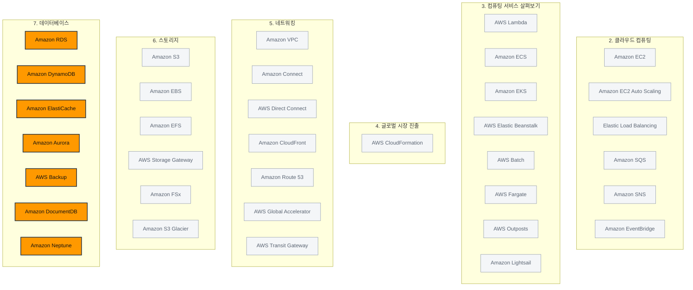

> 강의 7개 · 지식 점검 10문항 · 모듈 평가 12문항

---

## 1. 왜 필요한가

> 파일은 해결했다. 그럼 구조화된 데이터, 즉 데이터베이스는?

앞 모듈에서 파일과 객체를 어디에 둘지는 정리했습니다. 그런데 커피숍에 로열티 프로그램을 붙인다고 생각해 보시기 바랍니다.
누가 무엇을 언제 얼마에 샀는지, 그 고객이 지금 도장을 몇 개 모았는지를 알아야 합니다.
이런 데이터는 S3에 파일로 던져 두고 끝낼 수 없습니다. **찾고, 이어 붙이고, 갱신할 수 있어야** 하기 때문입니다.

그래서 이번 모듈에서는 **데이터베이스**를 다룹니다. 다만 AWS에서 데이터베이스를 배울 때 외워야 할 것은
SQL 문법이 아닙니다. 시험이 묻는 것은 딱 두 가지입니다.
**"이 데이터에는 어떤 종류의 데이터베이스가 맞는가"** 와 **"그 데이터베이스를 누가 관리하는가"** 입니다.

첫 번째 질문에 답하려고 AWS는 만능 데이터베이스 하나를 만들지 않고 **목적별 데이터베이스**를 여러 개 준비해 두었습니다.
관계형, 비관계형, 캐시, 문서, 그래프, 원장이 각각 따로 있습니다.
두 번째 질문은 모듈 1의 공동 책임 모델이 그대로 이어집니다.
EC2에 직접 MySQL을 설치할 것인지, RDS에 맡길 것인지에 따라 **내가 패치해야 할 것**이 완전히 달라집니다.
이 두 축을 따라가면서 서비스를 하나씩 붙여 보겠습니다.

## 2. 이번에 새로 나오는 서비스

| 서비스 | 한 줄 | 이 모듈에서 맡는 역할 |
|---|---|---|
| [[amazon-rds]] | 관계형 데이터베이스를 관리형으로 빌린다 | 표와 SQL이 필요할 때의 **기본 선택지** |
| [[amazon-aurora]] | MySQL·PostgreSQL 호환 고성능 관계형 데이터베이스 | 관계형인데 **성능·가용성이 더** 필요할 때 |
| [[amazon-dynamodb]] | 서버리스 키-값·문서 NoSQL 데이터베이스 | 스키마가 **유연**해야 하고 밀리초가 급할 때 |
| [[amazon-elasticache]] | 완전관리형 인메모리 캐시 | 같은 조회가 반복될 때 **DB 앞에** 세우는 계층 |
| [[amazon-documentdb]] | MongoDB 호환 문서 데이터베이스 | **JSON 문서**를 그대로 저장할 때 |
| [[amazon-neptune]] | 완전관리형 그래프 데이터베이스 | **관계 자체**가 데이터일 때 |
| [[aws-backup]] | 여러 서비스의 백업을 한곳에서 관리 | 흩어진 백업 정책을 **한 대시보드로** |

> [!tip] 이번 모듈의 큰 그림
> **관계형(RDS · Aurora)** 과 **비관계형(DynamoDB)** 이 큰 두 갈래이고, 그 앞에 **캐시(ElastiCache)** 를 두어 속도를 올립니다.
> 이 셋으로 안 되는 특수한 모양의 데이터에는 **DocumentDB · Neptune** 같은 목적별 데이터베이스를 붙이고,
> 어떤 데이터베이스를 쓰든 **AWS Backup**으로 보호합니다.

## 3. 강의 내용

---

### L1. 데이터베이스를 누가 관리할 것인가

> **이번 강의에서 다룰 내용** — 공동 책임 모델이 데이터베이스에서 어떻게 갈리는지, EC2에 직접 설치하는 것과 관리형 서비스를 쓰는 것의 차이를 짚어 보겠습니다.

#### 관리 범주 세 가지

AWS는 **관리 태스크를 누가 가져가느냐**에 따라 서비스를 세 범주로 나눕니다.
이번 모듈에서 배우는 서비스는 대부분 완전관리형이고, RDS 정도가 관리형에 해당합니다.

| 범주 | AWS가 하는 일 | 고객이 하는 일 | 예 |
|---|---|---|---|
| **완전관리형** | 프로비저닝, 스케일링, 패치 적용, 백업, 성능 최적화, 모니터링까지 **거의 전부** | **데이터 구조 설계**와 **액세스 제어 관리** | DynamoDB, Aurora, DocumentDB, Neptune |
| **관리형** | 백업, 패치 적용, 하드웨어 프로비저닝 같은 **일상 태스크** | 데이터베이스 구성, **쿼리 최적화**, 성능 튜닝 | Amazon RDS |
| **비관리형** | 물리 인프라와 하이퍼바이저까지만 | 설치, 구성, 패치, 보안, 백업, 고가용성 설정, 성능 최적화 **전부** | EC2 인스턴스에 직접 설치한 MySQL |

#### EC2에 직접 설치 vs Amazon RDS

시험에 반복해서 나오는 비교입니다. **같은 MySQL이라도 어디에 올렸느냐로 책임선이 통째로 움직입니다.**

| 항목 | EC2에 직접 설치 (비관리형) | Amazon RDS (관리형) |
|---|---|---|
| 하드웨어·데이터 센터 | AWS | AWS |
| 게스트 OS 설치·패치 | **고객** | AWS |
| 데이터베이스 엔진 설치·버전 업그레이드 | **고객** | AWS |
| 백업·스냅샷 | **고객이 직접 구성** | AWS가 자동 백업 제공 |
| 고가용성·장애 조치 | **고객이 직접 구축** | 다중 AZ 배포로 **자동 장애 조치** |
| OS 로그인·엔진 내부 접근 | **가능** | 불가능 |
| 데이터, 스키마, 접근 권한 | 고객 | 고객 |

> [!warning] "제어"와 "관리 부담"은 반대 방향으로 움직입니다
> 문제에 **"운영 오버헤드를 줄이고 싶다", "개발에 집중하고 싶다", "IT 인력을 줄이고 싶다"** 가 나오면 관리형 서비스입니다.
> 반대로 **"OS에 접근해야 한다", "엔진을 완전히 제어해야 한다", "RDS가 지원하지 않는 설정이 필요하다"** 가 나오면 EC2에 직접 설치하는 쪽입니다.

기존 온프레미스 데이터베이스를 그대로 EC2로 옮기는 방식을 **리프트 앤 시프트**라고 부릅니다.
운영 체제·메모리·CPU·스토리지를 온프레미스에서와 똑같이 제어하면서 위치만 AWS로 옮기는 것입니다.
이 이동을 도와주는 서비스가 **AWS Database Migration Service(AWS DMS)** 이고, 뒤에서 다시 보겠습니다.

```quiz 지식 점검 · 관리 책임
Q. AnyCompany Logistics에서는 온라인 플랫폼을 성장시키고 확장하려 합니다. 개발 팀은 Amazon EC2 인스턴스에서 자체 데이터베이스를 호스팅하거나, AWS의 완전관리형 데이터베이스 서비스를 사용하는 두 옵션 중 하나를 선택해야 합니다. 이 회사의 목표는 직원들이 개발 작업에 더 집중할 수 있도록 IT 유지 관리 태스크를 줄이는 것입니다. 어떤 옵션을 선택해야 합니까?
- Amazon EC2 기반의 자체 호스팅 데이터베이스를 선택합니다. 이 옵션은 성장 중인 기업의 비용 효율성을 항상 개선하기 때문입니다.
+ 개발 팀은 데이터베이스 관리 태스크보다 새로운 기능을 개발하는 데 집중하고자 하므로, 관리형 데이터베이스 서비스를 선택합니다.
- Amazon EC2 기반의 자체 호스팅 데이터베이스를 선택합니다. 이 옵션은 전자 상거래 애플리케이션의 성능을 항상 강화하기 때문입니다.
- 관리형 데이터베이스 서비스를 선택합니다. 이 옵션은 회사의 애플리케이션 코드를 자동으로 최적화하기 때문입니다.
> 결정적인 문장은 **"IT 유지 관리 태스크를 줄이고 개발에 집중"** 입니다. 곧바로 관리형 서비스를 가리킵니다. EC2 자체 호스팅을 고른 두 선택지는 "항상"이라는 단어로 근거를 과장하고 있어서 오답이고, 관리형을 골랐더라도 이유를 **"애플리케이션 코드를 자동으로 최적화한다"** 고 적은 선택지는 존재하지 않는 기능을 근거로 든 오답입니다. 관리형 서비스는 데이터베이스 운영을 대신해 줄 뿐, 고객이 짠 코드를 고쳐 주지는 않습니다.
```

---

### L2. 관계형 데이터베이스와 Amazon RDS

> **이번 강의에서 다룰 내용** — 관계형 데이터베이스가 무엇인지 정리하고, Amazon RDS의 다중 AZ 배포와 읽기 전용 복제본이 각각 무엇을 해결하는지 살펴보겠습니다.

#### 관계형 데이터베이스란

관계형 데이터베이스는 데이터를 **행과 열로 이루어진 테이블**에 저장하고, 테이블끼리 **공통 속성으로 연결**합니다.
스키마가 **고정**되어 있어서 한 테이블의 모든 항목은 같은 열을 갖습니다. 조회와 조작에는 **SQL**을 사용합니다.

예를 들어 커피숍 재고 테이블은 이렇게 생겼습니다.

| ID | 제품 이름 | 크기 | 가격 |
|---|---|---|---|
| 1 | 미디엄 로스트 분쇄 커피 | 12온스 | $13.95 |
| 2 | 싱글 오리진 홀빈 커피 | 12온스 | $21.95 |

여기에 고객 테이블과 주문 테이블을 따로 두고 **고객 ID로 연결**하면,
"같은 음료를 세 번 이상 주문한 고객"처럼 여러 테이블을 가로지르는 질문에 한 번에 답할 수 있습니다.
이 **관계를 추적하는 능력**이 관계형 데이터베이스를 쓰는 이유입니다.

#### Amazon RDS

**Amazon Relational Database Service(Amazon RDS)** 는 백업·패치 적용·하드웨어 프로비저닝 같은
일상적인 데이터베이스 태스크를 대신 처리해 주는 **관리형 관계형 데이터베이스 서비스**입니다.

| 항목 | 내용 |
|---|---|
| **지원 엔진** | Amazon Aurora, MySQL, PostgreSQL, MariaDB, Oracle Database, Microsoft SQL Server |
| **인스턴스 클래스** | 메모리·성능·I/O 중 무엇을 최적화할지 골라서 지정합니다 |
| **백업** | 자동 백업과 수동 **DB 스냅샷**을 모두 제공합니다. 특정 시점 복구와 장기 보관에 사용합니다 |
| **보안** | VPC 네트워크 격리, **저장 데이터 암호화**, **전송 중 암호화** |
| **스케일링** | 인스턴스 크기를 키우는 수직 확장과 읽기 전용 복제본을 늘리는 수평 확장이 모두 가능합니다 |
| **모니터링** | 성능 개선 도우미(Performance Insights)로 데이터베이스 부하를 실시간으로 분석합니다 |

RDS를 쓰면 하드웨어를 미리 구매할 필요가 없고, 실제로 사용한 컴퓨팅·스토리지에 대해서만 **종량제**로 지불합니다.
대표적인 사용 사례는 웹 애플리케이션, 기업 워크로드, 전자 상거래 플랫폼의 제품 인벤토리입니다.

#### 다중 AZ 배포 vs 읽기 전용 복제본

RDS에서 가장 많이 헷갈리는 두 기능입니다. **둘 다 "복제본"이지만 푸는 문제가 다릅니다.**

| | **다중 AZ 배포** | **읽기 전용 복제본(Read Replica)** |
|---|---|---|
| 목적 | **가용성** — 장애가 나도 끊기지 않게 | **성능** — 읽기 부하를 나눠서 처리 |
| 복제본의 역할 | 다른 AZ의 **대기(standby) 인스턴스**. 평소에는 트래픽을 받지 않습니다 | **읽기 요청을 실제로 처리**합니다 |
| 장애가 나면 | AWS가 **수동 개입 없이 자동으로 장애 조치**를 실행합니다 | 자동 장애 조치 대상이 아닙니다 |
| 쓰기 | 기본 인스턴스만 | 불가능 (읽기 전용) |
| 문제 속 신호 | "가동 중지 시간 최소화", "지속적인 운영", "AZ 중단에도 계속" | "읽기 트래픽이 많다", "조회 쿼리가 느리다", "기본 인스턴스 부하를 덜고 싶다" |

> [!warning] 한 문장으로 갈라 두세요
> **다중 AZ는 살아남기 위한 것**이고, **읽기 전용 복제본은 빨라지기 위한 것**입니다.
> "가용성·장애 조치"가 보이면 다중 AZ, "읽기 성능"이 보이면 읽기 전용 복제본입니다.

```quiz 지식 점검 · Amazon RDS
Q. AnyCompany Retail에서는 운영 오버헤드를 줄이기 위해 제품 데이터베이스를 AWS Cloud로 마이그레이션하고자 합니다. 이 회사의 기존 데이터베이스에는 가동 중지 시간을 최소화하면서 지속적으로 운영해야 하는 중요한 인벤토리 및 가격 정보가 포함되어 있습니다. 이 시나리오에서 설명한 요구 사항을 해결하는 Amazon RDS의 기능은 무엇입니까?
- 수동 스냅샷 생성
- 셀프 매니지드 패치 적용
- 고정 스토리지 할당
+ 다중 AZ 배포
> **"가동 중지 시간 최소화"와 "지속적인 운영"** 이 곧 다중 AZ 배포의 신호입니다. 다른 가용 영역의 대기 인스턴스에 데이터를 자동으로 복제해 두었다가, 장애가 발생하면 수동 개입 없이 장애 조치를 실행합니다. 수동 스냅샷은 복구 수단이지 무중단 수단이 아니고, 셀프 매니지드 패치 적용은 오히려 운영 오버헤드를 늘립니다. 고정 스토리지 할당은 RDS가 지향하는 방향과 반대입니다.
```

---

### L3. Amazon Aurora — 관계형의 한 단계 위

> **이번 강의에서 다룰 내용** — Aurora가 표준 MySQL·PostgreSQL과 무엇이 다른지, 그리고 어떤 문제에서 Aurora를 고르게 되는지 살펴보겠습니다.

**Amazon Aurora**는 클라우드에 맞게 다시 설계한 **완전관리형 관계형 데이터베이스**입니다.
**MySQL 및 PostgreSQL과 호환**되므로 애플리케이션 코드를 거의 바꾸지 않고 옮길 수 있습니다.

| 특성 | 내용 |
|---|---|
| **성능** | 표준 MySQL 대비 최대 **5배**, PostgreSQL 대비 최대 **3배** 처리량을 제공합니다 |
| **스토리지** | 사용량에 따라 **10GB에서 128TB까지 자동 확장**합니다. 용량을 미리 추측할 필요가 없습니다 |
| **내구성** | **가용 영역 3곳에 데이터 사본 6개**를 복제하고, 99.99% 가용성을 목표로 합니다 |
| **복제본** | 리전 안의 여러 AZ에 걸쳐 **Aurora 복제본을 최대 15개**까지 둘 수 있습니다 |
| **백업** | S3에 **지속적으로 백업**하여 특정 시점으로 복구합니다. AWS Backup으로 최대 35일 보존의 연속 백업도 지원합니다 |
| **장애 대응** | 데이터베이스 실패를 자동으로 감지하고 **데이터 손실 없이** 정상 복제본으로 트래픽을 돌립니다 |

사용 사례는 게임 애플리케이션, 미디어·콘텐츠 관리, 실시간 분석처럼 **관계형 구조를 유지하면서 처리량이 커야 하는** 워크로드입니다.

> [!tip] RDS와 Aurora 중 무엇을 고를까요
> - **"기존 Oracle·SQL Server를 그대로 쓰고 싶다", "익숙한 엔진을 관리형으로"** → **Amazon RDS**
> - **"상용 데이터베이스를 더 싸게 대체하고 싶다", "MySQL인데 처리량이 부족하다", "고성능·고가용성"** → **Amazon Aurora**
>
> Aurora는 RDS가 지원하는 엔진 중 하나이기도 합니다. 둘을 대립 관계로 외우기보다 **Aurora는 성능·가용성을 끌어올린 선택지**로 기억해 두시기 바랍니다.

```quiz 지식 점검 · Amazon Aurora
Q. AnyCompany Financial은 트랜잭션 피크 기간에 현재 MySQL 데이터베이스의 응답 시간이 느려지는 현상을 겪고 있습니다. 이 회사는 시간당 100,000건 이상의 트랜잭션을 처리하며, 고객 만족도를 충족하려면 높은 처리량이 필요합니다. 이 시나리오를 해결하는 데 가장 도움이 되는 Amazon Aurora의 기능은 무엇입니까?
- Aurora는 트랜잭션 피크 시간에 더 많은 CPU 리소스를 추가하는 자동 인스턴스 스케일링 기능을 기본적으로 제공합니다.
- Aurora에는 더 빠른 쿼리 성능을 위해 스토리지 요구 사항을 줄여주는 데이터 압축 기술이 포함되어 있습니다.
+ Aurora는 표준 MySQL보다 최대 5배 높은 처리량을 제공하는 고성능 및 고가용성 스토리지 아키텍처를 제공합니다.
- Aurora는 인스턴스 간의 네트워크 지연 시간을 없애는 중앙 집중식 스토리지 시스템을 제공합니다.
> 문제가 요구하는 것은 **높은 트랜잭션 처리량**이고, Aurora의 대표 수치가 정확히 **표준 MySQL 대비 최대 5배 처리량**입니다. 데이터 압축은 Aurora의 성능 근거로 제시되는 특성이 아니고, Aurora의 스토리지는 중앙 집중식이 아니라 **여러 노드에 분산된** 구조입니다. 지연 시간을 "없앤다"고 단정하는 표현도 과장이라 걸러내시면 됩니다.
```

---

### L4. 비관계형 데이터베이스 — Amazon DynamoDB

> **이번 강의에서 다룰 내용** — NoSQL이 관계형과 무엇이 다른지, 그리고 DynamoDB가 어떤 요구 사항에서 정답이 되는지 살펴보겠습니다.

#### NoSQL은 무엇이 다른가

관계형 데이터베이스는 스키마가 고정되어 있어서 **열을 바꾸는 일이 부담**입니다.
고객마다 저장할 항목이 제각각인 데이터라면 이 구조가 잘 맞지 않습니다.

**NoSQL(비관계형) 데이터베이스**는 행과 열의 관계 대신 **키-값 페어**로 데이터를 구성합니다.
키를 사전의 표제어, 값을 그 뜻이라고 생각하시면 됩니다.

| 키 | 값 |
|---|---|
| 1 | **이름:** John Doe · **주소:** 123 Any Street · **좋아하는 음료:** 미디엄 라떼 |
| 2 | **이름:** Mary Major · **주소:** 100 Main Street · **생일:** 1994년 7월 5일 |

두 항목이 **서로 다른 속성**을 가지고 있는데도 아무 문제가 없다는 점을 보시기 바랍니다.
언제든지 속성을 추가하거나 제거할 수 있고, 테이블의 모든 항목이 같은 속성을 가질 필요도 없습니다. 이것이 **유연한 스키마**입니다.

| | 관계형 (RDS · Aurora) | 비관계형 (DynamoDB) |
|---|---|---|
| 저장 구조 | 행과 열의 테이블 | 항목(item)과 속성(attribute) |
| 스키마 | **고정** — 모든 행이 같은 열 | **유연** — 항목마다 달라도 됩니다 |
| 테이블 간 연결 | 외래 키로 조인 | 조인·외래 키 개념이 없습니다 |
| 조회 언어 | **SQL** | 자체 API (SQL을 쓰지 않습니다) |
| 강점 | 복잡한 관계와 트랜잭션 | **규모**와 **속도**, 스키마 변경의 자유 |

#### Amazon DynamoDB

**Amazon DynamoDB**는 **완전관리형 서버리스 NoSQL 데이터베이스**입니다.
키-값과 문서 구조를 모두 지원하고, 테이블을 만들면 바로 데이터를 넣고 조회할 수 있습니다.

| 특성 | 내용 |
|---|---|
| **성능** | 어떤 규모에서든 **한 자릿수 밀리초(10밀리초 미만)** 응답 시간을 제공합니다 |
| **스케일링** | 실제 사용량에 따라 처리량을 **자동으로 스케일 업·다운**합니다. 테이블 크기와 저장량에 사실상 제한이 없습니다 |
| **가용성·내구성** | 리전 내 개별 시설 3곳에 데이터를 복제합니다 |
| **글로벌 테이블** | 여러 리전에 사본을 유지해 **전 세계에 분산된 애플리케이션**을 지원합니다 |
| **운영 부담** | 서버 프로비저닝, 버전 업그레이드, 유지 관리 기간, 패치 적용이 **없습니다** |
| **암호화** | 스토리지에 기록되기 전에 자동으로 암호화됩니다 |

사용 사례는 게임 플랫폼, 금융 서비스 애플리케이션, 글로벌 사용자를 가진 모바일 애플리케이션입니다.
읽기가 특히 몰리는 경우에는 **DynamoDB Accelerator(DAX)** 라는 전용 캐싱 계층을 앞에 붙일 수도 있습니다.

```quiz 지식 점검 · Amazon DynamoDB
Q. 한 인력 파견 회사에서 직원 정보를 저장하는 애플리케이션을 구축하려 하는데, 트래픽 패턴을 예측하기 어렵습니다. 이 애플리케이션은 상시적으로 일관된 성능이 필요하며, 개발 팀에서는 데이터베이스 관리 태스크보다 기능 개발에 집중하고자 합니다. 이 워크로드의 요구 사항을 가장 잘 충족하는 Amazon DynamoDB의 기능은 무엇입니까?
- 수동으로 읽기 및 쓰기 용량 단위 구성
+ 프로비저닝된 용량으로 오토 스케일링
- 고정 스토리지 제한 할당
- 사전 정의된 스키마 적용
> 신호가 세 개나 겹쳐 있습니다. **트래픽을 예측하기 어렵다**, **일관된 성능이 필요하다**, **관리 부담을 줄이고 싶다**. 사용량에 맞춰 처리량을 자동으로 조절하는 오토 스케일링이 이 셋을 한 번에 해결합니다. 용량을 수동으로 구성하면 예측 불가능한 트래픽을 따라가지 못하고, 고정 스토리지 제한이나 사전 정의된 스키마는 애초에 DynamoDB의 특성이 아니라 관계형 데이터베이스의 성질입니다.
```

---

### L5. 인메모리 캐싱 — Amazon ElastiCache

> **이번 강의에서 다룰 내용** — 캐싱 계층이 왜 필요한지, ElastiCache가 어디에 놓이고 무엇을 해결하는지 살펴보겠습니다.

#### 같은 질문이 반복되면 데이터베이스가 지칩니다

Amazon RDS로 제품 정보를 제공하는 전자 상거래 사이트를 떠올려 보시기 바랍니다.
수천 명의 고객이 **같은 상품 상세 페이지**를 계속 열어 봅니다.
데이터베이스는 매번 같은 쿼리를 실행해서 매번 같은 결과를 돌려주게 되고, 결국 부하가 걸려 지연 시간이 늘어납니다.

해결책은 **자주 조회되는 데이터를 미리 꺼내 놓는 것**입니다.
그 자리가 디스크가 아니라 **메모리(RAM)** 이면 검색 속도가 디스크 기반 스토리지보다 수백~수천 배 빨라집니다.
이것이 **인메모리 캐시**입니다.

EC2에 올린 애플리케이션이 RDS를 백엔드로 쓰는 전형적인 구성에 캐시를 끼워 넣으면 요청 흐름이 이렇게 바뀝니다.

| 순서 | 일어나는 일 |
|---|---|
| 1 | 사용자가 EC2의 애플리케이션에 데이터를 요청합니다 |
| 2 | 애플리케이션이 **ElastiCache부터** 확인합니다 |
| 3-A | 캐시에 있으면(**캐시 히트**) 그대로 반환합니다. 데이터베이스까지 내려가지 않습니다 |
| 3-B | 캐시에 없으면(**캐시 미스**) RDS에서 읽어 오고, **그 결과를 캐시에 저장한 뒤** 반환합니다 |
| 4 | 다음에 같은 요청이 오면 3-A로 끝납니다 |

#### Amazon ElastiCache

**Amazon ElastiCache**는 **Redis OSS, Valkey, Memcached와 호환되는 완전관리형 인메모리 캐싱 서비스**입니다.
기존에 쓰던 캐시 도구와 구성을 그대로 유지하면서, 하드웨어 프로비저닝·패치 적용·모니터링만 AWS에 넘길 수 있습니다.

| 이점 | 내용 |
|---|---|
| **마이크로초 지연 시간** | 읽기 요청에 마이크로초 단위로 응답하여 애플리케이션 성능을 끌어올립니다 |
| **데이터베이스 오프로드** | 쿼리 볼륨 자체가 줄어 백엔드 데이터베이스의 부담이 내려갑니다 |
| **비용 최적화** | 데이터베이스 부하가 줄어들므로 **더 작은 DB 인스턴스**를 써도 됩니다 |
| **고가용성** | 프라이머리 노드 실패를 감지하면 **복제본을 새 프라이머리로 자동 승격**합니다 |
| **다중 AZ 복제** | 여러 가용 영역에 프라이머리·복제본 노드를 배치할 수 있습니다 |
| **확장성** | 수요에 따라 노드를 추가·제거합니다. 서버리스 옵션도 있습니다 |

사용 사례는 **세션 데이터 관리, 데이터베이스 쿼리 결과 캐싱, 게임 순위표, 실시간 분석**입니다.

> [!warning] 캐시는 데이터베이스의 대체품이 아닙니다
> ElastiCache는 자주 쓰는 데이터를 **임시로** 담아 두는 계층입니다. 원본은 여전히 RDS나 DynamoDB에 있습니다.
> "관계형 데이터베이스를 완전히 대체한다"는 식의 선택지는 항상 오답입니다.

```quiz 지식 점검 · Amazon ElastiCache
Q. Amazon ElastiCache는 어떤 문제를 해결합니까?
- 온프레미스와 AWS 환경 간의 네트워크 연결
+ 높은 지연 시간 및 처리량 제약으로 인한 성능 병목 현상
- 애플리케이션 자격 증명 및 보안 암호 저장
- 액세스 빈도가 낮은 데이터의 비용 최적화
> ElastiCache가 존재하는 이유는 **반복되는 읽기 때문에 생기는 성능 병목**을 없애는 것입니다. 네트워크 연결은 Direct Connect나 VPN이 푸는 문제이고, 자격 증명 보관은 Secrets Manager의 몫입니다. 액세스 빈도가 낮은 데이터의 비용 최적화는 오히려 정반대 방향이라 S3 Glacier 같은 아카이브 스토리지가 담당합니다. 캐시는 **자주 쓰는** 데이터를 다루는 서비스라는 점을 기억해 두시기 바랍니다.
```

---

### L6. 목적별 데이터베이스 — 데이터 모양에 맞는 도구

> **이번 강의에서 다룰 내용** — 데이터를 데이터베이스에 끼워 맞추지 않고, 데이터 모양에 맞는 데이터베이스를 고르는 방법을 살펴보겠습니다.

AWS의 원칙은 분명합니다. **모든 용도에 맞는 만능 데이터베이스는 없습니다.**
비즈니스 요구 사항에 맞는 데이터베이스를 고르는 것이지, 데이터를 데이터베이스에 맞추는 것이 아닙니다.

#### Amazon DocumentDB (MongoDB 호환)

고정된 관계형 스키마에 잘 들어가지 않는 **반정형 데이터**를 다루는 완전관리형 **문서 데이터베이스**입니다.
**MongoDB와 호환**되므로 기존 MongoDB API·드라이버·도구를 거의 그대로 쓸 수 있고, 마이그레이션 시 코드 변경도 최소화됩니다.

- **동적 스키마**로 JSON 스타일 문서를 저장·쿼리·인덱싱합니다
- 스토리지를 10GB 단위로 **최대 64TB까지 자동 확장**합니다
- 기본 스토리지를 공유하는 **복제본 인스턴스를 최대 15개**까지 두어 읽기 처리량을 올립니다
- 사용 사례 — **콘텐츠 관리 시스템, 카탈로그·인벤토리 관리, 사용자 프로필 및 개인화**

#### Amazon Neptune

**고도로 연결된 데이터**를 다루는 완전관리형 **그래프 데이터베이스**입니다.
관계형 데이터베이스에서 "누가 누구와 어떻게 연결되어 있는지"를 추적하려면 조인이 끝없이 늘어나는데, Neptune은 이 관계 자체를 저장 구조로 삼습니다.

- 속성 그래프와 RDF 모델을 모두 지원합니다
- **수십억 개의 관계**를 몇 밀리초 안에 탐색하고, 스토리지를 최대 64TB까지 확장합니다
- 사용 사례 — **소셜 네트워크의 사용자 연결 매핑, 사기 행위 탐지, 추천·검색 엔진**

#### 시험에 함께 나오는 두 가지

이번 모듈에서 자세히 다루지는 않지만, 서비스 선택 문제에서 보기로 자주 등장합니다.

| 서비스 | 무엇인가 | 이 모듈의 서비스와 갈리는 지점 |
|---|---|---|
| **Amazon Redshift** | 페타바이트급 **데이터 웨어하우스**. 대량의 과거 데이터를 모아 **분석 쿼리**를 돌립니다 | RDS는 실시간 거래 처리(OLTP), Redshift는 **분석·리포팅(OLAP)** 입니다 |
| **Amazon QLDB**<br/>*(2025-07-31 종료)* | 변경할 수 없는 **원장(ledger) 데이터베이스**. 모든 변경 이력을 암호화 검증이 가능한 형태로 남깁니다 | 일반 데이터베이스는 값을 덮어쓰지만, 원장은 **변경 이력이 지워지지 않습니다** |

> [!warning] DynamoDB와 DocumentDB를 가르는 한 단어
> 둘 다 비관계형이라 헷갈립니다. 문제에 **키-값, 초고속, 서버리스, 대규모 트래픽**이 보이면 **DynamoDB**,
> **JSON 문서, MongoDB, 카탈로그·콘텐츠 관리**가 보이면 **DocumentDB**입니다.
> 그리고 **관계·연결·네트워크**라는 단어가 보이면 그때는 **Neptune**입니다.

```quiz 지식 점검 · 목적별 데이터베이스
Q. Amazon DocumentDB의 주요 기능은 무엇입니까?
+ MongoDB 호환성
- Amazon S3 호환성
- AWS Lambda 통합
- Amazon EC2 호스팅
> DocumentDB의 정식 이름 자체가 **Amazon DocumentDB(MongoDB 호환)** 입니다. 기존 MongoDB API·드라이버·도구를 그대로 쓸 수 있다는 점이 이 서비스의 핵심이자, 문제에서 정답을 고르는 신호입니다. S3 호환성은 객체 스토리지 이야기이고, Lambda 통합은 DocumentDB만의 특징이 아니며, DocumentDB는 완전관리형이라 고객이 EC2에 직접 호스팅하지 않습니다.

Q. Amazon Neptune을 사용하면 어떤 이점이 있습니까?
- 간단한 데이터 스토리지에 대한 비용 절감
- 내장된 자연어 처리(NLP) 기능
- SQL 쿼리를 그래프 쿼리로 자동 변환
+ 고도로 연결된 데이터에 대한 지연 시간이 짧은 쿼리
> Neptune은 **관계가 곧 데이터**인 워크로드를 위해 만들어진 그래프 데이터베이스입니다. 수십억 개의 관계를 밀리초 단위로 탐색하는 것이 존재 이유입니다. 단순한 데이터를 싸게 저장하는 용도라면 S3가 훨씬 저렴하고, 자연어 처리는 Amazon Comprehend 같은 AI 서비스의 영역입니다. SQL을 그래프 쿼리로 자동 변환해 주는 기능은 존재하지 않습니다.
```

---

### L7. 데이터 보호와 마이그레이션, 그리고 서비스 선택

> **이번 강의에서 다룰 내용** — AWS Backup과 AWS DMS를 정리하고, 이번 모듈 전체를 하나의 선택 결정표로 묶어 보겠습니다.

#### AWS Backup — 흩어진 백업을 한곳에서

데이터베이스 종류가 늘어날수록 백업 방법도 제각각이 됩니다.
EBS 볼륨은 스냅샷으로, RDS는 자동 백업으로, DynamoDB는 또 다른 방식으로 관리하다 보면 정책이 조각조각 흩어집니다.

**AWS Backup**은 이 문제를 **단일 대시보드**로 해결합니다.

| 기능 | 내용 |
|---|---|
| **중앙 집중식 관리** | **여러 AWS 서비스와 여러 계정**의 백업을 한곳에서 관리합니다. EBS 볼륨, EFS 파일 시스템, RDS 데이터베이스, DynamoDB 테이블 등을 지원하고 **온프레미스 데이터**까지 포함할 수 있습니다 |
| **자동 백업 일정** | 규정 준수 요구 사항에 맞춰 일정을 만들고, **새 리소스가 생기면 자동으로 보호**하는 정책을 걸 수 있습니다 |
| **리전 간 이중화** | 재해 복구를 위해 **여러 리전에 백업을 자동 복제**합니다. 프라이머리 리전이 중단되어도 세컨더리 리전에서 복원합니다 |
| **규정 준수** | 상세한 **감사 로그와 보고서**를 남기고, 조직 전체에 백업 정책을 적용합니다 |

#### AWS DMS — 옮기는 동안에도 서비스는 계속

**AWS Database Migration Service(AWS DMS)** 는 소스 데이터베이스를 **계속 운영한 채로**
데이터를 대상 데이터베이스로 옮겨 주는 서비스입니다.
온프레미스 데이터베이스를 EC2나 RDS로 옮길 때, 또는 다른 엔진으로 갈아탈 때 사용합니다.

핵심은 하나입니다. **마이그레이션 중 가동 중지 시간을 최소화하는 것**입니다.
DMS는 쿼리를 최적화해 주거나 테이블을 설계해 주는 도구가 아니라는 점도 함께 기억해 두시기 바랍니다.

#### 데이터베이스 선택 결정표

**이 표가 이번 모듈에서 시험에 가장 많이 나오는 부분입니다.**
문제는 대부분 "이 상황에 가장 적합한 서비스는?" 형태로 나오므로, **문제 속 신호**부터 찾으시기 바랍니다.

| 요구 사항 | 고르는 서비스 | 문제 속 신호 |
|---|---|---|
| 표·행·열 구조, 테이블 간 관계, SQL 트랜잭션 | **Amazon RDS** | "관계형", "SQL", "MySQL·PostgreSQL·Oracle·SQL Server", "기존 DB를 관리형으로" |
| 관계형인데 상용 DB급 성능·가용성이 필요 | **Amazon Aurora** | "비싼 상용 엔진을 대체", "MySQL의 5배 처리량", "고성능 · 고가용성 관계형" |
| 스키마가 항목마다 다름, 초고속·대규모 | **Amazon DynamoDB** | "키-값", "유연한 스키마", "한 자릿수 밀리초", "서버리스", "트래픽 예측 불가" |
| 쌓인 데이터를 모아 분석·리포팅 | **Amazon Redshift** | "데이터 웨어하우스", "페타바이트급 분석", "BI 대시보드", "과거 데이터 집계" |
| 같은 조회가 반복되어 DB가 느려짐 | **Amazon ElastiCache** | "캐싱", "마이크로초", "읽기 부하 오프로드", "세션 데이터", "게임 순위표" |
| JSON 문서를 그대로 저장·쿼리 | **Amazon DocumentDB** | "MongoDB 호환", "반정형 데이터", "콘텐츠 관리", "제품 카탈로그", "사용자 프로필" |
| 연결 관계 자체를 탐색 | **Amazon Neptune** | "그래프", "소셜 네트워크", "추천 엔진", "사기 탐지", "고도로 연결된 데이터" |
| 지울 수 없는 변경 이력이 필요 | **Amazon QLDB**<br/>*(종료됨. 옛 기출용)* | "원장", "변경 불가", "암호화로 검증 가능한 이력", "감사 추적" |
| 데이터베이스를 AWS로 옮겨야 함 | **AWS DMS** | "마이그레이션", "가동 중지 시간 최소화", "소스 DB를 계속 운영하면서" |
| 여러 서비스의 백업 정책이 흩어져 있음 | **AWS Backup** | "중앙 집중식 백업", "여러 계정·리전", "백업 정책 일원화", "규정 준수 감사" |

> [!tip] 두 단계로 좁히시기 바랍니다
> 1. **데이터의 모양**을 먼저 봅니다 — 표인가, 자유로운 항목인가, 문서인가, 관계인가, 분석용 집계인가.
> 2. 그다음 **관리 부담**을 봅니다 — 운영을 맡기고 싶으면 관리형, OS까지 제어해야 하면 EC2에 직접 설치입니다.

```quiz 지식 점검 · AWS Backup과 서비스 선택
Q. AWS Backup을 구현하여 해결할 수 있는 주요 문제는 무엇입니까?
- 리전 간 네트워크 연결 속도 저하
- 온디맨드 컴퓨팅 인스턴스의 높은 비용
+ 다양한 AWS 서비스 전체에서 조각화된 백업 접근 방식
- 복잡한 기계 학습 모델 개발
> AWS Backup이 푸는 문제는 성능도 비용도 아니라 **관리의 파편화**입니다. EBS·EFS·RDS·DynamoDB가 각자 다른 방식으로 백업되던 것을 하나의 정책과 하나의 대시보드로 모아 줍니다. 네트워크 속도, 컴퓨팅 비용, 기계 학습은 전부 다른 서비스의 영역입니다.

Q. 한 소셜 미디어 회사에서 사용자 간의 친구 관계와 팔로우 관계를 저장하고, "내 친구의 친구 중 같은 관심사를 가진 사람"을 빠르게 찾아내려 합니다. 가장 적합한 AWS 데이터베이스 서비스는 무엇입니까?
- Amazon RDS
- Amazon DynamoDB
+ Amazon Neptune
- Amazon Redshift
> **연결을 따라가며 탐색하는 질문**이므로 그래프 데이터베이스인 Neptune입니다. 관계형 데이터베이스로 같은 질문에 답하려면 조인이 계속 겹쳐서 느려지고, DynamoDB는 키로 항목을 빠르게 꺼내는 데 강할 뿐 관계 탐색용이 아닙니다. Redshift는 쌓인 데이터를 집계·분석하는 데이터 웨어하우스라 실시간 관계 탐색에는 맞지 않습니다.

Q. 한 소매업체가 지난 5년간의 판매 기록 수백 테라바이트를 한곳에 모아 두고, 분기별 매출 추이를 집계하는 리포트를 매일 생성하려 합니다. 가장 적합한 서비스는 무엇입니까?
- Amazon RDS
+ Amazon Redshift
- Amazon ElastiCache
- Amazon DocumentDB
> **대량의 과거 데이터 + 집계 리포트**는 데이터 웨어하우스의 전형적인 신호이므로 Redshift입니다. RDS는 주문을 넣고 재고를 차감하는 실시간 거래 처리에 맞고, ElastiCache는 자주 쓰는 데이터를 잠깐 담아 두는 캐시이며, DocumentDB는 JSON 문서를 다루는 서비스라 대규모 분석 쿼리와는 목적이 다릅니다.
```

---

## 4. 모듈 평가

```exam
Q. Amazon RDS를 가장 잘 설명한 내용은 무엇입니까?
+ 클라우드에서 관계형 데이터베이스를 설정, 운영, 확장하는 데 도움이 되는 관리형 서비스입니다.
- 비정형 데이터에 최적화된 NoSQL 데이터베이스 시스템입니다.
- 분석 처리를 위한 데이터 웨어하우징 솔루션입니다.
- Redis, Valkey 또는 Memcached와 원활하게 통합되는 완전관리형 인메모리 캐싱 서비스입니다.
> RDS는 **관계형** 데이터베이스를 관리형으로 제공하는 서비스입니다. 나머지 셋은 각각 DynamoDB(비관계형), Redshift(데이터 웨어하우스), ElastiCache(인메모리 캐시)의 설명입니다. 선택지에 이 네 가지가 나란히 나오는 문제가 반복되므로, 서비스마다 한 줄 정의를 붙여 두시기 바랍니다.

Q. Amazon Aurora의 사용 사례로 가장 적절한 것은 무엇입니까?
+ 비용이 많이 드는 상용 데이터베이스 엔진을, 엔터프라이즈급 성능과 신뢰성을 제공하는 더 비용 효율적인 솔루션으로 교체합니다.
- 가용성 요구 사항이 거의 없는 개발 환경용 임시 데이터베이스를 실행합니다.
- 거의 액세스하지 않는 정적 데이터를 최소한의 처리 기능만으로 저장합니다.
- 관계형 데이터베이스의 제약 없이 실시간으로 비정형 데이터 스트림을 처리합니다.
> Aurora의 대표적인 도입 이유가 바로 **비싼 상용 엔진의 대체**입니다. MySQL·PostgreSQL 호환이면서 성능과 가용성은 엔터프라이즈급이기 때문입니다. 가용성이 필요 없는 임시 개발 환경이라면 Aurora는 과한 선택이고, 거의 읽지 않는 정적 데이터는 S3나 Glacier가 훨씬 저렴합니다. 비정형 스트림 처리는 애초에 관계형 데이터베이스가 맡는 일이 아닙니다.

Q. AWS Database Migration Service(AWS DMS)는 어떤 문제를 해결합니까?
+ 데이터베이스 마이그레이션 중 애플리케이션의 가동 중지 시간을 최소화합니다.
- SQL 쿼리를 최적화하여 데이터베이스 성능을 향상합니다.
- 데이터베이스 관리자가 테이블을 설계할 수 있는 그래픽 인터페이스를 제공합니다.
- 자동 데이터베이스 백업 일정을 생성합니다.
> DMS의 존재 이유는 **소스 데이터베이스를 계속 운영한 채로 옮기는 것**입니다. 쿼리 최적화는 RDS 성능 개선 도우미 같은 도구가 돕는 일이고, 테이블 설계 도구는 DMS의 기능이 아니며, 백업 일정은 AWS Backup의 영역입니다. 문제에 "마이그레이션"과 "가동 중지 시간"이 함께 나오면 DMS입니다.

Q. Amazon DynamoDB에 대한 올바른 설명은 무엇입니까?
+ 완전관리형 NoSQL 키-값 및 도큐먼트 데이터베이스로, 원활한 확장성과 함께 빠르고 예측 가능한 성능을 제공합니다.
- 복잡한 SQL 쿼리 기능을 제공하는 관계형 데이터베이스 서비스입니다.
- 완전관리형 그래프 데이터베이스로, 예정된 가동 중지 시간 동안 서버 유지 관리가 필요합니다.
- 데이터를 저장하기 전에 스키마를 정의해야 하는 열 기반 데이터베이스입니다.
> DynamoDB의 정의는 **완전관리형 NoSQL**이고, 키-값과 문서 구조를 모두 지원합니다. SQL을 쓰는 관계형이라는 설명, 그래프 데이터베이스라는 설명(그쪽은 Neptune입니다), 사전 스키마 정의가 필요하다는 설명은 모두 DynamoDB의 성질과 정반대입니다. 특히 DynamoDB는 유지 관리 기간이나 예정된 가동 중지가 **없다**는 점을 기억해 두시기 바랍니다.

Q. Amazon ElastiCache를 사용하여 얻을 수 있는 주요 이점은 무엇입니까?
+ 인메모리 캐싱을 통해 애플리케이션 성능이 향상됩니다.
- 관계형 데이터베이스를 완전히 대체할 수 있습니다.
- 데이터 분석을 위한 기계 학습 기능이 내장되어 있습니다.
- 기본 데이터베이스 스토리지가 자동으로 확장됩니다.
> ElastiCache는 자주 쓰는 데이터를 메모리에 두어 **응답 시간을 줄이고 데이터베이스 부하를 덜어 줍니다**. 캐시는 원본 데이터베이스 **앞에 서는 계층**일 뿐이므로 데이터베이스를 대체한다는 설명은 오답입니다. 기계 학습 기능은 들어 있지 않고, 데이터베이스 스토리지를 자동 확장하는 것은 Aurora나 DynamoDB의 특성입니다.

Q. AWS Backup의 기능을 올바르게 설명한 것은 무엇입니까?
+ 여러 AWS 계정 및 리전에서 중앙 집중식 백업 정책과 모니터링을 제공합니다.
- 단일 AWS 리전 내의 리소스만 백업할 수 있습니다.
- 각 개별 리소스마다 수동으로 구성해야 합니다.
- 데이터베이스 서비스에만 국한됩니다.
> AWS Backup의 핵심 가치는 **중앙 집중화와 자동화**입니다. 리전 간 백업 복제를 지원하므로 단일 리전에 갇힌다는 설명은 틀렸고, 정책으로 새 리소스를 자동 보호하므로 리소스마다 수동 구성이 필요하다는 설명도 틀렸습니다. 지원 대상도 데이터베이스에 그치지 않고 EBS 볼륨, EFS 파일 시스템, 온프레미스 데이터까지 포함합니다.

Q. Amazon DocumentDB(MongoDB 호환)의 실제 사용 사례로 가장 적절한 것은 무엇입니까?
+ 전자 상거래 애플리케이션을 위한 대규모 제품 카탈로그를 저장하고 관리합니다.
- 엄격한 규정 준수 요구 사항이 있는 고성능 트랜잭션 뱅킹 애플리케이션을 실행합니다.
- 액세스 빈도가 낮은 과거 데이터를 장기 아카이브로 저장합니다.
- 웹 세션 데이터를 실시간으로 인메모리 캐싱합니다.
> 제품마다 속성이 제각각인 **카탈로그**는 문서 데이터베이스의 대표적인 사용 사례입니다. 콘텐츠 관리와 사용자 프로필도 같은 묶음입니다. 트랜잭션 중심의 뱅킹 시스템은 관계형(RDS·Aurora)이 맡고, 장기 아카이브는 S3 Glacier, 세션 캐싱은 ElastiCache의 몫입니다.

Q. Amazon Neptune의 실제 사용 사례로 가장 적절한 것은 무엇입니까?
+ 고도로 연결된 데이터세트를 효율적으로 관리하고 쿼리합니다.
- 실시간 스트리밍 분석을 제공합니다.
- 모든 워크로드에서 기존 SQL 데이터베이스를 대체합니다.
- 대규모 도큐먼트 데이터베이스의 텍스트 검색을 최적화합니다.
> Neptune은 **관계 자체가 핵심인 데이터**를 위한 그래프 데이터베이스입니다. 소셜 네트워크, 추천 엔진, 사기 탐지가 대표 사례입니다. 실시간 스트리밍 분석은 Kinesis 계열의 일이고, 텍스트 검색 최적화도 Neptune의 목적이 아닙니다. "모든 워크로드를 대체한다"는 표현은 목적별 데이터베이스라는 AWS의 원칙과 정면으로 어긋나므로 항상 걸러내시면 됩니다.

Q. 인메모리 캐싱을 가장 잘 설명한 정의는 무엇입니까?
+ 빠른 액세스를 위해 데이터를 메모리에 저장하여 데이터베이스 로드를 줄이는 동시에, 애플리케이션 성능 및 확장성을 향상하는 서비스입니다.
- 일관된 검색 속도를 위해 모든 애플리케이션 데이터를 솔리드 스테이트 드라이브에 영구적으로 저장하는 데이터베이스 관리 시스템입니다.
- 인터넷 라우팅 경로를 최적화하여 사용자 요청과 클라우드 기반 애플리케이션 간의 지연 시간을 줄이는 네트워킹 솔루션입니다.
- 5분마다 중요한 데이터의 스냅샷을 자동으로 생성하여 데이터 손실을 방지하는 백업 및 복구 서비스입니다.
> 정의를 이루는 두 조각은 **메모리(RAM)에 저장한다**는 것과 **임시로 담아 데이터베이스 부하를 줄인다**는 것입니다. 디스크에 영구 저장한다는 설명은 캐시가 아니라 일반 스토리지이고, 라우팅 경로 최적화는 Global Accelerator 같은 네트워킹 서비스, 주기적 스냅샷은 백업 서비스의 설명입니다.

Q. Amazon DynamoDB 같은 NoSQL 데이터베이스가 관계형 데이터베이스와 크게 다른 점은 무엇입니까?
+ NoSQL 데이터베이스는 관계형 데이터베이스의 고정된 테이블 구조 대신 유연한 스키마 디자인을 사용합니다.
- 관계형 데이터베이스는 NoSQL 솔루션에 비해 트랜잭션 워크로드에 항상 더 향상된 성능을 제공합니다.
- 관계형 데이터베이스는 오토 스케일링을 제공하며 NoSQL 데이터베이스는 수동 스케일링이 필요합니다.
- 관계형 데이터베이스는 모든 쿼리에 대한 인덱스가 필요하며, NoSQL 데이터베이스는 인덱스를 사용하지 않습니다.
> 둘을 가르는 근본적인 차이는 **스키마의 유연성**입니다. NoSQL은 항목마다 속성이 달라도 되고, 관계형은 모든 행이 같은 열을 가져야 합니다. 성능을 "항상 더 낫다"고 단정하는 선택지는 워크로드에 따라 달라지므로 오답이고, 오토 스케일링은 오히려 DynamoDB 쪽의 강점이며, 인덱스는 두 방식 모두 사용합니다.

Q. 완전관리형 AWS 데이터베이스 서비스를 사용하는 것보다, Amazon EC2 인스턴스에 직접 설치한 데이터베이스 같은 비관리형 솔루션이 더 적합한 시나리오는 무엇입니까?
+ 개발자가 데이터베이스를 완전히 제어하고 기본 운영 체제, 데이터베이스 설치, 구성에 액세스할 수 있어야 합니다.
- 개발자가 백업 및 패치 적용 같은 일상적인 데이터베이스 유지 관리 태스크를 AWS에 맡기고자 합니다.
- 개발자가 보유한 데이터베이스 크기가 Amazon RDS의 최대 한도보다 작습니다.
- 개발자가 라이선싱 복잡성에 대한 우려 없이 워크로드 패턴에 따라 데이터베이스 인스턴스를 확장하려 합니다.
> 비관리형을 고르는 유일한 이유는 **제어권**입니다. OS에 로그인해야 하거나, 관리형 서비스가 열어 주지 않는 설정을 직접 만져야 할 때입니다. 유지 관리를 AWS에 맡기고 싶다는 요구와 라이선싱 걱정 없이 확장하고 싶다는 요구는 모두 관리형 서비스가 해결해 주는 것이고, 데이터베이스 크기가 한도보다 작다는 것은 오히려 관리형을 못 쓸 이유가 되지 못합니다.

Q. 완전관리형 AWS 데이터베이스 서비스를 사용할 때 고객의 책임에 해당하는 것은 무엇입니까?
+ 고객은 데이터 구조를 설계하고 액세스 제어를 관리할 책임이 있습니다.
- 고객은 데이터베이스 지표를 모니터링하고 생성할 책임이 있습니다.
- 고객은 완전관리형 데이터베이스 서비스의 운영 체제에서 바이러스 백신 솔루션을 배포하고 관리할 책임이 있습니다.
- 고객은 프로비저닝, 스케일링, 패치 적용, 백업에 대한 책임이 있습니다.
> 완전관리형 서비스에서 고객에게 남는 것은 **데이터를 어떻게 설계하고 누구에게 열어 줄 것인가** 두 가지입니다. 프로비저닝·스케일링·패치·백업은 AWS가 처리하고, 모니터링 지표도 서비스가 기본으로 제공합니다. 완전관리형 데이터베이스는 고객이 OS에 접근할 수 없으므로 바이러스 백신을 설치한다는 선택지는 성립 자체가 불가능합니다.
```

## 5. 여기까지의 지도

주황색이 이번 모듈에서 새로 나온 서비스입니다.



모듈 1에서 세운 세 가지 축에 이번 모듈의 서비스를 얹어 보면 이렇게 정리됩니다.

| 축 | 이번 모듈에서의 답 |
|---|---|
| 비용 | 인스턴스 시간과 스토리지 기준(RDS·Aurora), 사용한 요청과 저장량 기준(DynamoDB). 캐시를 두면 **더 작은 DB 인스턴스**로 내려갈 수 있습니다 |
| 가용성 | RDS는 **다중 AZ**, Aurora는 **AZ 3곳에 사본 6개**, DynamoDB는 리전 내 3개 시설 복제 + 글로벌 테이블 |
| 책임 | 완전관리형은 **데이터 설계와 액세스 제어만**, 관리형은 여기에 **구성·튜닝**이 더해지고, EC2 직접 설치는 **OS부터 전부** 내 몫입니다 |

## 6. 셀프 체크

- [ ] 완전관리형 · 관리형 · 비관리형에서 각각 내가 무엇을 책임지는지 말할 수 있다
- [ ] EC2에 직접 설치한 DB와 RDS의 책임 차이를 항목별로 구분할 수 있다
- [ ] RDS 다중 AZ 배포와 읽기 전용 복제본이 각각 무엇을 해결하는지 한 문장씩 말할 수 있다
- [ ] 관계형과 비관계형의 차이를 스키마·조회 언어·연결 방식으로 설명할 수 있다
- [ ] RDS와 Aurora 중 무엇을 고를지 문제 속 신호로 판단할 수 있다
- [ ] DynamoDB · DocumentDB · Neptune을 각각의 신호 단어로 구분할 수 있다
- [ ] ElastiCache가 왜 데이터베이스의 대체품이 아닌지 설명할 수 있다
- [ ] Redshift(분석) · QLDB(원장) · DMS(마이그레이션) · AWS Backup(중앙 백업)의 자리를 말할 수 있다
- [ ] 위 `모듈 평가` 12문항을 다시 풀어 전부 맞혔다

확인 문제: [문제 풀이](/aws-clf-c02/quiz) · 틀린 것은 [[wrong-answers]]로.
