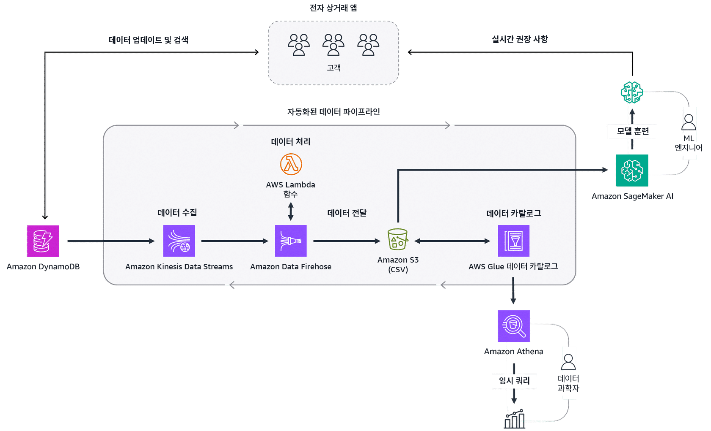
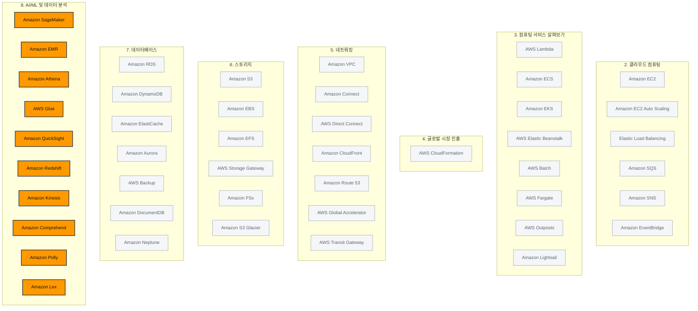

# AI/ML 및 데이터 분석

> 강의 8개 · 지식 점검 15문항 · 모듈 평가 10문항

---

## 1. 왜 필요한가

> 데이터가 쌓였다. 이걸로 분석하고 예측하려면?

앞의 모듈들에서 데이터를 **어디에 둘지**를 배웠습니다. S3에 파일을 쌓고, RDS와 DynamoDB에 레코드를 넣었죠.
그런데 쌓아 두는 것 자체는 목적이 아닙니다. 쌓인 데이터에서 **무슨 일이 있었는지 알아내고, 다음에 무슨 일이 일어날지 맞히는 것**이 목적입니다.

커피숍으로 다시 돌아가 보겠습니다. 매일 어떤 얼굴이 오는지, 언제가 가장 붐비는지, 어떤 원두가 먼저 떨어지는지를
사장님은 이미 어렴풋이 알고 계십니다. 하지만 그건 감입니다. 감을 **숫자와 모델**로 바꾸면
다음 달에 원두를 몇 킬로 주문할지, 이 손님에게 어떤 디저트를 권할지를 근거를 가지고 정할 수 있습니다.

이번 모듈에서는 그 일을 두 갈래로 나눠서 살펴보겠습니다.
하나는 **AI/ML** — 미리 훈련된 모델을 불러 쓰거나 내 모델을 만들어서 예측·자동화하는 쪽입니다.
다른 하나는 **데이터 분석** — 흩어진 원시 데이터를 한곳에 모아 정제하고, 쿼리하고, 대시보드로 보여 주는 쪽입니다.
그리고 이 두 갈래가 사실 **같은 데이터 파이프라인 위에 나란히 얹힌다**는 것까지 마지막 강의에서 확인해 보겠습니다.

## 2. 이번에 새로 나오는 서비스

| 서비스 | 한 줄 | 이 모듈에서 맡는 역할 |
|---|---|---|
| [[amazon-rekognition]] | 이미지와 동영상에서 사물·얼굴·활동을 식별합니다 | AI 서비스 — 컴퓨터 비전 |
| [[amazon-transcribe]] | 음성을 텍스트로 바꿉니다 | AI 서비스 — 받아쓰기 |
| [[amazon-polly]] | 텍스트를 사람 같은 음성으로 읽어 줍니다 | AI 서비스 — 음성 합성 |
| [[amazon-translate]] | 텍스트를 다른 언어로 번역합니다 | AI 서비스 — 번역 |
| [[amazon-comprehend]] | 텍스트에서 의미·감정·핵심 구를 뽑아냅니다 | AI 서비스 — 텍스트 이해 |
| [[amazon-textract]] | 문서·이미지 안의 글자를 텍스트로 추출합니다 | AI 서비스 — 문서 디지털화 |
| [[amazon-lex]] | 앱에 챗봇·음성 봇 인터페이스를 붙입니다 | AI 서비스 — 대화형 AI |
| [[amazon-sagemaker]] | 내 모델을 직접 구축·훈련·배포합니다 | ML 서비스 티어의 중심 |
| [[amazon-kinesis]] | 스트리밍 데이터를 실시간으로 수집합니다 | 파이프라인 — 수집 |
| [[aws-glue]] | 메타데이터를 카탈로그화하고 서버리스로 ETL을 돌립니다 | 파이프라인 — 카탈로그·처리 |
| [[amazon-emr]] | Spark·Hadoop 같은 빅데이터 프레임워크를 클러스터로 굴립니다 | 파이프라인 — 대규모 처리 |
| [[amazon-athena]] | S3에 있는 데이터에 그대로 SQL을 던집니다 | 파이프라인 — 쿼리 |
| [[amazon-redshift]] | 페타바이트급 데이터 웨어하우스입니다 | 파이프라인 — 정형 데이터 저장·분석 |
| [[amazon-quicksight]] | 대화형 BI 대시보드를 만듭니다 | 파이프라인 — 시각화 |

여기에 더해 **별도 노트 없이 이름만 기억하시면 되는 서비스**들이 함께 나옵니다.
Amazon Personalize(개인화 추천), Amazon Kendra(사내 문서 지능형 검색), Amazon Bedrock(파운데이션 모델 API),
Amazon SageMaker JumpStart(사전 구축 모델 허브), Amazon Q Business·Q Developer(생성형 AI 어시스턴트),
Amazon Data Firehose(거의 실시간 수집·전달), Amazon OpenSearch Service(실시간 검색·로그 분석)입니다.

> [!tip] 이번 모듈의 큰 그림
> **AI/ML은 위에서 아래로** 읽습니다 — 사전 구축 AI 서비스(바로 호출) → SageMaker AI(내 모델) → 프레임워크·인프라(전부 직접).
> **데이터 분석은 왼쪽에서 오른쪽으로** 읽습니다 — 수집 → 저장 → 카탈로그 → 처리 → 분석·시각화.
> 시험 문제는 대부분 "이 태스크에 어떤 서비스인가" 한 줄짜리이므로, 두 축의 **자리표**를 외워 두시는 것이 가장 빠릅니다.

## 3. 강의 내용

---

### L1. AI · 기계 학습 · 딥 러닝 · 생성형 AI

> **이번 강의에서 다룰 내용** — 네 용어의 포함 관계를 세우고, 기존 프로그래밍과 기계 학습이 어디에서 갈리는지 짚어 보겠습니다.

#### 네 용어는 서로 겹쳐 있습니다

시험에서 이 네 단어는 나란히 놓고 헷갈리게 만드는 단골 소재입니다.
서로 대등한 개념이 아니라 **큰 원 안에 작은 원이 들어 있는 구조**라는 점을 먼저 잡아 두시기 바랍니다.

```layers 바깥쪽이 넓은 분야, 안쪽으로 갈수록 좁고 구체적인 기술입니다.
인공 지능(AI) | 인간과 유사한 태스크를 수행하는 지능형 시스템을 만드는 광범위한 분야
  기계 학습(ML) | 명시적인 명령 없이도 태스크를 수행하도록 기계를 훈련하는 AI의 한 유형
    딥 러닝 | 인간의 뇌를 모방한 인공 신경망으로 모델을 훈련하는 ML의 한 갈래
      생성형 AI | 대화 · 이미지 · 음악 같은 새 콘텐츠를 만들어 내는 딥 러닝의 한 종류
```

#### 기존 프로그래밍과 기계 학습의 차이

커피숍 앱에 "구매한 커피에 어울리는 음식을 추천하는 기능"을 넣는다고 해 보겠습니다.

| | 기존 프로그래밍 | 기계 학습 |
|---|---|---|
| 사람이 하는 일 | **규칙을 직접 씁니다** — "캐러멜 라떼를 사면 데니시를 추천" | **데이터를 줍니다** — 과거 주문 내역 전부 |
| 기계가 하는 일 | 쓰인 규칙을 그대로 실행합니다 | 데이터에서 **패턴을 스스로 찾아냅니다** |
| 개인화 | 규칙 하나가 모든 고객에게 똑같이 적용됩니다 | 고객마다 다른 추천이 나옵니다 |
| 규칙이 바뀌면 | 사람이 코드를 고쳐야 합니다 | 새 데이터로 다시 훈련하면 됩니다 |

> [!warning] 자주 나오는 함정
> "기존 프로그래밍은 단순한 일에, 기계 학습은 복잡한 일에 쓴다"는 식의 설명은 **오답 보기**로 자주 등장합니다.
> 갈리는 지점은 난이도가 아니라 **규칙을 누가 만드느냐**입니다. 사람이 명시적으로 쓰면 기존 프로그래밍, 데이터에서 학습하면 ML입니다.

#### 훈련과 추론

기계 학습은 두 단계로 굴러갑니다.

| 단계 | 하는 일 | 결과물 |
|---|---|---|
| **훈련(training)** | 방대한 과거 데이터에서 숨은 패턴을 찾습니다 | **ML 모델** |
| **추론(inference)** | 훈련된 모델에 새 데이터를 넣습니다 | **예측 또는 결정** |

여기서 중요한 것은 훈련의 산출물이 **보고서도, 규칙서도, 데이터베이스도 아닌 "모델"**이라는 점입니다.
모델은 "이런 입력이 들어오면 이런 결과일 가능성이 높다"를 담고 있는 물건이라고 생각하시면 됩니다.

그리고 그 모델의 품질은 **넣은 데이터의 품질을 넘지 못합니다.**
판매 기록, 소셜 미디어 게시물, 센서 측정값, 고객 피드백을 모으고 정리하고 형식을 맞추는 일이 먼저입니다.
이 모듈의 후반부가 통째로 데이터 파이프라인 이야기인 이유가 여기에 있습니다.

```quiz 지식 점검 · 훈련과 모델
Q. 기계 학습(ML)은 명시적인 명령을 실행하지 않아도 복잡한 태스크를 수행할 수 있도록 기계를 훈련하는 AI의 한 유형입니다. 이러한 훈련 프로세스에서는 방대한 양의 과거 데이터에서 패턴을 찾는 작업이 이루어집니다. ML 훈련 프로세스를 통해 생성되는 결과물은 무엇입니까?
- 태스크 수행 방법을 설명하는 명시적인 ML 규칙서
+ 예측하거나 결정을 내릴 수 있는 ML 모델
- 데이터를 요약하는 ML 데이터 보고서
- 검색된 데이터 유형을 카탈로그화하는 ML 데이터베이스
> 훈련의 산출물은 **모델**입니다. 명시적인 규칙서를 만드는 것은 기존 프로그래밍 방식이고, 요약 보고서나 데이터 카탈로그는 훈련이 아니라 분석·카탈로그화 작업의 결과물입니다. 훈련으로 모델을 만들고, 그 모델에 새 데이터를 넣어 예측을 얻는 단계를 **추론**이라고 부른다는 짝까지 함께 기억해 두시기 바랍니다.
```

---

### L2. AWS AI/ML 스택 — 3가지 티어

> **이번 강의에서 다룰 내용** — AWS가 AI/ML 서비스를 세 층으로 나눠 놓은 이유와, 각 층을 언제 고르는지 살펴보겠습니다.

AWS는 AI/ML 서비스를 **세 개의 티어**로 정리해 두었습니다.
위로 갈수록 **바로 쓸 수 있고 필요한 기술이 적으며**, 아래로 갈수록 **직접 만들어야 하고 제어 범위가 넓어집니다.**

```layers 위쪽은 사서 쓰는 완제품, 아래쪽은 부품을 받아 직접 조립하는 쪽입니다.
티어 1 — AWS AI 서비스 | 사전 훈련된 관리형 모델을 API로 호출합니다. ML 전문 지식이 필요 없습니다
  Rekognition · Transcribe · Polly · Translate · Comprehend · Textract · Lex · Personalize · Kendra
티어 2 — AWS ML 서비스 | 내 데이터로 내 모델을 만들되, 인프라는 AWS가 관리합니다
  Amazon SageMaker AI | 구축 · 훈련 · 배포를 한 환경에서
티어 3 — ML 프레임워크 및 인프라 | 훈련 프로세스까지 전부 직접 제어합니다
  PyTorch · TensorFlow 같은 ML 프레임워크
  ML에 최적화된 EC2 인스턴스 · 목적별 칩
```

| | 티어 1 — AI 서비스 | 티어 2 — ML 서비스 | 티어 3 — 프레임워크·인프라 |
|---|---|---|---|
| **모델은 누가 만드나** | AWS가 이미 만들어 두었습니다 | **내가** 만듭니다 | **내가** 만듭니다 |
| **인프라는 누가 관리하나** | AWS | AWS | **내가** 관리합니다 |
| **필요한 전문성** | 거의 없습니다. API만 호출하면 됩니다 | ML 지식은 필요하지만 인프라 지식은 불필요합니다 | ML·인프라 양쪽 모두 필요합니다 |
| **문제 속 신호** | "사전 구축된", "미리 만들어진 솔루션", "바로 사용 가능한" | "**자체** 맞춤형 모델", "인프라 관리 없이 구축·훈련·배포" | "훈련 프로세스를 **완전하게 제어**", "PyTorch로 직접" |

> [!tip] 티어를 고르는 한 문장
> 문제에 **"사전 구축된"**이 있으면 티어 1, **"자체 모델을 만들되 인프라는 신경 쓰기 싫다"**면 SageMaker AI,
> **"훈련 과정을 완전히 제어해야 한다"**면 프레임워크와 인프라입니다.

---

### L3. 티어 1 — 사전 구축된 AI 서비스

> **이번 강의에서 다룰 내용** — 언어·비전·대화형 AI 서비스를 태스크별로 정리하고, 특히 헷갈리는 짝들을 갈라 보겠습니다.

**이번 모듈의 모듈 평가는 절반 이상이 "이 태스크에 어떤 서비스인가"입니다.**
그래서 이 표 하나를 확실히 외워 두시는 것이 가장 효율이 높습니다.

| 서비스 | 하는 일 | 문제 속 신호 |
|---|---|---|
| **Amazon Rekognition** | 이미지·동영상에서 사물, 사람, 얼굴, 텍스트, 활동을 식별합니다 | "**이미지**", "**동영상**", "사진 속 물체", "얼굴 인식", "부적절한 콘텐츠 탐지" |
| **Amazon Transcribe** | **음성을 텍스트로** 변환합니다 | "통화 **녹음**", "회의 받아쓰기", "자막 생성", "음성을 텍스트로" |
| **Amazon Polly** | **텍스트를 음성으로** 변환합니다 | "**대본을 읽어 준다**", "음성 안내", "성우·녹음실 없이", "텍스트를 음성으로" |
| **Amazon Translate** | 텍스트를 **다른 언어로** 번역합니다 | "번역", "다국어 지원", "현지 언어로 제공" |
| **Amazon Comprehend** | 텍스트에서 **감정·핵심 구·엔터티·주제**를 뽑아냅니다 (자연어 처리) | "**고객 감정** 파악", "리뷰·설문 응답 분석", "문서에서 인사이트 도출" |
| **Amazon Textract** | 문서·이미지 안의 **인쇄 및 손글씨 텍스트, 표, 양식**을 추출합니다 | "**스캔한** 문서", "PDF·영수증·양식", "손으로 쓴 글씨", "서류를 디지털화" |
| **Amazon Kendra** | 자연어 질문으로 사내 콘텐츠를 지능적으로 검색합니다 | "엔터프라이즈 **검색**", "사내 문서에서 답을 찾아 준다" |
| **Amazon Lex** | 앱에 **음성·텍스트 대화형 인터페이스**를 붙입니다 | "**챗봇**", "대화형 인터페이스", "가상 상담원" |
| **Amazon Personalize** | 고객별 **맞춤 추천**을 제공합니다 | "**제품 권장 사항**", "개인화", "고객 각각에게 적합한 추천" |
| **[[amazon-connect]]** | 클라우드 기반 **콜센터**를 통째로 제공합니다 | "**콜센터**", "상담원 워크플로", "고객 센터 구축" |

#### 방향으로 외우면 헷갈리지 않습니다

언어 서비스는 **무엇이 들어가서 무엇이 나오는지**만 잡으면 전부 갈라집니다.

| 입력 → 출력 | 서비스 |
|---|---|
| 음성 → 텍스트 | **Transcribe** |
| 텍스트 → 음성 | **Polly** |
| 텍스트 → 다른 언어의 텍스트 | **Translate** |
| 텍스트 → 의미·감정 | **Comprehend** |
| 문서·이미지 → 텍스트 | **Textract** |
| 이미지·동영상 → 사물·활동 라벨 | **Rekognition** |

> [!warning] Transcribe vs Textract — 원본이 소리인가, 종이인가
> 둘 다 "텍스트를 뽑아낸다"고 설명되기 때문에 문제에서 자주 붙어 나옵니다. 갈리는 지점은 **원본의 형태** 하나뿐입니다.
> - 원본이 **오디오**(통화 녹음, 회의, 팟캐스트, 영상의 음성)라면 → **Transcribe**
> - 원본이 **문서 이미지**(스캔본, PDF, 영수증, 신청서, 손글씨 메모)라면 → **Textract**
>
> "녹음"·"음성"·"통화"라는 단어가 보이면 Transcribe, "스캔"·"양식"·"문서"·"손으로 쓴"이 보이면 Textract입니다.

> [!warning] Comprehend vs Textract — 글자를 "꺼내는" 일과 "읽는" 일
> - **Textract**는 아직 텍스트가 아닌 것을 **텍스트로 만들어 줍니다.** 내용의 의미는 해석하지 않습니다.
> - **Comprehend**는 이미 텍스트인 것을 받아 **무슨 말인지, 어떤 감정인지**를 알려 줍니다.
>
> 문제에 "**감정**", "고객이 만족했는지 불만인지", "의견을 분석해서" 같은 표현이 있으면 Comprehend입니다.
> "서류에 적힌 값을 시스템에 입력해야 한다"처럼 **아직 글자를 못 읽는 상태**라면 Textract입니다.
> 실무에서는 Textract로 뽑은 텍스트를 Comprehend에 넣어 이어서 쓰기도 하므로, **순서상 Textract가 먼저**라고 기억하셔도 좋습니다.

> [!warning] Lex vs Personalize vs Kendra
> - **Lex** — 사용자와 **대화**합니다. 챗봇, 음성 봇, 주문받는 키오스크.
> - **Personalize** — 사용자에게 **추천**합니다. "이 고객에게 어떤 상품을 보여 줄까".
> - **Kendra** — 사용자의 **질문에 사내 자료로 답합니다**. 검색 엔진 쪽에 가깝습니다.

```quiz 지식 점검 · 텍스트에서 감정 읽기
Q. 한 자동차 대리점의 대표가 지난 한 해 동안 서비스 부서의 비즈니스 기회가 감소한 이유를 확인하려 합니다. 그리고 문서화된 수많은 고객 의견을 분석하여 고객 감정을 더욱 잘 파악하고자 합니다. 이 사용 사례에 적합한 AWS 서비스는 무엇입니까?
- Amazon Translate
+ Amazon Comprehend
- Amazon Personalize
- Amazon Textract
> 결정적인 단어는 **"고객 감정"**입니다. 이미 문서화되어 있는 텍스트를 읽고 감정과 의미를 뽑아내는 것은 Comprehend의 자연어 처리 기능입니다. 번역 서비스는 언어만 바꿀 뿐 감정을 알려 주지 않고, 추천 서비스는 상품을 권할 뿐이며, 문서에서 글자를 추출하는 서비스는 이미 텍스트로 된 의견에는 쓸 일이 없습니다.

Q. 한 의료 회사에서 미리 만들어진 솔루션을 사용하여 고객 지원 애플리케이션에 대화형 인터페이스를 추가하려 합니다. 이 경우 어떤 AWS 서비스를 선택할 수 있습니까?
- Amazon Translate
- Amazon Personalize
+ Amazon Lex
- Amazon Comprehend
> **"대화형 인터페이스"**가 곧 Lex입니다. Lex는 음성·텍스트 챗봇을 애플리케이션에 붙여 주는 사전 구축 서비스입니다. 번역과 감정 분석은 대화를 주고받는 기능이 아니고, 추천 서비스는 상품을 권하는 용도라 고객 지원 창구가 되지 못합니다.

Q. 한 교육 설계자가 고객 서비스 기술에 관한 새로운 교육 과정을 개발하고 있습니다. 이러한 과정에 여러 가지 시뮬레이션 통화를 포함하여 학습 효과를 높이고자 합니다. 하지만 녹음실을 이용할 수 없기 때문에 대본을 음성으로 변환할 수 있는 빠른 방법이 필요합니다. 이 사용 사례에 적합한 서비스는 무엇입니까?
- Amazon Textract
- Amazon Kendra
- Amazon Translate
+ Amazon Polly
> **"대본을 음성으로"**, 즉 텍스트 → 음성 방향이므로 Polly입니다. 방향이 반대인 음성 → 텍스트는 Transcribe라는 점을 나란히 기억해 두시기 바랍니다. 문서에서 글자를 뽑는 서비스와 사내 검색 서비스, 번역 서비스는 모두 소리를 만들어 내지 못합니다.
```

---

### L4. 티어 2·3 — SageMaker AI와 ML 프레임워크

> **이번 강의에서 다룰 내용** — 사전 구축 모델로 부족할 때 쓰는 SageMaker AI, 그리고 그마저도 부족할 때 쓰는 프레임워크·인프라를 살펴보겠습니다.

#### Amazon SageMaker AI

사전 구축된 AI 서비스는 **AWS가 정해 둔 태스크**만 합니다.
"우리 회사 데이터로, 우리만의 예측을 하는 모델"이 필요해지는 순간 티어 2로 내려옵니다.

**Amazon SageMaker AI**는 완전관리형 서비스로, **인프라를 신경 쓰지 않고 자체 ML 모델을 구축·훈련·배포**하게 해 줍니다.

| SageMaker AI가 제공하는 것 | 설명 |
|---|---|
| **통합 개발 환경(IDE)** | ML 프로젝트에 대한 접근 제어와 투명성을 한곳에서 관리합니다 |
| **실험 추적** | 모델 훈련 실험의 조건과 결과를 기록하고 비교합니다 |
| **데이터 시각화** | 훈련에 쓰는 데이터를 같은 환경에서 살펴봅니다 |
| **디버깅과 모니터링** | 훈련 중인 모델과 배포된 모델을 감시합니다 |
| **사전 훈련된 모델 수백 개** | 몇 단계만 거치면 바로 배포할 수 있습니다 |

핵심은 **관리형 인프라**입니다. 훈련용 서버를 몇 대 띄우고 언제 끄고 어떻게 확장할지를 고민하지 않아도 됩니다.
데이터 과학자와 비즈니스 분석가가 **같은 환경에서** 작업할 수 있다는 점도 자주 강조되는 특징입니다.

#### 티어 3 — ML 프레임워크와 인프라

훈련 과정 자체를 **완전하게 제어**해야 하는 조직도 있습니다. 이럴 때는 아래까지 내려갑니다.

| 구성 요소 | 무엇인가 |
|---|---|
| **ML 프레임워크** | PyTorch, TensorFlow처럼 **사전 구축되고 최적화된 구성 요소를 갖춘 소프트웨어 라이브러리**입니다 |
| **목적별 칩** | ML 훈련·추론에 특화된 AWS 칩으로, 주요 프레임워크와 통합됩니다 |
| **ML 최적화 EC2 인스턴스** | 프레임워크를 직접 올려 훈련 환경을 구성합니다 |

> [!warning] "프레임워크"와 "IDE"와 "관리형 서비스"를 섞어 쓰지 마세요
> 문제에서 ML 프레임워크의 정의를 물으면 답은 **소프트웨어 라이브러리**입니다.
> IDE는 SageMaker AI가 제공하는 개발 환경이고, EC2 인스턴스는 프레임워크를 올려 두는 **하드웨어 쪽**이며,
> 사전 훈련된 관리형 서비스는 티어 1의 AI 서비스를 가리킵니다. 넷을 서로 바꿔 놓은 보기가 그대로 오답으로 나옵니다.

```quiz 지식 점검 · SageMaker AI와 프레임워크
Q. 한 소규모 기술 회사에서 기본 인프라를 관리하지 않고 자체 맞춤형 기계 학습(ML) 모델을 개발하려 합니다. 이에 따라 데이터 과학자와 비즈니스 분석가가 모두 사용할 수 있는 솔루션을 찾고 있습니다. 이 회사는 어떤 AWS 서비스를 선택해야 합니까?
- Amazon Kendra
+ Amazon SageMaker AI
- Amazon EC2
- Amazon Lex
> **"자체 맞춤형 모델" + "인프라를 관리하지 않고"**의 조합이 정확히 SageMaker AI입니다. EC2에 직접 프레임워크를 올려도 모델은 만들 수 있지만 인프라 관리가 고스란히 남으므로 조건에 어긋납니다. 사내 검색 서비스와 챗봇 서비스는 사전 구축된 AI 서비스라 맞춤형 모델을 만들 수 없습니다.

Q. 기계 학습(ML) 엔지니어 팀에서 고도로 전문화된 애플리케이션을 위한 새로운 ML 모델을 개발하려 합니다. 이를 위해서는 ML 훈련 프로세스를 완전하게 제어해야 합니다. 따라서 이 팀은 PyTorch ML 프레임워크를 사용하여 자체 맞춤형 솔루션을 개발하고 있습니다. ML 프레임워크란 무엇입니까?
+ 사전 구축되고 최적화된 구성 요소를 갖춘 소프트웨어 라이브러리
- ML 훈련에 최적화된 Amazon EC2 인스턴스
- 회사의 ML 프로젝트에 간편하게 액세스할 수 있는 통합 개발 환경(IDE)
- 특정 기능을 수행할 수 있도록 사전 훈련된 관리형 서비스
> 프레임워크는 **코드 라이브러리**입니다. 그 라이브러리를 올려서 돌리는 하드웨어가 ML 최적화 EC2 인스턴스이고, 프로젝트를 관리하는 개발 환경은 SageMaker AI의 IDE이며, 사전 훈련된 관리형 서비스는 티어 1의 AI 서비스입니다. 나머지 셋이 전부 이 모듈에 실제로 등장하는 다른 개념이라 그대로 오답 보기가 됩니다.
```

---

### L5. 생성형 AI와 AWS 생성형 AI 솔루션

> **이번 강의에서 다룰 내용** — 파운데이션 모델이 무엇인지 정의하고, Bedrock·JumpStart·Amazon Q를 언제 고르는지 갈라 보겠습니다.

#### 딥 러닝에서 생성형 AI까지

**딥 러닝**은 인간의 뇌를 모방한 **인공 신경망**으로 모델을 훈련하는 방식입니다.
인공 뉴런(수학 함수) 계층이 여러 겹 쌓여 있고, 각 계층이 정보를 요약해 다음 계층에 넘깁니다.
이론은 수십 년 전부터 있었지만, 이를 감당할 하드웨어가 최근에야 갖춰지면서 실현되었습니다.

**생성형 AI**는 그 딥 러닝의 한 종류로, **대화·스토리·이미지·음악 같은 새 콘텐츠를 만들어 내는** 모델을 다룹니다.

#### 파운데이션 모델(FM)

생성형 AI의 바탕에는 **파운데이션 모델**이라고 부르는 초대형 ML 모델이 있습니다.

| 특징 | 설명 |
|---|---|
| **방대한 데이터로 사전 훈련됩니다** | 미리 훈련된 상태로 제공되므로 처음부터 훈련할 필요가 없습니다 |
| **여러 태스크에 맞게 조정할 수 있습니다** | 단일 태스크 전용으로 훈련되는 기존 ML 모델과 결정적으로 다른 지점입니다 |
| **대규모 언어 모델(LLM)** | 방대한 텍스트로 훈련해 인간 언어의 작동 원리를 학습한, 가장 잘 알려진 FM입니다 |

> [!warning] FM의 특징을 묻는 문제에서 걸러내야 할 것
> "FM은 **단일 태스크**를 수행하도록 훈련된다"와 "FM은 **명시적인 규칙**으로 프로그래밍된다"는 둘 다 오답입니다.
> 앞의 것은 **기존 ML 모델**의 설명이고, 뒤의 것은 **기존 프로그래밍 방식**의 설명입니다.
> FM은 사전 훈련되고, 여러 태스크로 조정된다 — 이 두 가지가 정답 쌍입니다.

#### AWS의 생성형 AI 서비스

| 서비스 | 무엇인가 | 문제 속 신호 |
|---|---|---|
| **Amazon SageMaker JumpStart** | SageMaker AI 안의 **기계 학습 허브**입니다. 컴퓨터 비전·NLP·테이블 형식 데이터용 사전 구축 솔루션과 FM을 클릭 몇 번으로 배포하고 미세 조정합니다 | "모델 개발을 **가속화**", "사전 구축 솔루션 라이브러리에서 골라 미세 조정" |
| **Amazon Bedrock** | **완전관리형 서비스**로, Amazon과 주요 AI 기업의 고성능 FM을 **단일 API**로 제공합니다. 내 데이터로 비공개 조정하고 애플리케이션에 통합합니다 | "**여러 FM**을 실험", "**단일 API**", "**새 인프라를 관리하고 싶지 않다**", "텍스트와 이미지 생성 기능을 앱에 추가" |
| **Amazon Q Business** | 기업의 **정보 리포지토리와 통합**되는 생성형 AI 어시스턴트입니다. 질문에 답하고, 문제를 해결하고, 인사이트를 제공합니다 | "**사내 자료**를 근거로 직원 질문에 답변", "직원 **생산성** 향상" |
| **Amazon Q Developer** | 개발자를 위한 어시스턴트로, **코드 권장 사항**을 제공해 개발 속도를 높입니다 | "**코드**를 더 빠르게 개발", "촉박한 개발 마감" |

> [!tip] Bedrock과 JumpStart와 Amazon Q를 가르는 질문
> - **모델 자체를 앱에 붙여 쓰고 싶다** → Bedrock (단일 API로 여러 FM 호출)
> - **모델을 골라서 내 데이터로 미세 조정하고 배포하겠다** → SageMaker JumpStart
> - **완성된 어시스턴트를 그대로 쓰고 싶다** → Amazon Q. 대상이 **일반 직원**이면 Q Business, **개발자의 코드**면 Q Developer

```quiz 지식 점검 · 생성형 AI
Q. 생성형 AI는 방대한 데이터 컬렉션으로 사전 훈련된 초대형 ML 모델에 기반한 딥 러닝의 한 종류입니다. 이러한 모델의 이름은 무엇입니까?
- 생성형 모델
- 기능 모델
- 대규모 모델
+ 파운데이션 모델
> 정식 명칭은 **파운데이션 모델(FM)**입니다. 방대한 데이터로 사전 훈련되고, 여러 태스크를 수행하도록 조정할 수 있다는 두 가지가 FM의 정의입니다. 그중에서도 텍스트로 훈련된 것을 대규모 언어 모델(LLM)이라고 부릅니다. 나머지 보기들은 그럴듯하게 지어낸 이름일 뿐 AWS 용어가 아닙니다.

Q. 한 대형 광고 대행사에서 새로운 콘텐츠 생성 기능을 기존의 엔터프라이즈급 설계 애플리케이션에 신속하게 통합하려 합니다. 이러한 새로운 기능은 텍스트와 이미지를 모두 생성할 수 있어야 하며, 이 대행사는 새로운 인프라를 관리하고 싶어 하지 않습니다. 이 사용 사례에 가장 적합한 서비스는 무엇입니까?
- Amazon SageMaker JumpStart
+ Amazon Bedrock
- Amazon Q Business
- Amazon Q Developer
> **"기존 애플리케이션에 통합" + "텍스트와 이미지 둘 다" + "인프라 관리 없이"**가 겹치면 Bedrock입니다. 단일 API로 여러 파운데이션 모델을 불러 쓸 수 있어 앱에 곧바로 붙습니다. 모델 허브는 모델을 골라 미세 조정하고 배포하는 쪽이라 통합의 신속함이 떨어지고, 어시스턴트 두 가지는 완성된 대화형 도구라 설계 애플리케이션 안에 생성 기능을 심는 용도가 아닙니다.

Q. 한 소프트웨어 개발 회사에서 마감일이 매우 촉박한 신제품을 개발하는 중입니다. 이 회사에는 신뢰성이나 보안을 포기하지 않으면서 코드를 더 빠르게 개발할 수 있는 방법이 필요합니다. 이 회사가 마감일을 맞추는 데 가장 도움이 될 수 있는 서비스는 무엇입니까?
- Amazon SageMaker JumpStart
- Amazon Bedrock
- Amazon Q Business
+ Amazon Q Developer
> **"코드를 더 빠르게 개발"**이 결정적입니다. 개발자용 어시스턴트가 코드 권장 사항을 제공하는 서비스입니다. 같은 Amazon Q 제품군이라도 비즈니스용은 사내 정보로 직원 질문에 답하는 쪽이라 코딩 속도와는 무관하고, 모델 허브와 FM API는 모델을 다루는 서비스이지 코드 작성을 돕는 도구가 아닙니다.
```

---

### L6. 데이터 분석과 ETL — 파이프라인이 필요한 이유

> **이번 강의에서 다룰 내용** — 데이터 분석의 정의, 데이터 레이크와 웨어하우스의 차이, 그리고 ETL과 데이터 파이프라인을 살펴보겠습니다.

#### 데이터 분석은 여전히 필요합니다

**데이터 분석**은 분석가가 **원시 과거 데이터를 변환하여 중요한 인사이트와 추세를 찾아내는** 작업입니다.
AI/ML이 화제를 독점하고 있지만, 전통적인 데이터 분석이 밀려난 것은 아닙니다.

| 상황 | 왜 전통적 분석인가 |
|---|---|
| 금융 회사가 고객에게 대출 결정을 **설명**해야 합니다 | 근거를 사람이 설명할 수 있어야 합니다 |
| 의학 연구원이 임상시험 데이터를 검증합니다 | 가설 검정 같은 확립된 방법이 여전히 필요합니다 |
| 보험 회사가 위험 평가 모델로 **규제 승인**을 받습니다 | 모델의 동작이 투명해야 합니다 |
| 데이터세트가 작습니다 | AI/ML보다 더 효율적이고 경제적입니다 |

#### 데이터 레이크와 데이터 웨어하우스

AI/ML이든 전통적 분석이든 공통점이 하나 있습니다. **데이터가 아주 많이 필요하다**는 것입니다.
그런데 그 데이터는 여러 시스템에 서로 다른 형식으로 흩어져 있습니다. 먼저 한곳으로 모아야 합니다.

| | 데이터 레이크 | 데이터 웨어하우스 |
|---|---|---|
| **무엇을 담나** | **원시 데이터**를 형식 그대로 | 정제·정형화된 데이터 |
| **성격** | 유연합니다. 무엇이든 일단 넣습니다 | 체계적입니다. 비즈니스 인텔리전스에 최적화되어 있습니다 |
| **AWS의 대표 서비스** | **Amazon S3** | **Amazon Redshift** |

> [!warning] 이 짝을 뒤집어 놓은 보기가 시험에 나옵니다
> **S3가 데이터 레이크, Redshift가 데이터 웨어하우스**입니다.
> 둘을 바꿔 놓거나, 한쪽 자리에 EMR·Athena를 끼워 넣은 보기가 그대로 오답으로 등장합니다.

#### ETL과 데이터 파이프라인

한곳에 모으는 것만으로는 부족합니다. 데이터가 **분석 도구와 AI 알고리즘이 쓸 수 있는 형식**이어야 합니다.
그 변환 과정을 **ETL**이라고 부릅니다.

| 단계 | 하는 일 |
|---|---|
| **E — 추출(Extract)** | 여러 소스 시스템에서 데이터를 꺼냅니다 |
| **T — 변환(Transform)** | 다운스트림 도구가 쓸 수 있는 일관된 형식으로 바꿉니다 |
| **L — 로드(Load)** | 데이터 웨어하우스나 분석 플랫폼 같은 대상 시스템에 넣습니다 |

순서를 바꾼 **ELT**도 있습니다. 먼저 로드해 두고 **필요할 때 변환**하는 방식입니다.
그리고 데이터가 이미 쓸 수 있는 형식으로 알맞은 위치에 있다면 **ETL 없이** 진행해도 됩니다.

이 과정을 매번 손으로 하면 느리고 틀립니다. 그래서 **데이터 파이프라인**을 만듭니다.
파이프라인은 수집 → 처리 → 전달의 흐름을 **자동화하는 조립 라인**이고,
그 덕분에 ETL 프로세스가 **효율적이고 반복 가능해집니다.**

```quiz 지식 점검 · ETL과 데이터 분석
Q. 데이터 파이프라인은 ETL 프로세스를 효율적이고 반복 가능하도록 설정하는 데 사용되는 자동화된 어셈블리 라인입니다. ETL은 무엇을 의미합니까?
- 탐색, 전송, 로그
+ 추출, 변환, 로드
- 평가, 테스트, 실행
- 내보내기, 번역, 링크
> ETL은 **Extract(추출) · Transform(변환) · Load(로드)**입니다. 나머지 보기들은 앞글자만 맞춰 지어낸 조합입니다. 변환 단계를 마지막으로 미루는 **ELT** 패턴도 함께 기억해 두시기 바랍니다.

Q. 데이터 분석 분야에서 분석가는 원시 과거 데이터를 유용한 자료로 변환합니다. 분석가가 변환된 데이터를 통해 알아내는 것은 무엇입니까?
- 하드웨어 오작동
- 프로그래밍 오류 및 버그
- 고객의 개인 정보
+ 유용한 인사이트 및 추세
> 데이터 분석의 정의 자체가 **원시 과거 데이터에서 인사이트와 추세를 찾아내는 것**입니다. 하드웨어 오작동이나 프로그래밍 오류를 찾는 것은 모니터링과 디버깅의 영역이고, 개인 정보 수집은 분석의 목적이 아닙니다.
```

---

### L7. AWS 데이터 파이프라인 5단계

> **이번 강의에서 다룰 내용** — 수집·저장·카탈로그·처리·분석 다섯 단계에 어떤 AWS 서비스가 들어가는지 정리해 보겠습니다.

파이프라인은 다섯 칸으로 나뉩니다. **각 칸에 들어갈 서비스 이름**이 그대로 시험 문제가 됩니다.

| 단계 | 하는 일 | 대표 서비스 |
|---|---|---|
| **1. 수집(Ingest)** | 소스 시스템의 데이터를 스토리지로 옮깁니다 | **Kinesis Data Streams**, **Data Firehose** |
| **2. 저장(Store)** | 흩어진 데이터를 한 위치에 통합합니다 | **Amazon S3**(데이터 레이크), **Amazon Redshift**(웨어하우스) |
| **3. 카탈로그(Catalog)** | 메타데이터를 모아 조직 데이터의 인벤토리를 만듭니다 | **AWS Glue 데이터 카탈로그** |
| **4. 처리(Process)** | 분석에 바로 쓸 수 있도록 정제하고 변환합니다 | **AWS Glue**, **Amazon EMR** |
| **5. 분석·시각화** | 쿼리하고 대시보드로 보여 줍니다 | **Amazon Athena**, **Amazon Redshift**, **Amazon QuickSight**, **Amazon OpenSearch Service** |

#### 서비스별 문제 속 신호

| 서비스 | 하는 일 | 문제 속 신호 |
|---|---|---|
| **Amazon Kinesis Data Streams** | 테라바이트 단위 스트리밍 데이터를 **실시간**으로 수집합니다. 여러 앱이 같은 스트림을 동시에 소비할 수 있습니다 | "**실시간**", "지연 시간이 짧은 처리", "실시간 주식 데이터", "여러 앱이 같은 스트림을" |
| **Amazon Data Firehose** | **거의 실시간**의 완전관리형 스트리밍 ETL로, 수집한 데이터를 목적지까지 **전달**합니다 | "**거의 실시간**", "수집해서 S3·Redshift로 바로 전달", "설정을 최소화" |
| **Amazon S3** | 모든 유형의 데이터를 거의 무제한으로 담는 **데이터 레이크**입니다 | "**비정형** 데이터", "원시 데이터", "형식이 제각각인 대량의 데이터" |
| **Amazon Redshift** | 페타바이트급 **데이터 웨어하우스**로, 복잡한 SQL로 대규모 정형 데이터를 분석합니다 | "**데이터 웨어하우스**", "정형·반정형", "고빈도 고성능 분석 워크로드" |
| **AWS Glue 데이터 카탈로그** | 데이터세트의 **메타데이터를 담는 중앙 리포지토리**입니다. 스키마와 위치를 테이블로 정의합니다 | "**메타데이터**", "스키마와 위치를 등록", "여러 분석 서비스가 참조" |
| **AWS Glue** | 서버리스 **ETL** 서비스입니다. Visual ETL 작업, 작업 예약, 다양한 소스·형식 지원 | "**ETL**", "데이터를 정제·변환", "코드 없이", "간소화된 접근 방식" |
| **Amazon EMR** | **Apache Spark · Hadoop · Hive** 프레임워크로 대규모 데이터를 처리합니다 | "**Spark**", "**Hadoop**", "빅데이터 프레임워크", "사용자 지정 구성", "빅데이터 전문 지식이 있는 팀" |
| **Amazon Athena** | **서버리스**로 **S3의 데이터에 표준 SQL**을 던집니다. 데이터를 옮기지 않습니다 | "**S3에 있는 데이터에 SQL**", "**임시(ad hoc) 쿼리**", "서버 없이 바로 쿼리", "데이터를 이동하지 않고" |
| **Amazon QuickSight** | 대화형 **BI 대시보드**와 보고서를 만듭니다. Amazon Q로 자연어 질의도 가능합니다 | "**대시보드**", "보고서", "**시각화**", "비즈니스 인텔리전스" |
| **Amazon OpenSearch Service** | 비즈니스·운영 데이터를 **실시간으로 검색·모니터링·분석**합니다 | "**로그 분석**", "애플리케이션 모니터링", "관찰성", "웹사이트 검색" |

> [!warning] Athena vs Redshift — 데이터를 옮기느냐 마느냐
> - **Athena** — S3에 놓인 데이터를 **그 자리에서** 쿼리합니다. 서버리스이고 설정이 거의 없어 **임시 쿼리**에 알맞습니다.
> - **Redshift** — 데이터를 웨어하우스로 **적재해 두고** 씁니다. 대규모·고빈도의 무거운 분석 워크로드에 알맞습니다.
>
> "데이터를 옮기지 않고", "서버 관리 없이", "가끔 한 번씩 쿼리"라면 Athena입니다.

> [!warning] Glue vs EMR — 완제품 ETL이냐, 프레임워크 클러스터냐
> - **Glue** — 서버리스이고 **간소화된 접근 방식**입니다. 코드를 거의 쓰지 않고 ETL 작업을 만들고 예약합니다.
> - **EMR** — **Spark·Hadoop·Hive**를 직접 돌립니다. 빅데이터 전문 지식과 사용자 지정 구성이 필요한 조직용입니다.
>
> 문제에 **프레임워크 이름이 직접 등장하면 EMR**, "간단하게 ETL"이면 Glue입니다.

> [!warning] QuickSight vs OpenSearch Service — 둘 다 시각화지만 보는 대상이 다릅니다
> - **QuickSight** — **비즈니스 데이터**를 대시보드와 보고서로 봅니다. 매출, 고객, KPI 쪽입니다.
> - **OpenSearch Service** — **운영 데이터**를 실시간으로 봅니다. 로그, 모니터링, 검색 쪽입니다.

```quiz 지식 점검 · 데이터 파이프라인 서비스
Q. 데이터 분석 팀이 AWS 기반의 자동화된 데이터 파이프라인을 생성하려 합니다. 데이터 수집을 위해 선택할 수 있는 AWS 서비스는 무엇입니까? (2개 선택)
- Amazon Redshift
+ Amazon Kinesis Data Streams
- Amazon EMR
- AWS Glue 데이터 카탈로그
+ Amazon Data Firehose
> 파이프라인의 **수집** 칸에 들어가는 서비스는 두 개입니다. Kinesis Data Streams는 **실시간** 수집을, Data Firehose는 **거의 실시간** 수집과 전달을 담당합니다. 데이터 웨어하우스는 저장 단계, 빅데이터 프레임워크 서비스는 처리 단계, 데이터 카탈로그는 카탈로그 단계에 속하므로 수집이 아닙니다.

Q. 데이터 분석 팀에서 방대한 양의 비정형 데이터를 파이프라인에 수집해야 합니다. 이 데이터를 저장하는 데 가장 적합한 AWS 서비스는 무엇입니까?
- Amazon Athena
- Amazon Redshift
- Amazon Data Firehose
+ Amazon S3
> **"비정형" + "방대한 양"**이면 데이터 레이크이고, AWS의 데이터 레이크는 S3입니다. 데이터 웨어하우스는 정형·반정형 데이터에 최적화되어 있어 비정형 원시 데이터를 담기에 적합하지 않고, 쿼리 서비스와 수집 서비스는 애초에 저장소가 아닙니다.

Q. 데이터 파이프라인에서 데이터를 처리하는 데 가장 적합한 AWS 서비스는 무엇입니까?
+ AWS Glue
- Amazon QuickSight
- Amazon Data Firehose
- Amazon S3
> **처리(정제·변환)** 단계의 대표 서비스가 Glue입니다. 서버리스 ETL로 데이터를 분석 가능한 형태로 바꿔 줍니다. 나머지 셋은 각각 시각화·수집·저장 단계에 속합니다. 참고로 Spark나 Hadoop 같은 프레임워크 이름이 문제에 등장하면 같은 처리 단계라도 EMR을 골라야 합니다.

Q. 데이터 분석 팀에서 데이터 시각화를 위해 선택할 수 있는 AWS 서비스는 무엇입니까? (2개 선택)
- Amazon Data Firehose
+ Amazon QuickSight
- Amazon Athena
- AWS Glue
+ Amazon OpenSearch Service
> **시각화** 칸에는 두 서비스가 들어갑니다. QuickSight는 비즈니스 인텔리전스 대시보드를, OpenSearch Service는 실시간 운영 데이터의 검색·모니터링 시각화를 담당합니다. 쿼리 서비스는 결과를 SQL로 돌려줄 뿐 대시보드를 만들지 않고, 수집 서비스와 ETL 서비스는 시각화 단계 이전에 놓입니다.
```

---

### L8. 실제 환경에서의 클라우드 — 하나의 파이프라인, 두 명의 소비자

> **이번 강의에서 다룰 내용** — 지금까지 배운 서비스들이 하나의 전자 상거래 아키텍처에서 어떻게 이어지는지 확인해 보겠습니다.

한 전자 상거래 회사가 **ML 모델로 제품을 추천**하려 합니다. 조건이 두 가지 있습니다.
모델은 **최신 데이터로 계속 갱신**되어야 하고, 데이터 과학자도 **같은 데이터를 쿼리**해서 인사이트를 얻어야 합니다.



| # | 단계 | 서비스 | 왜 이렇게 하나 |
|---|---|---|---|
| 1 | 앱 데이터 저장 | **Amazon DynamoDB** | 지연 시간이 짧은 읽기·쓰기에는 최적이지만, 모델 훈련을 위해 테이블 전체를 스캔하는 것은 비현실적입니다 |
| 2 | 데이터 수집 | **Kinesis Data Streams** | DynamoDB의 변경 사항을 스트림으로 흘려보냅니다. DynamoDB는 Firehose와 직접 통합되지 않기 때문입니다 |
| 3 | 집계·전달 | **Amazon Data Firehose** | 스트림을 집계해 거의 실시간으로 목적지에 전달합니다 |
| 4 | 데이터 처리 | **AWS Lambda** | 원본이 JSON인데 ML 쪽은 `.csv`가 필요하므로, Firehose가 Lambda 함수를 호출해 형식을 변환합니다 |
| 5 | 데이터 레이크 | **Amazon S3** | 변환된 데이터가 데이터 레이크에 쌓이고, 여기서부터 **여러 소비자가 나눠 씁니다** |
| 6 | 카탈로그 작성 | **AWS Glue 데이터 카탈로그** | S3 데이터의 **스키마와 위치**를 테이블로 정의해 검색·쿼리 가능하게 만듭니다 |
| 7 | 분석 | **Amazon Athena** | 데이터 과학자가 S3 데이터에 **표준 SQL로 임시 쿼리**를 던집니다. 카탈로그 덕분에 스키마를 자동으로 인식합니다 |
| 8 | 모델 훈련 | **Amazon SageMaker AI** | ML 엔지니어가 **같은 S3 데이터**를 직접 읽어 추천 모델의 새 버전을 훈련합니다 |

> [!tip] 이 아키텍처가 말하는 것
> 눈여겨보실 부분은 **5번 이후**입니다. 하나의 S3 데이터 레이크를 **데이터 과학자(Athena)와 ML 엔지니어(SageMaker AI)가 함께** 씁니다.
> 같은 데이터를 두 가지 이상의 용도로 쓰는 상황은 아주 흔하고, 파이프라인을 만드는 이유가 바로 여기에 있습니다.
> 한 번 설정해 두면 **일정에 따라 자동으로 반복**되므로, 사람은 인사이트와 모델에만 집중하면 됩니다.

---

## 4. 모듈 평가

```exam
Q. 기존의 프로그래밍 방식과 기계 학습을 둘 다 사용하여 태스크를 수행하도록 컴퓨터를 훈련할 수 있습니다. 이러한 2가지 접근 방식의 주요 차이점은 무엇입니까?
- 기존의 프로그래밍 방식은 기계 학습에 비해 계산 리소스가 더 많이 필요하므로, 복잡한 태스크를 수행할 경우에는 효율성이 떨어집니다.
- 기존의 프로그래밍 방식은 수학적인 연산에 사용되는 반면, 기계 학습은 이미지 및 텍스트의 패턴 인식에만 사용됩니다.
+ 기존의 프로그래밍 방식은 컴퓨터가 따라야 할 명시적인 규칙을 생성합니다. 기계 학습의 경우 컴퓨터는 과거 데이터에서 학습한 패턴을 사용하여 예측을 수행합니다.
- 기존의 프로그래밍 방식은 단순한 태스크에 사용되는 반면, 기계 학습은 매우 복잡한 태스크에 사용됩니다.
> 갈리는 지점은 **규칙을 누가 만드는가**입니다. 기존 프로그래밍은 사람이 명시적인 규칙을 쓰고 컴퓨터가 그대로 실행하지만, 기계 학습은 컴퓨터가 과거 데이터에서 패턴을 스스로 찾아 예측합니다. 계산 리소스의 양이나 태스크의 난이도로 두 방식을 가르는 설명은 전부 틀렸고, 기계 학습이 이미지와 텍스트에만 쓰인다는 설명도 사실이 아닙니다(수요 예측, 이상 탐지, 추천 등에 널리 쓰입니다).

Q. 소규모 개발 팀에서 텍스트를 음성으로 변환하는 기능을 애플리케이션에 추가하려 합니다. 이 태스크에 사용할 수 있는 사전 구축된 AWS AI 서비스는 무엇입니까?
- Amazon Personalize
+ Amazon Polly
- Amazon Comprehend
- Amazon Textract
> **텍스트 → 음성**은 Polly입니다. 방향이 반대인 음성 → 텍스트는 Transcribe입니다. 개인화 추천 서비스는 상품을 권하는 용도이고, 텍스트 이해 서비스는 이미 있는 텍스트에서 감정과 의미를 뽑으며, 문서 추출 서비스는 이미지 속 글자를 텍스트로 만들 뿐 소리를 내지 못합니다.

Q. 한 전자 상거래 회사에서 온라인 애플리케이션에 제품 권장 사항 엔진을 추가하여 매출을 늘리려 합니다. 개발 팀에서 원하는 목표는 각 개별 고객에게 적합한 권장 사항을 제공하는 것입니다. 이 사용 사례에 적합한 사전 구축된 AWS AI 서비스는 무엇입니까?
- Amazon Lex
- Amazon Kendra
- Amazon Comprehend
+ Amazon Personalize
> **"각 개별 고객에게 적합한 권장 사항"**, 즉 개인화 추천이므로 Personalize입니다. 챗봇 서비스는 대화형 인터페이스를 붙이는 용도이고, 사내 검색 서비스는 질문에 문서로 답하며, 텍스트 이해 서비스는 감정과 핵심 구를 뽑을 뿐 상품을 추천하지 않습니다.

Q. 기본 인프라에 대한 우려 없이 사용자 지정 기계 학습(ML) 모델을 구축, 훈련, 배포하는 데 사용할 수 있는 AWS 서비스는 무엇입니까?
+ Amazon SageMaker AI
- Amazon EMR
- Amazon Personalize
- Amazon Comprehend
> **"사용자 지정 ML 모델을 구축·훈련·배포" + "인프라 걱정 없이"**는 SageMaker AI의 정의 그대로입니다. 빅데이터 프레임워크 서비스는 데이터 처리용이지 모델을 만드는 서비스가 아니고, 추천 서비스와 텍스트 이해 서비스는 AWS가 미리 훈련해 둔 사전 구축 AI 서비스라 사용자 지정 모델을 만들 수 없습니다.

Q. 생성형 AI는 파운데이션 모델(FM)이라고 하는 초대형 기계 학습(ML) 모델에 기반한 딥 러닝의 한 종류입니다. FM의 특징은 무엇입니까? (2개 선택)
+ FM은 방대한 데이터 컬렉션으로 사전 훈련됩니다.
- FM은 단일 태스크를 수행하도록 훈련됩니다.
+ FM은 여러 태스크를 수행하도록 조정할 수 있습니다.
- FM은 명시적인 규칙으로 프로그래밍됩니다.
- FM은 이미지를 생성하는 데에만 사용됩니다.
> FM의 두 가지 정의는 **방대한 데이터로 사전 훈련된다**는 것과 **여러 태스크로 조정할 수 있다**는 것입니다. 단일 태스크 전용으로 훈련되는 것은 기존 ML 모델의 특징이고, 명시적인 규칙으로 프로그래밍되는 것은 기존 프로그래밍 방식의 설명이며, FM은 이미지뿐 아니라 텍스트·대화·코드·음악까지 생성합니다.

Q. Amazon Bedrock은 대규모 파운데이션 모델(FM) 작업 및 생성형 AI 애플리케이션 구축을 위해 특별히 설계된 완전관리형 서비스입니다. 이 서비스는 Amazon 및 주요 AI 스타트업의 FM에 액세스하기 위해 무엇을 제공합니까?
+ 단일 API
- 오픈 소스 리포지토리
- 무료로 무제한 사용
- 전용 클라우드 스토리지
> Bedrock의 핵심은 **하나의 통합 API로 여러 제공자의 FM에 접근**한다는 점입니다. 모델을 바꿔 실험할 때 애플리케이션 코드를 갈아엎지 않아도 되는 것이 이 방식의 이점입니다. Bedrock은 오픈 소스 리포지토리가 아니고, 완전관리형 유료 서비스이며, 스토리지 서비스도 아닙니다.

Q. 한 대규모 의료 기관에서 직원 생산성을 높이려 합니다. 이 기관은 정보 리포지토리에서 검색된 데이터와 전문 지식을 활용하여 질문에 답하고, 문제를 해결하고, 조치를 취할 수 있는 사전 구축된 생성형 AI 어시스턴트를 찾고 있습니다. 이 사용 사례에 적합한 AWS 서비스는 무엇입니까?
- Amazon Q Developer
- Amazon Bedrock
+ Amazon Q Business
- Amazon SageMaker JumpStart
> **"기업의 정보 리포지토리와 통합" + "직원 생산성"**이면 Amazon Q Business입니다. 같은 제품군의 개발자용 어시스턴트는 코드 권장 사항을 제공하는 도구라 대상이 다르고, FM API 서비스는 어시스턴트가 아니라 모델에 접근하는 수단이며, 모델 허브는 ML 모델을 골라 배포하는 곳이지 완성된 어시스턴트가 아닙니다.

Q. 추출, 변환, 로드(ETL) 프로세스는 분석 도구 및 AI 알고리즘에서 사용할 수 있는 형식의 정제되고 액세스 가능한 데이터를 제공하는 데 사용되는 경우가 많습니다. 데이터 파이프라인은 이 프로세스를 어떻게 개선합니까?
+ 데이터 파이프라인은 ETL 프로세스를 더 효율적이고 반복 가능하도록 설정합니다.
- 데이터 파이프라인을 사용하면 데이터 변환이 필요하지 않습니다.
- 데이터 파이프라인은 ETL에서 사용하는 다양한 데이터 소스를 줄입니다.
- 데이터 파이프라인은 수집되는 원시 데이터의 양을 늘립니다.
> 파이프라인은 ETL을 **자동화하는 조립 라인**입니다. 그래서 수동 작업과 오류가 줄고, 같은 흐름을 일정에 따라 반복할 수 있습니다. 변환 자체를 없애 주지도, 데이터 소스를 줄여 주지도 않으며, 원시 데이터의 양을 늘리는 것은 개선이라고 부를 수 없습니다.

Q. 한 금융 서비스 회사의 분석 팀이 즉각적인 거래 결정을 내릴 수 있도록 실시간 주식 데이터를 분석하는 애플리케이션을 개발하고 있습니다. 이 회사는 서버 또는 용량 스케일링에 대한 우려 없이 실시간 주식 시장 데이터를 수집해야 합니다. 고객의 요구 사항을 충족하는 AWS 서비스는 무엇입니까?
- Amazon EMR
+ Amazon Kinesis Data Streams
- Amazon Athena
- Amazon QuickSight
> **"실시간" + "수집"**이 겹치면 Kinesis Data Streams입니다. 빅데이터 프레임워크 서비스는 처리 단계이고 클러스터 구성이 필요하므로 "서버 걱정 없이"라는 조건과도 어긋납니다. 쿼리 서비스는 이미 저장된 데이터에 SQL을 던지는 분석 도구이고, BI 서비스는 결과를 대시보드로 보여 주는 시각화 도구라 둘 다 수집 단계가 아닙니다.

Q. 데이터는 다양한 소스에서 가져올 수 있습니다. 인사이트를 제공하려면 데이터를 단일한 위치에 통합해야 합니다. 이를 위한 2가지 스토리지 옵션이 있습니다. 데이터 레이크는 방대한 양의 원시 데이터를 저장하는 반면, 데이터 웨어하우스는 비즈니스 인텔리전스에 최적화되어 있습니다. 일반적으로 데이터 레이크 및 데이터 웨어하우스로 사용되는 AWS 서비스는 무엇입니까?
+ Amazon S3는 데이터 레이크에 널리 사용되는 반면, Amazon Redshift는 데이터 웨어하우스 서비스입니다.
- Amazon EMR은 데이터 레이크에 널리 사용되는 반면, Amazon Redshift는 데이터 웨어하우스 서비스입니다.
- Amazon Redshift는 데이터 레이크에 널리 사용되는 반면, Amazon S3는 데이터 웨어하우스 서비스입니다.
- Amazon S3는 데이터 레이크에 널리 사용되는 반면, Amazon Athena는 데이터 웨어하우스 서비스입니다.
> **S3가 데이터 레이크, Redshift가 데이터 웨어하우스**입니다. 이 짝을 뒤집어 놓거나 한쪽 자리에 다른 서비스를 끼워 넣은 보기가 함정으로 나옵니다. 빅데이터 프레임워크 서비스는 처리 단계이고, 서버리스 쿼리 서비스는 S3의 데이터를 조회하는 도구일 뿐 웨어하우스가 아닙니다.
```

## 5. 여기까지의 지도

주황색이 이번 모듈에서 새로 나온 서비스입니다.



모듈 1에서 세운 세 가지 축에 이번 모듈의 서비스를 얹어 보면 이렇게 정리됩니다.

| 축 | 이번 모듈에서의 답 |
|---|---|
| 비용 | AI 서비스는 **호출·처리량 단위**, Athena는 **스캔한 데이터량**, EMR·Redshift는 **띄운 클러스터 시간**. 서버리스일수록 안 쓰면 안 나갑니다 |
| 가용성 | 대부분 리전 단위 관리형 서비스입니다. 데이터 레이크(S3)가 사실상 가용성의 기준점 역할을 합니다 |
| 책임 | 티어 1 AI 서비스는 모델까지 AWS 몫, SageMaker AI는 **모델이 내 몫**, 티어 3은 **모델과 인프라 모두 내 몫**입니다 |

## 6. 셀프 체크

- [ ] AI · ML · 딥 러닝 · 생성형 AI의 포함 관계를 그릴 수 있다
- [ ] 기존 프로그래밍과 ML의 차이를 "규칙을 누가 만드는가"로 설명할 수 있다
- [ ] AI/ML 스택 3티어를 각각 언제 고르는지 문제 속 신호로 말할 수 있다
- [ ] 음성↔텍스트↔이미지↔의미의 방향만 보고 Transcribe·Polly·Textract·Comprehend·Rekognition을 고를 수 있다
- [ ] Transcribe와 Textract를 "원본이 소리인가 문서인가"로 가를 수 있다
- [ ] Comprehend와 Textract를 "의미를 읽는가, 글자를 꺼내는가"로 가를 수 있다
- [ ] 파운데이션 모델의 두 가지 특징을 말하고, 오답으로 나오는 두 설명을 걸러낼 수 있다
- [ ] Bedrock · SageMaker JumpStart · Q Business · Q Developer를 용도로 구분할 수 있다
- [ ] ETL 세 단계와 데이터 파이프라인이 무엇을 개선하는지 설명할 수 있다
- [ ] 파이프라인 5단계(수집·저장·카탈로그·처리·분석)에 들어갈 서비스를 각각 댈 수 있다
- [ ] Athena와 Redshift, Glue와 EMR, QuickSight와 OpenSearch Service를 각각 가를 수 있다
- [ ] 위 `모듈 평가` 10문항을 다시 풀어 전부 맞혔다

확인 문제: [문제 풀이](/aws-clf-c02/quiz) · 틀린 것은 [[wrong-answers]]로.
</content>
</invoke>
