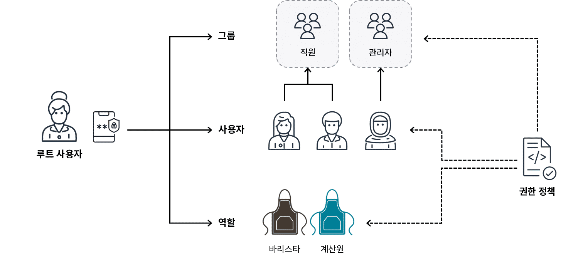
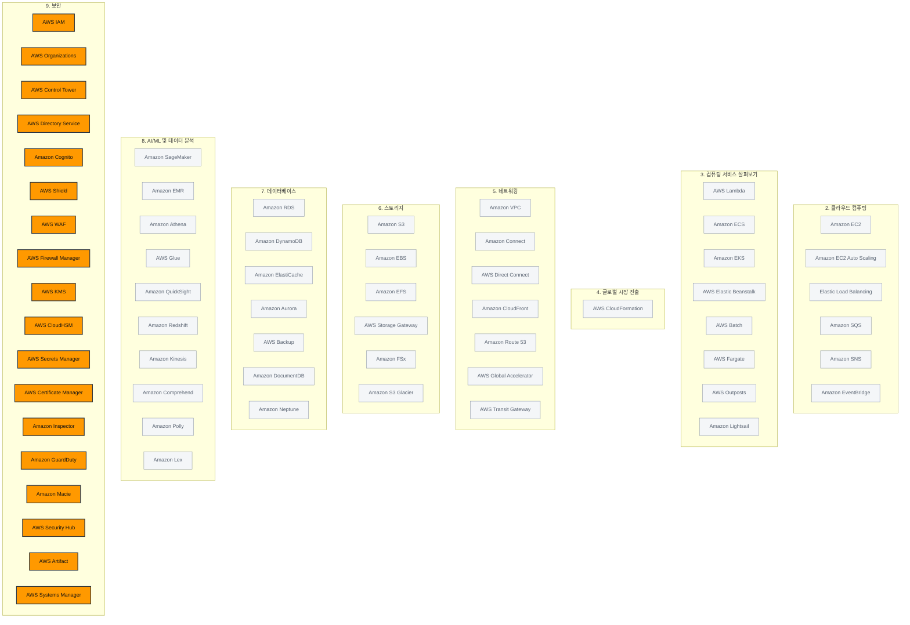

> 강의 6개 · 지식 점검 15문항 · 모듈 평가 10문항

---

## 1. 왜 필요한가

> 다 만들었다. 그런데 이거 안전한가? 누가 무엇을 책임지나?

앞의 여덟 모듈에서 서버를 띄우고, 네트워크를 깔고, 데이터를 저장하고, 분석까지 돌려 보았습니다.
이제 그 위에 마지막 질문이 하나 남습니다. **이 전부를 누가 열어 볼 수 있는가**입니다.

모듈 1에서 공동 책임 모델을 배우면서 "AWS는 클라우드의 보안, 고객은 클라우드 내부의 보안"이라는 경계선을 그어 두었습니다.
이번 모듈은 그 경계선에서 **고객 쪽에 남은 일**을 구체적인 도구로 바꿔 놓는 시간입니다.
누구에게 어떤 권한을 줄지(IAM), 공격을 어떻게 막을지(Shield·WAF), 데이터를 어떻게 잠글지(KMS·ACM),
그리고 이미 무슨 일이 벌어졌는지 어떻게 알아챌지(GuardDuty·Inspector·Macie)를 차례로 짚어 보겠습니다.

서비스 이름이 많이 나오지만 겁먹지 않으셔도 됩니다.
시험에서 요구하는 것은 각 서비스의 내부 동작이 아니라 **"이 문장이 나오면 이 서비스"** 라는 판별력 하나입니다.
그래서 이번 모듈은 표를 특히 많이 쓰겠습니다.

## 2. 이번에 새로 나오는 서비스

| 서비스 | 한 줄 | 이 모듈에서 맡는 역할 |
|---|---|---|
| [[aws-iam]] | AWS 리소스에 누가 무엇을 할 수 있는지 정한다 | 이번 모듈의 **중심축** |
| [[aws-organizations]] | 여러 AWS 계정을 하나의 조직으로 묶어 관리한다 | 계정이 여러 개일 때의 **상한선** |
| [[aws-control-tower]] | 다계정 환경을 모범 사례대로 자동 구성한다 | 조직을 **처음 세팅**할 때 |
| [[aws-directory-service]] | Microsoft Active Directory를 AWS에서 사용한다 | 사내 디렉터리 **연동** |
| [[amazon-cognito]] | 내가 만든 앱의 최종 사용자 로그인을 처리한다 | **앱 사용자**의 가입·로그인 |
| [[aws-shield]] | DDoS 공격을 막는다 | 네트워크 **볼륨 공격** 방어 |
| [[aws-waf]] | 웹 요청을 규칙으로 검사해 걸러낸다 | 애플리케이션 **요청 필터** |
| [[aws-firewall-manager]] | 여러 계정의 방화벽 규칙을 한 곳에서 관리한다 | 방화벽 규칙의 **중앙 관리** |
| [[aws-kms]] | 암호화 키를 만들고 관리한다 | **저장 시 암호화**의 기반 |
| [[aws-cloudhsm]] | 전용 하드웨어 보안 모듈에서 키를 직접 관리한다 | 규정이 **전용 하드웨어**를 요구할 때 |
| [[aws-secrets-manager]] | DB 암호·API 키 같은 비밀 값을 보관하고 교체한다 | 코드에 박아 둔 **비밀번호 제거** |
| [[aws-certificate-manager]] | SSL/TLS 인증서를 발급하고 갱신한다 | **전송 중 암호화** |
| [[amazon-inspector]] | EC2·Lambda·컨테이너의 취약점을 스캔한다 | **취약점 점검** |
| [[amazon-guardduty]] | 로그를 지속 분석해 위협 활동을 탐지한다 | **위협 탐지** |
| [[amazon-macie]] | S3에 민감 데이터가 있는지 찾아낸다 | **민감 데이터 발견** |
| [[aws-security-hub]] | 여러 보안 서비스의 결과를 한 화면에 모은다 | 보안 상태의 **종합 대시보드** |
| [[aws-artifact]] | AWS의 규정 준수 보고서와 계약서를 내려받는다 | 감사 대응 **문서 창구** |
| [[aws-systems-manager]] | 서버·노드를 대규모로 운영 관리한다 | 패치·구성 **운영 작업** |

> [!tip] 이번 모듈의 큰 그림
> **예방(IAM·Organizations)** → **보호(Shield·WAF·KMS·ACM)** → **탐지와 대응(GuardDuty·Inspector·Macie·Security Hub)**.
> 사고가 나기 전에 막고, 막을 수 없는 공격은 흡수하고, 그래도 벌어진 일은 빨리 알아채는 순서로 읽으시면 됩니다.

## 3. 강의 내용

---

### L1. 인증과 권한 부여 — 보안의 두 기둥

> **이번 강의에서 다룰 내용** — 인증과 권한 부여를 구분하고, 공동 책임 모델을 보안 관점에서 다시 짚어 보겠습니다.

#### 두 단어부터 정확히 갈라 두겠습니다

AWS 계정 보호는 **인증(Authentication)** 과 **권한 부여(Authorization)** 두 개념에서 출발합니다.
시험에서 이 둘을 바꿔 놓은 선택지가 반복해서 나오므로, 처음부터 확실히 갈라 두시기 바랍니다.

| | 인증 (Authentication) | 권한 부여 (Authorization) |
|---|---|---|
| 묻는 것 | **당신이 당신이 맞습니까?** | **그 작업을 해도 됩니까?** |
| 확인 대상 | 신원 | 권한 |
| 수단 | 사용자 이름·암호, MFA 토큰, 액세스 키 | 정책, 권한 설정 |
| 순서 | **먼저** 일어납니다 | 인증이 끝난 **뒤에** 일어납니다 |
| 문제 속 신호 | "로그인합니다", "자격 증명을 입력합니다" | "권한이 있는지 확인합니다", "이 작업을 허용합니다" |

직원 포털을 예로 들어 보겠습니다. 사원증을 찍고 건물에 들어가는 것이 **인증**입니다.
들어간 뒤에 자기 급여 명세서는 열리는데 남의 인사 기록은 열리지 않는 것이 **권한 부여**입니다.

#### 보안 작업을 세 박자로 나눠 보겠습니다

AWS의 보안 서비스는 전부 아래 세 칸 중 하나에 들어갑니다.
새 서비스를 만날 때마다 "이건 몇 번째 칸인가"를 붙여 두시면 나중에 헷갈리지 않습니다.

| 단계 | 하는 일 | 이 모듈의 대표 서비스 |
|---|---|---|
| **예방** | 애초에 잘못된 접근이 일어나지 않게 막습니다 | IAM, Organizations, IAM Identity Center |
| **보호** | 공격과 유출을 견디도록 방어선을 칩니다 | Shield, WAF, KMS, ACM, Secrets Manager |
| **탐지·대응** | 이미 벌어진 일을 빨리 찾아내고 조사합니다 | GuardDuty, Inspector, Macie, Detective, Security Hub |

#### 공동 책임 모델을 보안 관점에서 다시 보기

모듈 1에서 배운 경계선을 이번에는 **보안 항목**으로 채워 보겠습니다.

| 항목 | 누구 책임 | 왜 |
|---|---|---|
| 데이터 센터 출입 통제, 전원·냉각 | **AWS** | 물리 시설은 클라우드「의」 보안입니다 |
| 하이퍼바이저·가상화 계층 패치 | **AWS** | 고객이 손댈 수 없는 계층입니다 |
| 결함 하드웨어 교체 | **AWS** | 물리 자산 관리입니다 |
| S3·RDS에 저장한 데이터의 보호와 암호화 여부 | **고객** | 무엇을 올릴지 정한 사람이 고객입니다 |
| IAM 사용자·역할·정책 설정 | **고객** | 누구에게 권한을 줄지는 고객만 압니다 |
| 보안 그룹 규칙 구성 | **고객** | 어떤 트래픽을 받을지는 애플리케이션의 사정입니다 |
| 게스트 OS 패치 | **고객** | AWS는 고객 OS에 들어갈 키가 없습니다 |
| 게스트 OS 라우팅 테이블·영역(zone) 보안 설정 | **고객** | 내 네트워크를 어떻게 나눌지는 고객만 압니다 |
| **패치 관리 · 구성 관리 · 인식 및 교육** | **공유 제어(shared controls)** | 같은 항목을 **양쪽이 각자의 층에서** 수행합니다. AWS는 인프라를, 고객은 게스트 OS와 애플리케이션을 맡습니다 |

> [!tip] 한 줄 판별법
> 선택지에 **물리·하드웨어·데이터 센터·하이퍼바이저**가 보이면 AWS 책임입니다.
> **데이터·권한·구성·패치**가 보이면 고객 책임입니다.
> **패치 관리·구성 관리·인식 및 교육** 세 가지만은 어느 한쪽이 아니라 **공유 제어**라는 점을 따로 챙겨 두시기 바랍니다.

```quiz 지식 점검 · 인증·권한 부여와 공동 책임
Q. 고객이 사용자 이름과 암호로 온라인 뱅킹 프로필에 로그인한 뒤, 저축 예금에서 10,000 USD를 당좌 예금 계좌로 이체하려고 합니다. 시스템은 계속 진행하기 전에 이 고객에게 그만한 금액을 송금할 권한이 있는지 확인합니다. 이 예시는 어떤 유형의 확인에 해당합니까?
- 인증
+ 권한 부여
- 암호화
- 감사
> 로그인은 이미 끝난 상태이고, 시스템이 확인하는 것은 **"이 사람이 이 작업을 해도 되는가"** 입니다. 신원이 아니라 권한을 묻고 있으므로 권한 부여입니다. 앞선 아이디·암호 확인 단계가 인증이었다는 점과 나란히 기억해 두시기 바랍니다.

Q. 한 의료 회사가 민감한 환자 데이터를 처리할 웹 애플리케이션을 Amazon EC2 인스턴스에 배포하려 합니다. 이 애플리케이션은 Amazon RDS를 데이터베이스로, Amazon S3를 파일 스토리지로 사용합니다. 이 시나리오에서 **고객**의 보안 책임은 무엇입니까?
+ Amazon S3와 Amazon RDS에 저장된 민감한 환자 데이터를 보호합니다.
- EC2 인스턴스가 호스팅되는 데이터 센터의 물리적 보안을 지킵니다.
- Amazon EC2의 기반 하이퍼바이저 인프라를 유지 관리하고 패치합니다.
- EC2 인스턴스 가용성에 영향을 주는 결함 하드웨어 구성 요소를 교체합니다.
> **데이터는 언제나 고객 책임**입니다. 데이터 센터 출입 통제, 하이퍼바이저 패치, 하드웨어 교체는 모두 물리 인프라 쪽 일이라 AWS가 맡습니다. 선택지에서 "물리", "하드웨어", "하이퍼바이저"라는 단어를 먼저 찾아 걸러내시면 빠르게 답이 좁혀집니다.
```

---

### L2. AWS IAM — 누가 무엇을 할 수 있는가

> **이번 강의에서 다룰 내용** — 루트 사용자 보호, IAM 사용자·그룹·역할의 차이, 최소 권한의 원칙, 그리고 IAM 정책의 구조를 살펴보겠습니다.

#### 루트 사용자 — 가장 강하고 가장 위험한 계정

AWS 계정을 만들면 **AWS 계정 루트 사용자**가 함께 생깁니다.
계정의 소유자이고, 그 계정 안에서 **무엇이든** 할 수 있는 권한을 갖습니다.

커피숍으로 치면 사장님입니다. 계산대든 재고 시스템이든 금고든 제한 없이 열 수 있습니다.
편리해 보이지만, 바로 그 이유로 **일상 업무에는 절대 쓰지 않아야 하는 계정**입니다.

| 루트 사용자로 **해야 할 것** | 루트 사용자로 **하지 말아야 할 것** |
|---|---|
| 계정 생성 직후 **강력한 암호**를 설정합니다 | 일상적인 태스크에 로그인해서 사용합니다 |
| **MFA를 즉시 활성화**합니다 | 자격 증명을 다른 사람에게 위임하거나 공유합니다 |
| 관리자용 **IAM 사용자를 따로 만들어** 평소에는 그것을 씁니다 | 액세스 키를 만들어 애플리케이션에 넣습니다 |
| 계정 설정 변경, 지원 플랜 변경처럼 **루트만 가능한 작업**에만 사용합니다 | 이중화를 이유로 루트 사용자를 여러 개 만들려고 합니다 |

> [!warning] 시험에서 자주 나오는 두 가지 함정
> - **루트 사용자는 계정당 정확히 1명**입니다. 여러 개를 만들 수 없습니다.
> - **루트 사용자는 삭제할 수 없습니다.** "IAM 사용자를 만든 뒤 루트를 삭제한다"는 선택지는 언제나 오답입니다.

#### 다중 인증(MFA)

MFA는 로그인할 때 **서로 다른 종류의 확인 수단을 두 가지 이상** 요구하는 방식입니다.

| 요소 종류 | 예시 |
|---|---|
| 아는 것 | 암호, PIN |
| 가진 것 | 인증 앱의 일회용 토큰, 하드웨어 키 |
| 자신인 것 | 지문, 얼굴 |

암호가 유출되어도 **두 번째 요소가 없으면 로그인이 막힙니다.**
암호를 30일마다 바꾸는 것은 암호 정책일 뿐이고, VPN은 접속 경로를 보호할 뿐이라 둘 다 MFA가 아닙니다.

#### IAM 자격 증명 — 사용자·그룹·역할



```layers IAM 자격 증명이 계정 안에 어떻게 담기는지 보겠습니다.
AWS 계정 | 계정 하나에 루트 사용자는 정확히 1명입니다
  AWS 계정 루트 사용자 | 이메일로 로그인 · 모든 권한 · 삭제 불가 · MFA 필수
  IAM 그룹 — 「직원」 | 그룹에 붙인 정책을 소속 사용자 전원이 상속합니다
    IAM 사용자 — john_doe | 이름 + 자격 증명 · 처음에는 권한이 0입니다
    IAM 사용자 — jane_roe
  IAM 그룹 — 「관리자」 | 사람이 바뀌어도 그룹 구성만 바꾸면 됩니다
    IAM 사용자 — admin
  IAM 역할 — 「s3_read_only」 | 정적 자격 증명이 없고, 수임하는 동안만 유효합니다
```

| | **IAM 사용자** | **IAM 그룹** | **IAM 역할** |
|---|---|---|---|
| 무엇인가 | 사람 또는 애플리케이션 **한 개체** | 사용자를 묶은 **모음** | 임시로 **수임(assume)** 하는 자격 증명 |
| 자격 증명 | 사용자 이름·암호, 액세스 키 (**정적**) | 자체 자격 증명이 없습니다 | **임시** 자격 증명을 받습니다 |
| 로그인 가능 | 가능합니다 | 불가능합니다 | 로그인이 아니라 **수임**합니다 |
| 대표 용도 | 계정에 접근해야 하는 각 개인에게 하나씩 | 부서·직무별 권한을 **한 번에** 관리 | 서비스 간 접근, 크로스 계정, 연동 로그인 |
| 문제 속 신호 | "개인마다 고유한 자격 증명" | "**상속**", "모든 ○○에게 한 번에" | "**임시**", "일시적으로", "역할을 수임" |

**역할이 특히 유용한 경우**는 규모가 커질 때입니다.
회사 직원 전원에게 IAM 사용자를 하나씩 만드는 대신, 사내 자격 증명을 IAM 역할에 매핑해 두면
직원들은 **평소 쓰던 회사 계정으로 AWS에 로그인**할 수 있습니다.
이 연동을 설정하고 Single Sign-On 환경을 제공하는 서비스가 **AWS IAM Identity Center**입니다.

#### 최소 권한의 원칙

IAM은 **기본이 거부**입니다. 새로 만든 IAM 사용자는 EC2 인스턴스를 시작할 수도, S3 버킷을 만들 수도 없습니다.
할 수 있는 일을 **명시적으로 허용**해 주기 전까지는 아무것도 못 합니다.

여기에 얹는 원칙이 **최소 권한의 원칙(least privilege)** 입니다.

| 원칙 | 내용 |
|---|---|
| 기본 동작 | 명시적으로 허용하지 않은 것은 전부 **거부**됩니다 |
| 부여 기준 | 업무에 **꼭 필요한 만큼만** 부여합니다 |
| 확장 방식 | 부족하면 그때 **추가**합니다. 넉넉히 주고 나중에 줄이지 않습니다 |
| 문제 속 신호 | "필요한 경우에만", "꼭 필요한 권한만", "기본적으로 거부" |

#### IAM 정책 — 권한을 적어 두는 JSON 문서

권한을 실제로 정의하는 것은 **IAM 정책**입니다. 사용자·그룹·역할에 붙여서 효력을 냅니다.

```json
{
  "Effect": "Allow",
  "Action": "s3:ListBucket",
  "Resource": "arn:aws:s3:::coffee_shop_report"
}
```

| 요소 | 무엇을 적는가 | 가능한 값 |
|---|---|---|
| **Effect** | 허용인지 거부인지 | `Allow` 또는 `Deny`, **이 둘뿐입니다** |
| **Action** | 어떤 API 직접 호출인지 | `s3:ListBucket` 같은 AWS API 작업 |
| **Resource** | 어떤 리소스에 대해서인지 | 버킷·테이블 등의 ARN |

위 정책을 붙이면 그 사용자는 `coffee_shop_report` 버킷의 목록만 볼 수 있고, 계정에서 다른 작업은 하지 못합니다.

정책에는 두 종류가 있습니다.

| 종류 | 누가 만드나 | 언제 쓰나 |
|---|---|---|
| **AWS 관리형 정책** | AWS가 만들고 유지 관리합니다 | 일반적인 용도. 예: `ViewOnlyAccess`, `AmazonS3ReadOnlyAccess` |
| **고객 관리형 정책** | 고객이 직접 작성합니다 | 사용자 지정 제어가 필요한 특수한 요구 사항 |

> [!warning] 자격 증명과 정책을 섞지 마세요
> **사용자·그룹·역할은 「누구」** 이고, **정책은 「무엇을 할 수 있는지」** 입니다.
> 문제가 "권한을 **정의**하는 것"을 물으면 정책, "권한을 **상속**받는 단위"를 물으면 그룹, "**임시**로 받는 것"을 물으면 역할입니다.

```quiz 지식 점검 · IAM
Q. AWS 계정을 만든 관리자에게는 루트 사용자 자격 증명이 제공됩니다. 권한이 막강한 이 계정을 보호하려면 강력한 암호를 설정하고 다중 인증(MFA)을 켜야 합니다. MFA를 사용한다는 것은 무엇을 뜻합니까?
+ 액세스 권한을 얻기 위해 2가지 이상의 확인 방법을 제공합니다.
- 30일마다 암호를 변경합니다.
- 로그인할 때마다 가상 프라이빗 네트워크(VPN)를 사용합니다.
- 자격 증명 확인을 위해 신용 카드를 등록합니다.
> MFA의 M은 **다중(Multi)** 입니다. 아는 것(암호)에 더해 가진 것(인증 앱의 토큰)까지 **최소 두 가지**를 요구합니다. 암호를 주기적으로 바꾸는 것은 요소를 늘리는 것이 아니라 같은 요소를 갱신하는 일이고, VPN은 접속 경로를 감쌀 뿐 신원 확인 수단을 추가하지 않습니다.

Q. AWS Identity and Access Management(AWS IAM)는 사용자, 그룹, 역할, 정책을 제공합니다. 이 중 권한에 **임시로** 액세스하도록 특별히 고안된 것은 무엇입니까?
+ IAM 역할
- IAM 사용자
- IAM 그룹
- IAM 정책
> 역할은 사용자 이름·암호 같은 **정적 자격 증명이 없고**, 수임하는 동안에만 유효한 임시 자격 증명을 받습니다. 사용자와 그룹은 상시로 존재하는 자격 증명이고, 정책은 권한 내용을 적어 둔 문서라 그 자체로는 접근 수단이 아닙니다.

Q. 한 금융 서비스 회사가 회계사들에게 특정 Amazon S3 버킷에 대한 액세스 권한을 부여하려 합니다. 이 액세스 권한의 내용을 **정의**하는 데 사용하는 IAM 제어는 무엇입니까?
+ IAM 정책
- IAM 사용자
- IAM 그룹
- IAM 역할
> "어떤 리소스에 어떤 작업을 허용할지 **정의**한다"가 곧 정책의 정의입니다. 사용자·그룹·역할은 정책을 **붙이는 대상**일 뿐이고, 권한의 내용을 스스로 담고 있지는 않습니다.
```

---

### L3. 계정이 여러 개가 되면 — Organizations와 자격 증명 서비스

> **이번 강의에서 다룰 내용** — AWS Organizations와 SCP로 계정 전체에 상한선을 거는 방법, 그리고 자격 증명 관련 서비스들을 구분해 보겠습니다.

#### 계정 하나로는 부족해지는 순간

부서마다, 환경마다 계정을 나누는 것이 일반적인 모범 사례입니다.
개발 계정에서 실수가 나도 프로덕션 계정은 멀쩡하기 때문입니다.
문제는 계정이 20개가 되면 **각 계정 관리자가 무엇을 하는지 통제할 방법이 없어진다**는 점입니다.

여기서 **AWS Organizations**가 위에 한 겹을 씌웁니다.

```layers 계정이 늘어나면 조직 계층을 하나 더 올립니다.
AWS Organizations — 조직(Organization) | 관리 계정이 조직 전체를 관리합니다 · 통합 결제
  조직 단위(OU) — 「프로덕션」 | OU에 건 SCP는 하위 계정 전부에 내려갑니다
    프로덕션 계정
    재해 복구 계정
  조직 단위(OU) — 「개발」 | 환경별로 다른 상한선을 걸 수 있습니다
    개발 계정
    샌드박스 계정
```

| 개념 | 무엇인가 |
|---|---|
| **조직(Organization)** | 여러 AWS 계정을 묶은 최상위 단위입니다. **관리 계정**이 이 조직을 소유합니다 |
| **조직 단위(OU)** | 계정을 목적별로 묶는 폴더입니다. OU 안에 OU를 중첩할 수 있습니다 |
| **서비스 제어 정책(SCP)** | OU나 계정에 거는 **권한의 상한선**입니다 |
| **통합 결제** | 조직 전체의 사용량을 합산해 볼륨 할인을 받고 청구서를 한 장으로 받습니다 |

> [!warning] SCP는 권한을 「주지」 않습니다
> SCP는 **최대 한도를 정하는 울타리**일 뿐, 그 자체로 권한을 부여하지 않습니다.
> 실제 권한은 여전히 각 계정의 IAM 정책이 부여하고, **SCP와 IAM 정책이 모두 허용한 것만** 실행됩니다.
> 그래서 "계정 관리자가 임의로 풀 수 없는 제한"이라는 문장이 나오면 SCP입니다.

#### 자격 증명 관련 서비스 판별표

이름이 비슷해서 자주 섞이는 구간입니다. **누구를 위한 서비스인가**로 가르시면 됩니다.

| 서비스 | 누구를 다루나 | 문제 속 신호 |
|---|---|---|
| **AWS IAM** | AWS 리소스를 다루는 **내부 사용자·역할·애플리케이션** | "권한", "정책", "최소 권한", "역할 수임" |
| **AWS IAM Identity Center** | AWS 계정에 접근하는 **직원** | "**Single Sign-On**", "기존 자격 증명 소스를 연결", "여러 계정에 한 번 로그인" |
| **AWS Directory Service** | **Microsoft Active Directory**를 AWS에서 사용 | "Active Directory", "기존 AD 도메인 연결", "AD 통합 워크로드" |
| **Amazon Cognito** | 내가 만든 앱을 쓰는 **최종 사용자** | "**앱 사용자**의 가입·로그인", "소셜 로그인", "모바일 앱 사용자 수백만 명" |
| **AWS Organizations** | **계정** 자체 | "여러 계정", "OU", "통합 결제", "계정 전체에 제한" |
| **AWS Control Tower** | 다계정 환경의 **초기 구성과 가드레일** | "랜딩 존", "모범 사례대로 자동 설정", "새 계정을 표준대로 발급" |

```quiz 지식 점검 · Organizations와 자격 증명 서비스
Q. 한 기업이 부서별로 AWS 계정을 따로 운영하고 있습니다. 어떤 계정에서도 승인되지 않은 리전에서는 리소스를 만들지 못하도록, 각 계정의 관리자가 임의로 풀 수 없는 상한선을 걸어야 합니다. 무엇을 사용해야 합니까?
+ AWS Organizations의 서비스 제어 정책(SCP)
- 계정마다 IAM 그룹을 만들고 정책을 붙입니다
- 계정마다 IAM 역할을 만들어 사용 가능한 리전을 지정합니다
- 모든 계정의 루트 사용자 자격 증명을 보안 팀이 공유해서 관리합니다
> SCP는 OU나 계정에 걸리는 **권한의 상한선**이라, 계정 안의 IAM 관리자가 아무리 넓은 권한을 부여해도 그 선을 넘지 못합니다. 계정 안에서 IAM으로 거는 방식은 그 계정 관리자가 언제든 되돌릴 수 있어서 "풀 수 없는 제한"이 되지 못하고, 루트 자격 증명을 공유하는 것은 그 자체로 심각한 보안 위반입니다.

Q. 한 스타트업이 모바일 앱을 출시하면서 최종 사용자 수백만 명의 **가입·로그인과 소셜 로그인 연동**을 처리할 서비스를 찾고 있습니다. 어떤 서비스를 사용해야 합니까?
+ Amazon Cognito
- AWS Identity and Access Management(AWS IAM)
- AWS Directory Service
- AWS IAM Identity Center
> Cognito는 **내가 만든 애플리케이션의 최종 사용자**를 위한 자격 증명 서비스입니다. IAM은 AWS 리소스를 다루는 내부 인력과 시스템용이고, Directory Service는 Microsoft Active Directory를 AWS에서 쓰기 위한 서비스이며, IAM Identity Center는 **직원**에게 AWS 계정 SSO를 제공합니다. "앱 사용자"인지 "직원"인지가 갈리는 지점입니다.
```

---

### L4. 네트워크와 애플리케이션 보호 — DDoS 막기

> **이번 강의에서 다룰 내용** — DDoS 공격의 원리, AWS 인프라가 자동으로 흡수하는 부분, 그리고 Shield와 WAF의 역할을 살펴보겠습니다.

#### DoS와 DDoS

정상적인 상황에서 애플리케이션은 요청을 받아 결과를 돌려줍니다.
**서비스 거부(DoS)** 공격은 애플리케이션에 감당 못 할 부하를 걸어, 정상 고객의 요청까지 거부하게 만드는 공격입니다.

| | **DoS** | **DDoS** |
|---|---|---|
| 공격 출발지 | **한 대**의 시스템 | 감염된 **여러 대**(좀비 봇 무리) |
| 위력 | 상대적으로 약합니다 | 차단이 어렵고 규모가 큽니다 |
| 핵심 단어 | — | **분산(Distributed)** = 출발지가 여럿 |

> [!warning] "분산"은 표적이 여럿이라는 뜻이 아닙니다
> DDoS의 D는 **공격을 보내는 쪽**이 흩어져 있다는 뜻입니다. 표적은 보통 하나입니다.
> "여러 웹 사이트를 동시에 표적으로 삼는다"는 설명은 매번 나오는 오답 선택지입니다.

**UDP Flood**가 전형적인 예입니다. 공격자가 기상 정보 서비스 같은 공개 서비스에
"일기 예보를 알려 달라"는 작은 요청을 보내면서 **반환 주소를 표적의 주소로 위조**합니다.
그러면 표적 서버는 요청한 적도 없는 대용량 예보 데이터를 뒤집어쓰고, 그것을 분류하는 것만으로도 멈춰 버립니다.

#### AWS 인프라가 기본으로 흡수하는 부분

| 구성 요소 | 어떻게 막나 |
|---|---|
| **보안 그룹** | 허용한 프로토콜·포트의 트래픽만 통과시킵니다. UDP Flood처럼 목록에 없는 프로토콜은 서버에 닿지 못합니다 |
| **AWS 네트워크 수준 동작** | 보안 그룹은 EC2 인스턴스가 아니라 **AWS 네트워크 계층**에서 작동합니다. 그래서 공격은 인스턴스 한 대의 용량이 아니라 **리전 전체 용량**과 부딪힙니다 |
| **Elastic Load Balancing** | 진입점을 인스턴스 앞으로 옮기고 트래픽을 분산해, 프론트엔드 한 대가 무너지는 상황을 막습니다 |
| **글로벌 인프라** | 여러 리전·AZ·엣지 로케이션에 분산되어 있어 한 지점에 과부하를 몰기 어렵습니다 |

#### 전용 방어 서비스

| 서비스 | 무엇을 막나 | 요금 | 문제 속 신호 |
|---|---|---|---|
| **AWS Shield Standard** | 가장 흔한 네트워크·전송 계층 DDoS 공격 | **모든 고객에게 추가 비용 없이 자동 적용** | "추가 비용 없이", "자동으로 보호", "일반적인 DDoS" |
| **AWS Shield Advanced** | 정교한 대규모 DDoS. 상세한 공격 진단과 대응 팀 지원을 제공합니다 | **유료** | "정교한 공격", "상세 진단", "전문가 지원" |
| **AWS WAF** | **웹 요청**을 규칙으로 검사해 SQL 삽입·크로스 사이트 스크립팅·악성 IP 등을 차단합니다 | 유료 | "웹 ACL", "요청 필터링", "특정 IP 차단", "애플리케이션 계층" |
| **AWS Firewall Manager** | 여러 계정·리소스의 **방화벽 규칙을 한 곳에서** 배포하고 관리합니다 | 유료 | "여러 계정에 규칙을 일괄", "중앙에서 방화벽 관리" |

> [!warning] Shield와 WAF는 층이 다릅니다
> - **Shield** — 트래픽 **양**으로 밀어붙이는 공격을 막습니다. 네트워크 계층입니다.
> - **WAF** — 요청 **내용**을 들여다보고 규칙에 걸리는 것을 거릅니다. 애플리케이션 계층입니다.
>
> "웹 요청을 필터링한다", "웹 ACL"이라는 표현이 보이면 WAF, "DDoS"라는 단어가 보이면 Shield입니다.
> 실무에서는 둘을 함께 사용합니다.

```quiz 지식 점검 · 네트워크·애플리케이션 보호
Q. 서비스 거부(DoS) 공격에서 공격자는 웹 애플리케이션에 과도한 네트워크 트래픽을 보냅니다. 애플리케이션에 과부하가 걸려 응답할 수 없게 되면 정상적인 고객 요청도 거부됩니다. 이 공격이 **분산 서비스 거부(DDoS)** 공격과 다른 점은 무엇입니까?
+ DDoS 공격은 손상된 여러 대의 컴퓨터와 장치를 사용하여 공격을 시작합니다.
- DDoS 공격은 네트워크 리소스에 과부하를 유발하는 대신 최종 사용자에게 맬웨어를 배포합니다.
- DDoS 공격은 들어오는 트래픽을 여러 서버에 분산하여 서비스 중단을 방지합니다.
- DDoS 공격은 단일 대상에 집중하는 대신 여러 웹 사이트를 동시에 표적으로 삼습니다.
> **분산(Distributed)** 은 공격의 **출발지**가 여러 곳이라는 뜻이지 표적이 여럿이라는 뜻이 아닙니다. 공격자는 감염시킨 좀비 봇 무리를 동원해 한 대상에 동시에 부하를 겁니다. 트래픽을 분산해 중단을 막는 것은 로드 밸런서가 하는 일이라 공격에 대한 설명이 될 수 없고, 맬웨어 배포는 DDoS와 다른 종류의 공격입니다.

Q. 한 온라인 상점이 최근 표적 분산 서비스 거부(DDoS) 공격을 여러 차례 받았습니다. 이 상점이 AWS에서 웹 애플리케이션을 DDoS 공격으로부터 보호하는 데 사용할 수 있는 구성 요소는 무엇입니까? (2개 선택)
+ 보안 그룹
+ Elastic Load Balancing(ELB)
- Auto Scaling 그룹
- 컴퓨팅 인스턴스
- 퍼블릭 서브넷
> 보안 그룹은 허용한 프로토콜·포트만 통과시켜 UDP Flood 같은 공격을 애초에 걸러 내고, ELB는 진입점을 인스턴스 앞으로 옮겨 트래픽을 분산합니다. 둘 다 **AWS 네트워크 수준**에서 동작하므로 개별 인스턴스 용량이 아니라 리전 전체 용량으로 공격을 흡수합니다. Auto Scaling은 공격 트래픽에 맞춰 대수만 늘려 비용을 키울 수 있고, 인스턴스와 서브넷은 보호 수단이 아니라 보호 대상입니다.
```

---

### L5. 데이터 보호 — 암호화와 키 관리

> **이번 강의에서 다룰 내용** — 저장 시 암호화와 전송 중 암호화를 구분하고, KMS·CloudHSM·Secrets Manager·ACM의 역할을 나눠 보겠습니다.

#### 암호화는 자물쇠와 열쇠입니다

암호화는 데이터를 **맞는 키가 있어야만 읽을 수 있는 형태**로 바꿔 두는 것입니다.
키가 없으면 데이터를 손에 넣어도 의미 없는 문자열만 보게 됩니다.
그래서 실수로 접근 권한을 넓게 열어 두더라도 피해가 한 단계 줄어듭니다.

암호화는 **데이터가 어디에 있느냐**에 따라 두 종류로 나뉩니다.

| | **저장 시 암호화 (at rest)** | **전송 중 암호화 (in transit)** |
|---|---|---|
| 데이터 상태 | 디스크에 **가만히** 있습니다 | 네트워크를 **이동 중**입니다 |
| 대표 수단 | AWS KMS의 암호화 키 | **SSL/TLS** 인증서 |
| 대표 서비스 | S3, EBS, DynamoDB, RDS | **AWS Certificate Manager(ACM)** |
| 문제 속 신호 | "저장된 데이터", "버킷에 보관", "볼륨 암호화" | "이동 중", "전송 중", "HTTPS", "한 서비스에서 다른 서비스로" |

#### AWS 스토리지에 이미 들어 있는 보호

| 서비스 | 기본 동작 |
|---|---|
| **Amazon S3** | 모든 새 버킷에 암호화가 구성되어 있고, 업로드되는 모든 새 객체는 **저장 시 자동으로 암호화**됩니다 |
| **Amazon EBS** | 볼륨과 스냅샷을 저장 시 암호화할 수 있습니다. 부팅 볼륨과 데이터 볼륨 모두 가능합니다 |
| **Amazon DynamoDB** | KMS에 저장된 키를 사용해 **모든 테이블 데이터**에 서버 측 저장 시 암호화가 적용됩니다 |

#### 키를 관리하는 두 가지 방법 — KMS와 CloudHSM

| | **AWS KMS** | **AWS CloudHSM** |
|---|---|---|
| 형태 | AWS **관리형** 키 관리 서비스 | 고객 **전용 하드웨어 보안 모듈(HSM)** |
| 하드웨어 | AWS와 공유하는 관리형 인프라 | **단독 사용 전용 장비** |
| 키 통제 | AWS가 운영하고, 키는 **KMS 밖으로 나가지 않습니다** | AWS도 접근할 수 없고 **고객이 전적으로 관리**합니다 |
| 다른 서비스 연동 | 대다수 AWS 서비스와 **기본 통합**됩니다 | 통합 범위가 좁고 직접 구성해야 합니다 |
| 운영 부담 | 낮습니다 | 높습니다. 키를 잃으면 복구할 수 없습니다 |
| 문제 속 신호 | "**키를 생성하고 관리**", "중앙 집중식 키 관리", "AWS 서비스와 통합" | "**전용 하드웨어**", "FIPS 140 레벨 3", "AWS조차 접근 불가", "규정이 HSM을 요구" |

KMS에서는 어떤 IAM 사용자와 역할이 키를 관리할 수 있는지 지정할 수 있고, 키를 비활성화해서 더 이상 쓰지 못하게 만들 수도 있습니다.
**키가 KMS 밖으로 나가지 않는다**는 점이 중요합니다. 키를 다루는 작업은 전부 KMS 안에서 일어납니다.

#### 비밀 값과 인증서

| 서비스 | 무엇을 보관·관리하나 | 문제 속 신호 |
|---|---|---|
| **AWS Secrets Manager** | 데이터베이스 자격 증명, **API 키**, 토큰 같은 비밀 값. **자동 교체(rotation)** 를 지원합니다 | "DB 암호를 코드에서 빼고 싶다", "API 키 중앙 관리", "자격 증명 자동 교체" |
| **AWS Certificate Manager(ACM)** | **SSL/TLS 인증서**의 발급·배포·갱신 | "전송 중 암호화", "HTTPS", "인증서 만료 관리" |
| **AWS KMS** | **암호화 키** | "키를 생성하고 관리" |

> [!warning] 셋이 다루는 대상이 각각 다릅니다
> - **KMS** — 암호화 **키**
> - **Secrets Manager** — 암호·API 키 같은 **비밀 문자열**
> - **ACM** — SSL/TLS **인증서**
>
> "키"라는 단어만 보고 반사적으로 KMS를 고르지 마시고, **암호화용 키인지 애플리케이션이 쓰는 API 키인지**를 확인하시기 바랍니다.

```quiz 지식 점검 · 데이터 보호
Q. 인증된 사용자만 액세스할 수 있도록 특수한 키를 사용하여 데이터를 잠그고 다시 여는 프로세스를 무엇이라고 합니까?
+ 암호화 및 암호 해독
- 토큰화 및 마스킹
- 인증 및 권한 부여
- 해싱 및 솔팅
> **키로 잠그고 같은 키로 연다**는 설명이 곧 암호화와 복호화입니다. 해싱은 원래 값으로 되돌릴 수 없다는 점에서 다르고, 토큰화·마스킹은 값을 대체하거나 가려서 보여 주는 기법이며, 인증·권한 부여는 데이터가 아니라 사람을 다룹니다.

Q. 한 세무회계 회사가 민감한 고객 데이터를 데이터베이스에서 AWS 기반 웹 애플리케이션으로 옮기려 하며, 이동하는 동안에도 데이터를 보호해야 합니다. **전송 중** 데이터를 보호하는 데 도움이 되는 서비스는 무엇입니까?
+ AWS Certificate Manager(ACM)
- Amazon S3
- Amazon DynamoDB
- Amazon Macie
> "이동하는 동안"이 곧 **전송 중 암호화**이고, 이를 담당하는 것이 SSL/TLS입니다. ACM이 그 인증서를 발급하고 자동으로 갱신해 줍니다. S3와 DynamoDB는 저장 시 암호화를 제공하는 스토리지·데이터베이스이고, Macie는 이미 S3에 저장된 데이터에서 민감 정보를 찾아내는 서비스라 이동 중인 데이터와는 관계가 없습니다.

Q. 한 소프트웨어 개발 팀이 AWS에서 데이터베이스 자격 증명과 API 키를 중앙에서 관리하고 주기적으로 교체하려 합니다. 어떤 서비스를 선택해야 합니까?
+ AWS Secrets Manager
- AWS Identity and Access Management(AWS IAM)
- AWS IAM Identity Center
- AWS Systems Manager
> **자격 증명과 API 키 같은 비밀 값의 보관과 자동 교체**는 Secrets Manager의 전담 영역입니다. IAM은 AWS 리소스에 대한 접근 권한을 다루지 애플리케이션이 쓰는 DB 암호를 보관하지 않고, IAM Identity Center는 직원 Single Sign-On, Systems Manager는 서버와 노드를 운영 관리하는 도구입니다.
```

---

### L6. 탐지와 대응 — 이미 벌어진 일을 찾아내기

> **이번 강의에서 다룰 내용** — GuardDuty·Inspector·Macie·Detective·Security Hub의 역할을 구분하고, 규정 준수 문서를 어디서 받는지 확인해 보겠습니다.

#### 막는 것만으로는 부족합니다

취약점이 존재하는지 몰라서 사고가 나는 경우가 있습니다.
그래서 예방과 보호에 더해 **탐지와 대응** 능력이 필요합니다.
이 구간의 서비스들은 이름이 비슷해 보이지만 **보는 대상이 전부 다릅니다.**

| 서비스 | 무엇을 보나 | 언제 쓰나 | 문제 속 신호 |
|---|---|---|---|
| **Amazon Inspector** | **EC2 인스턴스·Lambda 함수·컨테이너 이미지**의 소프트웨어 | 배포한 것에 알려진 취약점이나 모범 사례 위반이 있는지 점검할 때 | "**취약성 스캔**", "보안 모범 사례 위반", "EC2·Lambda·컨테이너 평가", "CVE" |
| **Amazon GuardDuty** | **계정 메타데이터와 네트워크 활동 로그** | 지금 수상한 활동이 벌어지고 있는지 지속 감시할 때 | "**지속적으로 모니터링**", "위협 탐지", "악성 IP", "비정상 활동", "기계 학습으로 이상 탐지" |
| **Amazon Macie** | **Amazon S3에 저장된 데이터의 내용** | 민감한 개인 정보가 S3에 섞여 있는지 찾아낼 때 | "**S3**", "민감한 데이터 발견", "개인 식별 정보(PII)", "신용 카드 번호가 있는지" |
| **Amazon Detective** | 이미 탐지된 사건의 **로그 전반** | 근본 원인을 파고들어 조사할 때 | "**근본 원인 조사**", "대화형 시각화", "시간 흐름에 따라 분석" |
| **AWS Security Hub** | 위 서비스들이 만들어 낸 **결과들** | 보안·규정 준수 상태를 한 화면에서 볼 때 | "**집계**", "종합적인 보기", "여러 서비스의 결과를 한곳에", "인사이트" |

> [!warning] GuardDuty · Inspector · Macie가 갈리는 지점
> 세 서비스는 시험에서 가장 자주 바꿔치기되는 조합입니다. **무엇을 들여다보는가**로 가르시면 한 번에 정리됩니다.
> - **Inspector** — **소프트웨어의 약한 곳**을 봅니다. 아직 공격당하지 않았어도 "패치 안 된 버전이 깔려 있다"를 찾아냅니다. → **취약점 스캔**
> - **GuardDuty** — **행위**를 봅니다. 로그를 계속 읽으면서 "지금 이상한 IP와 통신하고 있다"를 찾아냅니다. → **위협 탐지**
> - **Macie** — **데이터의 내용물**을 봅니다. "이 S3 버킷에 주민등록번호가 들어 있다"를 찾아냅니다. → **민감 데이터 발견**
>
> 한 문장으로 줄이면, **Inspector는 구멍, GuardDuty는 침입자, Macie는 보물**을 찾습니다.

#### 규정 준수 문서는 AWS Artifact에서 받습니다

감사에 대응하려면 AWS 자체의 인증서와 감사 보고서가 필요할 때가 있습니다.
SOC 보고서, PCI 규정 준수 문서, ISO 인증서 같은 것들입니다.

| 서비스 | 하는 일 | 문제 속 신호 |
|---|---|---|
| **AWS Artifact** | AWS의 **규정 준수 보고서와 계약서**를 온디맨드로 내려받습니다 | "**감사 보고서**", "SOC", "PCI", "ISO 인증서", "규정 준수 문서가 필요" |
| **AWS Security Hub** | 내 환경의 보안 결과를 규정 준수 표준에 대조해 보여 줍니다 | "내 리소스가 표준을 지키고 있는지" |

> [!info] Artifact와 Security Hub를 헷갈리지 마세요
> **Artifact는 AWS가 받은 인증서**를 가져오는 곳이고, **Security Hub는 내 계정의 상태**를 보여 주는 곳입니다.
> "AWS의 감사 보고서를 받아야 한다"면 Artifact입니다.

#### 이번 모듈 보안 서비스 판별표

시험 직전에 이 표 하나만 다시 훑으시면 됩니다.

| 서비스 | 한 줄 정의 | 문제 속 신호 |
|---|---|---|
| **AWS IAM** | 계정 안에서 누가 무엇을 할 수 있는지 정합니다 | "권한", "정책", "최소 권한", "역할 수임" |
| **AWS IAM Identity Center** | 직원에게 여러 AWS 계정 SSO를 제공합니다 | "Single Sign-On", "기존 자격 증명 소스 연결" |
| **AWS Organizations** | 여러 계정을 조직·OU로 묶고 SCP로 상한선을 겁니다 | "여러 계정", "OU", "통합 결제", "계정 관리자가 풀 수 없는 제한" |
| **AWS Control Tower** | 다계정 환경을 모범 사례대로 자동 구성합니다 | "랜딩 존", "새 계정을 표준대로 발급" |
| **AWS Directory Service** | Microsoft Active Directory를 AWS에서 사용합니다 | "Active Directory", "기존 AD 도메인" |
| **Amazon Cognito** | 내 앱의 최종 사용자 가입·로그인을 처리합니다 | "앱 사용자", "소셜 로그인", "모바일 앱 회원" |
| **AWS Shield** | DDoS 공격을 막습니다 | "DDoS", "추가 비용 없이 자동"(Standard), "정교한 공격·상세 진단"(Advanced) |
| **AWS WAF** | 웹 요청을 규칙으로 검사해 차단합니다 | "웹 ACL", "요청 필터링", "SQL 삽입", "IP 차단" |
| **AWS Firewall Manager** | 여러 계정의 방화벽 규칙을 중앙에서 관리합니다 | "여러 계정에 규칙 일괄 적용" |
| **AWS KMS** | 암호화 키를 만들고 관리합니다 | "키 생성·관리", "중앙 집중식 키 관리" |
| **AWS CloudHSM** | 전용 하드웨어에서 키를 고객이 직접 관리합니다 | "전용 하드웨어", "AWS도 접근 불가" |
| **AWS Secrets Manager** | 비밀 값을 보관하고 자동 교체합니다 | "DB 자격 증명", "API 키", "자동 교체" |
| **AWS Certificate Manager** | SSL/TLS 인증서를 발급·갱신합니다 | "전송 중 암호화", "HTTPS", "인증서" |
| **Amazon Inspector** | 소프트웨어 취약점을 스캔합니다 | "취약성", "모범 사례 위반", "EC2·Lambda·컨테이너 평가" |
| **Amazon GuardDuty** | 로그를 분석해 위협 활동을 탐지합니다 | "지속 모니터링", "위협 탐지", "악성 IP", "이상 활동" |
| **Amazon Macie** | S3의 민감 데이터를 찾아냅니다 | "S3", "민감 데이터", "개인 식별 정보" |
| **Amazon Detective** | 탐지된 사건의 근본 원인을 시각화해 조사합니다 | "근본 원인", "대화형 시각화" |
| **AWS Security Hub** | 보안 결과를 집계해 한 화면에 보여 줍니다 | "집계", "종합적인 보기", "인사이트" |
| **AWS Artifact** | AWS의 규정 준수 보고서를 내려받습니다 | "감사 보고서", "SOC", "PCI", "ISO" |

```quiz 지식 점검 · 탐지와 대응
Q. 한 법률 회사의 보안 팀이 자사 AWS 환경에서 위협을 탐지했습니다. 시간 흐름에 따른 근본 원인을 조사하기 위해 보안 데이터를 대화형으로 시각화해 볼 수 있어야 합니다. 이 조사에 가장 적합한 AWS 서비스는 무엇입니까?
+ Amazon Detective
- Amazon Inspector
- Amazon GuardDuty
- AWS Security Hub
> 이미 **탐지가 끝난 뒤**에 "왜 이런 일이 생겼는지"를 파고드는 단계이고, **대화형 시각화**라는 표현이 Detective를 정확히 가리킵니다. GuardDuty는 위협을 찾아내는 앞 단계, Inspector는 취약점을 스캔하는 서비스, Security Hub는 결과를 모아 보여 주는 대시보드라 조사 도구가 아닙니다.

Q. 한 지방 정부 기관이 다가오는 규정 준수 감사를 준비하고 있습니다. 여러 AWS 서비스에서 나온 보안 결과를 하나의 종합적인 화면으로 자동 집계해야 합니다. 이 기관이 선택해야 하는 서비스는 무엇입니까?
+ AWS Security Hub
- Amazon Inspector
- Amazon GuardDuty
- Amazon Detective
> **여러 서비스의 결과를 한 화면에 모은다**가 Security Hub의 정의입니다. 나머지 셋은 각자 자기 결과를 만들어 내는 쪽이고, 그 결과들이 흘러 들어가는 종착지가 Security Hub입니다.

Q. 한 회사가 Amazon S3에 고객 파일을 대량으로 보관하고 있습니다. 그중에 주민등록번호나 신용 카드 번호 같은 개인 정보가 섞여 있는지 자동으로 찾아내야 합니다. 어떤 서비스를 사용해야 합니까?
+ Amazon Macie
- Amazon GuardDuty
- Amazon Inspector
- AWS Key Management Service(AWS KMS)
> **S3 + 민감 데이터 발견**이면 Macie입니다. GuardDuty는 계정과 네트워크 활동에서 위협 행위를 찾고, Inspector는 EC2·Lambda·컨테이너의 소프트웨어 취약점을 스캔하며, KMS는 암호화 키를 관리할 뿐 데이터 내용을 들여다보지 않습니다.
```

---

## 4. 모듈 평가

```exam
Q. 한 직원이 회사의 온라인 직원 포털에서 연차가 얼마나 쌓였는지 확인하려 합니다. 이 직원은 개인 기록에 액세스하기 전에 사용자 이름과 암호를 입력하여 사이트에 로그인합니다. 이 로그인 과정에서 일어나는 일은 무엇입니까?
+ 인증
- 권한 부여
- 탐지
- 암호화
> 사용자 이름과 암호로 **"이 사람이 본인이 맞는가"** 를 확인하는 단계이므로 인증입니다. 권한 부여는 로그인이 끝난 뒤 **"이 사람이 무엇을 할 수 있는가"** 를 판정하는 단계라, 이 문제에서는 개인 기록을 실제로 열어 볼 때 작동합니다. 로그인 화면에서 자격 증명을 입력하는 장면이 나오면 인증이라고 보시면 됩니다.

Q. AWS 공동 책임 모델에서 AWS가 책임지는 항목은 무엇입니까?
+ 데이터 센터의 물리적 보안 관리
- 저장된 고객 데이터 암호화
- Amazon EC2 인스턴스에 대한 보안 그룹 구성
- AWS Identity and Access Management(AWS IAM) 역할 및 정책 설정
> AWS는 **클라우드「의」 보안**, 즉 데이터 센터·하드웨어·네트워크 같은 물리 인프라를 책임집니다. 데이터를 암호화할지 말지, 보안 그룹에 어떤 규칙을 넣을지, IAM 역할과 정책을 어떻게 구성할지는 전부 **클라우드「내부의」 보안**이라 고객이 직접 설정하고 관리해야 합니다.

Q. AWS Identity and Access Management(AWS IAM)를 사용할 경우 기본적으로 모든 작업이 거부됩니다. 권한을 부여할 때에도 꼭 필요한 경우에만 액세스 권한을 제공해야 합니다. 이러한 개념을 무엇이라고 합니까?
+ 최소 권한의 원칙
- 기본 거부 정책
- 역할 기반 액세스 제어
- 권한 경계 프레임워크
> "필요한 만큼만 준다"가 곧 **최소 권한의 원칙**입니다. 기본이 거부라는 것은 IAM의 동작 방식을 설명하는 말이지 이 원칙의 이름이 아니고, 역할 기반 액세스 제어는 권한을 역할 단위로 묶어 배분하는 구현 방식을 가리킵니다.

Q. 모든 AWS 계정에는 AWS 계정 루트 사용자가 제공됩니다. 루트 사용자는 계정 소유자이며 모든 작업을 수행할 수 있는 전체 권한을 갖습니다. 이 강력한 계정을 보호할 수 있는 방법은 무엇입니까? (2개 선택)
+ 계정에 강력한 암호를 연결합니다.
+ 다중 인증(MFA)을 켭니다.
- 이중화를 위해 여러 개의 루트 사용자를 생성합니다.
- AWS Identity and Access Management(AWS IAM) 사용자를 설정한 후 루트 사용자를 삭제합니다.
- 루트 사용자 액세스를 다른 사용자에게 위임합니다.
> 루트 사용자 보호의 기본은 **강력한 암호 + MFA** 두 가지입니다. AWS 계정에는 루트 사용자가 **정확히 1명**만 존재하므로 여러 개를 만들 수 없고, **삭제할 수도 없습니다.** 루트 자격 증명을 다른 사람에게 넘기는 것은 보호가 아니라 정확히 그 반대 방향의 조치입니다.

Q. 한 대형 마케팅 회사에서는 디자이너에게 특정 Amazon S3 버킷에 대한 액세스 권한을 부여하는 표준 권한 세트를 갖고 있습니다. 이번에 모든 디자이너가 액세스해야 하는 새 S3 버킷을 추가했습니다. 모든 디자이너에게 한 번에 상속될 권한을 할당하는 데 사용할 수 있는 AWS Identity and Access Management(AWS IAM) 제어는 무엇입니까?
+ IAM 그룹
- IAM 사용자
- IAM 역할
- IAM 정책
> 키워드는 **상속**입니다. 여러 사람을 하나로 묶어 두고 한 번의 변경으로 전원에게 반영하는 자격 증명은 그룹뿐입니다. 정책은 권한을 적어 둔 문서라 어딘가에 붙여야 효력이 생기고, 이 상황에서 붙일 대상이 바로 그룹입니다. 역할은 임시 수임용이고, 사용자는 개인 한 명이라 "모든 디자이너"를 한꺼번에 처리하지 못합니다.

Q. 한 기술 회사에서 리소스 중 일부를 AWS로 이전하려 합니다. 그리고 이 회사는 기존에 사용하던 자격 증명 소스를 그대로 활용하여 직원들에게 Single Sign-On 액세스를 제공하고자 합니다. 이 목표를 달성하는 데 도움이 되는 서비스는 무엇입니까?
+ AWS IAM Identity Center
- AWS Identity and Access Management(AWS IAM)
- AWS Secrets Manager
- AWS Systems Manager
> **Single Sign-On**과 **기존 자격 증명 소스 연결**이 함께 나오면 IAM Identity Center입니다. IAM 자체는 계정 안의 사용자·그룹·역할·정책을 다루는 서비스이고, Secrets Manager는 DB 암호나 API 키 같은 비밀 값을 보관하며, Systems Manager는 서버와 노드를 대규모로 운영 관리하는 도구입니다.

Q. 한 소규모 금융 서비스 회사에서 최근에 온라인 리소스를 AWS로 이전했습니다. 보안 팀은 자주 발생하는 일반적인 유형의 분산 서비스 거부(DDoS) 공격으로부터 보호하는 문제를 우려하고 있습니다. 추가 비용 없이 DDoS 공격으로부터 고객을 자동으로 보호하는 AWS 서비스는 무엇입니까?
+ AWS Shield
- AWS Identity and Access Management(AWS IAM)
- AWS Systems Manager
- Amazon Macie
> **DDoS + 추가 비용 없이 자동**이라는 조합은 AWS Shield Standard를 가리킵니다. 모든 AWS 고객에게 기본으로 적용되어 있습니다. IAM은 접근 권한 관리, Systems Manager는 노드 운영 관리, Macie는 S3의 민감 데이터 발견 서비스라 모두 DDoS와 무관합니다.

Q. 민감한 고객 데이터를 보호하는 것은 고객 신뢰 유지의 핵심 요소이며, 여기에는 저장된 데이터와 전송 중인 데이터를 모두 암호화하는 작업이 포함됩니다. **전송 중인** 데이터를 암호화하는 데 사용되는 것은 무엇입니까?
+ SSL/TLS 인증서
- 다중 인증(MFA)
- 강력한 암호
- 암호화 키
> 전송 중 암호화는 **SSL/TLS**가 담당하고, 그 인증서를 AWS에서 발급하고 갱신해 주는 서비스가 AWS Certificate Manager입니다. MFA와 강력한 암호는 로그인 단계의 인증 수단이라 데이터 자체를 암호화하지 않습니다. 암호화 키는 KMS가 관리하는 **저장 시** 암호화 쪽 개념이라, 전송 중을 묻는 이 문제에서는 한 단계 어긋납니다.

Q. 한 대규모 전자 상거래 회사의 보안 팀은 AWS에서 데이터를 보호하는 **암호화 키를 생성하고 관리**할 수 있는 중앙 집중식 방법이 필요합니다. 이 팀에 가장 적합한 서비스는 무엇입니까?
+ AWS Key Management Service(AWS KMS)
- AWS WAF
- Amazon Macie
- AWS Certificate Manager(ACM)
> **키를 생성하고 관리한다**는 문구가 그대로 KMS의 정의입니다. WAF는 웹 요청을 규칙으로 걸러 내는 방화벽, Macie는 S3의 민감 데이터를 찾아내는 서비스이고, ACM은 키가 아니라 **SSL/TLS 인증서**를 관리한다는 점에서 갈립니다.

Q. 한 대규모 소프트웨어 개발 회사의 보안 팀은 여러 애플리케이션에 보안 취약성이 있는지, 그리고 보안 모범 사례에서 벗어난 부분이 있는지 확인해야 합니다. 이러한 애플리케이션은 Amazon EC2, AWS Lambda, 컨테이너에서 실행됩니다. 보안 평가를 위해 어떤 AWS 서비스를 선택해야 합니까?
+ Amazon Inspector
- Amazon Detective
- Amazon GuardDuty
- AWS Security Hub
> **취약성 점검**과 **모범 사례 위반 확인**은 Inspector의 정의 그대로이고, "EC2·Lambda·컨테이너"라는 대상 목록도 Inspector의 스캔 범위와 일치합니다. GuardDuty는 지금 벌어지는 위협 활동을 로그로 탐지하고, Detective는 탐지된 사건의 근본 원인을 시각화해 조사하며, Security Hub는 여러 서비스의 결과를 모아 보여 주는 대시보드 역할을 합니다.
```

## 5. 여기까지의 지도

주황색이 이번 모듈에서 새로 나온 서비스입니다.



모듈 1에서 세운 세 가지 축에 이번 모듈을 얹으면 이렇게 정리됩니다.

| 축 | 이번 모듈에서의 답 |
|---|---|
| 비용 | Shield Standard는 **무료**, Shield Advanced·WAF·GuardDuty·Inspector·Macie·Secrets Manager는 유료입니다. ACM 인증서는 AWS 서비스에 붙여 쓰면 **무료**입니다 |
| 가용성 | 보안 그룹과 ELB가 AWS **네트워크 수준**에서 동작해 리전 전체 용량으로 공격을 흡수합니다 |
| 책임 | 물리·하드웨어·하이퍼바이저는 AWS, **데이터·권한·구성·패치**는 전부 고객입니다 |

## 6. 셀프 체크

- [ ] 인증과 권한 부여를 각각 한 문장으로 구분해 설명할 수 있다
- [ ] 임의의 보안 항목을 보고 AWS 책임인지 고객 책임인지 판단할 수 있다
- [ ] 루트 사용자로 해야 할 것과 하지 말아야 할 것을 각각 두 가지 이상 말할 수 있다
- [ ] IAM 사용자·그룹·역할·정책을 문제 속 신호로 구분할 수 있다
- [ ] 최소 권한의 원칙과 "기본은 거부"를 연결해 설명할 수 있다
- [ ] IAM 정책의 Effect·Action·Resource가 각각 무엇을 적는 자리인지 말할 수 있다
- [ ] Organizations의 SCP가 왜 계정 관리자도 풀 수 없는 상한선인지 설명할 수 있다
- [ ] Shield와 WAF가 각각 어느 계층을 막는지 구분할 수 있다
- [ ] KMS와 CloudHSM, Secrets Manager, ACM이 각각 무엇을 다루는지 말할 수 있다
- [ ] GuardDuty·Inspector·Macie를 "침입자·구멍·보물"로 갈라낼 수 있다
- [ ] 위 `모듈 평가` 10문항을 다시 풀어 전부 맞혔다

확인 문제: [문제 풀이](/aws-clf-c02/quiz) · 틀린 것은 [[wrong-answers]]로.
