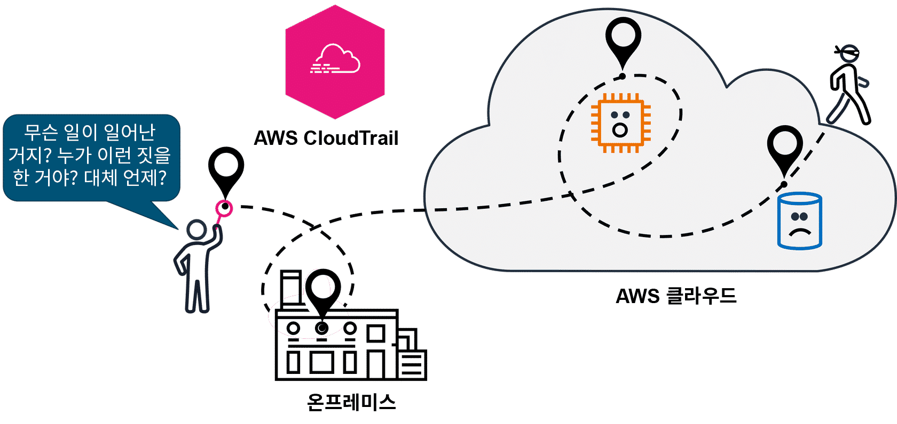
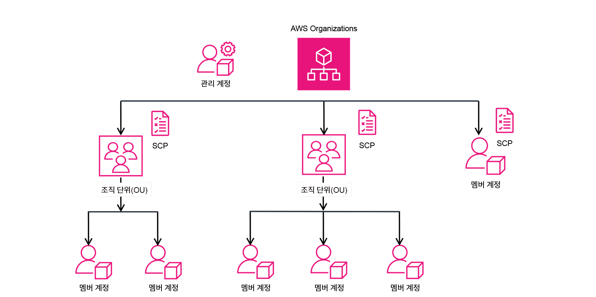

> 강의 8개 · 지식 점검 7문항 · 모듈 평가 11문항

---

## 1. 왜 필요한가

> 안전하게 만들었다. 그런데 지금 잘 돌아가는지, 누가 뭘 만졌는지는?

앞 모듈에서 방화벽을 세우고, 권한을 나누고, 데이터를 암호화했습니다.
그런데 보안은 **한 번 잠그고 끝나는 일이 아닙니다.** 잠가 둔 문이 지금도 잠겨 있는지,
누가 언제 그 문을 열었는지, 그리고 애초에 잘못 잠그는 사람이 나오지 않게 하려면 무엇을 해야 하는지가 남습니다.

이번 모듈은 그 남은 질문 네 개를 순서대로 풉니다.
**시스템이 지금 정상인가**(모니터링), **누가 무엇을 언제 했는가**(감사),
**구성이 우리 규칙과 법을 지키고 있는가**(규정 준수), 그리고
**애초에 규칙을 벗어나지 못하게 어떻게 틀을 씌울 것인가**(거버넌스)입니다.

이 모듈은 시험에서 **"이 상황에는 어떤 도구를 쓰나"** 형태로 거의 전부 출제됩니다.
서비스 하나하나의 내부 동작보다, **문제 지문의 어떤 단어가 어떤 서비스를 가리키는지**에 집중해 주시기 바랍니다.

## 2. 이번에 새로 나오는 서비스

| 서비스 | 한 줄 | 이 모듈에서 맡는 역할 |
|---|---|---|
| [[amazon-cloudwatch]] | 지표·경보·대시보드·로그를 한곳에서 본다 | **지금 잘 돌아가고 있는가** |
| [[aws-cloudtrail]] | 계정에서 일어난 모든 API 호출을 기록한다 | **누가 무엇을 언제 했는가** |
| [[aws-config]] | 리소스 구성을 기록하고 규칙으로 평가한다 | **구성이 규칙에 맞는가** |
| [[aws-artifact]] | AWS 규정 준수 보고서와 계약을 내려받는다 | 감사관에게 낼 **증빙** |
| **AWS Audit Manager** | 감사 증거 수집을 자동화한다 | 감사 보고서를 **만드는** 쪽 |
| [[aws-organizations]] | 여러 AWS 계정을 묶어 중앙에서 관리한다 | 계정·결제 **통합** |
| [[aws-control-tower]] | 다중 계정 환경을 모범 사례대로 구성하고 감독한다 | 계정 **생성 단계**의 거버넌스 |
| [[aws-service-catalog]] | 승인된 제품 목록을 셀프 서비스로 제공한다 | 직원이 **고르게만** 만들기 |
| **AWS License Manager** | 소프트웨어 라이선스 사용을 추적하고 제한한다 | BYOL 라이선스 관리 |
| [[aws-health-dashboard]] | AWS 서비스 장애와 예정된 변경을 알린다 | **AWS 쪽** 문제인지 확인 |
| [[aws-trusted-advisor]] | 5개 범주로 계정을 점검하고 권장 사항을 준다 | 모범 사례 **자동 점검** |

> [!tip] 이번 모듈의 큰 그림
> **CloudWatch**(성능을 본다) → **CloudTrail**(행위를 남긴다) → **Config**(구성을 검사한다) →
> **Artifact·Audit Manager**(증빙을 낸다) → **Organizations·Control Tower·Service Catalog**(애초에 못 벗어나게 한다).
> 뒤로 갈수록 "사후에 확인"에서 "사전에 차단"으로 옮겨 갑니다.

## 3. 강의 내용

---

### L1. 모니터링 · 감사 · 규정 준수 · 거버넌스 — 네 가지가 맞물리는 순서

> **이번 강의에서 다룰 내용** — 이 모듈이 다루는 네 가지 활동이 어떤 순서로 이어지는지 정리해 보겠습니다.

#### 네 단계를 순서대로 밟습니다

클라우드 리소스를 안전하고 건강하게 유지하는 일은 다음 네 단계로 이어집니다.

| 순서 | 활동 | 무엇을 하는가 | 이 모듈의 대표 서비스 |
|---|---|---|---|
| 1 | **보안** | 접근을 통제하고 데이터를 보호합니다 | (모듈 9에서 다뤘습니다) |
| 2 | **모니터링** | 상태와 성능을 계속 수집하고 관찰합니다 | Amazon CloudWatch |
| 3 | **감사** | 누가 무엇을 언제 했는지 기록을 남기고 조회합니다 | AWS CloudTrail |
| 4 | **규정 준수** | 구성과 운영이 규정·표준을 지키는지 검증하고 증빙합니다 | AWS Config · AWS Artifact |

그리고 이 네 가지를 위에서 감싸는 틀이 **거버넌스**입니다.
거버넌스는 "배포를 만들고 운영하는 모든 작업이 조직의 목표를 벗어나지 않게 하는 프레임워크"를 말합니다.
계정을 어떻게 만들지, 어떤 서비스를 쓰게 할지, 어떤 리소스를 승인할지를 **미리** 정해 두는 쪽입니다.

#### 클라우드에서 모니터링이란

**AWS 인프라·서비스·애플리케이션의 상태와 성능을 수집하고, 시각화하고, 추적하는 지속적인 프로세스**입니다.
목표는 두 가지입니다. **최적의 성능을 유지하는 것**, 그리고 **문제가 커지기 전에 발견하는 것**입니다.

커피숍 사장이 하루 종일 매장에 앉아 있을 수는 없습니다.
그래서 "오늘 몇 잔 팔렸는지", "주문 후 평균 대기 시간이 얼마인지", "재고가 떨어지지는 않았는지"를
숫자로 받아 보고 싶어집니다. 대기 시간이 너무 길어지면 알림까지 오면 더 좋겠죠.
이렇게 **시스템을 관찰하고, 지표를 모으고, 시간에 따라 평가해서, 조치로 이어 가는 것**이 모니터링입니다.

클라우드에서는 이것이 특히 중요합니다. AWS 리소스는 동적으로 늘었다 줄었다 하기 때문입니다.
예를 들어 EC2 사용률이 계속 높으면 EC2 Auto Scaling으로 인스턴스를 자동으로 더 띄우게 하고,
애플리케이션이 오류 응답을 비정상적으로 많이 내보내기 시작하면 담당자에게 알림을 보내도록 만들 수 있습니다.

| 모니터링으로 얻는 것 | 설명 |
|---|---|
| **보안 유지** | 이상 징후와 잠재적 위협을 탐지합니다 |
| **선제적 대응** | 고객이 불평하기 전에 문제를 발견합니다 |
| **신뢰성 보장** | 가용성과 안정성을 지속적으로 확인합니다 |
| **비용 모니터링** | 놀고 있는 리소스와 과다 사용을 찾아냅니다 |
| **성능 개선** | 병목 지점을 찾아 최적화합니다 |

---

### L2. Amazon CloudWatch — 지표 · 경보 · 대시보드 · 로그

> **이번 강의에서 다룰 내용** — CloudWatch의 네 가지 기능과, 각각이 문제에서 어떤 표현으로 등장하는지 살펴보겠습니다.

#### 지표(Metric)에서 출발합니다

**지표는 리소스에 붙는 변수**입니다. EC2 인스턴스의 CPU 사용률, S3 버킷의 요청 수 같은 것들이죠.
커피숍으로 치면 **에스프레소 머신이 커피를 추출한 횟수**가 지표입니다.

CloudWatch는 AWS 리소스의 표준 지표를 자동으로 수집하고, 필요하면 **사용자 지정 지표**도 만들 수 있습니다.
에스프레소를 1,000번 추출하면 기기를 세척해야 한다면, "추출 횟수"라는 사용자 지정 지표를 만들어 두면 됩니다.

#### 네 가지 기능

| 기능 | 하는 일 | 문제 속 표현 |
|---|---|---|
| **지표(Metrics)** | AWS 리소스·애플리케이션·온프레미스 서버에서 측정값을 수집합니다 | "지표를 수집", "사용률을 측정" |
| **경보(Alarms)** | 지표에 **임곗값**을 걸어 두고, 넘으면 알림을 보내거나 자동 작업을 실행합니다 | "임곗값을 초과하면 알림", "자동으로 스케일 업" |
| **대시보드(Dashboards)** | 여러 지표를 한 화면에 모아 거의 실시간으로 보여 줍니다. 자동으로 새로 고침됩니다 | "통합된 보기", "한 곳에서 시각화" |
| **로그(Logs)** | 시스템·애플리케이션·AWS 서비스의 로그를 중앙에 모아 보고, 검색하고, 필터링합니다 | "로그를 수집", "오류 원인을 검색" |

경보는 **Amazon SNS와 통합**되어 있습니다. 그래서 임곗값에 도달하면 관리자에게 바로 문자나 이메일을 보낼 수 있고,
알림에서 멈추지 않고 **EC2 인스턴스를 추가로 시작하는 작업**까지 연결할 수 있습니다.

#### 한 화면에서 전체를 봅니다

CloudWatch의 가장 큰 이점은 **중앙 집중화**입니다.
모든 AWS 리소스와 온프레미스 서버의 지표를 한곳에서 보므로 모니터링이 여러 도구로 쪼개지지 않습니다.
그 결과 평균 복구 시간(MTTR)이 줄고, 총 소유 비용(TCO)이 개선되며,
개발자는 감시가 아니라 **다음 기능을 만드는 일**에 시간을 쓸 수 있게 됩니다.

> [!info] 실제로는 이렇게 조합합니다
> 한 소매 회사가 EC2에서 애플리케이션을 돌린다고 해 보겠습니다.
> CloudWatch가 사용률 **지표**를 자동으로 수집하고, 애플리케이션 **로그**를 모으고,
> 사용률이 오래 높으면 **경보**가 울려 인스턴스를 자동으로 늘리고,
> 이 모든 상황을 사용자 지정 **대시보드** 하나로 봅니다. 네 기능이 한 시나리오 안에서 전부 쓰입니다.

```quiz 지식 점검 · Amazon CloudWatch
Q. 한 전자 상거래 회사가 여러 Amazon EC2 인스턴스에서 고객 애플리케이션을 호스팅하고 있습니다. 이 애플리케이션은 트래픽 변동이 심하고 가끔 성능 문제가 발생하여 고객 경험에 영향을 미칩니다. Amazon CloudWatch는 이 고객에게 어떤 도움을 줄 수 있습니까? (3개 선택)
- CloudWatch는 지연 시간을 줄이기 위해 고객이 있는 곳과 가까운 엣지 로케이션에 콘텐츠를 전송할 수 있습니다.
+ CloudWatch 대시보드를 사용자 지정하여 지표, 경보, 데이터를 통합된 보기로 시각화할 수 있습니다.
- CloudWatch는 고객이 구매할 품목을 예측하여 전자 상거래 애플리케이션 장바구니의 **재구매** 카테고리에 배치할 수 있습니다.
+ CloudWatch 경보는 Amazon EC2 사용률이 장기간 너무 높아질 경우 이를 알리고, 로드를 나누기 위해 EC2 인스턴스를 추가로 시작하는 작업을 자동화하도록 설정할 수 있습니다.
+ CloudWatch Logs는 EC2 인스턴스 및 애플리케이션 로그에서 데이터를 수집하여, 성능 문제나 애플리케이션 오류에 대한 인사이트를 얻게 해 줍니다.
- CloudWatch는 아키텍처를 설계하고 모든 리소스를 생성하여 성능 문제를 최소화할 수 있습니다.
> **대시보드 · 경보 · 로그** 세 가지가 CloudWatch의 기능이고, 셋 모두 성능 문제를 선제적으로 잡는 데 쓰입니다. 엣지 로케이션으로 콘텐츠를 배포하는 것은 Amazon CloudFront이고, 구매 예측은 기계 학습 서비스의 영역이며, 아키텍처를 대신 설계하고 리소스를 만들어 주는 AWS 서비스는 존재하지 않습니다.
```

---

### L3. AWS CloudTrail — 누가, 무엇을, 언제

> **이번 강의에서 다룰 내용** — 감사가 왜 필요한지, CloudTrail이 무엇을 기록하는지, 그리고 이벤트·로그·Insights의 차이를 살펴보겠습니다.

#### 물리 데이터 센터에서는 어려웠던 일

물리적인 데이터 센터에서는 누군가 서버를 만졌을 때 그 기록이 남지 않는 경우가 많습니다.
악의가 없는 실수여도 마찬가지죠. 나중에 문제가 터지면 원인을 되짚을 방법이 없습니다.

AWS에서는 이 문제가 구조적으로 풀립니다. **AWS에서 일어나는 모든 작업이 API 호출**이기 때문입니다.
그러니 API 호출만 전부 기록해 두면 감사 기록이 완성됩니다. 그 기록을 담당하는 서비스가 **AWS CloudTrail**입니다.



#### CloudTrail이 남기는 정보

EC2 인스턴스를 시작하든, DynamoDB 테이블에 행을 넣든, 사용자 권한을 바꾸든 전부 기록됩니다.
각 요청마다 다음이 남습니다.

| 남는 정보 | 예 |
|---|---|
| **누가** | 어떤 IAM 자격 증명이 호출했는지 |
| **무엇을** | 어떤 API 작업을 호출했는지 |
| **언제** | 호출 시각 |
| **어디에서** | 요청을 보낸 IP 주소 |
| **결과** | 응답이 무엇이었는지, 변경 사항이 있었는지, 요청이 거부되었는지 |

CloudTrail에는 **로그 파일 무결성 검증** 기능이 있어서 로그가 변조되었는지 확인할 수 있습니다.
루트 권한을 가진 사람이 로그를 건드리는 상황까지 걱정된다면,
**권한이 다른 별도의 AWS 계정으로 로그를 보내서** 무결성을 한 겹 더 보호할 수 있습니다.

#### 이벤트 · 로그 · Insights

| 구성 요소 | 무엇인가 | 문제 속 신호 |
|---|---|---|
| **CloudTrail 이벤트** | 계정에서 수행된 작업의 상세 기록입니다. **이벤트 기록**은 최근 **90일간**의 관리 이벤트를 조회·검색·다운로드할 수 있게 해 주며, 변경할 수 없습니다. 조회 자체에는 요금이 붙지 않습니다 | "최근 활동을 **콘솔에서 바로** 확인" |
| **CloudTrail 로그** | 이벤트를 로그 파일로 만들어 **Amazon S3 버킷에 전송**합니다. 안전하게 장기 보관되므로 PCI·HIPAA 같은 규정 준수 증명에 사용합니다 | "**파일로 저장**", "**S3에 보관**", "장기 보존" |
| **CloudTrail Insights** | API 호출량과 오류율의 평소 패턴을 학습해 두고, 여기서 벗어나는 **비정상 활동**이 나타나면 인사이트 이벤트를 만듭니다 | "**이상 동작 탐지**", "평소와 다른 패턴" |

> [!warning] CloudWatch와 CloudTrail을 바꿔 쓰지 마세요
> - **CloudWatch** — 리소스가 **어떻게 동작하고 있는가**(CPU 사용률, 응답 시간 같은 성능 지표)
> - **CloudTrail** — 리소스에 **누가 무엇을 했는가**(API 호출 이력)
>
> 문제에 "임곗값", "경보", "지표"가 나오면 CloudWatch입니다.
> "누가", "언제", "감사", "추적"이 나오면 CloudTrail입니다.

```quiz 지식 점검 · AWS CloudTrail
Q. 한 회사에서 AWS 계정의 API 활동이 포함된 파일을 Amazon S3 버킷에 저장하려고 합니다. 이 회사는 감사 및 규정 준수를 위해 이러한 파일을 유지하려 합니다. 이러한 기능을 제공하는 솔루션은 무엇입니까?
- AWS CloudTrail 이벤트
+ AWS CloudTrail 로그
- AWS CloudTrail Insights
- Amazon CloudWatch Logs
> 결정적인 단어는 **파일**과 **S3 버킷**입니다. 이벤트를 로그 파일로 만들어 S3에 전송하고 장기 보관하는 것이 CloudTrail 로그입니다. 이벤트 기록은 콘솔에서 최근 90일을 조회하는 기능이라 장기 보존에 쓰지 않고, Insights는 비정상 패턴을 찾아내는 기능입니다. CloudWatch Logs는 애플리케이션·시스템 로그를 모으는 곳이지 API 활동 감사 기록이 아닙니다.
```

---

### L4. 규정 준수와 AWS Artifact — 증빙을 어디에서 받나

> **이번 강의에서 다룰 내용** — 규정 준수가 무엇인지 정의하고, AWS Artifact의 두 가지 유형을 구분해 보겠습니다.

#### 규정 준수란

**보안과 데이터 보호에 관한 관련 법규, 산업 표준, 내부 정책을 클라우드 리소스와 데이터가 지키고 있는 상태**를 말합니다.
유럽 소비자 데이터를 다루면 GDPR을, 미국에서 의료 애플리케이션을 운영하면 HIPAA를 만족해야 합니다.

여기서 좋은 소식이 있습니다. **AWS가 이미 상당 부분을 대신 해 두었습니다.**

| AWS가 해 주는 것 | 뜻 |
|---|---|
| AWS가 자체 인프라에 쓰는 것과 **동일한 보안 제어**를 제공합니다 | 인프라 계층은 이미 검증된 상태에서 출발합니다 |
| **서드 파티 감사 기관**이 수천 개의 글로벌 요구 사항 준수를 검증했습니다 | 인프라에 대한 증빙을 내가 만들 필요가 없습니다 |
| 규정 준수를 **간소화·자동화**하는 도구를 제공합니다 | Config, Audit Manager 같은 서비스입니다 |
| **온디맨드 규정 준수 보고서**를 내려받을 수 있습니다 | 이것이 AWS Artifact입니다 |

**리전 선택도 규정 준수 수단입니다.** 데이터를 원산지 국가 안에만 저장해야 한다면 그 리전을 고르면 됩니다.
AWS는 데이터를 리전 사이로 자동 복제하지 않습니다.

#### AWS Artifact의 두 가지 유형

| 유형 | 무엇을 하는가 | 언제 쓰나 |
|---|---|---|
| **AWS Artifact 계약(Agreements)** | AWS와의 계약을 **검토·수락·관리**합니다. 개별 계정은 물론 AWS Organizations 내 모든 계정에 대해 처리할 수 있습니다 | HIPAA처럼 특정 규정의 적용을 받아 AWS와 별도 계약이 필요할 때 |
| **AWS Artifact 보고서(Reports)** | **서드 파티 감사 기관이 작성한 규정 준수 보고서**를 온디맨드로 내려받습니다. 최신 보고서로 항상 갱신됩니다 | 감사관이나 규제 기관에 AWS 보안 제어의 증거를 제출해야 할 때 |

> [!warning] Artifact는 "받는" 곳이지 "검사하는" 곳이 아닙니다
> Artifact는 **AWS가 규정을 지켰다는 증빙 문서를 내려받는 포털**입니다.
> **내 리소스**가 규정을 지키는지 검사하는 것은 AWS Config이고, 내 감사 증거를 모아 주는 것은 AWS Audit Manager입니다.

#### 고객 컴플라이언스 센터

Artifact가 **문서를 받는 곳**이라면, **고객 컴플라이언스 센터(AWS Customer Compliance Center)** 는 **읽고 배우는 곳**입니다.
여기에서 다음을 찾을 수 있습니다.

- **고객 규정 준수 사례** — 규제 업종의 기업들이 규정 준수·거버넌스·감사 과제를 어떻게 풀었는지
- **핵심 규정 준수 질문에 대한 AWS의 답변**
- **AWS 위험 및 규정 준수 개요 백서**
- **보안 감사 체크리스트**

시험에서 "사례 연구", "규정 준수 질문에 대한 답변", "감사 체크리스트"를 어디에서 찾느냐고 물으면 이곳입니다.

```quiz 지식 점검 · AWS Artifact
Q. 다음 중 AWS Artifact에서 수행할 수 있는 태스크는 무엇입니까? (2개 선택)
+ 온디맨드로 AWS 규정 준수 보고서에 액세스합니다.
- 중앙 위치에서 여러 AWS 계정을 통합 및 관리합니다.
- 사람과 애플리케이션이 AWS 서비스 및 리소스와 상호 작용할 수 있도록 허용하는 사용자를 생성합니다.
- 서비스 제어 정책(SCP)을 구성하여 계정의 권한을 설정합니다.
+ AWS와의 계약을 검토, 수락, 관리합니다.
> Artifact는 **보고서**와 **계약** 두 가지로 이루어져 있습니다. 여러 계정을 통합 관리하고 SCP를 설정하는 것은 AWS Organizations이고, 사용자를 만드는 것은 AWS IAM입니다.
```

---

### L5. AWS Config와 AWS Audit Manager — 내 리소스를 검사하고 증거를 모으기

> **이번 강의에서 다룰 내용** — 리소스 구성을 규칙으로 평가하는 AWS Config와, 감사 증거 수집을 자동화하는 AWS Audit Manager를 살펴보겠습니다.

#### AWS Config — 구성이 규칙에 맞는지 계속 확인합니다

회사에는 보통 "EC2는 승인된 인스턴스 유형 목록에서만 고른다", "S3 버킷은 절대 퍼블릭이면 안 된다" 같은 규칙이 있습니다.
개발자가 수백 명이면 이 규칙을 사람이 일일이 확인할 수 없습니다. 이때 쓰는 서비스가 **AWS Config**입니다.

| Config가 하는 일 | 설명 |
|---|---|
| **구성 기록** | AWS 리소스의 구성을 기록하고, **변경 이력**을 계속 추적합니다 |
| **규칙 평가** | 내가 정의한 규정 준수 규칙에 리소스가 맞는지 **자동으로 평가**합니다 |
| **알림** | 규정을 지키지 않는 리소스가 나타나면 알려 줍니다 |
| **자동 수정** | 리소스를 규정 준수 상태로 되돌리는 **자동 문제 해결 작업**을 설정할 수 있습니다 |
| **보고** | 어떤 리소스가 준수하고 어떤 리소스가 준수하지 않는지 보고서를 만듭니다 |

규정 준수는 한 번 해 놓고 끝나는 일이 아닙니다. 시간이 지나면 누군가 설정을 바꾸기 때문입니다.
Config는 그 **시간축**을 담당한다고 기억해 두시면 좋습니다.

#### AWS Audit Manager — 증거를 자동으로 모읍니다

규정을 지키는 것만으로는 부족한 산업이 있습니다. **지키고 있다는 증거를 제출**해야 하죠.
의료 회사는 환자 데이터를 안전하게 보관한다는 증거를, 금융 회사는 자금을 정확히 처리한다는 증거를 규제 기관에 내야 합니다.

**AWS Audit Manager**는 완전관리형 서비스로, **증거 수집을 자동화**합니다.
정책·절차·활동(제어 활동)이 실제로 작동하는지 평가하고, 감사에 바로 제출할 수 있는 보고서를 만들어 줍니다.
사전 구축된 프레임워크로 여러 규정 준수 표준을 커버하고, AWS 리소스를 그 표준의 요구 사항에 매핑해 줍니다.

> [!warning] 시험에서 가장 헷갈리는 3종 — 무엇을 보는가로 갈립니다
> - **Amazon CloudWatch** — **성능과 지표**를 봅니다. "CPU 사용률이 얼마인가, 임곗값을 넘었는가"
> - **AWS CloudTrail** — **누가 호출했는가**를 봅니다. "이 리소스를 누가, 언제, 어떤 API로 건드렸는가"
> - **AWS Config** — **구성이 어떻게 바뀌었는가**를 봅니다. "이 리소스의 설정이 우리 규칙에 맞는가, 언제부터 어긋났는가"
>
> 한 문장으로 줄이면 **성능은 CloudWatch, 행위는 CloudTrail, 상태는 Config**입니다.

```quiz 지식 점검 · AWS Config
Q. 대규모 개발자 팀을 보유한 한 기업 고객이 있습니다. 이 고객은 AWS 리소스를 생성할 때 개발자에게 특정한 구성 지침을 제공할 방법이 필요합니다. 그리고 이 고객은 AWS 리소스를 평가하고 감사를 수행하여 개발자 팀이 가장 비용 효율적이고 승인된 Amazon EC2 인스턴스 목록을 사용하고 있는지 확인하려 합니다. 이 고객의 요구 사항에 가장 적합한 AWS 서비스는 무엇입니까?
- AWS Artifact
- AWS Audit Manager
+ AWS Config
- AWS CloudTrail
> 신호는 **구성 지침**과 **리소스를 평가·감사**입니다. 리소스 구성을 규칙에 비추어 자동으로 평가하는 서비스는 AWS Config뿐입니다. Artifact는 AWS의 규정 준수 문서를 받는 포털이고, Audit Manager는 감사 증거 수집을 자동화하는 쪽이며, CloudTrail은 API 호출 이력을 남길 뿐 구성이 규칙에 맞는지 판정하지는 않습니다.
```

---

### L6. AWS Organizations — 계정이 여러 개일 때

> **이번 강의에서 다룰 내용** — 여러 AWS 계정을 통합 관리하는 AWS Organizations의 구조와 서비스 제어 정책(SCP)을 살펴보겠습니다.

#### 계정은 반드시 늘어납니다

처음에는 AWS 계정 하나로 시작합니다. 하지만 회사에서 AWS 비중이 커지면
프로덕션 계정, 비프로덕션 계정, 개발자 계정, 인프라 팀 계정처럼 **용도별로 계정이 쪼개집니다.**
이 계정들을 사람이 하나씩 관리하는 것은 곧 불가능해집니다.

**AWS Organizations**는 여러 AWS 계정을 하나의 **조직(Organization)** 으로 묶어
결제·액세스·규정 준수·보안을 중앙에서 관리하게 해 주는 계정 관리 서비스입니다.



```layers 조직은 루트를 꼭짓점으로 하는 트리입니다.
조직(Organization) — 루트 | 관리 계정이 조직을 만들고 전체를 통제합니다
  조직 단위(OU) — 개발 | SCP를 여기에 걸면 아래 계정 전부에 적용됩니다
    멤버 계정 | 개발용
    멤버 계정 | 테스트용
  조직 단위(OU) — 규제 대상 | 특정 규제를 만족하는 서비스만 허용
    멤버 계정 | 결제 처리용
  멤버 계정 — OU 밖 | OU에 맞지 않는 고유 요구 사항이면 루트 바로 아래에 둘 수 있습니다
```

#### 주요 개념

| 개념 | 설명 |
|---|---|
| **관리 계정(Management account)** | 조직을 생성하고 관리하는 중앙 계정입니다. 전체 제어와 거버넌스를 담당하고, **결제가 여기로 통합**됩니다 |
| **루트(Root)** | 조직을 만들면 자동으로 생기는, 모든 계정의 최상위 컨테이너입니다 |
| **조직 단위(OU)** | 계정을 논리적으로 묶은 그룹입니다. 멤버 계정과 **중첩된 OU**를 담을 수 있습니다 |
| **멤버 계정** | 조직에 속한 나머지 계정입니다. OU 아래에 두어도 되고, 루트 바로 아래에 두어도 됩니다 |
| **서비스 제어 정책(SCP)** | 계정이 사용할 수 있는 **AWS 서비스·리소스·개별 API 작업의 최대 한도**를 정하는 정책입니다 |

**결제 통합**도 큰 이점입니다. 하위 계정의 사용료가 관리 계정으로 모이고, 합산된 사용량에 볼륨 할인이 적용됩니다.
OU에 속하지 않은 멤버 계정도 이 통합 결제 혜택은 그대로 받습니다.

> [!warning] SCP와 IAM 정책의 적용 대상이 다릅니다
> - **SCP** — **조직 루트 · OU · 개별 멤버 계정**에 적용합니다. 계정 안의 모든 IAM 사용자·그룹·역할은 물론 **루트 사용자에게까지** 영향을 미칩니다
> - **IAM 정책** — **IAM 사용자 · 그룹 · 역할**에 적용합니다. AWS 계정 루트 사용자에게는 적용할 수 없습니다
>
> SCP는 "이 계정에서 할 수 있는 일의 천장"이고, IAM 정책은 "그 안에서 이 사용자에게 주는 권한"이라고 보시면 됩니다.

```quiz 지식 점검 · AWS Organizations와 SCP
Q. 사용자가 AWS Organizations에서 서비스 제어 정책(SCP)을 구성하려 합니다. SCP는 어떤 자격 증명과 리소스에 적용할 수 있습니까? (2개 선택)
- AWS Identity and Access Management(AWS IAM) 사용자
- AWS Identity and Access Management(AWS IAM) 그룹
+ 개별 멤버 계정
- AWS Identity and Access Management(AWS IAM) 역할
+ 조직 단위(OU)
> SCP는 **조직 루트 · OU · 개별 멤버 계정**이라는 **계정 단위 구조**에 붙입니다. 붙이고 나면 그 계정 안의 IAM 사용자·그룹·역할 전부에 영향을 미치지만, 붙이는 대상 자체가 IAM 개체는 아닙니다. IAM 사용자·그룹·역할에 직접 붙이는 것은 IAM 정책입니다.
```

---

### L7. 거버넌스 — Control Tower · Service Catalog · License Manager

> **이번 강의에서 다룰 내용** — 조직이 커질 때 계정·리소스·라이선스를 규칙 안에 묶어 두는 세 서비스를 구분해 보겠습니다.

조직이 커지면 세 가지가 동시에 통제를 벗어나기 시작합니다.
**새 계정**이 아무렇게나 만들어지고, **직원들이 원하는 리소스**를 마음대로 띄우고, **소프트웨어 라이선스**가 어디에 얼마나 쓰이는지 아무도 모릅니다.
각각에 대응하는 서비스가 하나씩 있습니다.

#### AWS Control Tower — 다중 계정 환경을 모범 사례대로 세팅합니다

새 AWS 계정을 만들 때마다 보안 설정을 처음부터 다시 하고 있다면, 언젠가 반드시 빠뜨리는 사람이 나옵니다.
**AWS Control Tower**는 계정 생성과 거버넌스를 표준화합니다.

| 구성 요소 | 무엇인가 |
|---|---|
| **랜딩 존(Landing Zone)** | 보안·규정 준수 모범 사례에 따라 설계된 **다중 계정 환경**입니다. 규제하려는 모든 OU·계정·사용자·리소스를 담는 **전사적 컨테이너**입니다 |
| **Account Factory** | 새 계정 프로비저닝을 표준화하는 **구성 가능한 계정 템플릿**입니다 |
| **제어(Controls, 가드레일)** | AWS 환경 전체에 자동 적용되는 **상위 수준 규칙**입니다. 정책에 맞지 않는 리소스의 배포를 막고, 규정 미준수 계정·리소스를 탐지·수정합니다 |
| **대시보드** | 프로비저닝된 계정, 가드레일, 규정 준수 상태를 **한 화면**에서 감독합니다 |

가드레일은 고속도로의 안전벽과 같습니다. 운전은 각 팀이 자유롭게 하되, **차선 밖으로는 못 나가게** 만드는 장치입니다.

#### AWS Service Catalog — 승인된 것만 고르게 합니다

직원이 새 리소스가 필요할 때마다 요청서를 올리면 관리자가 지치고,
그렇다고 각자 알아서 만들게 두면 제각각의 설정이 쏟아집니다.

**AWS Service Catalog**는 조직이 **미리 승인해 큐레이팅한 제품 목록**을 만들어 두고,
직원이 그중에서 **셀프 서비스로 골라 배포**하게 해 줍니다.
고르는 순간 조직 표준을 만족한 리소스가 나오므로, 자유와 통제를 동시에 잡습니다.

#### AWS License Manager — 라이선스를 추적하고 제한합니다

온프레미스에서 클라우드로 옮길 때 이미 사 둔 소프트웨어 라이선스를 어떻게 할지 정해야 합니다.
**기존 보유 라이선스 사용(BYOL)** 모델을 쓰면 Microsoft 등에서 직접 구매한 라이선스를
EC2 전용 호스트나 Amazon WorkSpaces 같은 AWS 서비스에서 그대로 사용할 수 있어 비용을 크게 아낄 수 있습니다.

문제는 **누가 몇 개를 쓰고 있는지 파악하기 어렵다**는 점입니다.
**AWS License Manager**는 라이선스 사용을 추적하고, **사용 제한을 강제**하며,
한도를 넘는 새 인스턴스 시작을 차단해서 규정 미준수 위험을 줄여 줍니다.

#### 세 서비스를 한 줄로 가르기

| 서비스 | 통제 대상 | 문제 속 신호 |
|---|---|---|
| **AWS Control Tower** | **계정** | "다중 계정 환경 설정", "새 계정이 승인된 요구 사항을 준수", "랜딩 존", "가드레일" |
| **AWS Service Catalog** | **리소스(제품)** | "큐레이팅한 목록", "승인된 제품", "셀프 서비스로 시작", "직원이 선택" |
| **AWS License Manager** | **소프트웨어 라이선스** | "BYOL", "라이선스 사용 제한", "라이선스 규정 미준수" |

```quiz 지식 점검 · 거버넌스 서비스
Q. 한 정부 기관 고객이 안전하고 규정을 준수하는 다중 계정 AWS 환경을 설정하고 관리해야 하는 상황입니다. 이 고객은 직원들이 새 AWS 계정을 생성할 때 승인된 요구 사항을 준수하는지 확인하고자 합니다. 이 고객의 요구 사항에 가장 적합한 AWS 서비스는 무엇입니까?
- AWS CloudTrail
+ AWS Control Tower
- AWS Service Catalog
- AWS License Manager
> 신호는 **다중 계정 환경 설정**과 **새 계정 생성 시 요구 사항 준수**입니다. 계정 생성 자체를 표준화하고 가드레일로 규칙을 강제하는 서비스는 Control Tower입니다. Service Catalog는 계정이 아니라 그 안에서 만드는 **리소스** 목록을 통제하고, License Manager는 소프트웨어 라이선스를 다루며, CloudTrail은 이미 일어난 API 호출을 기록할 뿐 예방 장치가 아닙니다.
```

---

### L8. AWS Health Dashboard와 Trusted Advisor — 남이 보는 내 계정

> **이번 강의에서 다룰 내용** — AWS 쪽 이벤트를 알려 주는 Health Dashboard와, 계정을 5개 범주로 점검해 주는 Trusted Advisor를 살펴보겠습니다.

#### AWS Health Dashboard — AWS 쪽 문제인지 알려 줍니다

서비스가 느려졌을 때 **내 코드 문제인지 AWS 쪽 문제인지**부터 알아야 대응이 갈립니다.
**AWS Health Dashboard**는 AWS 클라우드 리소스의 상태에 영향을 주는 이벤트와 변경 사항을 알려 주는 데이터 소스입니다.

| 알려 주는 것 | 예 |
|---|---|
| **서비스 이벤트** | 특정 리전의 서비스 성능 저하나 장애 |
| **계획된 변경 사항** | 내 리소스에 예정된 유지 관리, 인스턴스 재부팅 일정 |
| **계정 알림** | 내 계정에 개별적으로 필요한 조치 |

#### AWS Trusted Advisor — 5개 범주 자동 점검

밖에서 온 컨설턴트가 계정을 훑어보고 "이건 이렇게 바꾸시면 비용이 줄고, 저건 보안 구멍입니다"라고 알려 준다면 좋겠죠.
그 역할을 자동으로 하는 서비스가 **AWS Trusted Advisor**입니다.
AWS 모범 사례에 따라 계정을 실시간으로 검사하고, 결과를 다섯 범주로 묶어 콘솔에 보여 줍니다.

| 범주 | 무엇을 찾아 주는가 | 예 |
|---|---|---|
| **비용 최적화** | 낭비되는 리소스 | 유휴 RDS 인스턴스, 사용률이 낮은 EC2 인스턴스, 활용도가 낮은 ELB |
| **성능** | 성능을 갉아먹는 구성 | EBS 볼륨 처리량이 연결된 EC2 인스턴스에 병목이 되는 경우 |
| **보안** | 보안 구멍 | 루트 사용자에 MFA 미설정, 퍼블릭 액세스를 허용하는 보안 그룹, S3 버킷 로깅 미활성화 |
| **내결함성** | 장애에 약한 구성 | 스냅샷이 없는 EBS 볼륨, AZ 간 EC2 배치 불균형 |
| **서비스 한도** | 한도에 근접한 항목 | 서비스 할당량에 가까워진 리소스 (Service Quotas 콘솔에서 상향 요청) |

결과는 **빨간색(조치 필요) · 주황색(조사 필요) · 녹색(문제 없음)** 으로 표시됩니다.
일부 검사는 모든 계정에서 무료로 제공되고, 나머지는 **AWS Support 플랜 등급에 따라** 열립니다.
검사 결과를 결제·운영·보안 담당자 이메일로 자동 발송하도록 설정할 수도 있습니다.

#### IAM Access Analyzer — 권한을 한 번 더 좁힙니다

Trusted Advisor가 보안 범주 검사를 하긴 하지만, IAM 권한이 얼마나 넓은지까지 세밀하게 봐 주지는 않습니다.
**AWS IAM Access Analyzer**는 외부에 공유된 리소스를 찾아내고 실제 사용 기록을 바탕으로 정책을 다듬어,
**최소 권한** 원칙에 다가가도록 도와줍니다.

```quiz 지식 점검 · AWS Trusted Advisor
Q. 다중 리전 AWS 네트워크를 보유한 한 기업 고객은 모든 요소가 안전하고 효율적으로 작동하는지 확인하는 동시에, 비용을 지속적으로 평가하고 절감할 방법을 모색하고 있습니다. 또한 이 고객은 운영 환경에 적용할 수 있는 AWS 모범 사례를 익히는 데에도 관심이 있습니다. 이 고객의 요구 사항에 가장 잘 부합하는 솔루션은 무엇입니까?
+ AWS Trusted Advisor
- AWS Identity and Access Management Access Analyzer
- Amazon Inspector
- AWS 공동 책임 모델
> **비용 · 성능 · 보안 · 내결함성**을 한꺼번에, 그것도 **모범 사례 기준으로 권장 사항**까지 주는 서비스는 Trusted Advisor뿐입니다. IAM Access Analyzer는 권한 범위만 다루고, Amazon Inspector는 워크로드의 취약점을 스캔하는 보안 전용 서비스이며, 공동 책임 모델은 서비스가 아니라 책임 경계를 설명하는 개념입니다.
```

---

## 4. 모듈 평가

#### 문제 속 신호로 도구를 고르는 표

이번 모듈의 시험 문제는 거의 전부 **"이 상황에는 어떤 도구인가"** 형태로 나옵니다.
지문에서 아래 신호를 찾아내는 훈련을 해 두시면 대부분 한 번에 걸러집니다.
이후 모듈에서 다루는 도구까지 함께 넣어 두었으니 통째로 익혀 두시기 바랍니다.

| 도구 | 무엇을 해 주는가 | 문제 속 신호 |
|---|---|---|
| **Amazon CloudWatch** | 지표 수집, 임곗값 경보, 대시보드, 로그 중앙화 | "지표", "임곗값을 넘으면 알림", "대시보드로 시각화", "사용률이 높으면 자동 스케일 업" |
| **AWS CloudTrail** | 모든 API 호출을 기록하는 **감사** 로그 | "**누가**", "**언제**", "무슨 작업을 했는지", "감사", "API 활동을 S3에 보관" |
| **AWS Config** | 리소스 **구성 변경 이력** 기록 + 규정 준수 규칙 평가 | "구성 지침", "리소스를 평가하고 감사", "승인된 유형만 쓰는지", "설정이 언제 바뀌었는지" |
| **AWS CloudFormation** | 템플릿으로 인프라를 코드처럼 배포(IaC) | "템플릿", "코드형 인프라", "동일한 환경을 반복 생성" |
| **AWS Trusted Advisor** | 비용·성능·보안·내결함성·서비스 한도 **5개 범주 점검과 권장 사항** | "지속적인 평가", "모범 사례", "권장 사항", "여러 영역을 한꺼번에 개선" |
| **AWS Compute Optimizer** | 지표를 분석해 **리소스 크기(인스턴스 유형)** 를 권장 | "**적절한 크기**로 조정", "인스턴스 유형을 추천", "오버프로비저닝 확인" |
| **AWS Systems Manager** | 인스턴스 운영 관리 — 패치, 실행 명령, 인벤토리, 파라미터 저장 | "**패치** 적용", "여러 인스턴스에 명령 실행", "운영 작업 자동화" |
| **AWS Service Catalog** | 조직이 **승인한 제품 목록**을 셀프 서비스로 제공 | "큐레이팅한 목록", "승인된 리소스", "직원이 골라서 배포" |
| **AWS Health Dashboard** | **AWS 서비스 자체**의 이벤트·예정 변경·계정 알림 | "AWS 서비스에 문제가 있는지", "예정된 유지 관리", "서비스 중단 알림" |
| **AWS Well-Architected Tool** | 워크로드를 6개 기둥 기준으로 **설문 형식 검토** | "아키텍처를 검토", "모범 사례와 비교해 위험 식별", "Well-Architected 기둥" |
| **AWS X-Ray** | 요청이 서비스들을 거치는 경로를 추적(**분산 추적**) | "마이크로서비스 사이 어디가 느린지", "요청 경로 추적", "병목 구간 분석" |
| **AWS OpsWorks** | Chef·Puppet 기반 **구성 관리** 관리형 서비스 | "Chef", "Puppet", "기존 구성 관리 도구를 그대로" |
| **AWS Organizations** | 여러 계정을 조직으로 묶어 통합 결제·SCP 적용 | "여러 계정", "청구서 통합", "조직 단위로 중앙 관리" |
| **AWS Control Tower** | 다중 계정 환경을 모범 사례대로 세팅·감독 | "다중 계정 환경 설정", "새 계정이 정책을 준수", "랜딩 존", "가드레일" |
| **AWS Artifact** | AWS의 **규정 준수 보고서와 계약**을 온디맨드로 제공 | "규정 준수 보고서", "온라인 계약", "감사관에게 제출할 증빙" |
| **AWS Audit Manager** | 감사 **증거 수집을 자동화**하고 감사용 보고서 작성 | "증거 수집", "감사 준비 자동화", "제어 활동 평가" |
| **AWS License Manager** | 소프트웨어 라이선스 추적·제한 | "BYOL", "라이선스 사용 제한", "라이선스 규정 미준수" |

> [!warning] 시험에서 가장 많이 틀리는 3종을 한 번 더 대비시켜 두겠습니다
> - **CloudWatch** — **성능**을 봅니다. 지표가 얼마인가, 임곗값을 넘었는가
> - **CloudTrail** — **누가 호출했나**를 봅니다. 어떤 자격 증명이 언제 어떤 API를 불렀는가
> - **AWS Config** — **구성이 어떻게 바뀌었나**를 봅니다. 설정이 규칙에 맞는가, 언제부터 어긋났는가
>
> 지문에 사람(주체)이 등장하면 CloudTrail, 숫자와 임곗값이 등장하면 CloudWatch, 설정과 규칙이 등장하면 Config입니다.

```exam
Q. 한 스포츠웨어 회사가 Amazon EC2 인스턴스에서 애플리케이션을 호스팅하고 있습니다. 이 회사는 EC2 인스턴스에서 지표를 수집하려 하며, 사용률이 임곗값을 초과할 경우 알림을 받고자 합니다. 또한 사용률이 임곗값을 초과할 경우 EC2 인스턴스 수를 자동으로 스케일 업할 수 있는 작업도 구성하고자 합니다. 이 고객의 요구 사항에 가장 잘 부합하는 AWS 서비스는 무엇입니까?
- AWS CloudTrail
+ Amazon CloudWatch
- AWS Artifact
- AWS Trusted Advisor
> **지표 수집 + 임곗값 초과 시 알림 + 자동 작업** 세 가지가 모두 CloudWatch의 기능입니다. 특히 "임곗값"이라는 단어가 나오면 CloudWatch 경보라고 보시면 됩니다. CloudTrail은 API 호출 이력을 남기는 감사 서비스라 지표를 다루지 않고, Artifact는 규정 준수 문서 포털이며, Trusted Advisor는 모범 사례 점검이라 실시간 임곗값 경보를 걸 수 없습니다.

Q. 다음 중 AWS 보안 및 규정 준수 보고서와 일부 온라인 계약에 무료로 온디맨드 방식으로 액세스할 수 있는 AWS 서비스는 무엇입니까?
- AWS CloudTrail
- Amazon CloudWatch
+ AWS Artifact
- AWS Trusted Advisor
> **보고서**와 **계약**이라는 두 단어가 곧 AWS Artifact의 두 가지 유형입니다. 서드 파티 감사 기관이 작성한 규정 준수 보고서를 온디맨드로 내려받고, AWS와의 계약을 검토·수락·관리하는 곳입니다. 나머지 셋은 모두 문서가 아니라 리소스를 다루는 서비스입니다.

Q. 하이브리드 클라우드 솔루션을 보유한 한 금융 회사가 클라우드와 온프레미스 양쪽 모두에서 AWS 리소스의 변경 사항을 추적하고자 합니다. 구체적으로 설명하자면 이러한 리소스에 대해 누가, 언제, 무슨 작업을 수행했는지 파악하고자 합니다. 이 고객의 요구 사항에 가장 잘 부합하는 AWS 서비스는 무엇입니까?
+ AWS CloudTrail
- Amazon CloudWatch
- AWS Artifact
- AWS Trusted Advisor
> **누가 · 언제 · 무슨 작업**이라는 세 단어가 그대로 CloudTrail의 정의입니다. AWS의 모든 작업은 API 호출이고, CloudTrail은 그 호출을 호출자·시각·소스 IP·응답까지 기록합니다. CloudWatch는 성능 지표를 다루므로 "누구"라는 정보를 주지 않습니다.

Q. 급속도로 성장한 한 기업 고객이 AWS 리소스 및 계정의 결제 업무를 관리하는 데 어려움을 겪고 있습니다. 이 기업의 모든 직원은 중앙 집중식 관리나 계층적 계정 그룹 없이 개별 계정을 생성했습니다. 이 기업 고객은 청구서를 통합하고 관리 업무를 조직 단위로 중앙 집중화하고자 합니다. 이 고객의 요구 사항을 가장 잘 충족하는 AWS 서비스는 무엇입니까?
- AWS Trusted Advisor
- AWS Service Catalog
+ AWS Organizations
- 가용 영역(AZ)
> **청구서 통합**과 **조직 단위**가 결정적입니다. 여러 계정을 하나의 조직으로 묶어 결제를 관리 계정으로 통합하고 OU 계층으로 관리하는 서비스는 AWS Organizations입니다. Trusted Advisor는 점검 도구이고, Service Catalog는 승인된 리소스 목록을 제공하며, 가용 영역은 서비스가 아니라 인프라의 물리적 단위입니다.

Q. 다음 중 AWS 리소스에 대한 지속적인 평가 및 검사를 제공하고 비용, 성능, 보안, 복원력을 최적화하기 위한 권장 사항을 제공하는 AWS 서비스는 무엇입니까?
- AWS CloudTrail
- Amazon CloudWatch
- AWS Artifact
+ AWS Trusted Advisor
> **여러 범주를 한꺼번에** 검사하고 **권장 사항**을 준다는 점이 Trusted Advisor의 고유한 특징입니다. 비용 최적화·성능·보안·내결함성·서비스 한도 다섯 범주를 AWS 모범 사례에 비추어 자동으로 점검합니다. CloudWatch는 지표를 보여 줄 뿐 "이렇게 바꾸세요"라고 권장하지 않습니다.

Q. 한 금융 회사에서 직원을 위해 큐레이팅한 AWS 리소스 세트를 관리할 수 있는 솔루션을 찾고 있습니다. 이 회사는 직원이 새 AWS 리소스를 선택한 후 시작해야 할 때 AWS 리소스를 생성, 공유, 배포할 수 있는 셀프 서비스 방식을 제공하고자 합니다. 이 고객의 요구 사항에 가장 잘 부합하는 AWS 서비스는 무엇입니까?
+ AWS Service Catalog
- AWS License Manager
- AWS Artifact
- AWS Health
> **큐레이팅한 목록**과 **셀프 서비스**가 Service Catalog의 신호입니다. 조직이 미리 승인한 제품만 카탈로그에 올려 두고 직원이 그중에서 골라 배포하게 하므로, 자유롭게 쓰게 하면서도 표준을 지킬 수 있습니다. License Manager는 소프트웨어 라이선스를, Artifact는 규정 준수 문서를, AWS Health는 AWS 서비스의 상태를 다룹니다.

Q. 고객은 고객 규정 준수 사례에 관한 정보, 주요 규정 준수 질문에 대한 답변, 보안 감사 체크리스트 등과 같은 AWS 규정 준수에 관한 리소스를 어디에서 찾을 수 있습니까?
- AWS Organizations
- AWS Artifact
+ 고객 컴플라이언스 센터
- AWS Management Console
> **사례 연구 · 질문에 대한 답변 · 감사 체크리스트**는 읽고 배우는 자료이므로 고객 컴플라이언스 센터입니다. AWS Artifact와 헷갈리기 쉬운데, Artifact는 감사관에게 제출할 **공식 보고서와 계약**을 내려받는 포털입니다. 배우는 곳과 증빙을 받는 곳을 구분해 두시기 바랍니다.

Q. AWS Control Tower 랜딩 존의 목적은 무엇입니까?
- 이는 Virtual Private Cloud(VPC)에서 Amazon EC2 인스턴스로 전송되는 인바운드 및 아웃바운드 트래픽을 필터링합니다.
- 이는 사용자가 정의하는 가상 네트워크에서 AWS 리소스를 시작할 수 있는 AWS 클라우드의 논리적으로 격리된 공간입니다.
- 이는 리소스를 격리하고 액세스를 제어할 수 있는 Virtual Private Cloud(VPC)의 하위 섹션입니다.
+ 이는 규정 준수를 위해 규제하고자 하는 모든 조직 단위(OU), 계정, 사용자, 리소스를 보존하는 전사적 컨테이너입니다.
> 랜딩 존은 보안·규정 준수 모범 사례에 따라 설계된 **다중 계정 환경 전체를 담는 컨테이너**입니다. 나머지 세 선택지는 각각 보안 그룹, VPC, 서브넷의 설명이라 네트워킹 개념이지 거버넌스 개념이 아닙니다. 문제에 네트워크 용어가 섞여 나오면 그 선택지부터 걸러내시면 됩니다.

Q. 대규모 개발자 팀을 보유한 한 연구소 고객은 AWS 리소스를 생성할 때 개발자에게 특정한 구성 지침을 제공할 수 있는 방법이 필요합니다. 그리고 이 고객은 가장 비용 효율적이고 승인된 컴퓨팅 리소스 목록을 사용하고 있는지 확인하기 위해 AWS 리소스를 평가하고 감사를 수행할 방법을 찾고 있습니다. 이 고객의 요구 사항을 충족하는 솔루션 또는 기능은 무엇입니까?
- AWS Artifact
- AWS Audit Manager
+ AWS Config
- AWS CloudTrail
> **구성 지침**을 정하고 **리소스를 평가·감사**한다는 조합이 AWS Config입니다. 규칙을 정의해 두면 리소스가 그 규칙에 맞는지 자동으로 판정하고, 어긋나면 알리거나 자동으로 되돌립니다. Artifact는 AWS 측 규정 준수 문서를 받는 포털이고, Audit Manager는 감사 증거 수집을 자동화하는 서비스이며, CloudTrail은 호출 이력만 남길 뿐 구성이 규칙에 맞는지는 판정하지 않습니다.

Q. 한 고객이 결제를 최적화하고 정리하기 위해 AWS Organizations를 사용하여 회사의 결제용 계정을 중앙에서 관리하고 있습니다. 이 고객은 사용자가 액세스할 수 있는 AWS 서비스, 리소스, 개별 API 작업에 대한 규칙이나 제한을 설정하려고 합니다. 고객의 요구 사항을 충족하는 기능은 무엇입니까?
- 루트 계정
- AWS Identity and Access Management(AWS IAM) 사용자
+ 서비스 제어 정책(SCP)
- 조직 단위(OU)
> **서비스 · 리소스 · 개별 API 작업에 제한을 건다**는 표현이 SCP의 정의 그대로입니다. 조직 단위는 계정을 묶는 그릇일 뿐 그 자체가 제한을 걸지 않고(SCP를 붙여야 효력이 생깁니다), IAM 사용자는 정책을 적용받는 대상이며, 루트 계정은 오히려 제한 없이 모든 작업을 할 수 있는 쪽입니다.

Q. 한 고객이 온프레미스에서 클라우드로 전환하고 있으며, 비용 절감을 위해 기존 보유 라이선스 사용(BYOL) 모델 접근 방식을 사용하기로 결정했습니다. 이 고객은 라이선스 관리에 대해 우려하고 있으며, 규정 미준수 위험을 줄이고자 하며, 라이선스 사용 제한을 적용하고자 합니다. 이 고객의 요구 사항에 가장 잘 부합하는 솔루션은 무엇입니까?
+ AWS License Manager
- AWS Service Catalog
- AWS Control Tower
- AWS Organizations
> **BYOL**과 **라이선스 사용 제한**이 함께 나오면 곧바로 License Manager입니다. 라이선스 사용을 추적하고 한도를 넘는 인스턴스 시작을 차단해 규정 미준수 위험을 줄입니다. Service Catalog는 리소스 목록을, Control Tower는 계정 환경을, Organizations는 계정 구조와 결제를 다루므로 라이선스 수량을 세어 주지 않습니다.
```

## 5. 여기까지의 지도

주황색이 이번 모듈에서 새로 나온 서비스입니다.

```mermaid
flowchart TB
 classDef new fill:#ff9900,stroke:#232f3e,stroke-width:2px,color:#111
 classDef old fill:#f4f6f8,stroke:#8a94a6,color:#5a6472
 subgraph S2["2. 클라우드 컴퓨팅"]
 direction LR
 AmazonEC2["Amazon EC2"]
 AmazonEC2AutoScaling["Amazon EC2 Auto Scaling"]
 ElasticLoadBalancing["Elastic Load Balancing"]
 AmazonSQS["Amazon SQS"]
 AmazonSNS["Amazon SNS"]
 AmazonEventBridge["Amazon EventBridge"]
 end
 class AmazonEC2,AmazonEC2AutoScaling,ElasticLoadBalancing,AmazonSQS,AmazonSNS,AmazonEventBridge old
 subgraph S3["3. 컴퓨팅 서비스 살펴보기"]
 direction LR
 AWSLambda["AWS Lambda"]
 AmazonECS["Amazon ECS"]
 AmazonEKS["Amazon EKS"]
 AWSElasticBeanstalk["AWS Elastic Beanstalk"]
 AWSBatch["AWS Batch"]
 AWSFargate["AWS Fargate"]
 AWSOutposts["AWS Outposts"]
 AmazonLightsail["Amazon Lightsail"]
 end
 class AWSLambda,AmazonECS,AmazonEKS,AWSElasticBeanstalk,AWSBatch,AWSFargate,AWSOutposts,AmazonLightsail old
 subgraph S4["4. 글로벌 시장 진출"]
 direction LR
 AWSCloudFormation["AWS CloudFormation"]
 end
 class AWSCloudFormation old
 subgraph S5["5. 네트워킹"]
 direction LR
 AmazonVPC["Amazon VPC"]
 AmazonConnect["Amazon Connect"]
 AWSDirectConnect["AWS Direct Connect"]
 AmazonCloudFront["Amazon CloudFront"]
 AmazonRoute53["Amazon Route 53"]
 AWSGlobalAccelerator["AWS Global Accelerator"]
 AWSTransitGateway["AWS Transit Gateway"]
 end
 class AmazonVPC,AmazonConnect,AWSDirectConnect,AmazonCloudFront,AmazonRoute53,AWSGlobalAccelerator,AWSTransitGateway old
 subgraph S6["6. 스토리지"]
 direction LR
 AmazonS3["Amazon S3"]
 AmazonEBS["Amazon EBS"]
 AmazonEFS["Amazon EFS"]
 AWSStorageGateway["AWS Storage Gateway"]
 AmazonFSx["Amazon FSx"]
 AmazonS3Glacier["Amazon S3 Glacier"]
 end
 class AmazonS3,AmazonEBS,AmazonEFS,AWSStorageGateway,AmazonFSx,AmazonS3Glacier old
 subgraph S7["7. 데이터베이스"]
 direction LR
 AmazonRDS["Amazon RDS"]
 AmazonDynamoDB["Amazon DynamoDB"]
 AmazonElastiCache["Amazon ElastiCache"]
 AmazonAurora["Amazon Aurora"]
 AWSBackup["AWS Backup"]
 AmazonDocumentDB["Amazon DocumentDB"]
 AmazonNeptune["Amazon Neptune"]
 end
 class AmazonRDS,AmazonDynamoDB,AmazonElastiCache,AmazonAurora,AWSBackup,AmazonDocumentDB,AmazonNeptune old
 subgraph S8["8. AI/ML 및 데이터 분석"]
 direction LR
 AmazonSageMaker["Amazon SageMaker"]
 AmazonEMR["Amazon EMR"]
 AmazonAthena["Amazon Athena"]
 AWSGlue["AWS Glue"]
 AmazonQuickSight["Amazon QuickSight"]
 AmazonRedshift["Amazon Redshift"]
 AmazonKinesis["Amazon Kinesis"]
 AmazonComprehend["Amazon Comprehend"]
 AmazonPolly["Amazon Polly"]
 AmazonLex["Amazon Lex"]
 end
 class AmazonSageMaker,AmazonEMR,AmazonAthena,AWSGlue,AmazonQuickSight,AmazonRedshift,AmazonKinesis,AmazonComprehend,AmazonPolly,AmazonLex old
 subgraph S9["9. 보안"]
 direction LR
 AWSIAM["AWS IAM"]
 AWSKMS["AWS KMS"]
 AmazonInspector["Amazon Inspector"]
 AWSSecurityHub["AWS Security Hub"]
 AWSShield["AWS Shield"]
 AmazonGuardDuty["Amazon GuardDuty"]
 AmazonMacie["Amazon Macie"]
 AWSCertificateManager["AWS Certificate Manager"]
 AWSWAF["AWS WAF"]
 AWSSystemsManager["AWS Systems Manager"]
 end
 class AWSIAM,AWSKMS,AmazonInspector,AWSSecurityHub,AWSShield,AmazonGuardDuty,AmazonMacie,AWSCertificateManager,AWSWAF,AWSSystemsManager old
 subgraph S10["10. AWS 클라우드에서의 모니터링, 규정 준수, 거버넌스"]
 direction LR
 AmazonCloudWatch["Amazon CloudWatch"]
 AWSCloudTrail["AWS CloudTrail"]
 AWSArtifact["AWS Artifact"]
 AWSTrustedAdvisor["AWS Trusted Advisor"]
 AWSOrganizations["AWS Organizations"]
 AWSControlTower["AWS Control Tower"]
 AWSConfig["AWS Config"]
 AWSServiceCatalog["AWS Service Catalog"]
 end
 class AmazonCloudWatch,AWSCloudTrail,AWSArtifact,AWSTrustedAdvisor,AWSOrganizations,AWSControlTower,AWSConfig,AWSServiceCatalog new
```



모듈 1에서 세운 세 가지 축에 이번 모듈을 얹으면 이렇게 정리됩니다.

| 축 | 이번 모듈에서의 답 |
|---|---|
| 비용 | Trusted Advisor가 유휴 리소스를 찾아 주고, Organizations가 결제를 통합해 볼륨 할인을 받게 해 줍니다 |
| 가용성 | CloudWatch 경보로 문제를 조기에 잡고, AWS Health Dashboard로 AWS 쪽 이벤트를 먼저 알게 됩니다 |
| 책임 | 인프라의 규정 준수 증빙은 AWS가 Artifact로 제공하고, **내 리소스**의 규정 준수는 Config로 내가 확인합니다 |

## 6. 셀프 체크

- [ ] CloudWatch의 네 가지 기능을 말하고, 각각이 문제에서 어떤 표현으로 나오는지 설명할 수 있다
- [ ] CloudWatch · CloudTrail · Config가 각각 "무엇을 보는지" 한 문장씩으로 구분할 수 있다
- [ ] CloudTrail 이벤트 · 로그 · Insights를 용도로 구분할 수 있다
- [ ] AWS Artifact와 고객 컴플라이언스 센터의 차이를 말할 수 있다
- [ ] Config와 Audit Manager가 각각 어디까지 담당하는지 설명할 수 있다
- [ ] SCP를 어디에 붙일 수 있는지, IAM 정책과 무엇이 다른지 말할 수 있다
- [ ] Control Tower · Service Catalog · License Manager가 각각 무엇을 통제하는지 구분할 수 있다
- [ ] Trusted Advisor의 5개 점검 범주를 나열할 수 있다
- [ ] 위 `모듈 평가` 11문항을 다시 풀어 전부 맞혔다

확인 문제: [문제 풀이](/aws-clf-c02/quiz) · 틀린 것은 [[wrong-answers]]로.
