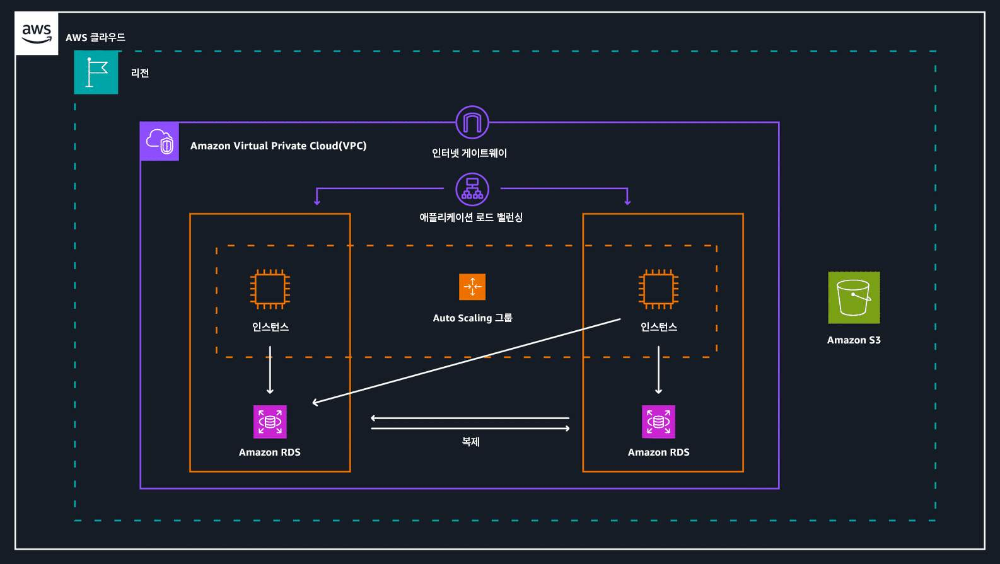

> 강의 6개 · 지식 점검 8문항 · 모듈 평가 10문항

---

## 1. 왜 필요한가

> 운영까지 된다. 그럼 돈은 얼마나 나가고 어떻게 통제하나?

앞 모듈까지 오면서 서버를 띄우는 법, 데이터를 넣는 법, 보안을 거는 법, 누가 무엇을 만졌는지 보는 법까지 살펴보았습니다.
그런데 이렇게 만든 환경은 **매달 청구서**로 돌아옵니다. 그리고 그 청구서는 아무도 보지 않으면 조용히 불어납니다.

이번 모듈에서는 두 가지 질문에 답해 보겠습니다.
첫째, **돈이 어디서 얼마나 나가고 그것을 어떤 도구로 보고 막는가**입니다.
비슷하게 생긴 도구가 여섯 개나 나오는데, 시험은 정확히 이 여섯 개를 서로 바꿔 놓고 물어봅니다.
둘째, **문제가 생겼을 때 누구에게 어떻게 도움을 받는가**입니다.
AWS Support 플랜 4단계는 CLF-C02에서 거의 매번 출제되는 단골이니 응답 시간까지 외워 두시기 바랍니다.

마지막으로 지금까지 배운 서비스들을 다시 꺼내서, **같은 아키텍처를 더 싸게 굴리는 방법**으로 마무리하겠습니다.

## 2. 이번에 새로 나오는 서비스

| 서비스 | 한 줄 | 이 모듈에서 맡는 역할 |
|---|---|---|
| [[aws-cost-explorer]] | 지나간 비용을 그래프로 분석한다 | **과거**를 본다 |
| [[aws-budgets]] | 예산을 정해 두고 넘으면 알린다 | **미래**를 막는다 |
| [[aws-cost-and-usage-report]] | 가장 상세한 원시 비용·사용 데이터를 내려준다 | 직접 파고들 때 |
| [[aws-pricing-calculator]] | 만들기 전에 견적을 낸다 | **쓰기 전**에 계산한다 |
| [[aws-support-plans]] | 기술 지원 수준을 4단계로 고른다 | 사람에게 물어볼 통로 |
| [[aws-marketplace]] | 서드 파티 소프트웨어를 사서 바로 배포한다 | 직접 만들지 않아도 될 때 |
| [[aws-compute-optimizer]] | 오버프로비저닝된 리소스를 찾아 준다 | 적정 규모 조정 |
| [[aws-health-dashboard]] | 내 리소스에 영향을 주는 AWS 이벤트를 알린다 | Basic부터 무료 |

여기에 모듈 10에서 이미 만난 [[aws-organizations]]가 **통합 결제**의 주인공으로 다시 등장합니다.

> [!tip] 이번 모듈의 큰 그림
> **요금 원칙**(어떻게 과금되나) → **Organizations 통합 결제**(청구서를 어디로 모으나) →
> **비용 도구 6종**(보고 막고 견적 내나) → **Support 플랜**(막히면 누구에게 묻나) → **비용 최적화**(같은 걸 더 싸게).

## 3. 강의 내용

---

### L1. AWS 요금의 3원칙과 비용의 동인

> **이번 강의에서 다룰 내용** — AWS가 요금을 매기는 세 가지 원칙과, 비용을 실제로 좌우하는 세 가지 동인을 짚어 보겠습니다.

#### 요금 3원칙

AWS는 대다수 서비스를 종량제로 제공합니다. 장기 계약이나 복잡한 라이선스 없이 쓴 만큼만 결제하시면 됩니다.
그 위에 두 가지 할인 원칙이 얹혀 있습니다.

| 원칙 | 무슨 뜻인가 | 어떤 워크로드에 맞나 | 문제 속 신호 |
|---|---|---|---|
| **종량제 (Pay-as-you-go)** | 선결제·약정 없이 실제 사용한 만큼만 지불합니다 | 요구 사항이 아직 확실하지 않을 때 | "약정 없이", "패턴을 모른다" |
| **약정을 통한 비용 절감** | 1년 또는 3년 동안 일정 사용량을 약정하면 상당한 할인을 받습니다 | 꾸준한 상태(steady-state) 워크로드 | "3년 동안 예측 가능한" |
| **사용량이 많을수록 비용 절감** | 사용량이 늘수록 **볼륨 기반 할인**으로 단위당 단가가 내려갑니다 | 규모가 큰 조직, 여러 계정 합산 | "규모가 커지면서 단가가" |

> [!warning] 뒤의 두 원칙을 헷갈리지 마세요
> - **약정을 통한 비용 절감** — **기간**을 약속해서 싸집니다 (절감형 플랜·예약 인스턴스)
> - **사용량이 많을수록 비용 절감** — **양**이 늘어서 싸집니다 (볼륨 할인, 계단식 요금)
>
> 문제에 "1년/3년"이 보이면 앞쪽, "많이 쓸수록 GB당 단가가 내려간다"가 보이면 뒤쪽입니다.

#### 비용의 3대 동인

서비스마다 요금 체계가 다르지만, AWS 비용은 결국 세 가지에서 나옵니다.

| 동인 | 무엇을 기준으로 과금하나 | 대표 서비스 | 실제 예 |
|---|---|---|---|
| **컴퓨팅** | 처리 용량 × **사용한 시간**(시간·초 단위) | [[amazon-ec2]], [[aws-lambda]], [[amazon-ecs]] | 예약하지 않았다면 인스턴스를 **시작한 시점부터 중지할 때까지** 요금이 붙습니다 |
| **스토리지** | **저장한 데이터 양과 기간** | [[amazon-s3]], [[amazon-ebs]] | EBS는 프로비저닝한 용량 기준, S3는 저장한 용량 기준입니다 |
| **아웃바운드 데이터 전송** | AWS **밖으로** 나가는 데이터 양(GB) | 거의 모든 서비스에서 발생 | S3에 올린 정적 웹 사이트를 누군가 열 때마다 데이터가 밖으로 나가면서 요금이 붙습니다 |

> [!warning] 인바운드는 무료, 아웃바운드가 과금입니다
> **들어오는(인바운드)** 데이터 전송과 **같은 리전 안의 AWS 서비스 간** 전송은 대부분 무료입니다.
> 요금이 붙는 쪽은 **나가는(아웃바운드)** 전송이고, 여러 서비스에서 발생한 양을 합산해 청구합니다.
> 그리고 아웃바운드도 **많이 보낼수록 GB당 단가가 내려갑니다.** 시험에서 "인바운드 데이터 전송"이 비용 동인 보기로 섞여 나오니 걸러내시기 바랍니다.

#### 스토리지는 요금 항목이 하나가 아닙니다

Amazon S3처럼 계층이 나뉜 서비스는 "저장 용량 요금" 하나로 끝나지 않습니다.
데이터를 얼마나 자주, 얼마나 빨리 꺼내야 하는지에 따라 최적화할 여지가 있다는 뜻이기도 합니다.

- 스토리지 요금
- 요청 및 데이터 검색 요금
- 데이터 전송 및 전송 가속화 요금
- 데이터 관리 및 분석 요금
- 복제 요금
- S3 객체 Lambda 처리 요금

```quiz 지식 점검 · 비용의 동인
Q. 여러분은 의료 회사에서 클라우드 엔지니어로 일하고 있습니다. 회사의 Chief Technology Officer가 환자 기록을 클라우드에 저장하고자 하며, 여러분에게 비용의 동인에 대해 질문합니다. 다음 중 AWS 클라우드의 주요 비용 동인을 가장 잘 설명한 답변은 무엇입니까?
- 비용의 주요 동인은 컴퓨팅, 스토리지, 데이터베이스, 네트워킹, 마이그레이션, 전송입니다.
- 유일한 비용 동인은 컴퓨팅입니다.
+ 요금은 다양한 서비스 범주의 영향을 받지만, 비용의 주요 동인은 컴퓨팅, 스토리지, 아웃바운드 데이터 전송입니다.
- 유일한 비용 동인은 스토리지입니다.
> 동인은 정확히 **세 가지 — 컴퓨팅 · 스토리지 · 아웃바운드 데이터 전송**입니다. 하나만 꼽는 선택지는 나머지 둘을 버리는 셈이라 오답이고, 데이터베이스·네트워킹·마이그레이션까지 나열한 선택지는 서비스 **범주**를 동인과 뒤섞어 놓은 것입니다.
```

---

### L2. AWS Organizations와 통합 결제

> **이번 강의에서 다룰 내용** — 계정이 여러 개일 때 청구서를 하나로 모으는 방법과, 그때 생기는 볼륨 할인 이점을 살펴보겠습니다.

#### 계정이 하나일 때와 여러 개일 때

계정이 하나면 이야기가 단순합니다. 그 계정에서 서비스를 쓰고, 그 계정으로 청구서를 받고, 매달 같은 일을 반복합니다.

하지만 부서·프로젝트·팀별로 계정을 나누기 시작하면 청구서도 계정 수만큼 늘어납니다.
**AWS Organizations의 통합 결제(consolidated billing)** 는 이 청구서들을 하나로 합쳐 줍니다.

```layers 통합 결제를 켜면 사용량은 각자 발생하고 청구서는 관리 계정 하나로 모입니다.
조직 (Organization) | AWS Organizations로 만듭니다 · 통합 결제의 단위
  루트 (Root) | 조직의 최상단. 여기에 건 정책은 아래 전부에 적용됩니다
    관리 계정 (Management account) | 조직을 만든 계정 · 청구서를 받는 **유일한** 계정
    조직 단위 (OU) — 개발 | 부서·환경·프로젝트 단위로 계정을 묶습니다
      멤버 계정 — dev-a | 사용량은 여기서 발생하고, 요금은 관리 계정으로 올라갑니다
      멤버 계정 — dev-b
    조직 단위 (OU) — 프로덕션 | OU 단위로 정책을 다르게 걸 수 있습니다
      멤버 계정 — prod-web
      멤버 계정 — prod-data
```

#### 통합 결제로 얻는 것

| 이점 | 구체적으로 |
|---|---|
| **청구서 하나** | AWS 청구서는 **관리 계정 소유자에게만** 갑니다. 멤버 계정의 요금은 전부 여기로 통합됩니다 |
| **지출 가시성** | 관리 계정에서 조직 전체의 AWS 지출을 한눈에 확인하고, 계정별로 분해해서 볼 수 있습니다 |
| **볼륨 할인 공유** | 계정별 사용량을 **합산해서** 계단식 요금 구간을 계산합니다. 혼자서는 못 넘던 할인 구간을 조직 전체가 함께 넘습니다 |
| **약정 할인 공유** | 한 계정이 산 **예약 인스턴스·절감형 플랜**의 미사용분이 조직 내 다른 계정에 적용됩니다 |
| **중앙 거버넌스** | 서비스 제어 정책(SCP)으로 계정이 쓸 수 있는 서비스를 제한할 수 있습니다 (모듈 10 참고) |

> [!tip] 볼륨 할인 공유를 한 문장으로
> 계정 다섯 개가 각각 10TB를 쓰면, 통합 결제에서는 **10TB 다섯 번이 아니라 50TB 한 번**으로 계산합니다.
> 그래서 계정을 잘게 나눠도 손해를 보지 않습니다.

```quiz 지식 점검 · 통합 결제
Q. 한 기업이 부서별로 AWS 계정을 따로 만들어 쓰고 있습니다. 회계 팀은 청구서를 하나로 받고 싶어 하고, 재무 팀은 계정을 나눈 탓에 볼륨 할인을 못 받는 것은 아닌지 걱정하고 있습니다. AWS Organizations의 통합 결제를 사용할 경우 얻는 결과로 옳은 것은 무엇입니까?
- 계정마다 청구서가 따로 발행되지만 총액만 관리 계정에 표시됩니다.
+ 청구서는 관리 계정으로 통합되고, 모든 계정의 사용량을 합산해 볼륨 할인을 적용받습니다.
- 멤버 계정의 리소스가 관리 계정으로 자동 이전됩니다.
- 계정별 사용량이 각각 따로 계산되므로 볼륨 할인은 계정 단위로만 적용됩니다.
> 통합 결제의 두 축은 **청구서 통합**과 **사용량 합산**입니다. 사용량을 합산하기 때문에 계정을 나눠도 할인 구간을 함께 넘을 수 있습니다. 리소스가 옮겨 가는 일은 없습니다. 통합되는 것은 **요금**이지 리소스가 아닙니다.
```

---

### L3. 비용 도구 6종 — 무엇을 언제 쓰나

> **이번 강의에서 다룰 내용** — 이름이 비슷해서 가장 많이 헷갈리는 비용 관리 도구들을 "문제 속 신호"로 갈라 보겠습니다.

**이 표가 이번 모듈에서 시험에 가장 많이 나오는 부분입니다.**

| 도구 | 하는 일 | 시점 | 문제 속 신호 |
|---|---|---|---|
| **AWS Billing Console**<br />(결제 대시보드) | 이번 달 **예상 지출** 개요, 서비스별 비용 분해, **인보이스 조회·다운로드**, 크레딧·할인 확인 | 지금 | "청구서를 보고 싶다", "인보이스", "이번 달 예상 요금" |
| [[aws-cost-explorer]] | **지나간 비용과 사용량을 시각화·분석**합니다. 서비스·연결 계정·태그별로 분해하고 추세를 예측합니다 | **과거** | "지난 3개월 추이", "어느 부서가 얼마 썼는지 **분석**", "비용을 시각화" |
| [[aws-budgets]] | 예산을 정해 두고 **한도에 가까워지거나 초과하면 알림**을 보냅니다. 자동 조치도 걸 수 있습니다 | **미래** | "**임곗값을 초과하면 경고**", "예산", "알림을 설정" |
| [[aws-cost-and-usage-report]] | **가장 상세한 원시 비용·사용 데이터**를 시간별·리소스별로 S3에 내려줍니다 | 과거 (원시) | "**가장 상세한**", "원시 데이터", "직접 쿼리하거나 BI 도구로 분석" |
| [[aws-pricing-calculator]] | **아직 만들지 않은** 구성의 예상 비용을 웹에서 견적 냅니다 | **사용 전** | "마이그레이션 **전에** 비용을 추정", "구성해 보고 견적" |
| **AWS Billing Conductor** | 실제 사용량 데이터를 **재구성해 사용자 지정 청구서**를 만듭니다 (쇼백·차지백, 재판매) | 청구 시 | "고객사·부서별로 **다른 요율로 청구**", "청구서를 다시 만들어야" |

> [!warning] Cost Explorer와 AWS Budgets — 여기서 갈립니다
> - **Cost Explorer** — **지난 비용을 봅니다.** 이미 쓴 돈을 그래프로 분석하는 도구입니다
> - **AWS Budgets** — **앞으로 넘으면 알립니다.** 한도를 정해 두고 경고를 보내는 도구입니다
>
> 문제에 "**초과하면 알림**", "임곗값", "예산"이 나오면 무조건 **AWS Budgets**입니다.
> "분석", "시각화", "어디에 얼마나 썼는지 확인"이 나오면 **Cost Explorer**입니다.

> [!warning] Pricing Calculator와 Cost Explorer도 자주 바뀝니다
> **아직 리소스를 만들지 않았다면** 실제 비용 데이터가 없으므로 Cost Explorer로는 아무것도 볼 수 없습니다.
> "**시작하기 전에** 비용을 예측한다"는 지문은 항상 **AWS Pricing Calculator**입니다.

#### 태그 — 비용을 분해하는 열쇠

**태그**는 AWS 리소스에 붙이는 메타데이터입니다. 프로젝트·부서·환경별로 태그를 달아 두면
Cost Explorer의 **태그 기반 비용 할당**으로 "어느 프로젝트가 얼마를 썼는지"를 바로 볼 수 있습니다.
AWS Budgets도 특정 서비스·비용 범주·**태그별로** 예산을 나눠서 걸 수 있습니다.

태그를 안 달아 두면 나중에 아무리 좋은 도구를 붙여도 **"EC2에 얼마"까지만 보이고 "누가 썼는지"는 보이지 않습니다.**

```quiz 지식 점검 · 예산 알림
Q. 한 정부 기관에서 AWS 클라우드 비용 관리를 시작하려 합니다. 이 기관에서는 비용이 특정 월의 특정 임곗값을 초과할 경우 이에 대해 경고하는 알림을 설정하려고 합니다. 이 태스크를 수행하려면 어떤 AWS 서비스를 사용해야 합니까?
- AWS Cost Explorer
+ AWS Budgets
- AWS Organizations
- AWS 요금 계산기
> "**임곗값을 초과하면 경고**"는 AWS Budgets의 전용 신호입니다. Cost Explorer는 **이미 쓴** 비용을 분석하는 도구라 앞으로 넘칠 일을 알려주지 못하고, 요금 계산기는 리소스를 만들기 **전** 견적용이며, Organizations는 계정을 묶고 청구서를 통합하는 서비스입니다.

Q. 한 회사가 아직 AWS에 아무것도 배포하지 않은 상태에서, 마이그레이션 후에 매달 얼마가 나갈지 경영진에게 보고해야 합니다. 어떤 도구를 사용해야 합니까?
- AWS Cost Explorer로 지난 6개월 비용 추세를 확인합니다.
- AWS Cost and Usage Report를 활성화해 시간별 사용량을 내려받습니다.
+ AWS Pricing Calculator로 필요한 서비스와 구성을 입력해 예상 비용을 산출합니다.
- AWS Budgets에 월 예산을 등록하고 알림을 설정합니다.
> 아직 **쓴 적이 없으므로 실제 비용 데이터 자체가 존재하지 않습니다.** 과거 데이터를 다루는 Cost Explorer와 Cost and Usage Report는 보여줄 것이 없고, Budgets는 지출이 시작된 뒤 한도를 감시하는 도구입니다. **사용 전 견적**은 언제나 Pricing Calculator입니다.
```

---

### L4. AWS Support 플랜 4단계

> **이번 강의에서 다룰 내용** — Support 플랜별로 무엇이 처음 생기는지, 응답 시간이 어떻게 짧아지는지 정확히 구분해 보겠습니다.

#### 플랜은 위로 갈수록 쌓입니다

각 플랜은 **아래 플랜의 모든 것을 포함**하고 그 위에 도구·전담 인력·더 짧은 응답 시간을 얹습니다.
그래서 외우실 것은 "이 플랜에 무엇이 다 있는지"가 아니라 **"이 플랜에서 처음 생기는 것이 무엇인지"** 입니다.

| | **Basic** | **Developer** | **Business** | **Enterprise** |
|---|---|---|---|---|
| **요금** | 모든 고객에게 **무료** | 유료 | 유료 | 유료 |
| **권장 대상** | 모든 AWS 고객 | AWS에서 **실험·테스트**하는 단계 | **프로덕션 워크로드**가 AWS에 있는 경우의 최소 티어 | **비즈니스·미션 크리티컬** 워크로드 |
| **기술 지원 창구** | 없음 (고객 서비스·문서·re:Post만) | **이메일** (업무 시간) | **24시간 연중무휴 전화·채팅·이메일** | 24시간 연중무휴 + 전담 인력 |
| **응답 시간** | — | 일반 안내 **24시간** 미만<br />시스템 손상 **12시간** 미만 | 프로덕션 시스템 손상 **4시간** 미만<br />프로덕션 시스템 중단 **1시간** 미만 | 비즈니스·미션 크리티컬 시스템 중단 **15분** 미만 |
| **Trusted Advisor** | **Core 검사**(기본 검사) | Core 검사 | **전체 검사** | 전체 검사 + 계정 팀의 우선순위 권장 사항 |
| **TAM** | 없음 | 없음 | 없음 | **지정 TAM** — 컨설팅·아키텍처·운영 지침 |
| **인프라 이벤트 관리** | 없음 | 없음 | **제공**(추가 요금) | 포함 |
| **Concierge 지원 팀** | 없음 | 없음 | 없음 | **제공**(결제·계정 전담) |

> [!info] Enterprise On-Ramp는 Business와 Enterprise 사이에 있습니다
> 프로덕션과 비즈니스 크리티컬 워크로드를 함께 운영하는 조직을 위한 중간 티어입니다.
> **비즈니스 크리티컬 시스템 중단 시 30분 미만** 응답이고, TAM은 지정이 아니라 **TAM 풀**에서 사전 예방적 지침을 제공합니다.
> Trusted Advisor는 이미 전체 검사입니다. 시험은 대부분 4단계만 묻지만, 30분이 보이면 이 티어라고 판단하시기 바랍니다.

#### 각 단계에서 "처음" 생기는 것

이 표만 외우셔도 Support 플랜 문제는 거의 다 풀립니다.

| 단계 | 여기서 **처음** 생기는 것 | 결정적 지문 |
|---|---|---|
| **Basic** | 문서·백서·[[aws-trusted-advisor]] **Core 검사**·[[aws-health-dashboard]] | "무료로 모든 고객에게" |
| **Developer** | **기술 지원팀에 직접 문의**(이메일) | "24시간 연중무휴는 필수가 아님", "12~24시간 내 대응", "실험 중" |
| **Business** | **24/7 전화·채팅 지원**, **Trusted Advisor 전체 검사**, 서드 파티 소프트웨어 지원, 인프라 이벤트 관리 | "프로덕션이 돌아간다", "전체 검사가 필요", "1시간 내 응답" |
| **Enterprise** | **지정 TAM**, **Concierge 지원 팀**, 15분 응답 | "미션 크리티컬", "15분", "전담 담당자" |

> [!warning] Trusted Advisor는 Business에서 갈립니다
> Basic과 Developer는 **Core 검사(기본 보안·서비스 한도 검사)만** 받습니다.
> **전체 검사**가 필요하다는 지문이 나오면 최소 **Business**입니다. "기본 Trusted Advisor 보안 검사면 충분하다"고 하면 Developer로 내려옵니다.

> [!warning] TAM은 돈으로 사는 사람이 아니라 티어로 붙는 사람입니다
> **Business에는 TAM이 없습니다.** TAM은 Enterprise On-Ramp에서 **풀 형태**로 처음 붙고,
> Enterprise에서 **고객 전담으로 지정**됩니다. "전담 기술 담당자"가 지문에 있으면 Enterprise입니다.

#### Support 플랜 밖의 지원 리소스

플랜과 별개로, AWS는 다음 리소스를 함께 제공합니다. **어느 것이 무료 자체 지원이고 어느 것이 사람이 붙는 유료 서비스인지**를 구분하는 문제가 나옵니다.

| 리소스 | 무엇인가 | 성격 |
|---|---|---|
| **AWS re:Post** | 커뮤니티 기반 Q&A 플랫폼입니다. 안에 **AWS Knowledge Center**(FAQ 기사·동영상)가 들어 있습니다 | 자체 지원 |
| **AWS 설명서** | 사용 설명서, **SDK 가이드**, 블로그 게시물, 백서 | 자체 지원 |
| **AWS Trust & Safety 센터** | AWS에서 일어나는 **부정 사용(abuse)이 의심되는 활동·콘텐츠를 신고**하는 창구입니다 | 신고 채널 |
| **AWS Solutions Architect** | **Business·Enterprise Support 고객**에게 아키텍처 지침과 모범 사례를 제공합니다 | 사람 |
| **AWS Professional Services** | 프로젝트 단위 **컨설팅 서비스**입니다. 복잡한 마이그레이션, **보안 감사**, 성능 튜닝을 지원합니다 | 사람(유료 컨설팅) |

> [!warning] Trust & Safety를 보안 컨설팅과 헷갈리지 마세요
> Trust & Safety 센터는 **"저 계정이 우리를 공격하는 것 같다"를 신고**하는 곳입니다.
> **"보안 모범 사례에 대해 조언을 듣고 우리 환경의 보안 감사를 받고 싶다"** 는 요구는 **AWS Professional Services**입니다.

```quiz 지식 점검 · Support 플랜 고르기
Q. 한 중견기업이 필요한 사항에 가장 적합한 AWS Support 수준을 결정하려 합니다. 이 회사의 요구 사항은 시기적절한 지원(24시간 연중무휴 지원은 필수가 아님), 기본적인 AWS Trusted Advisor 보안 검사, 모범 사례에 대한 일반 지침, 12~24시간 내의 인시던트 대응입니다. 이 회사가 선택해야 하는 AWS Support 플랜은 무엇입니까?
- Basic Support
+ Developer Support
- Business Support
- Enterprise Support
> 세 가지 조건이 정확히 Developer를 가리킵니다. **24/7이 필수가 아니고**(24/7은 Business부터), **기본 Trusted Advisor 검사면 충분하며**(전체 검사는 Business부터), **12~24시간 응답**(Developer의 응답 시간이 일반 안내 24시간·시스템 손상 12시간)입니다. Basic은 기술 지원 창구 자체가 없어서 인시던트 대응을 받을 수 없습니다.

Q. 한 대기업이 AWS에서 미션 크리티컬 애플리케이션을 운영하면서, 환경을 사전에 모니터링하고 최적화를 도와줄 **전담 기술 담당자**를 요구하고 있습니다. 어떤 조건이 충족되어야 이 요구가 만족됩니까?
- Business Support에 인프라 이벤트 관리를 추가하면 전담 TAM이 지정됩니다.
- Developer Support 이상이면 TAM이 배정됩니다.
+ Enterprise Support를 사용해야 고객 전담으로 지정된 TAM이 배정됩니다.
- Trusted Advisor 전체 검사를 활성화하면 TAM이 배정됩니다.
> **TAM은 Business에 포함되지 않습니다.** Enterprise On-Ramp에서 TAM 풀 형태로 처음 등장하고, **전담 지정 TAM**은 Enterprise에서만 제공됩니다. Trusted Advisor 전체 검사는 Business부터 열리는 별개의 기능이라 TAM과 관계가 없습니다.
```

---

### L5. AWS Marketplace와 AWS 파트너 네트워크

> **이번 강의에서 다룰 내용** — 필요한 소프트웨어를 사서 쓰는 곳과, AWS 위에서 함께 솔루션을 만드는 사람들을 구분해 보겠습니다.

#### AWS Marketplace — 사는 곳

**AWS Marketplace**는 AWS에서 실행되는 **서드 파티 소프트웨어를 검색·평가·구매·배포·관리**하는 큐레이팅된 디지털 카탈로그입니다.
Independent Software Vendor(ISV)의 리스팅 수천 개가 올라와 있고, 리스팅마다 요금 옵션과 다른 고객의 리뷰를 볼 수 있습니다.

| 항목 | 내용 |
|---|---|
| **무엇을 파나** | SaaS 애플리케이션, AMI·컨테이너 이미지 형태의 소프트웨어, **데이터세트·분석 도구**, 전문 서비스 |
| **어떤 분야** | 보안, 네트워킹, 스토리지, 기계 학습, 규정 준수 등 거의 모든 범주 |
| **요금 모델** | 무료·유료가 함께 있고, **종량제와 연간 구독** 같은 유연한 모델을 제공합니다 |
| **결제** | 구매 대금이 **AWS 계정 청구서에 통합**되므로 별도 조달 절차가 줄어듭니다 |
| **왜 쓰나** | 이미 있는 것을 다시 만드는 데 개발 시간을 쓰지 않아도 되므로 **총 소유 비용이 내려가고 도입이 빨라집니다** |

> [!warning] Marketplace에서 팔지 **않는** 것
> **온프레미스에 설치할 물리 하드웨어**는 팔지 않습니다. Marketplace는 AWS 위에서 돌아가는 소프트웨어·데이터·서비스의 카탈로그입니다.
> "클라우드 스토리지"나 "가상 머신" 같은 AWS 자체 인프라도 Marketplace 상품이 아니라 AWS 서비스입니다.

#### AWS 파트너 네트워크(APN) — 함께 만드는 사람들

**APN**은 AWS를 활용해 고객용 솔루션과 서비스를 만드는 **기술·컨설팅 기업들의 글로벌 파트너 프로그램**입니다.

고객 입장에서는, 예를 들어 소매 회사가 AWS로 웹 사이트를 호스팅한 다음
고급 분석과 기계 학습을 전문으로 하는 AWS 파트너와 협력해 개인화 기능을 붙이는 식으로 활용합니다.

파트너가 되면 다음과 같은 혜택을 받습니다.

- **자금 지원 혜택** — AWS 기반 솔루션을 개발·마케팅·판매할 수 있도록 크레딧과 할인을 제공합니다
- **교육 및 자격증** — 파트너 전용 과정과 자격증 리소스를 제공합니다
- **파트너 이벤트** — 웨비나·워크숍·오프라인 행사에 참여할 수 있습니다

> [!warning] Marketplace와 APN을 한 문장으로 갈라 두세요
> - **AWS Marketplace** — 소프트웨어를 **사는 곳**(카탈로그)
> - **AWS 파트너 네트워크** — 솔루션을 **함께 만드는 기업들의 프로그램**
>
> APN은 새로운 AWS 서비스를 개발하거나, 자격증을 발급하거나, 고객 지원을 제공하는 조직이 아닙니다. 그 셋은 각각 AWS 본사, AWS Training and Certification, AWS Support의 역할입니다.

```quiz 지식 점검 · AWS Marketplace
Q. 여러분은 성장 중인 기술 회사의 클라우드 솔루션 아키텍트입니다. 상사가 AWS Marketplace를 탐색하여 운영 효율성을 개선하고 비용을 절감할 솔루션을 찾아보라고 요청했습니다. AWS Marketplace에서 제공되는 옵션은 무엇입니까? (2개 선택)
+ 서비스형 소프트웨어(SaaS) 애플리케이션
+ 데이터세트 및 분석 도구
- 클라우드 스토리지
- 가상 머신(VM)
- 온프레미스 배포용 하드웨어 제품
> Marketplace는 ISV가 올린 **SaaS 애플리케이션**과 **데이터세트·분석 도구**를 구독 형태로 제공합니다. 클라우드 스토리지와 가상 머신은 Marketplace 상품이 아니라 Amazon S3·Amazon EC2 같은 **AWS 서비스 자체**이고, 물리 하드웨어는 애초에 취급하지 않습니다.
```

---

### L6. 비용 최적화 — 같은 아키텍처를 더 싸게

> **이번 강의에서 다룰 내용** — 지금까지 배운 서비스로 구성한 아키텍처에서 비용을 줄이는 실전 기법을 살펴보겠습니다.

VPC 안에 EC2 인스턴스와 RDS 데이터베이스가 있고, 옆에 S3 버킷이 붙어 있는 흔한 구성을 예로 들겠습니다.
이 구성에서 손댈 지점은 크게 네 군데입니다.



| 대상 | 최적화 기법 | 왜 싸지나 |
|---|---|---|
| **Amazon EC2** | **적정 규모 조정(right sizing)** — 워크로드 요구 사항에 맞게 인스턴스를 분석하고 조정합니다. [[aws-compute-optimizer]]가 오버프로비저닝된 리소스를 찾아 줍니다 | 안 쓰는 vCPU·메모리에 내던 돈이 사라집니다 |
| | **스팟 인스턴스** — 중단을 허용하는 워크로드에 씁니다 | 예비 용량을 쓰므로 온디맨드 대비 **최대 90%** 저렴합니다 |
| | **미사용 리소스 정리** — 방치된 EBS 볼륨·스냅샷·Elastic IP를 찾아 지웁니다 | 아무도 안 쓰는 리소스에 매달 나가던 요금이 멈춥니다 |
| **Auto Scaling** | 수요가 줄면 초과 용량을 **자동으로 제거**합니다 | 피크에 맞춰 켜 둔 인스턴스가 한가한 시간에 꺼집니다 |
| **Amazon RDS** | **적정 규모 조정 + 스토리지 오토 스케일링** | 오버프로비저닝과 언더프로비저닝을 둘 다 피합니다 |
| | **읽기 전용 복제본** — 읽기 트래픽을 수평으로 분산합니다 | 프라이머리를 **더 크고 비싼 인스턴스로 올릴 필요가 없어집니다** |
| | **캐싱** — [[amazon-elasticache]]에 자주 읽는 데이터를 올려 둡니다 | 프라이머리의 부하가 줄어 더 작은 인스턴스로 버팁니다 |
| **Amazon S3** | **스토리지 클래스 선택** — 1년에 한두 번 꺼내는 데이터는 S3 Glacier Deep Archive, 접근 패턴을 모르면 **S3 Intelligent-Tiering** | 접근 빈도에 맞는 단가를 적용받습니다 |
| | **수명 주기 정책** — 오래된 버전과 만료된 객체를 자동으로 옮기거나 지웁니다 | 30일만 쓸 백업에 10년 치 요금을 내는 일이 없어집니다 |
| **데이터 전송** | **VPC 엔드포인트** — 퍼블릭 인터넷을 거치지 않고 S3 같은 서비스에 프라이빗으로 연결합니다 | 아웃바운드·리전 외 전송 요금이 줄어듭니다 |
| | **AZ 간·인터넷 트래픽 최소화** 설계 | 데이터 전송은 항상 무료가 아니라는 점을 아키텍처에 반영합니다 |

> [!tip] 비용 최적화의 순서
> 1. **끄기** — 안 쓰는 리소스를 먼저 지웁니다. 가장 확실하고 가장 빨리 효과가 납니다
> 2. **줄이기** — 적정 규모 조정과 Auto Scaling으로 크기와 개수를 맞춥니다
> 3. **바꾸기** — 스토리지 클래스, 스팟, 캐싱처럼 더 싼 방식으로 갈아탑니다
> 4. **약정하기** — 그러고도 남는 꾸준한 사용량에 절감형 플랜·예약 인스턴스를 겁니다
>
> 순서를 거꾸로 하면 **낭비하고 있는 용량에 3년을 약정하는** 일이 벌어집니다.

이런 최적화의 대부분은 비용만 줄이는 것이 아니라 **성능과 안정성까지 함께 개선합니다.**
비용·성능·운영 효율 사이에서 최적의 지점을 찾는 것이 목표라고 기억해 두시기 바랍니다.

```quiz 지식 점검 · 비용 최적화
Q. 한 회사가 EC2 인스턴스의 CPU 사용률이 평균 8%에 머무는 것을 발견했습니다. 인스턴스는 항상 실행 중이어야 하고 중단을 허용할 수 없습니다. 가장 먼저 적용할 비용 최적화 기법은 무엇입니까?
- 스팟 인스턴스로 전환합니다.
+ AWS Compute Optimizer의 권장 사항을 참고해 인스턴스를 적정 규모로 조정합니다.
- Amazon S3 Intelligent-Tiering을 활성화합니다.
- VPC 엔드포인트를 생성합니다.
> CPU가 8%라는 것은 **너무 큰 인스턴스를 쓰고 있다**는 뜻이므로 적정 규모 조정이 정답이고, Compute Optimizer가 바로 그 판단을 도와주는 서비스입니다. 스팟은 **중단을 허용할 수 없다**는 조건에 정면으로 어긋나고, Intelligent-Tiering은 S3 스토리지, VPC 엔드포인트는 데이터 전송에 관한 기법이라 이 문제의 원인과 관계가 없습니다.
```

---

## 4. 모듈 평가

```exam
Q. 한 글로벌 금융 회사가 현재 IT 리소스를 온프레미스에 보유하고 있으며 AWS 클라우드를 평가하려 합니다. 이 회사는 고정된 자본 지출에 익숙하며 AWS 클라우드로 이전할 경우 요금 결제 방식이 어떻게 되는지 알고 싶어 합니다. 이 고객의 AWS 결제 방식을 가장 잘 설명한 항목은 무엇입니까? (3개 선택)
+ 종량제
+ 약정을 통한 비용 절감
+ 사용량이 많을수록 비용 절감
- 고정 비용을 사용하여 비용 절감
- 고정 계약 가입
- 전체 선결제
> AWS 요금은 세 원칙으로 정리됩니다. 기본은 **쓴 만큼 내는 종량제**이고, 1년·3년 동안 일정 사용량을 **약정하면** 할인을 받으며, 사용량이 늘어나면 **볼륨 기반 할인**으로 단가가 내려갑니다. 고정 비용·고정 계약·전체 선결제는 모두 온프레미스 조달 방식의 특징이며, AWS가 없애려는 대상이지 결제 방식이 아닙니다.

Q. 한 에듀테크 회사에서 교육 애플리케이션을 클라우드로 이전하는 방안을 고려하고 있습니다. 최고 재무 책임자(CFO)가 AWS 서비스의 요금이 어떻게 책정되고 어떤 요인이 비용을 좌우하는지 알고 싶어 합니다. 요금은 여러 요인에 따라 달라지지만, 다음 중 AWS의 기본 비용 동인은 무엇입니까? (3개 선택)
+ 컴퓨팅
+ 스토리지
+ 아웃바운드 데이터 전송
- 지원
- 인바운드 데이터 전송
- 보안
> 비용 동인은 **컴퓨팅 · 스토리지 · 아웃바운드 데이터 전송** 세 가지입니다. **인바운드 데이터 전송은 대부분 무료**라서 동인이 될 수 없고, 이 보기가 매번 함정으로 나옵니다. 지원은 Support 플랜 요금이지 사용량 기반 동인이 아니며, 보안 서비스 대부분은 별도 범주로 청구됩니다.

Q. 여러분은 조직 내의 서로 다른 부서에 있는 여러 AWS 계정의 비용을 모니터링하고 관리하려 하는 팀에 소속되어 있습니다. 이러한 계정의 결제 정보를 효과적으로 관리하고 통합하는 데 사용할 수 있는 AWS 서비스는 무엇입니까?
+ AWS Organizations
- AWS Budgets
- AWS Cost Explorer
- AWS 과금 정보 및 비용 관리 대시보드
> 여러 계정의 청구서를 **하나로 통합**하는 기능은 AWS Organizations의 **통합 결제**입니다. Budgets는 한도 초과 알림, Cost Explorer는 비용 분석, 결제 대시보드는 청구 내역 조회 도구라서 셋 다 계정을 묶는 일은 하지 못합니다. 계정을 묶어야 볼륨 할인 합산도 함께 따라온다는 점을 기억해 두세요.

Q. 한 온라인 소매 회사에서 애플리케이션 마이그레이션을 진행하려 하지만, 본격적으로 작업을 시작하기 전에 비용을 예측하고자 합니다. 필요한 특정 AWS 서비스 및 구성의 비용을 추정하는 데 사용할 수 있는 도구 또는 서비스는 무엇입니까?
+ AWS 요금 계산기는 이 회사가 고유한 비즈니스 요구 사항에 맞게 예상 비용을 구성하는 데 사용할 수 있는 웹 기반 도구입니다.
- AWS Organizations는 이 회사가 AWS 리소스를 확장하고 규모를 조정할 때 환경을 중앙에서 관리하고 통제하는 데 사용할 수 있는 서비스입니다.
- AWS Budgets를 통해 이 회사는 집계 사용률 및 담당률 지표를 모니터링할 수 있습니다.
- AWS Cost Explorer는 이 회사가 비용 및 사용량을 확인하고 분석하는 데 사용할 수 있는 도구입니다.
> 결정적인 단어는 "**시작하기 전에**"입니다. 아직 리소스가 없으니 실제 비용 데이터도 없고, 따라서 Cost Explorer로는 분석할 대상 자체가 없습니다. 사용 전 견적은 언제나 **AWS 요금 계산기(Pricing Calculator)** 입니다. Budgets는 지출이 시작된 뒤 한도를 감시하고, Organizations는 계정과 거버넌스를 다룹니다.

Q. 여러분은 AWS 기반의 미션 크리티컬 애플리케이션을 실행하는 대기업의 Chief Technology Officer입니다. 이 조직에는 미션 크리티컬 시스템이 중단된 경우 15분 이내에 응답하는 서비스를 비롯하여, 최고 수준의 지원이 필요합니다. 다음 중 어떤 AWS Support 플랜을 선택해야 합니까?
+ Enterprise Support
- Basic Support
- Developer Support
- Business Support
> **15분**이라는 응답 시간은 Enterprise Support에만 있습니다. Business는 프로덕션 중단 시 1시간, Developer는 시스템 손상 시 12시간이고, Basic은 기술 지원 창구 자체가 없습니다. Enterprise는 여기에 더해 **지정 TAM**과 Concierge 지원 팀까지 제공하므로 "최고 수준의 지원"이라는 표현과도 맞아떨어집니다.

Q. 여러분은 중견 전자 상거래 회사의 기술 책임자이며, AWS 인프라에 대한 다양한 지원 옵션을 평가하고 있습니다. 당면 과제에는 데이터베이스 성능 최적화와 인시던트 대응 계획이 포함되며, 보안 모범 사례에 대한 기술 컨설팅도 모색하는 중입니다. 일반적인 AWS Support 플랜 외에, 보안 모범 사례에 대한 조언을 얻고 AWS 환경의 보안 감사를 수행하는 데 가장 적합한 지원 옵션은 무엇입니까?
+ AWS Professional Services
- AWS Trust & Safety 팀
- AWS Basic Support
- AWS re:Post
> **보안 감사와 성능 튜닝 같은 프로젝트 단위 컨설팅**은 AWS Professional Services의 영역입니다. Trust & Safety 센터는 부정 사용이 의심되는 활동을 **신고**하는 창구이지 컨설팅 조직이 아니고, Basic Support에는 기술 지원 창구가 없으며, re:Post는 커뮤니티 Q&A라 감사를 수행해 주지 않습니다.

Q. AWS Support 플랜 및 그 밖의 기술 지원 옵션 외에, AWS에서는 자체 지원 리소스에 대한 액세스도 제공합니다. AWS 고객이 자체 지원 리소스로 사용할 수 있는 옵션은 무엇입니까? (3개 선택)
+ AWS 설명서(예: AWS 서비스에 대한 사용 설명서)
+ SDK 가이드
+ AWS Blog
- AWS Professional Services
- AWS Solutions Architect
- AWS Trust & Safety 센터
> 자체 지원(self-support)은 **사람을 거치지 않고 혼자 읽어서 해결하는 문서 리소스**를 말합니다. 사용 설명서, SDK 가이드, 블로그 게시물, 백서가 여기에 들어갑니다. Professional Services와 Solutions Architect는 사람이 붙는 지원이고, Trust & Safety 센터는 문서가 아니라 부정 사용 신고 채널이라 자체 지원 리소스가 아닙니다.

Q. 한 대기업에서는 업계 규정을 준수할 수 있도록 보장하는 규정 준수 소프트웨어 솔루션을 찾고 있습니다. 이 기업은 이 문제를 해결할 수 있는 AWS 서비스를 모색하고 있으며, 가능한 한 빨리 솔루션을 구현하고자 합니다. 이 기업의 요구 사항에 가장 적합한 옵션은 무엇입니까?
+ AWS Marketplace에서 규정 준수 지원 솔루션을 찾습니다.
- 사내에서 사용자 지정 솔루션을 개발합니다.
- AWS 설명서 같은 자체 지원 도구를 사용합니다.
- AWS Shield를 사용하여 분산 서비스 거부(DDoS) 공격으로부터 보호합니다.
> "**이미 있는 소프트웨어를 빨리 도입한다**"는 조건이 AWS Marketplace를 가리킵니다. 사내 개발은 "가능한 한 빨리"와 정반대이고, 설명서는 읽는 자료일 뿐 솔루션이 아니며, AWS Shield는 DDoS 방어 서비스라 규정 준수 소프트웨어와 무관합니다.

Q. AWS 파트너 네트워크(APN)의 역할을 가장 잘 설명한 옵션은 무엇입니까?
+ 기업이 AWS 기반 솔루션을 구축, 마케팅, 판매하도록 지원
- 새로운 AWS 서비스 및 기능 개발
- AWS 사용자를 위한 자격증 제공
- AWS 사용자에 대한 고객 지원 제공
> APN은 **AWS 위에서 솔루션을 만드는 기업들을 돕는 글로벌 파트너 프로그램**입니다. 새 서비스를 개발하는 것은 AWS 본사, 자격증을 발급하는 것은 AWS Training and Certification, 고객 지원을 제공하는 것은 AWS Support의 역할이라서 셋 다 APN의 정의와 다릅니다.

Q. AWS 파트너가 될 경우 제공되는 주요 이점을 가장 잘 설명한 옵션은 무엇입니까?
+ AWS 파트너 자금 지원 혜택
- 모든 AWS Training and Certification에 독점 액세스
- 모든 AWS 서비스 조기 이용
- 전용 AWS 하드웨어
> 파트너의 대표적인 이점은 솔루션을 **개발·마케팅·판매**할 수 있도록 지원하는 **자금 지원 혜택**(크레딧과 할인)입니다. 교육과 자격증 리소스는 제공되지만 "모든 과정에 독점 액세스"는 아니고, 모든 서비스의 조기 이용이나 전용 하드웨어 제공은 파트너 혜택에 포함되지 않습니다.
```

## 5. 여기까지의 지도

주황색이 이번 모듈에서 새로 나온 서비스입니다.

```mermaid
flowchart TB
 classDef new fill:#ff9900,stroke:#232f3e,stroke-width:2px,color:#111
 classDef old fill:#f4f6f8,stroke:#8a94a6,color:#5a6472
 subgraph S2["2. 클라우드 컴퓨팅"]
 direction LR
 AmazonEC2["Amazon EC2"]
 AmazonEC2AutoScaling["Amazon EC2 Auto Scaling"]
 ElasticLoadBalancing["Elastic Load Balancing"]
 AmazonSQS["Amazon SQS"]
 AmazonSNS["Amazon SNS"]
 AmazonEventBridge["Amazon EventBridge"]
 end
 class AmazonEC2,AmazonEC2AutoScaling,ElasticLoadBalancing,AmazonSQS,AmazonSNS,AmazonEventBridge old
 subgraph S3["3. 컴퓨팅 서비스 살펴보기"]
 direction LR
 AWSLambda["AWS Lambda"]
 AmazonECS["Amazon ECS"]
 AmazonEKS["Amazon EKS"]
 AWSElasticBeanstalk["AWS Elastic Beanstalk"]
 AWSBatch["AWS Batch"]
 AWSFargate["AWS Fargate"]
 AWSOutposts["AWS Outposts"]
 AmazonLightsail["Amazon Lightsail"]
 end
 class AWSLambda,AmazonECS,AmazonEKS,AWSElasticBeanstalk,AWSBatch,AWSFargate,AWSOutposts,AmazonLightsail old
 subgraph S4["4. 글로벌 시장 진출"]
 direction LR
 AWSCloudFormation["AWS CloudFormation"]
 end
 class AWSCloudFormation old
 subgraph S5["5. 네트워킹"]
 direction LR
 AmazonVPC["Amazon VPC"]
 AmazonConnect["Amazon Connect"]
 AWSDirectConnect["AWS Direct Connect"]
 AmazonCloudFront["Amazon CloudFront"]
 AmazonRoute53["Amazon Route 53"]
 AWSGlobalAccelerator["AWS Global Accelerator"]
 AWSTransitGateway["AWS Transit Gateway"]
 end
 class AmazonVPC,AmazonConnect,AWSDirectConnect,AmazonCloudFront,AmazonRoute53,AWSGlobalAccelerator,AWSTransitGateway old
 subgraph S6["6. 스토리지"]
 direction LR
 AmazonS3["Amazon S3"]
 AmazonEBS["Amazon EBS"]
 AmazonEFS["Amazon EFS"]
 AWSStorageGateway["AWS Storage Gateway"]
 AmazonFSx["Amazon FSx"]
 AmazonS3Glacier["Amazon S3 Glacier"]
 end
 class AmazonS3,AmazonEBS,AmazonEFS,AWSStorageGateway,AmazonFSx,AmazonS3Glacier old
 subgraph S7["7. 데이터베이스"]
 direction LR
 AmazonRDS["Amazon RDS"]
 AmazonDynamoDB["Amazon DynamoDB"]
 AmazonElastiCache["Amazon ElastiCache"]
 AmazonAurora["Amazon Aurora"]
 AWSBackup["AWS Backup"]
 AmazonDocumentDB["Amazon DocumentDB"]
 AmazonNeptune["Amazon Neptune"]
 end
 class AmazonRDS,AmazonDynamoDB,AmazonElastiCache,AmazonAurora,AWSBackup,AmazonDocumentDB,AmazonNeptune old
 subgraph S8["8. AI/ML 및 데이터 분석"]
 direction LR
 AmazonSageMaker["Amazon SageMaker"]
 AmazonEMR["Amazon EMR"]
 AmazonAthena["Amazon Athena"]
 AWSGlue["AWS Glue"]
 AmazonQuickSight["Amazon QuickSight"]
 AmazonRedshift["Amazon Redshift"]
 AmazonKinesis["Amazon Kinesis"]
 AmazonComprehend["Amazon Comprehend"]
 AmazonPolly["Amazon Polly"]
 AmazonLex["Amazon Lex"]
 end
 class AmazonSageMaker,AmazonEMR,AmazonAthena,AWSGlue,AmazonQuickSight,AmazonRedshift,AmazonKinesis,AmazonComprehend,AmazonPolly,AmazonLex old
 subgraph S9["9. 보안"]
 direction LR
 AWSIAM["AWS IAM"]
 AWSKMS["AWS KMS"]
 AmazonInspector["Amazon Inspector"]
 AWSSecurityHub["AWS Security Hub"]
 AWSShield["AWS Shield"]
 AmazonGuardDuty["Amazon GuardDuty"]
 AmazonMacie["Amazon Macie"]
 AWSCertificateManager["AWS Certificate Manager"]
 AWSWAF["AWS WAF"]
 AWSSystemsManager["AWS Systems Manager"]
 end
 class AWSIAM,AWSKMS,AmazonInspector,AWSSecurityHub,AWSShield,AmazonGuardDuty,AmazonMacie,AWSCertificateManager,AWSWAF,AWSSystemsManager old
 subgraph S10["10. AWS 클라우드에서의 모니터링, 규정 준수, 거버넌스"]
 direction LR
 AmazonCloudWatch["Amazon CloudWatch"]
 AWSCloudTrail["AWS CloudTrail"]
 AWSArtifact["AWS Artifact"]
 AWSTrustedAdvisor["AWS Trusted Advisor"]
 AWSOrganizations["AWS Organizations"]
 AWSControlTower["AWS Control Tower"]
 AWSConfig["AWS Config"]
 AWSServiceCatalog["AWS Service Catalog"]
 end
 class AmazonCloudWatch,AWSCloudTrail,AWSArtifact,AWSTrustedAdvisor,AWSOrganizations,AWSControlTower,AWSConfig,AWSServiceCatalog old
 subgraph S11["11. 요금 및 지원"]
 direction LR
 AWSMarketplace["AWS Marketplace"]
 AWSBudgets["AWS Budgets"]
 AWSSupportPlans["AWS Support Plans"]
 AWSCostExplorer["AWS Cost Explorer"]
 AWSCostAndUsageReport["AWS Cost and Usage Report"]
 AWSPricingCalculator["AWS Pricing Calculator"]
 AWSComputeOptimizer["AWS Compute Optimizer"]
 AWSHealthDashboard["AWS Health Dashboard"]
 end
 class AWSMarketplace,AWSBudgets,AWSSupportPlans,AWSCostExplorer,AWSCostAndUsageReport,AWSPricingCalculator,AWSComputeOptimizer,AWSHealthDashboard new
```



모듈 1에서 세운 세 가지 축에 이번 모듈을 얹으면 이렇게 정리됩니다.

| 축 | 이번 모듈에서의 답 |
|---|---|
| 비용 | 동인은 **컴퓨팅·스토리지·아웃바운드 전송**. 과거는 **Cost Explorer**, 미래는 **Budgets**, 사용 전은 **Pricing Calculator** |
| 가용성 | 문제가 났을 때 **얼마나 빨리 사람이 붙는지**가 Support 플랜으로 결정됩니다 (15분 / 1시간 / 12시간) |
| 책임 | 요금을 감시하고 낭비를 걷어내는 일은 **전적으로 고객 책임**입니다. AWS는 도구만 제공합니다 |

## 6. 셀프 체크

- [ ] AWS 요금 3원칙을 말하고, "약정"과 "볼륨 할인"을 구분할 수 있다
- [ ] 비용 동인 3가지를 말하고, 인바운드 전송이 왜 동인이 아닌지 설명할 수 있다
- [ ] 통합 결제가 청구서와 볼륨 할인에 각각 무슨 일을 하는지 말할 수 있다
- [ ] Billing Console · Cost Explorer · Budgets · CUR · Pricing Calculator · Billing Conductor를 문제 속 신호로 고를 수 있다
- [ ] "지난 비용을 본다"와 "앞으로 넘으면 알린다"로 Cost Explorer와 Budgets를 즉시 가를 수 있다
- [ ] Support 플랜 4단계의 응답 시간(24/12시간 · 4/1시간 · 15분)을 말할 수 있다
- [ ] Trusted Advisor 전체 검사와 TAM이 각각 어느 플랜에서 처음 생기는지 말할 수 있다
- [ ] AWS Marketplace와 AWS 파트너 네트워크의 역할을 한 문장씩 구분할 수 있다
- [ ] 아키텍처를 보고 EC2·RDS·S3·데이터 전송에서 각각 비용을 줄일 방법을 제시할 수 있다
- [ ] 위 `모듈 평가` 10문항을 다시 풀어 전부 맞혔다

확인 문제: [문제 풀이](/aws-clf-c02/quiz) · 틀린 것은 [[wrong-answers]]로.
