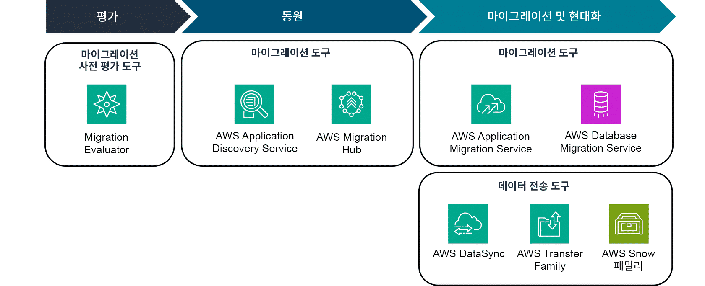
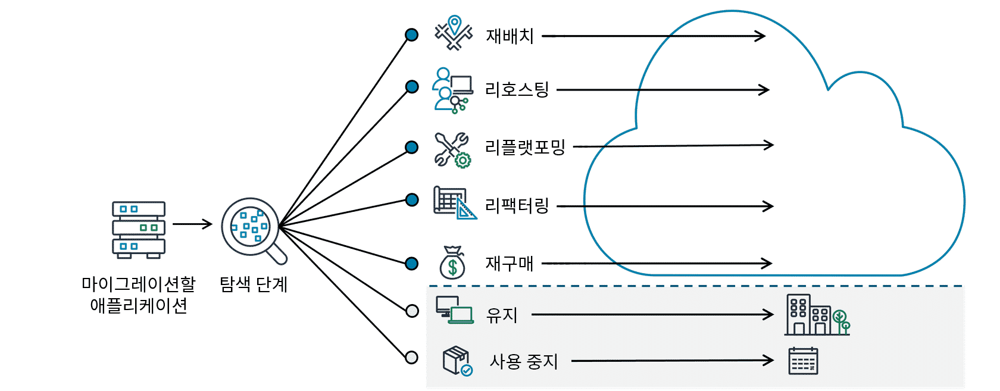

> 강의 7개 · 지식 점검 6문항 · 모듈 평가 9문항

---

## 1. 왜 필요한가

> 새로 만드는 건 다 배웠다. 이미 있는 시스템은 어떻게 옮기나?

지금까지는 **빈 계정에서 새로 만드는 이야기**만 했습니다. 그런데 현실의 회사에는 이미 돌아가는 시스템이 있습니다.
10년 된 데이터베이스, 누가 만들었는지 모르는 배치 스크립트, 라이선스 계약이 남아 있는 상용 소프트웨어까지요.
이것들을 **어떤 순서로, 무엇부터, 어디까지 바꿔서** 옮길지가 이번 모듈의 주제입니다.

마이그레이션은 한 번에 끝나는 작업이 아닙니다. 그래서 AWS는 세 가지 도구를 준비해 두었습니다.
조직을 어떻게 준비시킬지 알려주는 **프레임워크(AWS CAF)**, 애플리케이션마다 어디까지 손댈지 고르는 **7가지 전략(7R)**,
그리고 실제로 옮길 때 쓰는 **서비스들**입니다.

이번 모듈에서는 이 세 가지를 순서대로 짚어 보겠습니다.
특히 마지막에 나오는 데이터 전송에서는 **인터넷으로 보낼 것인가, 물리 장비에 담아 배송할 것인가**를 판단하는 기준까지 세워 보겠습니다.

## 2. 이번에 새로 나오는 서비스

| 서비스 | 한 줄 | 이 모듈에서 맡는 역할 |
|---|---|---|
| [[aws-migration-hub]] | 마이그레이션 진행 상황을 한곳에서 추적한다 | **어디까지 왔는지** 보는 관제탑 |
| [[aws-dms]] | 데이터베이스를 살아 있는 채로 옮긴다 | **데이터베이스** 이전 |
| [[aws-datasync]] | 온프레미스 ↔ AWS 데이터 이동을 자동화한다 | **파일·데이터**를 온라인으로 |
| [[aws-transfer-family]] | SFTP·FTPS·FTP로 S3와 파일을 주고받는다 | 기존 **프로토콜**을 그대로 쓸 때 |
| [[aws-snow-family]] | 물리 장비에 데이터를 담아 배송한다 | 네트워크로 **감당이 안 될 때** |

노트가 따로 없지만 시험에 그대로 나오는 도구가 네 가지 더 있습니다.

| 도구 | 한 줄 |
|---|---|
| **마이그레이션 평가기 (Migration Evaluator)** | 옮기면 얼마가 드는지 계산해 **비즈니스 사례**를 만들어 줍니다 |
| **AWS Application Discovery Service** | 온프레미스에 무엇이 있고 무엇에 물려 있는지 **조사**합니다 |
| **AWS Application Migration Service** | 서버·애플리케이션을 **실제로 옮깁니다** |
| **AWS Schema Conversion Tool (AWS SCT)** | 데이터베이스 **스키마와 코드를 다른 엔진 형식으로 번역**합니다 |

> [!tip] 이번 모듈의 큰 그림
> **얼마 드는지 계산(평가기)** → **무엇이 있는지 조사(Discovery Service)** → **어디까지 왔는지 추적(Migration Hub)** → **실제로 옮기기(Application Migration Service · DMS · DataSync · Transfer Family · Snow Family)**.
> 서비스 이름을 외우기보다 **마이그레이션 어느 단계에서 꺼내 드는 도구인지**로 묶어 두시면 문제에서 바로 갈라집니다.

## 3. 강의 내용

---

### L1. 클라우드 마이그레이션과 3단계 프로세스

> **이번 강의에서 다룰 내용** — 클라우드 마이그레이션이 무엇인지 정의하고, 대규모 마이그레이션이 거치는 3단계를 살펴보겠습니다.

#### 마이그레이션이란 무엇입니까

**클라우드 마이그레이션**은 조직의 디지털 자산 — IT 리소스, 애플리케이션, 데이터베이스 — 을
온프레미스 인프라에서 AWS 클라우드로 옮기는 과정을 말합니다.

여기서 먼저 기억하실 것이 하나 있습니다. **한 번에 끝나는 작업이 아닙니다.**
전략적 계획, 구현, 그리고 이전 이후의 지속적인 관리까지 이어지는 긴 과정입니다.
그래서 규모가 큰 기업일수록 **단계적으로, 점진적으로** 옮깁니다.

이미 다른 클라우드 서비스 공급자를 쓰고 있어도 마찬가지입니다. 그 워크로드도 언제든 AWS로 옮길 수 있습니다.

#### 3단계 프로세스

AWS는 마이그레이션을 세 단계로 나누어 안내합니다. 단계마다 꺼내 드는 도구가 다르다는 점이 핵심입니다.

| 단계 | 하는 일 | 이 단계의 도구 |
|---|---|---|
| **1. 평가 (Assess)** | 조직의 클라우드 준비 상태를 평가하고, 비즈니스 성과와 목표를 파악해 **마이그레이션의 비즈니스 사례**를 만듭니다 | 마이그레이션 평가기 |
| **2. 동원 (Mobilize)** | 마이그레이션 계획을 세우고 준비가 미흡했던 부분을 메웁니다. 애플리케이션 사이의 **상호 의존성**을 파악하는 일이 출발점입니다 | AWS Application Discovery Service · AWS Migration Hub |
| **3. 마이그레이션 및 현대화 (Migrate and modernize)** | 애플리케이션을 하나씩 아키텍팅·마이그레이션·검증합니다. **실행에 옮기는** 단계입니다 | AWS Application Migration Service · AWS DMS · DataSync · Transfer Family · Snow Family |



**AWS Migration Hub는 두 단계에 걸쳐 있습니다.** 동원 단계에서 리소스를 정리하는 데도 쓰이고,
마이그레이션이 시작된 뒤에는 진행 상황을 보는 관제탑으로도 계속 사용합니다.

혼자 다 하지 않아도 됩니다. 마이그레이션 및 현대화 단계에서는 **AWS 마이그레이션 및 현대화 컴피턴시 파트너**의 도움을 받을 수 있습니다.
사내에 전문가가 있다면 직접 옮겨도 좋습니다.

---

### L2. AWS Cloud Adoption Framework — 6가지 관점

> **이번 강의에서 다룰 내용** — AWS CAF가 무엇을 해결하는지, 그리고 6가지 관점이 각각 누구의 시각인지 정리해 보겠습니다.

#### 왜 프레임워크가 필요합니까

마이그레이션을 바라보는 시각은 **역할마다 완전히 다릅니다.**
개발자가 보는 마이그레이션과 클라우드 아키텍트, 비즈니스 분석가, 재무 분석가가 보는 마이그레이션은 서로 다른 그림입니다.

그래서 두 가지 문제가 생깁니다.
첫째, 사람마다 다른 이야기를 하고 있는데 같은 이야기를 하고 있다고 착각합니다.
둘째, 클라우드를 처음 접하는 조직은 **참여시켜야 할 역할 자체를 빠뜨립니다.**

**AWS Cloud Adoption Framework(AWS CAF)** 는 AWS Professional Services 팀이 만든 프레임워크로,
지침을 6가지 관점으로 나누어 **누가 무엇을 책임져야 하는지**를 정리해 줍니다.
각 관점에서 기술과 프로세스의 격차를 찾아내면, 그것이 **AWS CAF 실행 계획**의 재료가 됩니다.

#### 6가지 관점

앞의 셋(비즈니스·인력·거버넌스)은 **비즈니스 역량**, 뒤의 셋(플랫폼·보안·운영)은 **기술 역량**에 중점을 둡니다.

| 관점 | 역량 | 무엇을 챙깁니까 | 대표 역할 | 문제 속 신호 |
|---|---|---|---|---|
| **비즈니스** | 비즈니스 | IT 투자가 비즈니스 성과에 연결되도록 맞춥니다. 클라우드 채택의 **비즈니스 사례**를 만들고 우선순위를 정합니다 | 비즈니스 관리자, 재무 관리자, 예산 소유자, 전략 이해관계자 | "투자 근거", "예산", "어느 것부터 할지" |
| **인력** | 비즈니스 | 조직 구조·역할·필요한 기술의 격차를 파악해 **전사적인 변경 관리**를 준비합니다. 교육과 인력 충원을 계획합니다 | 인사(HR), 인력 충원 담당, 인력 관리자 | "**변경 관리 전략**", "교육", "채용", "조직 문화" |
| **거버넌스** | 비즈니스 | IT 전략을 비즈니스 전략에 맞추고, 클라우드 투자를 **측정·관리**해 위험을 최소화합니다 | CIO, 프로그램 관리자, Enterprise Architect, 비즈니스 분석가, 포트폴리오 관리자 | "위험 최소화", "포트폴리오 관리", "성과 측정" |
| **플랫폼** | 기술 | 새 솔루션을 구현하고 워크로드를 옮기는 **원칙과 패턴**을 정의합니다. **아키텍처 모델**로 IT 시스템의 구조를 설명합니다 | CTO, IT 관리자, Solutions Architect | "**아키텍처 모델**", "새 솔루션 구현", "워크로드 이전 패턴" |
| **보안** | 기술 | **가시성·감사 가능성·제어·민첩성**이라는 보안 목표를 충족시킵니다. 보안 통제를 체계적으로 고르고 구현합니다 | CISO, IT 보안 관리자, IT 보안 분석가 | "보안 통제", "감사 가능성" |
| **운영** | 기술 | 워크로드를 합의된 수준까지 **활성화·실행·사용·운영·복구**할 수 있게 만듭니다. 일·분기·연 단위 운영 절차를 정의합니다 | IT 운영 관리자, IT 지원 관리자 | "일상 운영", "복구", "운영 절차 변경" |

> [!warning] 비즈니스 · 거버넌스 · 인력이 매번 헷갈립니다
> - **비즈니스** — 돈을 **왜** 쓰는가. 투자 근거와 우선순위입니다
> - **거버넌스** — 잘 쓰고 있는지 **측정하고 통제**하는가. 위험 관리입니다
> - **인력** — **사람**을 어떻게 준비시키는가. 문제에 "**변경 관리**", "교육", "조직"이 나오면 인력입니다
>
> 마찬가지로 **플랫폼**과 **운영**도 갈라 두세요. 플랫폼은 **무엇을 어떻게 짓는가**(아키텍처), 운영은 **지어 놓은 것을 어떻게 굴리는가**(일상 운영)입니다.

```quiz 지식 점검 · CAF의 6가지 관점
Q. 클라우드에서 새로운 솔루션을 구현하고 온프레미스 워크로드를 클라우드의 새 플랫폼으로 마이그레이션하기 위한 원칙과 패턴이 포함된 AWS Cloud Adoption Framework(AWS CAF)의 관점은 무엇입니까? 다양한 아키텍처 모델을 사용하여 IT 시스템의 구조를 이해하고 전달합니다.
- 비즈니스 관점
+ 플랫폼 관점
- 운영 관점
- 인력 관점
> "**아키텍처 모델**"과 "새 솔루션을 구현하는 원칙과 패턴"이 곧 플랫폼 관점입니다. CTO와 Solutions Architect가 여기에 속합니다. 비즈니스 관점은 IT 투자를 비즈니스 성과에 맞추는 일, 운영 관점은 워크로드를 실행하고 복구하는 일상 절차, 인력 관점은 조직과 직원 기술을 클라우드에 맞게 준비시키는 일을 다룹니다.
```

---

### L3. 7가지 마이그레이션 전략 (7R)

> **이번 강의에서 다룰 내용** — 애플리케이션마다 어디까지 손댈지 고르는 7가지 전략을 정리하고, 시험에서 갈리는 지점을 짚어 보겠습니다.

애플리케이션을 클라우드로 옮길 때 선택지는 **일곱 가지**입니다. 이것을 **7R**이라고 부릅니다.
어느 하나를 골라 전체에 적용하는 것이 아니라, **애플리케이션마다 다른 전략을 섞어서** 쓰는 것이 보통입니다.

무엇으로 고를까요. 기존 애플리케이션의 복잡성, 비즈니스 목표, 시간 제약, 그리고 가용 리소스입니다.



위 그림에서 **점선 아래 두 가지(유지·사용 중지)는 클라우드로 올라가지 않는다**는 점을 눈여겨보시기 바랍니다.
7R 중 실제 마이그레이션 작업이 있는 것은 다섯 가지뿐입니다.

| 전략 | 무엇을 바꿉니까 | 노력 | 문제 속 신호 |
|---|---|---|---|
| **리호스팅 (Rehost)** | **아무것도 바꾸지 않습니다.** 기존 서버를 VM으로 전환해 거의 그대로 옮깁니다. **리프트 앤 시프트**라고도 합니다 | 가장 낮음 | "있는 그대로", "빠르게 대량으로", "리프트 앤 시프트", "최적화 없이도 최대 30% 절감" |
| **재배치 (Relocate)** | **호스팅 위치만** 바꿉니다. 이미 VM이나 컨테이너로 돌고 있던 워크로드를 통째로 옮깁니다 | 낮음 | "이미 VM/컨테이너로 실행 중", "위치만 옮긴다" |
| **리플랫포밍 (Replatform)** | **핵심 코드는 손대지 않고** 실행 기반만 최적화합니다. 예를 들어 MySQL을 코드 변경 없이 Amazon RDS나 Aurora로 옮깁니다. **리프트, 팅커 앤 시프트**라고도 합니다 | 낮음~중간 | "**코드 변경 없이**", "약간의 최적화", "관리 부담만 덜고 싶다" |
| **재구매 (Repurchase)** | **제품 자체를 바꿉니다.** 기존 라이선스를 버리고 SaaS로 갈아탑니다. **드롭 앤 숍**이라고도 합니다 | 중간 | "**다른 제품으로**", "SaaS 전환", "공급업체 변경", "Salesforce·AWS Marketplace" |
| **리팩터링 (Refactor)** | **새 코드를 씁니다.** 클라우드 네이티브 기능을 쓰도록 아키텍처를 다시 설계합니다. **리아키텍팅**이라고도 합니다 | **가장 높음** | "기존 환경에서는 **불가능한** 기능", "대대적인 재설계", "초기 비용이 가장 크다" |
| **유지 (Retain)** | 아무것도 하지 않고 **원래 자리에 둡니다** | 없음 | "지금 옮길 비즈니스 타당성이 없다", "곧 폐기 예정", "리팩터링 부담이 커서 나중으로 미룬다" |
| **사용 중지 (Retire)** | 옮기지 않고 **없앱니다** | 낮음 | "더 이상 사용되지 않는", "수명 종료 기회로 활용" |

> [!warning] 리호스팅 · 리플랫포밍 · 리팩터링 — 시험 단골입니다
> **"코드를 얼마나 건드리는가"** 한 축으로 세우시면 절대 헷갈리지 않습니다.
>
> | | 코드 | 아키텍처 | 예시 |
> |---|---|---|---|
> | **리호스팅** | 그대로 | 그대로 | 물리 서버를 EC2 인스턴스로 그대로 올립니다 |
> | **리플랫포밍** | 그대로 | 주변만 바꿉니다 | 자체 관리 MySQL을 Amazon RDS로 옮깁니다 |
> | **리팩터링** | **새로 씁니다** | **다시 설계합니다** | 모놀리식 앱을 Lambda·컨테이너 기반으로 재구성합니다 |
>
> **재배치와 리호스팅**도 붙여 두세요. 재배치는 **이미 가상화되어 있던 것**을 위치만 바꾸는 것이고,
> 리호스팅은 **물리 서버를 VM으로 전환하는 작업**이 들어갑니다.

> [!info] 사용 중지를 얕보지 마시기 바랍니다
> 엔터프라이즈 IT 포트폴리오의 워크로드 중 **10% 이상이 더 이상 사용되지 않는** 경우가 드물지 않습니다.
> 마이그레이션 계획을 이런 애플리케이션의 수명 종료 기회로 활용하면 옮길 대상 자체가 줄어듭니다.

```quiz 지식 점검 · 7가지 마이그레이션 전략
Q. 다음 중 다른 제품으로 전환하는 마이그레이션 전략은 무엇입니까?
- 리팩터링
- 사용 중지
- 리플랫포밍
+ 재구매
> "**다른 제품으로**"가 결정적입니다. 재구매는 기존 애플리케이션을 AWS Marketplace의 소프트웨어나 SaaS 같은 클라우드 기반 제품으로 **교체**하는 전략입니다. 리팩터링은 같은 애플리케이션을 클라우드 네이티브로 다시 개발하는 것이고, 리플랫포밍은 핵심 아키텍처를 그대로 둔 채 최적화만 하는 것이며, 사용 중지는 더 이상 쓰지 않는 애플리케이션을 제거하는 것이라 제품이 바뀌지 않습니다.
```

---

### L4. 마이그레이션 서비스와 도구

> **이번 강의에서 다룰 내용** — 마이그레이션 평가기, Application Discovery Service, Migration Hub, Application Migration Service가 각각 어느 상황에서 나오는지 구분해 보겠습니다.

이 네 가지는 이름이 비슷해서 문제에서 나란히 보기로 나옵니다.
**"고객이 지금 무엇을 못 하고 있는가"** 로 갈라내시면 됩니다.

| 도구 | 단계 | 한 줄 | 언제 씁니까 |
|---|---|---|---|
| **마이그레이션 평가기** | 평가 | 현재 IT 환경을 분석해 AWS로 옮겼을 때의 **예상 비용과 절감액**을 산출합니다 | 비용을 몰라서 **비즈니스 사례·자금 승인**을 못 만들 때. "CFO", "예산", "투자 근거"가 신호입니다 |
| **AWS Application Discovery Service** | 동원 | 온프레미스 서버 인벤토리와 **연결·의존 관계**, 구성·성능 정보를 자동으로 수집합니다 | 무엇이 무엇에 물려 있는지 몰라 계획을 못 세울 때. "탐색", "인벤토리", "상호 의존성"이 신호입니다 |
| **AWS Migration Hub** | 동원 ~ 마이그레이션 | 모든 마이그레이션 태스크와 진행 상황을 **한곳에서** 보여 줍니다 | "**중앙 집중식**", "한눈에", "**진행 상황 추적**", "누락 없이"가 신호입니다 |
| **AWS Application Migration Service** | 마이그레이션 및 현대화 | 애플리케이션을 **가동 중지 시간을 최소화**하면서 실제로 옮기고, 옮기는 김에 현대화합니다 | 실제 이전을 자동화할 때. "실제로 옮긴다", "현대화", "중단 최소화"가 신호입니다 |

> [!tip] 한 문장으로 구분하시면 됩니다
> **평가기는 얼마인지**, **Discovery Service는 무엇이 있는지**, **Migration Hub는 어디까지 왔는지**, **Application Migration Service는 실제로 옮기는 일**을 맡습니다.

```quiz 지식 점검 · 마이그레이션 도구 (1)
Q. 이제 막 마이그레이션을 시작한 고객이 있습니다. 그런데 이 고객은 마이그레이션의 타당성을 입증할 비즈니스 사례를 어떻게 구축해야 할지 잘 모르는 상태입니다. 이 요구 사항에 가장 잘 부합하는 솔루션은 무엇입니까?
+ 마이그레이션 평가기
- AWS Application Discovery Service
- AWS Application Migration Service
- AWS Migration Hub
> "**비즈니스 사례**"는 평가 단계의 언어이고, 그 단계의 도구가 마이그레이션 평가기입니다. 현재 환경을 분석해 예상 클라우드 비용과 절감액을 뽑아 주므로 이해관계자를 설득할 근거가 나옵니다. 나머지 셋은 각각 온프레미스 자산을 조사하는 도구, 실제로 옮기는 도구, 진행 상황을 추적하는 도구라서 비용 산출을 해 주지 않습니다.

Q. 한 고객이 모든 마이그레이션 태스크를 중앙 집중식으로 파악하고, 마이그레이션을 추적하는 데 도움이 되는 도구를 찾고 있습니다. 이 요구 사항에 가장 잘 부합하는 솔루션은 무엇입니까?
- 마이그레이션 평가기
- AWS Application Discovery Service
- AWS Application Migration Service
+ AWS Migration Hub
> "**중앙 집중식**"과 "**추적**"이 함께 나오면 Migration Hub입니다. 여러 도구와 팀이 동시에 움직이는 마이그레이션에서 태스크와 진행 상황을 한 화면으로 모아 주는 역할을 합니다. 비용을 산출하는 도구, 온프레미스 자산을 조사하는 도구, 실제 이전을 수행하는 도구는 각각 다른 일을 합니다.
```

---

### L5. 데이터베이스 마이그레이션 — AWS DMS와 AWS SCT

> **이번 강의에서 다룰 내용** — 동종 마이그레이션과 이기종 마이그레이션의 차이, 그리고 AWS DMS와 AWS SCT가 각각 무엇을 담당하는지 살펴보겠습니다.

#### 데이터베이스를 옮길 때 생기는 선택

데이터베이스를 클라우드로 옮기는 일은 아키텍처를 다시 손볼 좋은 기회이기도 합니다.
그래서 많은 회사가 이 기회에 **라이선스 비용을 줄이려고 상용 데이터베이스를 오픈 소스나 AWS 관리형으로 바꿉니다.**

바로 여기에서 난이도가 갈립니다.

| | **동종(homogeneous) 마이그레이션** | **이기종(heterogeneous) 마이그레이션** |
|---|---|---|
| 뜻 | 같은 엔진 → 같은 엔진 (MySQL → MySQL) | 다른 엔진 → 다른 엔진 (Oracle → Aurora) |
| 스키마 | 그대로 옮겨집니다 | **대상에서 다시 만들어야 합니다** |
| 애플리케이션 | 대체로 그대로 | **변경이 필요할 수 있습니다** |
| 필요한 도구 | **AWS DMS** 하나로 끝납니다 | **AWS SCT로 스키마 변환** → **AWS DMS로 데이터 이관** |

여기서 **스키마**는 데이터베이스 내부의 데이터 구조와 구성을 정의한 것입니다.
테이블 구조, 필드 유형, 항목 간 관계에 대한 **청사진**이라고 생각하시면 됩니다.
엔진이 바뀌면 이 청사진의 문법도 바뀌므로 번역이 필요해집니다.

#### AWS Database Migration Service (AWS DMS)

**데이터베이스를 AWS로 실제로 옮기는 서비스**입니다.
관계형 데이터베이스, 데이터 웨어하우스, NoSQL 데이터베이스, 분석 워크로드까지 옮길 수 있습니다.

실체는 **복제 소프트웨어를 실행하는 가상 머신**입니다. 소스와 대상 데이터베이스를 지정하고 태스크를 예약하면
DMS가 알아서 데이터를 뽑아 옮깁니다.

| 특징 | 왜 중요합니까 |
|---|---|
| **원본이 살아 있는 채로 복제** | 서비스를 내리지 않고 옮길 수 있습니다. 가동 중지 시간이 최소화됩니다 |
| **되돌리기 가능** | 문제가 생기면 원본 데이터베이스로 돌아갈 수 있습니다 |
| **다른 리전·AZ로 복제** | 마이그레이션뿐 아니라 재해 복구용 복제에도 씁니다 |
| **계획·평가·변환·마이그레이션을 한 도구에서** | 데이터베이스 이전 전체를 하나의 중앙 도구로 관리합니다 |

#### AWS Schema Conversion Tool (AWS SCT)

**소스 데이터베이스의 스키마와 코드를 대상 엔진과 호환되는 형식으로 변환**합니다.
테이블 정의뿐 아니라 저장 프로시저, 뷰, 함수 같은 **코드 객체**까지 번역 대상입니다.

자동으로 변환하지 못한 부분은 **수동 변환 대상으로 표시**해 주므로, 사람이 그 부분만 검토하면 됩니다.
모든 것을 손으로 다시 만드는 것과 비교하면 몇 주에서 몇 달이 줄어듭니다.

> [!warning] DMS와 SCT의 역할을 바꿔 놓은 보기가 나옵니다
> - **AWS DMS** — **데이터**를 옮깁니다. 데이터베이스 이전의 **주역**입니다
> - **AWS SCT** — **스키마와 코드**를 번역합니다. 이기종 마이그레이션에서만 등장하는 **조연**입니다
>
> 문제에 "데이터베이스 **개체를 변환**", "스키마", "저장 프로시저", "상용 → 오픈 소스"가 나오면 SCT입니다.
> "데이터베이스를 **마이그레이션**", "계획·평가·변환·마이그레이션을 하나의 도구로"가 나오면 DMS입니다.

```quiz 지식 점검 · 데이터베이스 마이그레이션
Q. 한 기업 고객이 온프레미스 데이터베이스를 AWS 클라우드로 마이그레이션하려 합니다. 이 고객은 라이선스 비용을 줄이기 위해 현재의 상용 데이터베이스를 오픈 소스 데이터베이스로 변경하는 데 관심이 있습니다. 모든 데이터베이스 개체를 새 데이터베이스 유형으로 변환하려면 도움이 필요합니다. 이 고객의 요구 사항에 가장 적합한 AWS 서비스는 무엇입니까?
- AWS Database Migration Service(AWS DMS)
+ AWS Schema Conversion Tool(AWS SCT)
- 마이그레이션 평가기
- AWS Migration Hub
> 엔진이 상용에서 오픈 소스로 바뀌는 **이기종 마이그레이션**이고, 지문이 요청하는 것은 "**데이터베이스 개체를 새 유형으로 변환**"하는 일입니다. 스키마와 코드 객체를 대상 엔진 문법으로 번역해 주는 것이 SCT의 역할입니다. DMS는 그다음 단계에서 데이터를 실제로 옮기는 서비스이고, 평가기는 비용 산출, Migration Hub는 진행 상황 추적이라 변환 작업을 수행하지 않습니다.
```

---

### L6. 데이터를 온라인으로 전송 — DataSync · Transfer Family · Direct Connect

> **이번 강의에서 다룰 내용** — 데이터를 인터넷으로 옮길 때 확인할 것들과, 세 가지 온라인 전송 서비스를 구분해 보겠습니다.

데이터베이스가 아닌 **일반 파일과 데이터**를 옮길 때는 다른 서비스를 씁니다.
그리고 옮기기 전에 네 가지를 반드시 확인하셔야 합니다.

| 확인할 것 | 질문 |
|---|---|
| **보안** | 데이터가 **안전하게** 도착합니까 |
| **데이터 검증** | 데이터가 **온전하게** 도착합니까 |
| **대역폭** | 이 회선으로 **감당이 됩니까** |
| **일정과 추적** | **언제** 보내는 것이 최적이고, 진행 상황을 볼 수 있습니까 |

#### 세 가지 온라인 전송 서비스

| 서비스 | 한 줄 | 언제 씁니까 | 문제 속 신호 |
|---|---|---|---|
| **AWS DataSync** | 온프레미스와 AWS 스토리지 사이의 데이터 이동을 **자동화하고 가속**합니다. 대역폭 제한, 마이그레이션 일정 예약, 태스크 필터링, 태스크 보고를 제공합니다 | **대부분의 온라인 데이터 마이그레이션 워크로드** | "**자동화**", "**일정 예약**", "피크 타임 이후", "**진행 상황·태스크 보고**" |
| **AWS Transfer Family** | **SFTP·FTPS·FTP** 등 표준 전송 프로토콜로 Amazon S3·Amazon EFS와 파일을 주고받는 완전관리형 서비스입니다 | 기존 파일 전송 **프로토콜을 그대로** 유지해야 할 때 | "**SFTP**", "**FTPS**", "프로토콜", "파일 전송 서버를 대체" |
| **AWS Direct Connect** | 온프레미스와 AWS를 잇는 **전용 프라이빗 회선**입니다 | 대역폭이 크고 안정적인 **연결 자체**가 필요할 때 | "**전용 프라이빗 연결**", "일관된 네트워크 성능" |

**전송 프로토콜**은 데이터가 한 위치에서 다른 위치로 이동하는 방식을 정한 규칙입니다.
회사가 이미 SFTP로 파트너와 파일을 주고받고 있다면, 그 방식을 그대로 두고 저장소만 S3로 바꾸고 싶어집니다.
Transfer Family가 정확히 그 자리를 채웁니다.

> [!warning] DataSync와 Transfer Family를 가르는 한 가지
> 지문에 **프로토콜 이름(SFTP·FTPS·FTP)** 이 등장하면 **Transfer Family**입니다.
> 프로토콜 이야기 없이 **자동화·일정 예약·보고**만 나오면 **DataSync**입니다.
> Direct Connect는 데이터 전송 도구가 아니라 **회선**이라는 점도 구분해 두세요.

```quiz 지식 점검 · 온라인 데이터 전송
Q. 한 의료 회사가 온프레미스 스토리지와 Amazon S3 사이에서 대량의 데이터를 마이그레이션하려 합니다. 이 회사는 프로세스를 자동화하고, 피크 타임이 끝난 시간대로 마이그레이션 일정을 예약할 수 있기를 원하며, 진행 상황 및 태스크 보고를 확인할 수 있기를 원합니다. 이 고객의 데이터 전송 요구 사항을 가장 잘 충족하는 서비스는 무엇입니까?
+ AWS DataSync
- AWS Transfer Family
- AWS Direct Connect
- 인터넷을 사용한 전송, AWS 서비스 불필요
> "**자동화 · 일정 예약 · 태스크 보고**" 세 가지가 DataSync의 기능 목록 그대로입니다. Transfer Family는 SFTP 같은 프로토콜을 지원하는 것이 목적인데 지문에 프로토콜 이야기가 없고, Direct Connect는 전용 회선이라 일정 예약이나 태스크 보고를 제공하지 않습니다. 서비스 없이 그냥 인터넷으로 보내면 자동화도, 검증도, 보고도 직접 만들어야 합니다.
```

---

### L7. 데이터를 오프라인으로 전송 — AWS Snow Family

> **이번 강의에서 다룰 내용** — 인터넷으로 보낼지 물리 장비로 배송할지 판단하는 기준을 세우고, Snow Family 디바이스를 용량 순으로 정리해 보겠습니다.

#### 언제 네트워크를 포기합니까

온라인 전송이 늘 정답은 아닙니다. 다음 두 경우에는 **물리 장비에 담아 배송하는 편이 빠릅니다.**

| 상황 | 왜 오프라인입니까 |
|---|---|
| **대역폭이 없거나 부족합니다** | 인터넷이 없는 외딴 지역, Direct Connect도 끌 수 없는 현장(선박, 시추 시설, 오지 연구소) |
| **데이터가 너무 큽니다** | 페타바이트급 데이터를 인터넷으로 보내면 **장비를 트럭에 실어 보내는 것보다 오래 걸립니다** |

판단 기준은 결국 **데이터 크기 ÷ 사용 가능한 대역폭 = 걸리는 시간**입니다. 대략적인 감을 잡아 두세요.

| 옮길 데이터 | 100Mbps 회선 | 1Gbps 회선 | 판단 |
|---|---|---|---|
| 1TB | 약 1일 | 약 3시간 | **온라인**으로 충분합니다 |
| 10TB | 약 열흘 | 약 하루 | 상황에 따라 갈립니다 |
| 100TB | 약 3개월 | 약 열흘 | **오프라인을 검토**하십시오 |
| 1PB 이상 | 사실상 불가능합니다 | 약 3개월 | **오프라인**입니다 |

> [!tip] 문제에서 고르는 법
> - "대역폭이 제한적", "인터넷이 없는 외딴 지역", "**페타바이트**" → **Snow Family (오프라인)**
> - "자동화", "일정 예약", "**온라인** 마이그레이션 솔루션" → **DataSync (온라인)**
>
> 지문이 "**온라인** 솔루션은 무엇입니까"라고 못 박아 두면, 아무리 데이터가 커도 Snowball은 답이 될 수 없습니다.

#### AWS Snow Family

AWS가 물리 디바이스를 보내 주면, 거기에 데이터를 채워 다시 보내고, AWS가 그 데이터를 클라우드에 올려 줍니다.
디바이스는 **용량과 목적**으로 나뉩니다.

| 디바이스 | 용량 | 성격 | 언제 씁니까 |
|---|---|---|---|
| **AWS Snowcone** | **8TB(HDD) / 14TB(SSD)** | 2kg 남짓, 손에 들리는 크기 | 데이터가 수 TB이고 **공간·전원이 제한된 현장**(드론, 차량, 소형 사무실) |
| **AWS Snowball Edge Storage Optimized** | 사용 가능 **약 80TB** | 스토리지 중심. 약간의 컴퓨팅도 제공합니다 | **수십~수백 TB의 대량 데이터 일괄 이전.** 시험에 가장 자주 나옵니다 |
| **AWS Snowball Edge Compute Optimized** | 약 **42TB** | 컴퓨팅 중심. GPU 옵션이 있습니다 | 연결이 끊긴 현장에서 **옮기기 전에 처리까지** 해야 할 때 |
| **AWS Snowmobile** | 최대 **100PB** | 45피트 컨테이너를 실은 **트럭** | **엑사바이트급** 데이터 센터를 통째로 이전할 때 |

> [!info] 용량 순서만 기억하시면 됩니다
> **Snowcone(TB 단위) < Snowball Edge(수십 TB) < Snowmobile(PB 단위)** 라는 자릿수 감각이 전부입니다.
> 문제는 "8TB짜리를 골라라"가 아니라 "**이 규모면 어느 장비냐**"를 묻습니다.
> (Snowmobile은 현재 신규 주문을 받지 않지만, 시험 자료에는 PB~EB급 이전 수단으로 그대로 남아 있습니다.)

Snow Family 디바이스는 전송 중 데이터를 암호화하고 물리적으로도 잠겨 있으므로,
민감한 데이터를 배송한다는 점 때문에 걱정하실 필요는 없습니다.

---

## 4. 모듈 평가

```exam
Q. 마이그레이션 팀은 조직이 성공적인 클라우드 도입을 위해 전사적인 변경 관리 전략을 고려하고 있는지 확인하려 합니다. 이 팀이 사용하게 될 Cloud Adoption Framework(CAF) 관점은 무엇입니까?
- 비즈니스
+ 인력
- 보안
- 운영
> "**전사적인 변경 관리 전략**"은 사람에 대한 이야기이므로 인력 관점입니다. 인력 관점은 조직 구조와 역할, 새로 필요한 기술을 평가해 격차를 찾고 교육·인력 충원·조직 변경의 우선순위를 정합니다. 비즈니스 관점은 IT 투자를 비즈니스 성과에 맞추는 일, 보안 관점은 가시성·감사 가능성·제어 같은 보안 목표, 운영 관점은 워크로드를 실행하고 복구하는 일상 절차를 다룹니다.

Q. AWS Cloud Adoption Framework(AWS CAF)의 주요 기능은 무엇입니까?
+ 마이그레이션 여정을 가속화하고, 리소스를 구성하며, 전환 도중 관리 작업을 조정하는 데 도움이 되는 도구를 제공합니다.
- 온프레미스 데이터베이스 및 데이터를 AWS 클라우드로 마이그레이션합니다.
- 이 서비스는 회사가 AWS 클라우드로 마이그레이션하는 작업을 관리하는 중앙 집중식 허브 역할을 합니다.
- 이를 7R 또는 7가지 마이그레이션 전략이라고도 합니다.
> CAF는 데이터를 옮기는 서비스가 아니라 **조직을 준비시키는 프레임워크**입니다. AWS의 경험과 모범 사례를 6가지 관점으로 정리해 마이그레이션 여정을 안내합니다. 데이터베이스와 데이터를 실제로 옮기는 것은 AWS DMS, 중앙 집중식 허브 역할은 AWS Migration Hub, 7R은 애플리케이션별 마이그레이션 전략이라 각각 다른 것을 설명하고 있습니다.

Q. 고객이 AWS 클라우드로 마이그레이션할 때 일반적으로 사용되는 7가지 마이그레이션 전략은 무엇입니까?
- 재배치, 수정, 개조, 리팩터링, 재분류, 리툴링, 제거
- 비즈니스, 인력, 거버넌스, 플랫폼, 보안, 운영, IT
+ 재배치, 리호스팅, 리플랫포밍, 리팩터링, 재구매, 유지, 사용 중지
- 7개가 아닌 3개가 있습니다(평가, 동원, 마이그레이션 및 현대화).
> 7R은 **재배치(Relocate) · 리호스팅(Rehost) · 리플랫포밍(Replatform) · 리팩터링(Refactor) · 재구매(Repurchase) · 유지(Retain) · 사용 중지(Retire)** 입니다. 비즈니스·인력·거버넌스·플랫폼·보안·운영은 CAF의 6가지 관점이고, 평가·동원·마이그레이션 및 현대화는 마이그레이션 프로세스의 3단계라서 전혀 다른 목록입니다. 세 가지 목록을 섞어 놓는 문제이므로 각각 **7개·6개·3개**라는 개수로 먼저 걸러내시면 편합니다.

Q. 한 소매 회사에서 이제 막 AWS 클라우드로 마이그레이션하는 작업을 시작하려 합니다. 이 회사의 최고 재무 책임자(CFO) 및 이해관계자로부터 자금 지원을 받으려면 비즈니스 사례를 구축하는 데 도움이 필요합니다. 이 고객의 요구 사항에 가장 잘 부합하는 마이그레이션 서비스는 무엇입니까?
+ 마이그레이션 평가기
- AWS Application Discovery Service
- AWS Application Migration Service
- AWS Migration Hub
> "**CFO**", "**자금 지원**", "**비즈니스 사례**"는 전부 평가 단계의 언어입니다. 마이그레이션 평가기는 현재 IT 환경을 분석해 예상 클라우드 비용과 잠재 절감액을 산출하므로 투자 근거를 만들 수 있습니다. Application Discovery Service는 서버 인벤토리와 의존 관계를 수집하고, Application Migration Service는 실제 이전을 수행하며, Migration Hub는 진행 상황을 추적하므로 비용 산출을 대신해 주지 않습니다.

Q. 한 미디어 회사가 마이그레이션의 마이그레이션 및 현대화 단계에 있으며, 중앙 집중식 위치에서 마이그레이션 태스크 및 진행 상황을 확인하고자 합니다. 이 고객의 요구 사항에 가장 잘 부합하는 마이그레이션 서비스는 무엇입니까?
- 마이그레이션 평가기
- AWS Application Discovery Service
- AWS Application Migration Service
+ AWS Migration Hub
> "**중앙 집중식 위치**"와 "**진행 상황 확인**"이 함께 나오면 Migration Hub입니다. Migration Hub는 동원 단계에서 리소스를 정리하는 데도 쓰이지만, 마이그레이션 및 현대화 단계에서 태스크와 진척을 한 화면으로 모아 보는 관제탑 역할을 계속합니다. 비용을 산출하는 도구, 온프레미스 자산을 조사하는 도구, 실제로 서버를 옮기는 도구는 모두 추적 화면을 제공하지 않습니다.

Q. 한 환경 기관에서 애플리케이션을 AWS 클라우드로 마이그레이션하려 합니다. 그리고 마이그레이션 과정에서 애플리케이션을 현대화하고 비용을 절감할 방법도 모색하고자 합니다. 이 고객의 요구 사항에 가장 잘 부합하는 마이그레이션 서비스는 무엇입니까?
- 마이그레이션 평가기
- AWS Application Discovery Service
+ AWS Application Migration Service
- AWS Migration Hub
> **애플리케이션을 실제로 옮기면서 현대화까지** 하는 도구는 Application Migration Service입니다. 마이그레이션 및 현대화 단계의 실행 도구이고, 가동 중지 시간을 최소화하면서 이전을 자동화하는 것이 특징입니다. 평가기는 비용 산출, Application Discovery Service는 사전 조사, Migration Hub는 진행 상황 추적이라 어느 것도 애플리케이션 자체를 옮기지 않습니다. **"조사·계산·추적"과 "실제로 옮기기"를 구분**하는 것이 이 문제의 핵심입니다.

Q. 향후 마이그레이션 과정에서 데이터베이스 관리자는 데이터베이스 관리 업무의 일부 부담을 덜기 위해, 현재 데이터베이스에서 AWS 관리형 데이터베이스로 전환하려 합니다. 그리고 데이터베이스를 계획, 평가, 변환, 마이그레이션하기 위한 도구도 사용하고자 합니다. 이 고객의 요구 사항에 가장 잘 부합하는 마이그레이션 솔루션은 무엇입니까?
+ AWS Database Migration Service(AWS DMS)
- AWS Schema Conversion Tool(AWS SCT)
- AWS Migration Hub
- 마이그레이션 평가기
> 지문이 요구하는 것은 **계획·평가·변환·마이그레이션을 하나의 도구로** 처리하는 것이고, 그 범위를 모두 덮는 것이 AWS DMS입니다. 원본 데이터베이스가 켜져 있는 동안에도 복제할 수 있어 가동 중지 시간도 줄어듭니다. AWS SCT는 스키마와 코드 객체를 번역하는 **보조 도구**라 이관 자체를 수행하지 않고, Migration Hub는 진행 상황 추적, 평가기는 비용 산출이라 데이터베이스를 옮기지 못합니다.

Q. 한 신용 카드 회사가 온프레미스 스토리지에서 AWS 클라우드로 대량의 민감한 데이터를 마이그레이션하려 합니다. 이 회사는 피크 타임이 끝난 시간대에 프로세스를 자동화하고 마이그레이션을 예약하고자 합니다. 그리고 진행 상황 및 태스크 보고도 확인할 수 있기를 원합니다. 이 회사는 데이터 센터와 AWS 클라우드 간에 전용 프라이빗 연결이 없습니다. 이 고객의 요구 사항을 충족할 만한 온라인 마이그레이션 솔루션은 무엇입니까?
+ AWS DataSync
- AWS Transfer Family
- 가상 프라이빗 게이트웨이
- AWS Snowball Edge Storage Optimized 디바이스
> "**자동화 · 일정 예약 · 진행 상황 및 태스크 보고**"는 DataSync의 기능 설명 그대로입니다. Transfer Family는 SFTP·FTPS 같은 프로토콜을 제공하는 것이 목적인데 지문에 프로토콜 요구가 없고, 가상 프라이빗 게이트웨이는 VPN 연결의 AWS 쪽 종단점이라 데이터 이관 도구가 아닙니다. Snowball Edge는 물리 장비를 배송하는 오프라인 방식이라 "**온라인** 마이그레이션 솔루션"이라는 조건에서 바로 걸러집니다.

Q. 한 엔지니어링 회사가 온프레미스 데이터 센터에서 AWS 클라우드로 대량의 독점적인 지적 재산권 설계 파일을 마이그레이션하려 합니다. 이 회사는 Secure File Transfer Protocol(SFTP) 및 File Transfer Protocol Secure(FTPS) 같은 서로 다른 여러 프로토콜을 사용하여 보안 파일 전송을 지원하는 완전관리형 서비스를 원합니다. 이 고객의 요구 사항을 충족할 만한 온라인 마이그레이션 솔루션은 무엇입니까?
- AWS DataSync
+ AWS Transfer Family
- AWS Direct Connect
- AWS Snowball Edge Storage Optimized 디바이스
> 지문에 **전송 프로토콜 이름(SFTP·FTPS)** 이 직접 등장하면 Transfer Family입니다. 표준 프로토콜로 Amazon S3·Amazon EFS와 파일을 주고받는 완전관리형 서비스이기 때문입니다. DataSync는 자체 에이전트로 데이터를 옮기는 방식이라 SFTP 엔드포인트를 제공하지 않고, Direct Connect는 전용 회선이지 파일 전송 서비스가 아니며, Snowball Edge는 오프라인 장비라 온라인 조건에 맞지 않습니다. **바로 앞 문제와 나란히 놓고 "프로토콜이 나왔는가"로 갈라 보시기 바랍니다.**
```

## 5. 여기까지의 지도

주황색이 이번 모듈에서 새로 나온 서비스입니다.

```mermaid
flowchart TB
 classDef new fill:#ff9900,stroke:#232f3e,stroke-width:2px,color:#111
 classDef old fill:#f4f6f8,stroke:#8a94a6,color:#5a6472
 subgraph S2["2. 클라우드 컴퓨팅"]
 direction LR
 AmazonEC2["Amazon EC2"]
 AmazonEC2AutoScaling["Amazon EC2 Auto Scaling"]
 ElasticLoadBalancing["Elastic Load Balancing"]
 AmazonSQS["Amazon SQS"]
 AmazonSNS["Amazon SNS"]
 AmazonEventBridge["Amazon EventBridge"]
 end
 class AmazonEC2,AmazonEC2AutoScaling,ElasticLoadBalancing,AmazonSQS,AmazonSNS,AmazonEventBridge old
 subgraph S3["3. 컴퓨팅 서비스 살펴보기"]
 direction LR
 AWSLambda["AWS Lambda"]
 AmazonECS["Amazon ECS"]
 AmazonEKS["Amazon EKS"]
 AWSElasticBeanstalk["AWS Elastic Beanstalk"]
 AWSBatch["AWS Batch"]
 AWSFargate["AWS Fargate"]
 AWSOutposts["AWS Outposts"]
 AmazonLightsail["Amazon Lightsail"]
 end
 class AWSLambda,AmazonECS,AmazonEKS,AWSElasticBeanstalk,AWSBatch,AWSFargate,AWSOutposts,AmazonLightsail old
 subgraph S4["4. 글로벌 시장 진출"]
 direction LR
 AWSCloudFormation["AWS CloudFormation"]
 end
 class AWSCloudFormation old
 subgraph S5["5. 네트워킹"]
 direction LR
 AmazonVPC["Amazon VPC"]
 AmazonConnect["Amazon Connect"]
 AWSDirectConnect["AWS Direct Connect"]
 AmazonCloudFront["Amazon CloudFront"]
 AmazonRoute53["Amazon Route 53"]
 AWSGlobalAccelerator["AWS Global Accelerator"]
 AWSTransitGateway["AWS Transit Gateway"]
 end
 class AmazonVPC,AmazonConnect,AWSDirectConnect,AmazonCloudFront,AmazonRoute53,AWSGlobalAccelerator,AWSTransitGateway old
 subgraph S6["6. 스토리지"]
 direction LR
 AmazonS3["Amazon S3"]
 AmazonEBS["Amazon EBS"]
 AmazonEFS["Amazon EFS"]
 AWSStorageGateway["AWS Storage Gateway"]
 AmazonFSx["Amazon FSx"]
 AmazonS3Glacier["Amazon S3 Glacier"]
 end
 class AmazonS3,AmazonEBS,AmazonEFS,AWSStorageGateway,AmazonFSx,AmazonS3Glacier old
 subgraph S7["7. 데이터베이스"]
 direction LR
 AmazonRDS["Amazon RDS"]
 AmazonDynamoDB["Amazon DynamoDB"]
 AmazonElastiCache["Amazon ElastiCache"]
 AmazonAurora["Amazon Aurora"]
 AWSBackup["AWS Backup"]
 AmazonDocumentDB["Amazon DocumentDB"]
 AmazonNeptune["Amazon Neptune"]
 end
 class AmazonRDS,AmazonDynamoDB,AmazonElastiCache,AmazonAurora,AWSBackup,AmazonDocumentDB,AmazonNeptune old
 subgraph S8["8. AI/ML 및 데이터 분석"]
 direction LR
 AmazonSageMaker["Amazon SageMaker"]
 AmazonEMR["Amazon EMR"]
 AmazonAthena["Amazon Athena"]
 AWSGlue["AWS Glue"]
 AmazonQuickSight["Amazon QuickSight"]
 AmazonRedshift["Amazon Redshift"]
 AmazonKinesis["Amazon Kinesis"]
 AmazonComprehend["Amazon Comprehend"]
 AmazonPolly["Amazon Polly"]
 AmazonLex["Amazon Lex"]
 end
 class AmazonSageMaker,AmazonEMR,AmazonAthena,AWSGlue,AmazonQuickSight,AmazonRedshift,AmazonKinesis,AmazonComprehend,AmazonPolly,AmazonLex old
 subgraph S9["9. 보안"]
 direction LR
 AWSIAM["AWS IAM"]
 AWSKMS["AWS KMS"]
 AmazonInspector["Amazon Inspector"]
 AWSSecurityHub["AWS Security Hub"]
 AWSShield["AWS Shield"]
 AmazonGuardDuty["Amazon GuardDuty"]
 AmazonMacie["Amazon Macie"]
 AWSCertificateManager["AWS Certificate Manager"]
 AWSWAF["AWS WAF"]
 AWSSystemsManager["AWS Systems Manager"]
 end
 class AWSIAM,AWSKMS,AmazonInspector,AWSSecurityHub,AWSShield,AmazonGuardDuty,AmazonMacie,AWSCertificateManager,AWSWAF,AWSSystemsManager old
 subgraph S10["10. AWS 클라우드에서의 모니터링, 규정 준수, 거버넌스"]
 direction LR
 AmazonCloudWatch["Amazon CloudWatch"]
 AWSCloudTrail["AWS CloudTrail"]
 AWSArtifact["AWS Artifact"]
 AWSTrustedAdvisor["AWS Trusted Advisor"]
 AWSOrganizations["AWS Organizations"]
 AWSControlTower["AWS Control Tower"]
 AWSConfig["AWS Config"]
 AWSServiceCatalog["AWS Service Catalog"]
 end
 class AmazonCloudWatch,AWSCloudTrail,AWSArtifact,AWSTrustedAdvisor,AWSOrganizations,AWSControlTower,AWSConfig,AWSServiceCatalog old
 subgraph S11["11. 요금 및 지원"]
 direction LR
 AWSMarketplace["AWS Marketplace"]
 AWSBudgets["AWS Budgets"]
 AWSSupportPlans["AWS Support Plans"]
 AWSCostExplorer["AWS Cost Explorer"]
 AWSPricingCalculator["AWS Pricing Calculator"]
 AWSComputeOptimizer["AWS Compute Optimizer"]
 AWSHealthDashboard["AWS Health Dashboard"]
 end
 class AWSMarketplace,AWSBudgets,AWSSupportPlans,AWSCostExplorer,AWSPricingCalculator,AWSComputeOptimizer,AWSHealthDashboard old
 subgraph S12["12. AWS 클라우드로 마이그레이션"]
 direction LR
 AWSDMS["AWS DMS"]
 AWSMigrationHub["AWS Migration Hub"]
 AWSDataSync["AWS DataSync"]
 AWSSnowFamily["AWS Snow Family"]
 AWSTransferFamily["AWS Transfer Family"]
 end
 class AWSDMS,AWSMigrationHub,AWSDataSync,AWSSnowFamily,AWSTransferFamily new
```



모듈 1에서 세운 세 가지 축에 이번 모듈을 얹어 보면 이렇게 정리됩니다.

| 축 | 이번 모듈에서의 답 |
|---|---|
| 비용 | 마이그레이션 도구 대부분은 **도구 자체보다 옮긴 뒤의 리소스 요금**이 본체입니다. 그래서 평가기로 **옮기기 전에** 예상 비용을 먼저 계산합니다 |
| 가용성 | DMS는 **원본이 살아 있는 채로** 복제하고, Application Migration Service는 **가동 중지를 최소화**합니다. 옮기는 동안 서비스를 내리지 않는 것이 목표입니다 |
| 책임 | 어디까지 바꿀지를 **내가 고릅니다.** 리호스팅이면 OS부터 위가 그대로 내 책임으로 남고, 리플랫포밍·리팩터링으로 갈수록 관리형 서비스 쪽으로 책임이 옮겨 갑니다 |

## 6. 셀프 체크

- [ ] 마이그레이션 3단계를 이름과 하는 일, 대표 도구까지 묶어서 말할 수 있다
- [ ] CAF 6가지 관점을 비즈니스 역량 셋과 기술 역량 셋으로 나눌 수 있다
- [ ] "변경 관리 전략"이 나오면 인력 관점, "아키텍처 모델"이 나오면 플랫폼 관점이라고 바로 고를 수 있다
- [ ] 7R을 전부 말하고, 각각 무엇을 바꾸는지 한 줄로 설명할 수 있다
- [ ] 리호스팅 · 리플랫포밍 · 리팩터링을 "코드를 얼마나 건드리는가"로 가를 수 있다
- [ ] 평가기 · Discovery Service · Migration Hub · Application Migration Service를 문제 속 신호로 구분할 수 있다
- [ ] 동종과 이기종 마이그레이션을 구분하고, SCT가 언제 필요한지 말할 수 있다
- [ ] DataSync와 Transfer Family를 "프로토콜 이름이 나왔는가"로 가를 수 있다
- [ ] 데이터 크기와 대역폭을 보고 온라인과 오프라인 중 무엇을 쓸지 판단할 수 있다
- [ ] Snowcone · Snowball Edge · Snowmobile의 용량 자릿수를 순서대로 말할 수 있다
- [ ] 위 `모듈 평가` 9문항을 다시 풀어 전부 맞혔다

확인 문제: [문제 풀이](/aws-clf-c02/quiz) · 틀린 것은 [[wrong-answers]]로.
