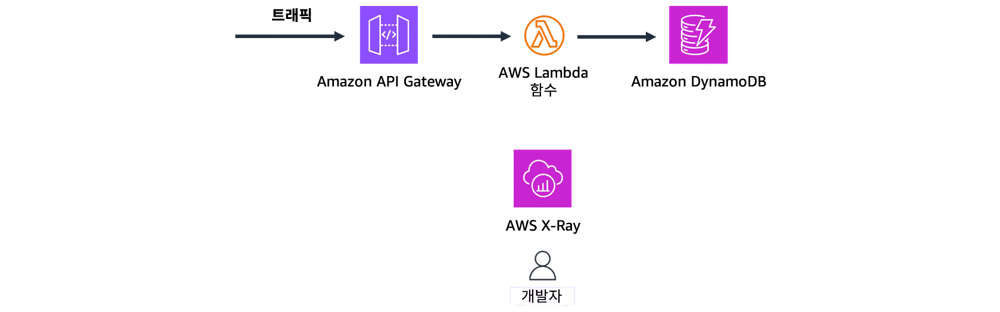

# Well-Architected 솔루션

> 강의 5개 · 지식 점검 8문항 · 모듈 평가 9문항

---

## 1. 왜 필요한가

> 전부 배웠다. 그럼 "잘 만든 아키텍처"의 기준은 무엇인가?

지금까지 12개 모듈을 거치면서 컴퓨팅, 스토리지, 데이터베이스, 네트워킹, 보안, 모니터링, 요금, 마이그레이션까지
클라우드를 구성하는 재료를 한 바퀴 둘러보았습니다. 이제 재료는 충분히 손에 쥐고 계십니다.

그런데 재료가 많아질수록 새로운 문제가 생깁니다. **같은 요구 사항을 만족시키는 아키텍처가 수십 가지로 갈린다**는 점입니다.
EC2로 짜도 되고 Lambda로 짜도 되고, 한 AZ에 둬도 돌아가고 세 AZ에 나눠도 돌아갑니다.
전부 "작동은 하는" 설계인데, 그중 어느 것이 **잘 만든 설계**인지 판단할 기준이 없다면 결국 감으로 고르게 됩니다.

이번 모듈에서는 그 기준을 세워 보겠습니다. AWS가 제시하는 판단 기준이 바로 **AWS Well-Architected Framework**이고,
6개의 기둥으로 아키텍처를 점검합니다. 여기에 더해, 앞선 모듈에서 다루지 못했던 **개발·비즈니스·최종 사용자 컴퓨팅·IoT용 전문 서비스**도
함께 채워 넣어 과정을 마무리하겠습니다.

## 2. 이번에 새로 나오는 서비스

| 서비스 | 한 줄 | 이 모듈에서 맡는 역할 |
|---|---|---|
| [[aws-well-architected-tool]] | 6개 기둥을 기준으로 워크로드를 점검해 주는 무료 도구 | 이번 모듈의 **주인공** |
| [[aws-codepipeline]] | 릴리스 파이프라인을 자동화한다 | 개발 — CI/CD 자동화 |
| [[aws-codebuild]] | 코드를 컴파일·테스트·패키징한다 | 개발 — 파이프라인의 빌드 단계 |
| [[aws-x-ray]] | 분산된 요청을 추적해 병목을 찾아낸다 | 개발 — 문제 해결 |
| [[aws-amplify]] | 풀스택 웹·모바일 앱을 빠르게 만들고 배포한다 | 개발 — 프론트엔드 + 백엔드 |
| [[amazon-api-gateway]] | API를 게시하고 요청을 받아 검증한다 | 서버리스 아키텍처의 **정문** |
| [[amazon-connect]] | AI 기반 클라우드 고객 센터 | 비즈니스 애플리케이션 |
| [[amazon-workspaces]] | 완전관리형 가상 데스크톱 | 최종 사용자 컴퓨팅 |
| [[amazon-appstream-2-0]] | 애플리케이션을 브라우저로 스트리밍한다 | 최종 사용자 컴퓨팅 |

> [!tip] 이번 모듈의 큰 그림
> 앞쪽 절반은 **아직 안 나온 서비스 채우기**(개발 · 비즈니스 · 최종 사용자 · IoT),
> 뒤쪽 절반은 **지금까지 배운 전부를 평가하는 자**(Well-Architected Framework 6개 기둥)입니다.
> 시험에서 배점이 큰 쪽은 단연 뒤쪽입니다.

## 3. 강의 내용

---

### L1. 개발자를 위한 AWS 서비스

> **이번 강의에서 다룰 내용** — 애플리케이션을 만들고, 배포하고, 문제를 찾아내는 데 쓰는 서비스 다섯 가지를 살펴보겠습니다.

AWS 서비스는 하나하나가 **특정 사용 사례를 겨냥해 목적별로 만들어졌습니다.**
그래서 시험에서도 "이 상황에 맞는 서비스는?" 형태로 물어봅니다. 상황과 서비스를 짝지어 외우시는 편이 빠릅니다.

먼저 개발 쪽입니다. 개발자가 반복해서 겪는 문제는 크게 세 가지입니다.
**배포를 손으로 하는 것**, **문제가 어디서 났는지 못 찾는 것**, 그리고 **백엔드 붙이는 데 시간을 다 쓰는 것**입니다.

| 서비스 | 무엇을 하는가 | 문제 속 신호 |
|---|---|---|
| **AWS CodePipeline** | 리포지토리의 변경을 감지해 **빌드 → 테스트 → 배포**를 자동으로 진행하는 릴리스 파이프라인입니다 | "CI/CD", "커밋하면 자동 배포", "릴리스 자동화" |
| **AWS CodeBuild** | 소스 코드를 **컴파일·테스트·패키징**합니다. 파이프라인 안의 빌드 단계를 담당합니다 | "빌드", "컴파일", "아티팩트 생성" |
| **AWS X-Ray** | 시스템을 지나가는 요청을 **추적(trace)** 해서 어디에서 느려지고 어디에서 실패했는지 시각적으로 보여줍니다 | "**디버깅**", "성능 분석", "요청 추적", "동작을 **시각화**" |
| **AWS AppSync** | **GraphQL API** 구축을 간소화해서, 프론트엔드 앱을 여러 백엔드 데이터 소스에 연결합니다 | "**GraphQL**", "여러 데이터 소스를 한 번의 요청으로" |
| **AWS Amplify** | 인증·데이터 스토리지·호스팅 같은 기능을 붙여 **풀스택 앱을 빠르게** 개발·배포·관리합니다 | "풀 스택", "**인증·스토리지를 빠르게 추가**", "인프라 관리 최소화" |

> [!warning] CodePipeline과 Amplify를 헷갈리지 마세요
> - **CodePipeline** — 이미 있는 코드를 **어떻게 내보낼지**(릴리스 자동화)를 다룹니다
> - **Amplify** — 앱에 **어떤 기능을 붙일지**(인증·스토리지·호스팅)를 다룹니다
>
> 문제에 "인증과 스토리지 같은 **기능을 추가**"가 나오면 Amplify이고, "커밋 → 자동 배포"가 나오면 CodePipeline입니다.

```quiz 지식 점검 · 개발 서비스
Q. 한 소규모 마케팅 회사의 개발 팀에서는 AWS에서 호스팅 중인 온라인 애플리케이션의 동작을 시각화할 수 있는 디버깅 및 성능 분석 도구가 필요한 상태입니다. 이 팀에서는 어떤 AWS 서비스를 선택해야 합니까?
+ AWS X-Ray
- AWS AppSync
- AWS Amplify
- AWS CodePipeline
> **디버깅**과 **성능 분석**, 그리고 동작을 **시각화**한다는 세 단어가 모두 X-Ray를 가리킵니다. GraphQL API를 만드는 서비스, 풀스택 앱을 빠르게 배포하는 서비스, 릴리스 파이프라인을 자동화하는 서비스는 모두 문제가 요구하는 "이미 돌고 있는 앱의 문제를 찾는 일"과는 다른 일을 합니다.
```

---

### L2. 비즈니스 · 최종 사용자 컴퓨팅 · IoT 서비스

> **이번 강의에서 다룰 내용** — 고객 응대, 이메일 발송, 원격 근무 환경, 커넥티드 디바이스에 쓰이는 서비스를 정리해 보겠습니다.

#### 비즈니스 애플리케이션 서비스

| 서비스 | 무엇을 하는가 | 문제 속 신호 |
|---|---|---|
| **Amazon Connect** | AI 기반 **클라우드 고객 센터**입니다. 통화 라우팅, 녹음, 분석, 채팅까지 처리합니다 | "**고객 센터**", "통화 라우팅·녹음", "콜백", "IVR" |
| **Amazon SES** (Simple Email Service) | 뉴스레터·프로모션·거래 이메일 같은 **대량 이메일**을 발송합니다 | "**마케팅 이메일**", "대량 발송", "트랜잭션 이메일" |

#### 최종 사용자 컴퓨팅 서비스

원격 근무가 늘면서 **직원이 어디에 있든 회사 업무 환경에 접속하게 해 주는 일**이 IT의 몫이 되었습니다.
AWS는 이 요구를 세 단계로 나눠서 제공합니다. **무엇을 통째로 주느냐**가 갈리는 지점입니다.

| 서비스 | 무엇을 주는가 | 문제 속 신호 |
|---|---|---|
| **Amazon WorkSpaces** | **가상 데스크톱 전체**를 줍니다. 완전관리형 VDI라, 사무실 PC와 똑같이 쓸 수 있습니다 | "**데스크톱**", "사무실 컴퓨터와 동일한 작업", "원격 근무자에게 업무 환경" |
| **Amazon WorkSpaces applications** · **Amazon AppStream 2.0** | 데스크톱이 아니라 **애플리케이션만** 스트리밍합니다. 로컬 설치가 필요 없습니다 | "**애플리케이션만** 스트리밍", "설치 없이 웹으로 SaaS 접근" |
| **Amazon WorkSpaces Secure Browser** | **웹 기반 애플리케이션만** 필요한 사용자를 위한 가벼운 브라우저 접근입니다 | "웹 애플리케이션만", "가장 가벼운 옵션" |

> [!warning] 데스크톱이냐, 앱이냐
> "**사무실 컴퓨터를 쓰는 것과 동일한 태스크**"처럼 **업무 환경 전체**를 옮기는 이야기면 **WorkSpaces**입니다.
> "특정 프로그램에만 접근하면 된다"면 애플리케이션 스트리밍 쪽입니다. 이 한 줄로 대부분의 문제가 갈립니다.

#### IoT 서비스

**사물 인터넷(IoT)** 은 센서와 소프트웨어가 내장된 **물리적 디바이스**들이 인터넷으로 데이터를 주고받는 네트워크입니다.
디바이스를 원격으로 모니터링하고 제어해서 효율을 높이는 것이 목적입니다.

**AWS IoT Core**는 이런 디바이스를 클라우드 애플리케이션에 **안전하게 연결**해 주는 서비스입니다.
공장 조립 라인 장비, 스마트 홈 기기, 웨어러블처럼 **현실에 존재하는 물건**이 등장하면 IoT Core를 떠올리시기 바랍니다.

> [!tip] IoT인지 아닌지 가르는 한 문장
> **물리적인 디바이스가 네트워크와 통신하는가?** 이것 하나만 보시면 됩니다.
> 모바일 앱, 온라인 뱅킹, 웹 서비스는 아무리 똑똑해도 물리 디바이스가 아니므로 IoT가 아닙니다.

```quiz 지식 점검 · 비즈니스 애플리케이션
Q. 한 대형 자동차 회사에서는 고객 서비스 센터에서 AI의 기능을 활용하고자 합니다. 이 회사에는 통화 라우팅, 녹음, 분석 기능이 포함된 솔루션이 필요합니다. 이러한 기능을 제공할 수 있는 AWS 서비스는 무엇입니까?
- AWS Amplify
- Amazon Simple Email Service(Amazon SES)
+ Amazon Connect
- Amazon WorkSpaces
> **고객 서비스 센터** + **통화 라우팅·녹음·분석**은 Amazon Connect의 정의 그대로입니다. 이메일을 대량 발송하는 서비스는 통화를 다루지 않고, 풀스택 개발 서비스와 가상 데스크톱 서비스는 고객 응대와 무관합니다.

Q. IT 부서에서는 직원들이 여러 가지 서비스형 소프트웨어(SaaS) 온라인 애플리케이션에 액세스할 수 있는 기능을 제공해야 하는 상황입니다. 이러한 액세스 기능을 제공할 수 있는 AWS 서비스는 무엇입니까?
- AWS IoT Core
+ Amazon WorkSpaces applications
- Amazon Connect
- AWS AppSync
> 여기서 필요한 것은 데스크톱 전체가 아니라 **애플리케이션에 대한 접근**입니다. 그래서 애플리케이션을 스트리밍하는 쪽을 고르시면 됩니다. 디바이스를 연결하는 서비스, 고객 센터 서비스, GraphQL API 서비스는 모두 사내 직원에게 업무용 앱을 제공하는 일과는 관계가 없습니다.

Q. 다음 중 사물 인터넷(IoT) 솔루션은 무엇입니까? (2개 선택)
- 좋아하는 음식점에서 음식을 주문할 수 있는 모바일 앱
+ 스마트폰에서 일일 걸음 수를 추적하는 웨어러블 디바이스
- 시청 기록을 기반으로 프로그램을 추천하는 스마트 TV
+ 원격으로 조명을 끄는 데 사용할 수 있는 Wi-Fi 지원 플러그
- 계좌 잔고를 확인하는 데 사용되는 온라인 뱅킹 애플리케이션
> IoT의 조건은 **물리적 디바이스가 센서를 통해 데이터를 수집하고 네트워크와 통신하는 것**입니다. 걸음 수를 재는 웨어러블과 원격으로 켜고 끄는 Wi-Fi 플러그가 여기에 해당합니다. 모바일 앱과 온라인 뱅킹은 물리 디바이스가 아니라 소프트웨어이고, 스마트 TV의 추천 기능은 시청 기록을 분석하는 소프트웨어 기능이라 커넥티드 디바이스 제어와는 초점이 다릅니다.
```

---

### L3. AWS Well-Architected Framework — 6개 기둥

> **이번 강의에서 다룰 내용** — 아키텍처를 평가하는 6개 기둥을 하나씩 짚고, 시나리오에서 어느 기둥인지 골라내는 요령을 잡아 보겠습니다.

**AWS Well-Architected Framework**는 안전하고, 성능이 뛰어나고, 복원력이 좋고, 효율적인 인프라를 만들기 위한
**체계적인 접근 방식**입니다. 모든 워크로드에 공통으로 적용되는 **6개 기둥(pillar)** 으로 이루어져 있습니다.

**이 표가 이번 모듈에서 시험에 가장 많이 나오는 부분입니다.**
시나리오를 주고 "어느 기둥에 해당하는가"를 묻는 문제가 단골이므로, **문제 속 신호** 열을 특히 눈여겨보시기 바랍니다.

| 기둥 | 핵심 질문 | 대표 설계 원칙 | 문제 속 신호 | 관련 AWS 서비스 |
|---|---|---|---|---|
| **운영 우수성**<br/>Operational Excellence | 시스템을 **잘 운영하고 계속 개선**하고 있는가? | 운영을 코드로 수행합니다 · 작게 자주 되돌릴 수 있게 변경합니다 · 장애에서 배웁니다 | "**수동 배포**", "배포 자동화", "CI/CD", "코드형 인프라", "자동 롤백", "런북·이벤트 대응" | CodePipeline · CodeBuild · CloudFormation · CloudWatch · Systems Manager |
| **보안**<br/>Security | 데이터와 시스템을 **지키고 있는가**? | 최소 권한을 적용합니다 · 모든 계층에 보안을 겁니다 · 저장·전송 데이터를 암호화합니다 · 추적성을 확보합니다 | "**암호화**", "**최소 권한**", "액세스 제어", "결제·개인 정보 보호", "감사 로그" | IAM · KMS · WAF · Shield · GuardDuty · CloudTrail |
| **안정성**<br/>Reliability *(신뢰성으로도 표기)* | 장애가 나도 **복구되고 계속 돌아가는가**? | 장애로부터 자동 복구합니다 · 복구 절차를 테스트합니다 · 수평으로 확장해 단일 장애점을 없앱니다 | "**단일 AZ**", "**중단이 발생**", "가용성", "장애 조치", "백업·복구 계획", "여러 AZ에 배포" | 다중 AZ 배포 · EC2 Auto Scaling · ELB · Route 53 · AWS Backup · CloudWatch |
| **성능 효율성**<br/>Performance Efficiency | 리소스를 **효율적으로 골라 쓰고 있는가**? | 적정 규모로 조정합니다 · 서버리스를 우선 검토합니다 · 실험을 자주 합니다 · 기술을 대중화합니다 | "**적정 규모 조정**", "**응답 시간·지연 시간**", "언더프로비저닝", "글로벌 사용자에게 빠르게" | Compute Optimizer · CloudFront · Lambda · 인스턴스 유형 선택 · ElastiCache |
| **비용 최적화**<br/>Cost Optimization | **필요 없는 돈**이 나가고 있지 않은가? | 소비 모델을 채택합니다 · 지출을 측정하고 귀속시킵니다 · 차별화되지 않는 작업에 돈을 쓰지 않습니다 | "**비용 절감**", "오버프로비저닝", "유휴 리소스", "예산 초과", "스팟·절감형 플랜" | Cost Explorer · AWS Budgets · Cost & Usage Report · 절감형 플랜 · 스팟 인스턴스 |
| **지속 가능성**<br/>Sustainability | **환경에 미치는 영향**을 줄이고 있는가? | 상시 가동 리소스를 줄입니다 · 사용률이 높은 인스턴스를 씁니다 · 관리형·서버리스로 전환합니다 | "**에너지 효율**", "**탄소 배출량**", "환경 영향 최소화", "상시 가동을 줄인다" | AWS Lambda(서버리스) · 적정 규모 RDS · Auto Scaling · Cost & Usage Report |

> [!warning] 성능 효율성 · 비용 최적화 · 지속 가능성은 자주 겹칩니다
> 인스턴스를 작게 줄이는 조치 하나가 세 기둥 모두에 걸칩니다. 그래서 시험은 **문제가 무엇을 목표로 말했는지**로 가릅니다.
> - "느리다 / 언더프로비저닝이다 / 응답 시간을 개선하겠다" → **성능 효율성**
> - "돈이 아깝다 / 지출을 줄이겠다" → **비용 최적화**
> - "에너지·탄소 배출을 줄이겠다" → **지속 가능성**
>
> 지문의 **마지막 목적 문장**을 읽으시면 답이 갈립니다.

> [!tip] 안정성과 성능 효율성을 가르는 신호
> "**중단이 발생했다 / 인스턴스가 한 AZ에만 있다**"는 가용성 이야기이므로 **안정성**입니다.
> 같은 상황에서 "인스턴스를 더 크게 키우자"는 선택지가 붙어 나오는데, 이것은 **가용성을 전혀 개선하지 못하는 함정**입니다.
> 인스턴스를 아무리 키워도 그 AZ가 죽으면 함께 죽기 때문입니다.

```quiz 지식 점검 · 기둥 고르기
Q. 개발 팀이 AWS에서 호스팅되는 애플리케이션에 대한 업데이트를 자주 릴리스하고 있습니다. 현재 각 배포에는 수동 조치가 필요하며, 이로 인해 가동 중지 시간이 발생하거나 환경의 일관성이 저하되는 사례가 종종 발생합니다. 이러한 상황에 도움이 될 수 있는 Well-Architected Framework의 AWS 작업 방식은 무엇입니까?
- 배포를 보호(보안)하는 데 중점을 둡니다.
- 배포 과정에서 AWS 리소스를 더 효과적으로 사용합니다(성능 효율성).
+ 지속적 통합 및 지속적 전달 파이프라인(운영 우수성)을 통해 배포를 자동화합니다.
- 배포에 사용되는 인프라 비용을 절감합니다(비용 최적화).
> 문제의 원인이 **수동 배포**와 그로 인한 **환경 불일치**입니다. 배포와 운영 절차를 자동화해서 개선하는 것은 **운영 우수성**의 영역입니다. 암호화나 권한 이야기가 없으므로 보안이 아니고, 리소스가 남거나 모자란다는 이야기가 없으므로 성능 효율성이나 비용 최적화도 아닙니다.

Q. 한 미디어 회사의 해외 사용자들이 동영상 썸네일 로딩이 **너무 느리다**고 불평하고 있습니다. 이 회사는 AWS Compute Optimizer로 인스턴스를 적정 규모로 조정하고 Amazon CloudFront를 도입해 **응답 시간을 개선**하려 합니다. 이 조치가 해당하는 Well-Architected Framework의 기둥은 무엇입니까?
- 운영 우수성
- 안정성
+ 성능 효율성
- 지속 가능성
> 지문이 문제 삼는 것은 **느리다**는 점이고 목표는 **응답 시간 개선**입니다. 리소스를 워크로드에 맞게 고르고 지연 시간을 줄이는 것은 **성능 효율성** 기둥입니다. 적정 규모 조정은 비용과 지속 가능성에도 도움이 되지만, 이 지문에는 지출이나 탄소 배출을 줄이겠다는 목적이 전혀 없습니다. 서비스가 중단된 것도 아니고 배포 절차 이야기도 나오지 않습니다.
```

---

### L4. AWS Well-Architected Tool과 아키텍처 개선하기

> **이번 강의에서 다룰 내용** — 프레임워크를 실제로 적용해 주는 도구를 살펴보고, 한 아키텍처가 6개 기둥을 거치며 어떻게 개선되는지 따라가 보겠습니다.

#### AWS Well-Architected Tool

기둥을 알았으니 이제 **내 워크로드가 그 기준에 맞는지 확인할 차례**입니다. 그 확인을 대신해 주는 것이 **AWS Well-Architected Tool(AWS WA Tool)** 입니다.

| 항목 | 내용 |
|---|---|
| 무엇을 하는가 | 6개 기둥을 기준으로 클라우드 워크로드를 **평가하고 개선 방향을 제시**합니다 |
| 어떻게 쓰는가 | 셀프 서비스 도구입니다. 워크로드를 만들고 계정에서 실행하면 **질문에 답하는 형식**으로 진행됩니다 |
| 결과물 | 해결이 필요한 영역을 짚어 주고, **어떻게 고칠지**까지 모범 사례 기반으로 알려주는 보고서가 나옵니다 |
| 유연성 | 내 시나리오에 해당하지 않는 질문은 **적용 대상에서 제외**할 수 있습니다. 사용자 지정 렌즈도 지원합니다 |
| 진행 관리 | **마일스톤**으로 개선 상황을 추적하고, IAM·API와 통합되어 팀이 함께 검토할 수 있습니다 |
| 요금 | **무료**입니다 |

> [!warning] WA Tool이 하지 않는 일
> 워크로드를 리전 간에 **옮겨 주지 않고**, 비용을 **예측해 주지 않으며**, 사용자 권한을 **관리하지 않습니다.**
> 비용 예측은 AWS Pricing Calculator, 권한 관리는 IAM의 일입니다. 이 셋이 오답 선택지로 자주 등장합니다.

#### 하나의 아키텍처를 6개 기둥으로 훑어보기

성수기에 주문이 몰리는 **온라인 꽃배달 사업**을 예로 들어 보겠습니다.
시작 아키텍처는 아주 평범합니다. 웹 사이트용 **EC2 인스턴스**, 주문·고객 데이터를 담는 **RDS 데이터베이스**,
제품 이미지를 넣어 둔 **S3 버킷**. 기능은 다 합니다. 문제는 밸런타인데이에 트래픽이 몰릴 때입니다.

여기에 기둥을 하나씩 대 보면 이렇게 개선점이 나옵니다.

| 기둥 | 던지는 질문 | 개선 조치 |
|---|---|---|
| **운영 우수성** | 주문이 폭주하는 중에 EC2 인스턴스가 죽으면 어떻게 되는가? | **EC2 Auto Scaling**으로 스케일링을 자동화하고, 코드형 인프라와 자동 롤백 같은 자가 복구 장치를 넣습니다 |
| **보안** | 인스턴스에 패치가 적용되고 있는가? IAM 정책이 최소 권한을 따르는가? | 고객 이름·주소·결제 정보를 지키기 위해 **저장 데이터와 전송 중 데이터를 암호화**하고, 세분화된 액세스 제어를 겁니다 |
| **안정성** | 성수기에 한 AZ가 멈추면 주문을 계속 받을 수 있는가? | 여러 **가용 영역에 리소스를 배포**하고, **Amazon CloudWatch**로 상태를 모니터링해 자동 복구를 설정합니다 |
| **성능 효율성** | EC2와 RDS가 워크로드에 맞는 크기인가? | **AWS Compute Optimizer**로 적정 규모를 확인하고, 이미지 처리 같은 이벤트 기반 작업은 **Lambda**로, 전 세계 이미지 전송은 **CloudFront**로 처리합니다 |
| **비용 최적화** | 온디맨드로만 쓰고 있지 않은가? | 가변 트래픽은 **스팟 인스턴스**, 안정적인 워크로드는 **절감형 플랜**으로 옮기고 **AWS Budgets · Cost Explorer**로 지출을 추적합니다 |
| **지속 가능성** | 놀고 있는 리소스가 계속 켜져 있지 않은가? | **서버리스와 탄력적인 리소스**를 써서 낭비를 줄입니다. **Cost & Usage Report**로 사용량을 확인하며 계속 최적화합니다 |

> [!tip] 이 표의 사용법
> 시험 문제는 대부분 이 표의 **한 칸**을 시나리오로 풀어 쓴 것입니다.
> "단일 AZ에서 중단이 발생했다"면 안정성 칸, "CPU 사용률이 10%밖에 안 된다"면 성능 효율성·비용 최적화 칸입니다.
> 프레임워크를 적용한다는 것은 **한 번의 점검으로 끝내는 일이 아니라, 기둥을 돌아가며 계속 다듬는 일**이라는 점도 함께 기억해 두시기 바랍니다.

```quiz 지식 점검 · AWS Well-Architected Tool
Q. AWS Well-Architected Tool(AWS WA Tool)의 목적은 무엇입니까?
- AWS 리전 간에 워크로드 마이그레이션
+ 6가지 주요 아키텍처 핵심 요소를 기준으로 클라우드 워크로드 평가 및 개선
- 클라우드 프로젝트의 비용 예측 자동화
- AWS 서비스 전체에서 사용자 권한 관리
> WA Tool은 6개 기둥을 기준으로 워크로드를 **점검하고 개선안을 제시**하는 무료 도구입니다. 리전 간 이동은 마이그레이션 서비스의 일이고, 비용 예측은 AWS Pricing Calculator, 권한 관리는 IAM의 일입니다.
```

---

### L5. 실제 환경에서의 클라우드 — 전문 서비스를 조합하기

> **이번 강의에서 다룰 내용** — 이번 모듈에서 배운 서비스들이 실제 아키텍처에서 어떻게 맞물리는지 세 가지 사례로 확인해 보겠습니다.

서비스를 하나씩 아는 것과, 그것들을 **엮어서 문제를 푸는 것**은 다른 능력입니다.
여기서는 **서버리스**를 축으로 세 가지 아키텍처를 보겠습니다. 세 가지 모두 관리할 서버가 없다는 공통점이 있습니다.

#### 사례 1 — X-Ray로 추적하는 서버리스 웹 백엔드



| 순서 | 하는 일 |
|---|---|
| 1 | **Amazon API Gateway**가 HTTP 요청을 수신하고 유효성을 검사합니다 |
| 2 | API Gateway가 **AWS Lambda** 함수를 호출하고, 함수는 **Amazon DynamoDB**에 요청을 보냅니다 |
| 3 | **AWS X-Ray**가 API Gateway → Lambda → DynamoDB → 클라이언트까지 요청을 추적해 개발자에게 보여줍니다 |

**X-Ray가 여기서 특히 중요한 이유**가 있습니다. 이 아키텍처에는 로그를 뒤져 볼 **웹 서버라는 단일 지점이 없습니다.**
요청이 여러 관리형 서비스를 건너다니기 때문에, 분산된 경로를 통째로 따라가 주는 추적 도구가 없으면 원인을 찾기 어렵습니다.

#### 사례 2 — 문의 양식이 있는 서버리스 정적 웹 사이트

| 순서 | 하는 일 |
|---|---|
| 1 | 고객이 **Amazon S3**에 호스팅된 정적 웹 사이트의 문의 양식을 제출합니다 |
| 2 | **API Gateway**가 요청을 수신하고 검증합니다 |
| 3 | API Gateway가 **Lambda** 함수를 호출하고, 함수는 **Amazon SES**로 사업주에게 이메일을 보냅니다 |

사례 1과 **쓰는 서비스는 거의 같은데 용도는 전혀 다릅니다.** 한쪽은 데이터를 저장하고, 한쪽은 이메일을 보냅니다.
Lambda 안에서 도는 것은 결국 **코드**이므로, 같은 뼈대 위에서 필요한 무엇이든 될 수 있습니다.

#### 사례 3 — 콜백 옵션이 있는 고객 지원

| 순서 | 하는 일 |
|---|---|
| 1 | 고객이 전화를 걸면 **Amazon Connect**의 IVR로 연결되고, 문자 메시지는 **CloudFront**를 거쳐 Connect로 라우팅됩니다 |
| 2 | Amazon Connect가 고객을 상담원에게 연결하려고 시도합니다 |
| 3 | 대기 줄이 길면 고객은 **콜백을 예약**하거나, **Lambda** 함수를 통해 채팅·이메일로 전환할 수 있습니다 |

> [!tip] 여기서 가져가실 것
> 복잡한 시스템이라고 해서 서비스가 수십 개 필요한 것이 아닙니다.
> **관리형 서비스 서너 개를 어떻게 잇느냐**로 대부분의 문제가 풀립니다.
> 이것이 모듈 1에서 이야기한 "AWS 서비스는 빌딩 블록"의 실제 모습입니다.

```quiz 지식 점검 · 서버리스 조합
Q. API Gateway, Lambda, DynamoDB로 구성된 서버리스 백엔드에서 특정 요청만 유독 느려지는 현상이 발생했습니다. 어떤 구간에서 지연이 생기는지 파악하려 할 때 가장 적합한 AWS 서비스는 무엇입니까?
- AWS CodePipeline
+ AWS X-Ray
- AWS Amplify
- Amazon API Gateway
> 서버리스 아키텍처에는 로그를 모아 볼 웹 서버가 없기 때문에, 여러 서비스를 건너다니는 **요청 경로 전체를 추적**해 주는 도구가 필요합니다. 그 역할을 하는 것이 X-Ray입니다. 릴리스를 자동화하는 서비스와 풀스택 앱을 배포하는 서비스는 문제 추적과 무관하고, API Gateway는 추적 대상이지 추적 도구가 아닙니다.
```

---

## 4. 모듈 평가

```exam
Q. 한 개발자가 AWS에서 호스팅되는 풀 스택 애플리케이션을 개발하는 중입니다. 이 개발자는 인프라 관리를 최소화하면서, 인증 및 스토리지 같은 기능을 신속하게 추가하여 개발 프로세스를 간소화하는 데 관심이 있습니다. 이 개발자의 요구 사항에 가장 적합한 솔루션을 제공하는 AWS 서비스는 무엇입니까?
- AWS CodePipeline
+ AWS Amplify
- AWS AppSync
- AWS Well-Architected Tool
> **풀 스택**, **인증·스토리지 기능을 빠르게 추가**, **인프라 관리 최소화**가 모두 Amplify의 설명입니다. 릴리스 파이프라인을 자동화하는 서비스는 이미 만든 코드를 내보내는 일을 하지 기능을 붙여 주지 않고, GraphQL API 서비스는 데이터 연결이라는 한 조각만 담당하며, 아키텍처를 평가하는 도구는 애플리케이션을 만들어 주지 않습니다.

Q. 한 대규모 하드웨어 회사의 소유주가 회사의 마케팅 이메일을 자동화하고 최적화하여 고객 참여를 향상하고자 합니다. 이 사용 사례에 적합한 AWS 서비스는 무엇입니까?
+ Amazon Simple Email Service(Amazon SES)
- Amazon AppStream 2.0
- Amazon Connect
- AWS Amplify
> **대량 마케팅 이메일 발송**은 SES의 정의 그대로입니다. 애플리케이션을 스트리밍하는 서비스와 고객 센터 서비스, 풀스택 개발 서비스는 이메일 발송 기능을 제공하지 않습니다. Connect는 같은 "고객 커뮤니케이션"이라도 통화·채팅 응대 쪽이라는 점에서 갈립니다.

Q. 한 소규모 기술 스타트업에서 원격 근무자에게 작업 환경에 안전하게 액세스할 수 있는 기능을 제공해야 합니다. 직원들은 실제 사무실 컴퓨터를 사용하는 것과 동일한 태스크를 수행할 수 있어야 합니다. 이 회사는 어떤 AWS 서비스를 사용하여 원격 액세스를 제공할 수 있습니까?
- AWS AppSync
- Amazon AppStream 2.0
- Amazon Connect
+ Amazon WorkSpaces
> "**사무실 컴퓨터를 사용하는 것과 동일한 태스크**"가 결정적인 신호입니다. 애플리케이션 하나가 아니라 **데스크톱 환경 전체**가 필요하므로 완전관리형 가상 데스크톱인 WorkSpaces입니다. 애플리케이션만 스트리밍하는 서비스는 데스크톱 전체를 주지 않고, GraphQL API 서비스와 고객 센터 서비스는 원격 근무 환경과 무관합니다.

Q. 한 제조사에서 조립 라인 장비에 성능 문제가 있는지 모니터링할 수 있는 방법을 필요로 합니다. 이 제조사가 장비에 대한 모니터링 솔루션을 구축하는 데 도움을 줄 수 있는 AWS 서비스는 무엇입니까?
- Amazon Connect
+ AWS IoT Core
- AWS Well-Architected Tool
- Amazon AppStream 2.0
> **조립 라인 장비**라는 물리적 디바이스를 클라우드에 연결해 모니터링하는 상황이므로 IoT Core입니다. 고객 센터 서비스는 사람과의 통화를 다루고, 아키텍처 평가 도구는 설계를 점검할 뿐 장비 데이터를 수집하지 않으며, 애플리케이션 스트리밍 서비스는 디바이스 연결과 관계가 없습니다.

Q. 한 스타트업이 가용 영역 한 곳에 있는 단일 Amazon EC2 인스턴스에서 중요한 웹 애플리케이션을 호스팅하고 있습니다. 잠시 중단이 발생한 후, 이 스타트업은 자사의 아키텍처를 재평가하기로 결정합니다. 이러한 상황을 개선할 수 있는 AWS Well-Architected Framework의 작업 방식은 무엇입니까?
- 더 많은 트래픽을 처리(성능 효율성)하도록 인스턴스를 스케일 업합니다.
- 리소스 사용량을 줄여 오버프로비저닝을 방지(비용 최적화)합니다.
+ 내결함성(신뢰성)을 위해 여러 가용 영역에 인스턴스를 배포합니다.
- 인스턴스의 방화벽 보호(보안)를 강화합니다.
> 문제의 원인은 **단일 AZ · 단일 인스턴스**라는 구조 자체이고, 실제로 **중단이 발생**했습니다. 이것은 가용성 문제이므로 **안정성(신뢰성)** 기둥에 해당하고, 해법은 여러 가용 영역에 나눠 배포하는 것입니다. 인스턴스를 더 크게 키워도 그 AZ가 멈추면 함께 멈추므로 가용성은 전혀 개선되지 않습니다. 비용이나 방화벽 이야기는 지문에 아예 등장하지 않습니다.

Q. 한 회사에서 트래픽이 적은 웹 사이트에 대규모 Amazon EC2 인스턴스 유형을 사용하고 있지만, 모니터링 결과에 따르면 CPU 사용량이 10%를 초과하는 경우가 거의 없습니다. 바람직한 다음 조치는 무엇입니까?
- 인스턴스 수를 줄여 비용을 절감합니다.
+ 실제 워크로드에 맞게 EC2 인스턴스를 더 작은 유형의 적정 규모로 조정합니다.
- 데이터 보호를 개선하기 위해 EC2 인스턴스를 업그레이드합니다.
- 트래픽을 기준으로 EC2 인스턴스의 규모 조정을 자동화합니다.
> 문제는 **대수가 많은 것**이 아니라 **인스턴스 유형이 워크로드에 비해 과하게 큰 것**입니다. 따라서 정답은 **적정 규모 조정(rightsizing)** 입니다. 인스턴스 수를 줄이는 조치는 애초에 몇 대인지 언급이 없어서 근거가 없고, 업그레이드는 이미 남는 용량을 더 늘리는 정반대 조치이며, 자동 스케일링은 대수를 조절할 뿐 **한 대의 크기가 과한 문제**를 해결해 주지 않습니다.

Q. 다음 중 AWS Well-Architected Framework의 기둥에 해당하는 항목은 무엇입니까? (2개 선택)
+ 운영 우수성
- 확장성
+ 지속 가능성
- 민첩성
- 규정 준수
> 6개 기둥은 **운영 우수성 · 보안 · 안정성(신뢰성) · 성능 효율성 · 비용 최적화 · 지속 가능성**입니다. 확장성과 민첩성은 클라우드의 이점을 설명할 때 쓰는 말이고, 규정 준수는 보안 기둥 안에서 다루는 주제이지 독립된 기둥이 아닙니다. 기둥 이름 목록은 그대로 외워 두시기 바랍니다.

Q. 한 SaaS 기업이 야간과 주말에 거의 사용되지 않는 EC2 인스턴스를 24시간 실행하고 있습니다. 이 기업은 상시 가동 리소스를 줄이고 **에너지 소비량과 탄소 발자국**을 낮추기 위해 이벤트 기반 서버리스 아키텍처로 전환하려 합니다. 이 조치가 해당하는 Well-Architected Framework의 기둥은 무엇입니까?
- 운영 우수성
- 안정성
- 보안
+ 지속 가능성
> 서버리스로 전환하면 비용도 함께 줄지만, 지문이 목표로 밝힌 것은 **에너지 소비량과 탄소 발자국**입니다. 환경에 미치는 영향을 최소화하는 설계는 **지속 가능성** 기둥이고, 상시 가동 인스턴스를 서버리스로 옮기는 것이 이 기둥의 대표 조치입니다. 지문에 배포 절차, 장애 복구, 접근 통제 이야기가 없으므로 나머지 기둥의 신호는 등장하지 않습니다.

Q. 한 전자 상거래 회사가 고객의 이름·주소·결제 정보를 저장하고 있습니다. 이 회사는 저장된 데이터와 전송 중 데이터를 모두 암호화하고, IAM 정책을 최소 권한 원칙에 맞게 재검토하려 합니다. 이 조치가 해당하는 Well-Architected Framework의 기둥은 무엇입니까?
- 운영 우수성
+ 보안
- 성능 효율성
- 비용 최적화
> **암호화**와 **최소 권한**은 보안 기둥의 대표 설계 원칙 두 가지입니다. 이 두 단어가 함께 나오면 다른 기둥을 고민할 필요가 없습니다. 배포 자동화라면 운영 우수성, 적정 규모나 응답 시간이라면 성능 효율성, 지출 절감이라면 비용 최적화가 되었을 텐데 지문에는 그런 신호가 없습니다.
```

## 5. 여기까지의 지도

주황색이 이번 모듈에서 새로 나온 서비스입니다.

```mermaid
flowchart TB
 classDef new fill:#ff9900,stroke:#232f3e,stroke-width:2px,color:#111
 classDef old fill:#f4f6f8,stroke:#8a94a6,color:#5a6472
 subgraph S2["2. 클라우드 컴퓨팅"]
 direction LR
 AmazonEC2["Amazon EC2"]
 AmazonEC2AutoScaling["Amazon EC2 Auto Scaling"]
 ElasticLoadBalancing["Elastic Load Balancing"]
 AmazonSQS["Amazon SQS"]
 AmazonSNS["Amazon SNS"]
 AmazonEventBridge["Amazon EventBridge"]
 end
 class AmazonEC2,AmazonEC2AutoScaling,ElasticLoadBalancing,AmazonSQS,AmazonSNS,AmazonEventBridge old
 subgraph S3["3. 컴퓨팅 서비스 살펴보기"]
 direction LR
 AWSLambda["AWS Lambda"]
 AmazonECS["Amazon ECS"]
 AmazonEKS["Amazon EKS"]
 AWSElasticBeanstalk["AWS Elastic Beanstalk"]
 AWSBatch["AWS Batch"]
 AWSFargate["AWS Fargate"]
 AWSOutposts["AWS Outposts"]
 AmazonLightsail["Amazon Lightsail"]
 end
 class AWSLambda,AmazonECS,AmazonEKS,AWSElasticBeanstalk,AWSBatch,AWSFargate,AWSOutposts,AmazonLightsail old
 subgraph S4["4. 글로벌 시장 진출"]
 direction LR
 AWSCloudFormation["AWS CloudFormation"]
 end
 class AWSCloudFormation old
 subgraph S5["5. 네트워킹"]
 direction LR
 AmazonVPC["Amazon VPC"]
 AmazonConnect["Amazon Connect"]
 AWSDirectConnect["AWS Direct Connect"]
 AmazonCloudFront["Amazon CloudFront"]
 AmazonRoute53["Amazon Route 53"]
 AWSGlobalAccelerator["AWS Global Accelerator"]
 AWSTransitGateway["AWS Transit Gateway"]
 end
 class AmazonVPC,AmazonConnect,AWSDirectConnect,AmazonCloudFront,AmazonRoute53,AWSGlobalAccelerator,AWSTransitGateway old
 subgraph S6["6. 스토리지"]
 direction LR
 AmazonS3["Amazon S3"]
 AmazonEBS["Amazon EBS"]
 AmazonEFS["Amazon EFS"]
 AWSStorageGateway["AWS Storage Gateway"]
 AmazonFSx["Amazon FSx"]
 AmazonS3Glacier["Amazon S3 Glacier"]
 end
 class AmazonS3,AmazonEBS,AmazonEFS,AWSStorageGateway,AmazonFSx,AmazonS3Glacier old
 subgraph S7["7. 데이터베이스"]
 direction LR
 AmazonRDS["Amazon RDS"]
 AmazonDynamoDB["Amazon DynamoDB"]
 AmazonElastiCache["Amazon ElastiCache"]
 AmazonAurora["Amazon Aurora"]
 AWSBackup["AWS Backup"]
 AmazonDocumentDB["Amazon DocumentDB"]
 AmazonNeptune["Amazon Neptune"]
 end
 class AmazonRDS,AmazonDynamoDB,AmazonElastiCache,AmazonAurora,AWSBackup,AmazonDocumentDB,AmazonNeptune old
 subgraph S8["8. AI/ML 및 데이터 분석"]
 direction LR
 AmazonSageMaker["Amazon SageMaker"]
 AmazonEMR["Amazon EMR"]
 AmazonAthena["Amazon Athena"]
 AWSGlue["AWS Glue"]
 AmazonQuickSight["Amazon QuickSight"]
 AmazonRedshift["Amazon Redshift"]
 AmazonKinesis["Amazon Kinesis"]
 AmazonComprehend["Amazon Comprehend"]
 AmazonPolly["Amazon Polly"]
 AmazonLex["Amazon Lex"]
 end
 class AmazonSageMaker,AmazonEMR,AmazonAthena,AWSGlue,AmazonQuickSight,AmazonRedshift,AmazonKinesis,AmazonComprehend,AmazonPolly,AmazonLex old
 subgraph S9["9. 보안"]
 direction LR
 AWSIAM["AWS IAM"]
 AWSKMS["AWS KMS"]
 AmazonInspector["Amazon Inspector"]
 AWSSecurityHub["AWS Security Hub"]
 AWSShield["AWS Shield"]
 AmazonGuardDuty["Amazon GuardDuty"]
 AmazonMacie["Amazon Macie"]
 AWSCertificateManager["AWS Certificate Manager"]
 AWSWAF["AWS WAF"]
 AWSSystemsManager["AWS Systems Manager"]
 end
 class AWSIAM,AWSKMS,AmazonInspector,AWSSecurityHub,AWSShield,AmazonGuardDuty,AmazonMacie,AWSCertificateManager,AWSWAF,AWSSystemsManager old
 subgraph S10["10. AWS 클라우드에서의 모니터링, 규정 준수, 거버넌스"]
 direction LR
 AmazonCloudWatch["Amazon CloudWatch"]
 AWSCloudTrail["AWS CloudTrail"]
 AWSArtifact["AWS Artifact"]
 AWSTrustedAdvisor["AWS Trusted Advisor"]
 AWSOrganizations["AWS Organizations"]
 AWSControlTower["AWS Control Tower"]
 AWSConfig["AWS Config"]
 AWSServiceCatalog["AWS Service Catalog"]
 end
 class AmazonCloudWatch,AWSCloudTrail,AWSArtifact,AWSTrustedAdvisor,AWSOrganizations,AWSControlTower,AWSConfig,AWSServiceCatalog old
 subgraph S11["11. 요금 및 지원"]
 direction LR
 AWSMarketplace["AWS Marketplace"]
 AWSBudgets["AWS Budgets"]
 AWSSupportPlans["AWS Support Plans"]
 AWSCostExplorer["AWS Cost Explorer"]
 AWSPricingCalculator["AWS Pricing Calculator"]
 AWSComputeOptimizer["AWS Compute Optimizer"]
 AWSHealthDashboard["AWS Health Dashboard"]
 end
 class AWSMarketplace,AWSBudgets,AWSSupportPlans,AWSCostExplorer,AWSPricingCalculator,AWSComputeOptimizer,AWSHealthDashboard old
 subgraph S12["12. AWS 클라우드로 마이그레이션"]
 direction LR
 AWSDMS["AWS DMS"]
 AWSMigrationHub["AWS Migration Hub"]
 AWSDataSync["AWS DataSync"]
 AWSSnowFamily["AWS Snow Family"]
 AWSTransferFamily["AWS Transfer Family"]
 end
 class AWSDMS,AWSMigrationHub,AWSDataSync,AWSSnowFamily,AWSTransferFamily old
 subgraph S13["13. Well-Architected 솔루션"]
 direction LR
 AWSWellArchitectedTool["AWS Well-Architected Tool"]
 AmazonAPIGateway["Amazon API Gateway"]
 AWSXRay["AWS X-Ray"]
 AmazonWorkSpaces["Amazon WorkSpaces"]
 AWSAmplify["AWS Amplify"]
 AWSCodePipeline["AWS CodePipeline"]
 AmazonAppStream20["Amazon AppStream 2.0"]
 AWSCodeBuild["AWS CodeBuild"]
 end
 class AWSWellArchitectedTool,AmazonAPIGateway,AWSXRay,AmazonWorkSpaces,AWSAmplify,AWSCodePipeline,AmazonAppStream20,AWSCodeBuild new
```



### 13개 모듈을 한 장으로

이번 모듈이 마지막이므로, 지금까지 지나온 길을 한 번 되짚어 보겠습니다.
각 모듈은 **앞 모듈이 남긴 질문에 답하는 방식**으로 이어져 왔습니다.

| 모듈 | 답한 질문 | 남긴 질문 |
|---|---|---|
| **1. 클라우드 소개** | 클라우드가 대체 무엇을 해결하는가? | 그럼 실제로 서버는 어떻게 빌리나? |
| **2. 클라우드 컴퓨팅** | 서버를 빌리고, 늘리고, 트래픽을 나누는 법 | EC2 말고 다른 컴퓨팅 선택지는? |
| **3. 컴퓨팅 서비스 살펴보기** | 컨테이너와 서버리스, 워크로드별 선택 | 이걸 전 세계에 어떻게 펼치나? |
| **4. 글로벌 시장 진출** | 리전 선택 기준과 인프라 자동 배포 | 그 안에서 네트워크는 어떻게 격리하나? |
| **5. 네트워킹** | VPC, 서브넷, 엣지 로케이션 | 데이터는 어디에 저장하나? |
| **6. 스토리지** | 객체·블록·파일 스토리지의 차이 | 구조화된 데이터는? |
| **7. 데이터베이스** | 관계형·NoSQL·캐시·목적별 DB | 쌓인 데이터로 무엇을 하나? |
| **8. AI/ML 및 데이터 분석** | 분석 파이프라인과 AI 서비스 | 이 모든 걸 어떻게 지키나? |
| **9. 보안** | IAM, 암호화, 위협 탐지 | 잘 지켜지고 있는지 어떻게 확인하나? |
| **10. 모니터링 · 규정 준수 · 거버넌스** | 로그·지표·감사·다중 계정 관리 | 그래서 돈은 얼마나 나가나? |
| **11. 요금 및 지원** | 요금 모델, 예산, 지원 플랜 | 이미 있는 시스템은 어떻게 옮기나? |
| **12. AWS 클라우드로 마이그레이션** | 마이그레이션 전략과 데이터 전송 | 다 옮겼는데, 잘 만든 게 맞나? |
| **13. Well-Architected 솔루션** | **6개 기둥으로 평가하는 기준** | — |

### 모듈 1의 세 가지 축은 어디로 갔을까요

모듈 1에서 **비용 · 가용성 · 책임**이라는 세 가지 축을 세워 두고, 새 서비스를 만날 때마다 이 질문을 던지자고 했습니다.
그 세 축이 과정 전체를 어떻게 관통했는지 정리해 보겠습니다.
그리고 이 세 축은 결국 **Well-Architected Framework의 기둥으로 흡수됩니다.**

| 축 | 과정에서 이어진 흐름 | 도착한 기둥 |
|---|---|---|
| **비용**<br/>쓴 만큼만 내는가? | 종량제(1) → 온디맨드·스팟·절감형 플랜(2) → 서버리스는 실행 시간만 과금(3) → 스토리지 클래스와 수명 주기(6) → 예산·Cost Explorer·Trusted Advisor(10·11) | **비용 최적화** + **지속 가능성** |
| **가용성**<br/>어디까지 견디는가? | 리전과 AZ, 고가용성·내결함성(1) → Auto Scaling과 ELB(2) → 다중 AZ RDS와 백업(7) → CloudWatch 알람과 자동 복구(10) | **안정성** + **성능 효율성** |
| **책임**<br/>내가 할 일은 어디까지인가? | 공동 책임 모델(1) → 비관리형 EC2 vs 관리형 Lambda(2·3) → 보안 그룹과 NACL(5) → IAM·암호화·위협 탐지(9) → CloudTrail·Config로 증명(10) | **보안** + **운영 우수성** |

> [!tip] 마지막으로 기억하실 것 하나
> Well-Architected Framework는 **새로운 지식이 아닙니다.**
> 12개 모듈에서 배운 판단 기준을 6개의 이름으로 묶어 놓은 것뿐입니다.
> 그래서 시험에서 기둥을 고르는 문제가 나오면, 프레임워크를 외워서 푸는 것이 아니라
> **지문이 비용 이야기인지, 가용성 이야기인지, 책임 이야기인지**를 먼저 판단하시면 됩니다.

## 6. 셀프 체크

시험 직전 최종 점검입니다. 이 목록을 전부 체크하실 수 있으면 준비가 되신 겁니다.

**이번 모듈**

- [ ] Well-Architected Framework의 6개 기둥 이름을 순서대로 말할 수 있다
- [ ] 시나리오를 보고 어느 기둥에 해당하는지 **신호 단어**로 판정할 수 있다 (단일 AZ·중단 → 안정성, 암호화·최소 권한 → 보안, 탄소 배출 → 지속 가능성)
- [ ] 성능 효율성 · 비용 최적화 · 지속 가능성이 겹칠 때 **지문의 목적 문장**으로 가를 수 있다
- [ ] AWS Well-Architected Tool이 무엇을 하고 무엇을 하지 않는지 말할 수 있다 (평가 O, 마이그레이션·비용 예측·권한 관리 X)
- [ ] CodePipeline · CodeBuild · X-Ray · AppSync · Amplify를 각각 한 줄로 구분할 수 있다
- [ ] WorkSpaces(데스크톱 전체)와 애플리케이션 스트리밍(앱만)을 문제 속 신호로 가를 수 있다
- [ ] 어떤 사례가 IoT인지 아닌지 "물리 디바이스가 통신하는가"로 판단할 수 있다
- [ ] API Gateway → Lambda → DynamoDB 서버리스 백엔드에서 각 서비스의 역할을 말할 수 있다

**과정 전체**

- [ ] 모듈 1의 세 가지 축(비용 · 가용성 · 책임)으로 임의의 서비스를 설명할 수 있다
- [ ] 공동 책임 모델에서 임의의 항목이 AWS 책임인지 고객 책임인지 판단할 수 있다
- [ ] 리전 · AZ · 엣지 로케이션의 포함 관계와 각각의 용도를 말할 수 있다
- [ ] 헷갈리는 서비스 쌍을 [[service-comparisons]]에서 다시 확인했다
- [ ] 13개 모듈의 `모듈 평가`를 전부 다시 풀어 보았고, 위 `모듈 평가` 9문항도 전부 맞혔다
- [ ] [[wrong-answers]]에 모아 둔 오답을 다시 풀어 전부 맞혔다

수고하셨습니다. 확인 문제: [문제 풀이](/aws-clf-c02/quiz) · 틀린 것은 [[wrong-answers]]로.
