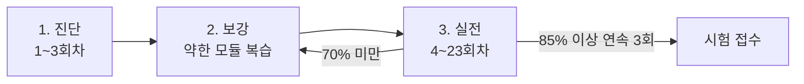

> [!warning] 순서를 지키세요
> **[[00-learning-path]] 13개 모듈을 먼저 끝내고** 여기로 오세요.
> 개념 없이 문제부터 풀면 답만 외우게 되고, 표현이 조금만 바뀌면 무너집니다.

## 보유 자원

| | |
|---|---|
| 모의고사 | **23회분 / 1,142문항** |
| 다중정답 문항 | 267개 |
| 출처 | [kananinirav/AWS-Certified-Cloud-Practitioner-Notes](https://github.com/kananinirav/AWS-Certified-Cloud-Practitioner-Notes) (MIT) |
| 응시 | [문제 풀이](/aws-clf-c02/quiz) — 실제 시험 화면 구조 · 타이머 · 자동 채점 |
| 오답 복습 | [오답노트](/aws-clf-c02/review) — 자동 수집 + FSRS 간격 반복 |

## 3단계 루틴

### 1. 진단 — 회차 1~3

**학습 모드**를 켜고 편하게 푸세요. 목적은 점수가 아니라 **어느 모듈이 약한지 찾기**입니다.

- 결과 화면의 틀린 문항마다 `관련` 서비스가 표시됩니다. 어느 모듈 서비스가 많은지 세어보세요
- 그 모듈로 돌아가 `5. 셀프 체크`를 다시 통과하세요

### 2. 보강

약한 모듈의 서비스 노트 `시험 포인트`를 채우고, [오답노트](/aws-clf-c02/review)를 한 바퀴 돌립니다.

### 3. 실전 — 회차 4~23

**학습 모드를 끄고** 타이머를 켠 채 끝까지 풀고 한 번에 제출하세요.
확신 없는 문항은 **Flag for Review** 로 표시해두고 Review Screen에서 다시 봅니다.

- 목표: **700점 이상** (100~1000 스케일)
- 연속 3회 85% 이상 → 접수해도 됩니다

## 점수대별 판단

| 기준 | 판단 |
|---|---|
| 70% 미만 | 해당 모듈로 복귀. 문제를 더 풀어도 안 늘어요 |
| 70~80% | 오답노트 반복 + 취약 도메인 집중 |
| 80~85% | 실전 감각 유지. 계속 회차 진행 |
| 85% 이상 3회 연속 | 접수 |

회차별 최고 점수와 응시 횟수는 [문제 풀이](/aws-clf-c02/quiz) 목록에서 바로 확인됩니다.

## 하지 말 것

- 답 순서 외우기 — 같은 회차를 반복하면 지문이 아니라 위치를 외우게 됩니다
- 오답을 그냥 넘기기 — [오답노트](/aws-clf-c02/review)를 비우고 넘어가세요
- 23회를 한 번씩만 — 틀린 것 위주로 2회독하는 편이 낫습니다

## 관련

- [[exam-overview]] — 도메인 비중, 자주 나오는 함정
- [[service-comparisons]] — 실점 1순위 구분 표
- [[service-map]] — 출현 빈도 상위 20 서비스
