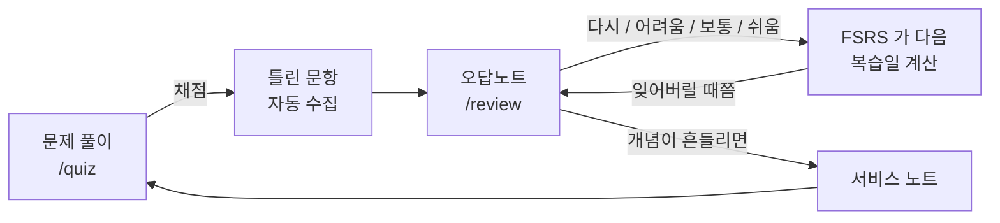

오답은 **직접 옮겨 적지 않습니다.** [문제 풀이](/aws-clf-c02/quiz)에서 채점하면 틀린 문항이 자동으로 [오답노트](/aws-clf-c02/review)에 쌓입니다.

> [!important] 지금 바로
> [오답노트 열기](/aws-clf-c02/review) — 복습할 문항이 있으면 여기서 바로 시작합니다.

## 동작 방식

1. 회차를 풀고 **Submit Exam** 하면 틀린 문항이 전부 오답노트로 들어갑니다
2. 오답노트에서 문제를 다시 보고 **정답 보기** 를 누른 뒤 난이도를 고릅니다
3. [FSRS](https://github.com/open-spaced-repetition/ts-fsrs) 알고리즘이 다음 복습 날짜를 정합니다
4. 완전히 익힌 문항은 **오답노트에서 제거** 할 수 있습니다

## 난이도 고르는 기준

| 버튼 | 언제 |
|---|---|
| **다시** | 전혀 모르겠다 — 곧 다시 나옵니다 |
| **어려움** | 겨우 생각났다 |
| **보통** | 기억났다 — 표준 간격 |
| **쉬움** | 바로 나왔다 — 간격이 크게 늘어납니다 |

정직하게 누르세요. 실제보다 쉽게 누르면 시험 직전에 무너집니다.

## 기록 백업

오답노트 화면 상단의 **내보내기 / 가져오기** 로 JSON 백업이 가능합니다.
기록은 지금 쓰는 브라우저에만 저장되므로, 기기를 옮길 때는 내보낸 파일을 가져오세요.

## 같이 볼 것

- [[00-exam-strategy]] — 점수대별로 무엇을 할지
- [[service-comparisons]] — 실점 1순위 구분 표
- 같은 서비스에서 계속 틀리면 해당 서비스 노트의 `시험 포인트` 에 적어두세요
